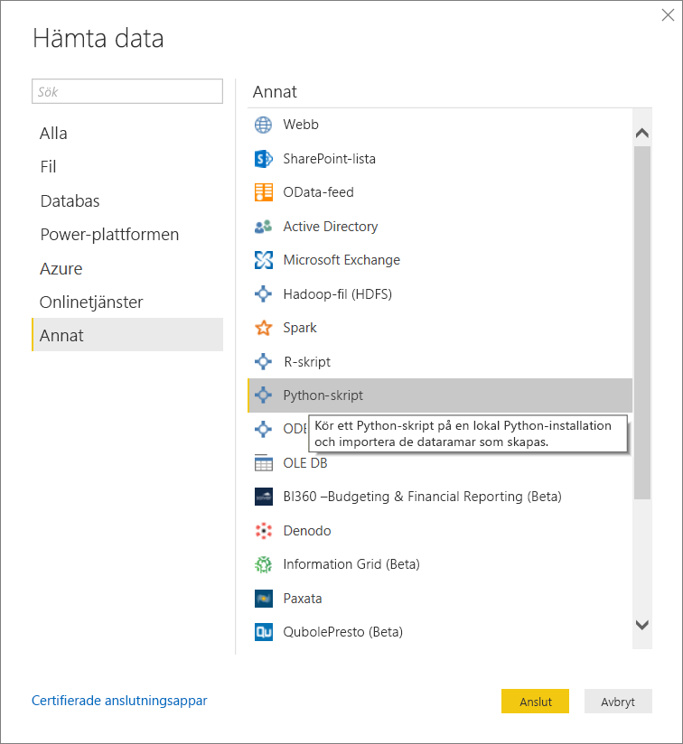
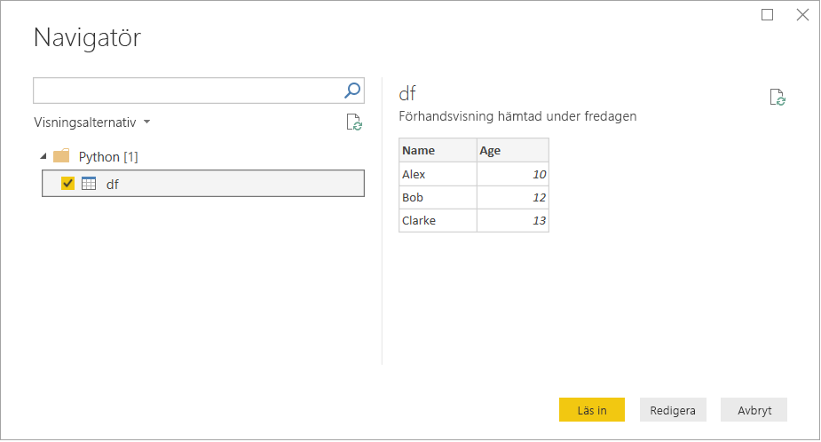

# <a name="run-python-scripts-in-power-bi-desktop"></a>Kör Python-skript i Power BI Desktop

Du kan köra Python-skript direkt i Power BI Desktop och importera de resulterande datamängderna till en Power BI Desktop-datamodell.

## <a name="install-python"></a>Installera Python

Om du vill köra Python-skript i Power BI Desktop, måste du installera Python på din lokala dator. Du kan ladda ned Python från [Pythons webbplats](https://www.python.org/). Den aktuella versionen av Python-skript stöder Unicode-tecken och blanksteg i installationssökvägen.

### <a name="install-required-python-packages"></a>Installera nödvändiga Python-paket

Power BI Python-integreringen kräver att två Python-paket installeras:

* [Pandas](https://pandas.pydata.org/). Ett programvarubibliotek för datamanipulering och analys. Det innehåller datastrukturer och åtgärder för manipulering av numeriska tabeller och tidsserier. Dina importerade data måste finnas i en [Pandas-dataram](https://www.tutorialspoint.com/python_pandas/python_pandas_dataframe.htm). En dataram är en tvådimensionell datastruktur. Data ordnas exempelvis i tabellform i rader och kolumner.
* [Matplotlib](https://matplotlib.org/). Ett ritningsbibliotek för Python samt [NumPy](https://www.numpy.org/)-tillägget för numerisk matematik. Det innehåller ett objektorienterat API för inbäddning av ritytor i program med hjälp av GUI-verktyg för generell användning, till exempel Tkinter, wxPython, Qt och GTK+.

I en konsol eller i ett gränssnitt använder du kommandoradsverktyget [pip](https://pip.pypa.io/en/stable/) för att installera de två paketen. Verktyget pip paketeras med mer aktuella Python-versioner.

```CMD
pip install pandas
pip install matplotlib
```

## <a name="enable-python-scripting"></a>Aktivera Python-skript

Så här aktiverar du Python-skript:

1. I Power BI Desktop väljer du **Arkiv** > **Alternativ och inställningar** > **Alternativ** > **Python-skript**. Sidan med **Python-skriptalternativ** visas.

   

1. Vid behov anger du din lokala Python-installationssökväg i **Identifierade Python-startkataloger:** .

   I bilden ovan är den sökvägen för den lokala Python-installationen *C:\Python*. Kontrollera att sökvägen gäller för den lokala Python-installation som du vill att Power BI Desktop ska använda.

1. Välj **OK**.

När du har angett Python-installationen är du redo att börja köra Python-skript i Power BI Desktop.

## <a name="run-python-scripts"></a>Kör Python-skript

Med bara några få steg kan du köra Python-skript och skapa en datamodell. Från den här modellen kan du skapa rapporter och dela dem i Power BI-tjänsten.

### <a name="prepare-a-python-script"></a>Förbered ett Python-skript

Först skapar du ett skript i din lokala Python-utvecklingsmiljö och kontrollerar att det körs korrekt. Här är till exempel ett enkelt Python-skript som importerar Pandas och använder en dataram:

```python
import pandas as pd
data = [['Alex',10],['Bob',12],['Clarke',13]]
df = pd.DataFrame(data,columns=['Name','Age'],dtype=float)
print (df)
```

Vid körningen returneras följande skript:

```python
     Name   Age
0    Alex  10.0
1     Bob  12.0
2  Clarke  13.0
```

När du förbereder och kör ett Python-skript i Power BI Desktop, finns det några begränsningar:

* Endast Pandas-dataramar importeras, så se till att de data som du vill importera i Power BI representeras i en dataram
* Alla Python-skript som körs längre än 30 minuters avbryts
* Interaktiva anrop i Python-skriptet som väntar på indata från användaren avbryter körningen av skriptet
* När du ställer in arbetskatalogen i Python-skriptet *måste* du definiera en fullständig sökväg till arbetskatalogen istället för en relativ sökväg
* Kapslade tabeller stöds inte för tillfället

### <a name="run-your-python-script-and-import-data"></a>Kör ditt Python-skript och importera data

Så här kör du Python-skriptet i Power BI Desktop:

1. På startmenyfliken väljer du **Hämta data** > **Annan**.

1. Välj **Annat** > **Python-skript** enligt följande bild:

   

1. Välj **Anslut**. Den lokala Python-version som senast installerades väljs som Python-motor. Kopiera skriptet till dialogrutan **Python-skript** som visas. Här anger vi det enkla Python-skript som visades tidigare.

   

1. Välj **OK**. Om skriptet körs som det ska, visas **Navigatör** där du kan läsa in datan och använda den. I exemplet väljer du **df** enligt bilden och sedan **Läs in**.

    

### <a name="troubleshooting"></a>Felsökning

Om Python inte är installerat eller inte identifierat visas en varning. Det kan även visas en varning om du har flera installationer på den lokala datorn. Gå tillbaka och läs de tidigare avsnitten Installera Python och Aktivera Python-skript.


#### <a name="using-custom-python-distributions"></a>Använda anpassade Python-distributioner

Power BI kör skript direkt via den körbara filen python.exe från en användardefinierad katalog (som tillhandahålls via sidan Inställningar). Distributioner som kräver ett extra steg för att förbereda miljön (t.ex. Conda) kan drabbas av ett problem där körningen misslyckas.

Vi rekommenderar att du använder den officiella Python-distributionen från https://www.python.org/ för att undvika relaterade problem.

Du kan starta Power BI Desktop från din anpassade kommandotolk för din Python-miljö som en möjlig lösning.

### <a name="refresh"></a>Uppdatera

Du kan uppdatera ett Python-skript i Power BI Desktop. Uppdatera genom att gå till menyfliken **Start** och välja **Uppdatera**. När du uppdaterar ett Python-skript kör Power BI Desktop Python-skriptet igen.

## <a name="known-limitations"></a>Kända begränsningar

För närvarande kan du inte använda Python-skript i rapporter som skapats med funktionen **förbättrade metadata (förhandsversion)** aktiverad. Befintliga rapporter fortsätter att fungera. Mer information finns i artikeln om att [använda utökade datamängdsmetadata (förhandsversion)](desktop-enhanced-dataset-metadata.md). 

## <a name="next-steps"></a>Nästa steg

Ta en titt på följande extra information om Python i Power BI.

* [Skapa Python-visualiseringar i Power BI Desktop](desktop-python-visuals.md)
* [Använd en extern Python IDE med Power BI](desktop-python-ide.md)
