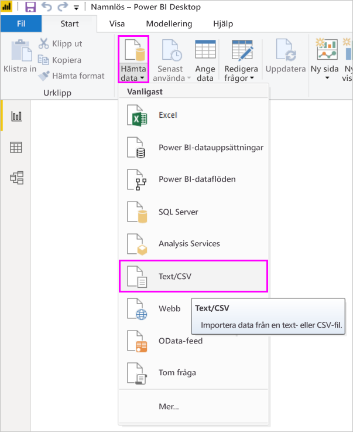
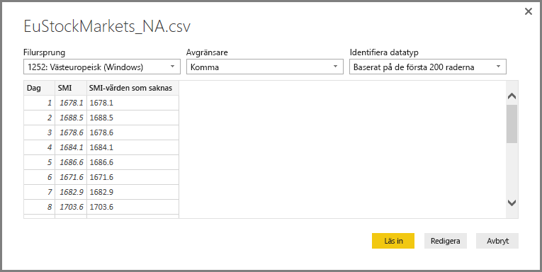
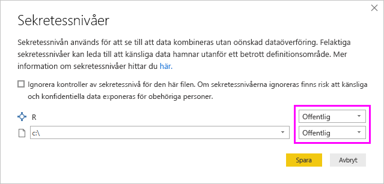
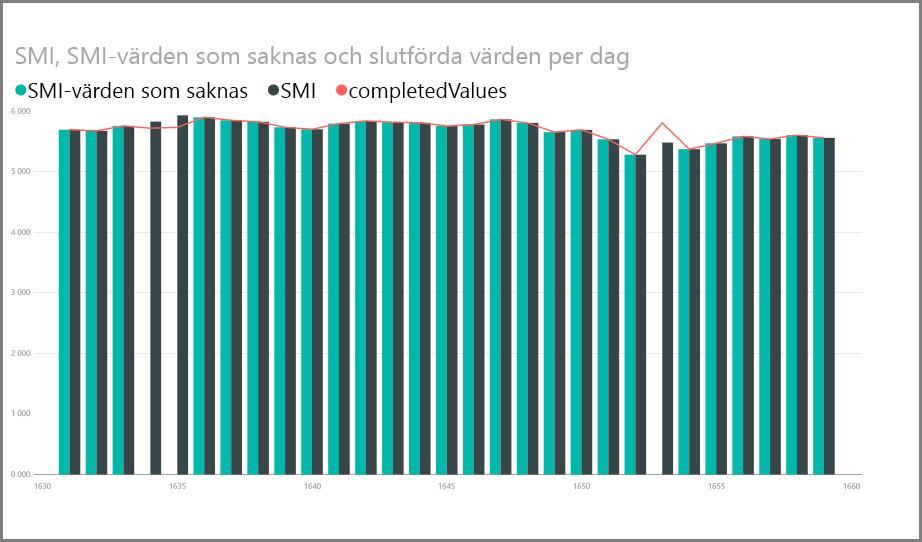
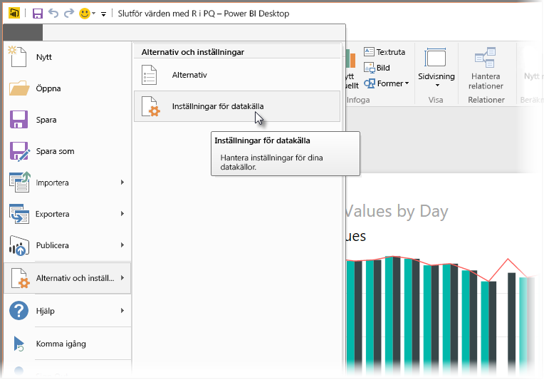

# <a name="use-r-in-power-query-editor"></a>Använda R i Power Query-redigeraren

[Språket R](https://mran.microsoft.com/documents/what-is-r) är ett kraftfullt programmeringsspråk som används av många statistiker, data scientists och dataanalytiker. Du kan använda R i Power Query-redigeraren i Power BI Desktop till att:

* Förbereda datamodeller.

* Skapa rapporter.

* Utföra datarengöring, avancerad datautformning och datamängdsanalys, som omfattar slutförande av saknade data, förutsägelser, klustring och mer.  

## <a name="install-r"></a>Installera R

Du kan ladda ned R kostnadsfritt från [nedladdningssidan för Revolution R Open](https://mran.revolutionanalytics.com/download/) och [CRAN-lagringsplatsen](https://cran.r-project.org/bin/windows/base/).

## <a name="install-mice"></a>Installera mice

Som en förutsättning måste du installera [biblioteket mice](https://www.rdocumentation.org/packages/mice/versions/3.5.0/topics/mice) i din R-miljö. Utan mice fungerar inte koden i exempelskriptet korrekt. mice-paketet implementerar en metod för hantering av saknade data.

Så här installerar du biblioteket mice:

1. Starta programmet R.exe (till exempel C:\Program\Microsoft\R Open\R-3.5.3\bin\R.exe).  

2. Kör installationskommandot från R-prompten:

   ``` 
   install.packages('mice') 
   ```

## <a name="use-r-in-power-query-editor"></a>Använda R i Power Query-redigeraren

För att visa hur du använder R i Power Query-redigeraren använder vi en exempeldatamängd för aktiemarknaden som finns i en .csv-fil och går igenom följande steg:

1. [Ladda ned filen EuStockMarkets_NA.csv](https://download.microsoft.com/download/F/8/A/F8AA9DC9-8545-4AAE-9305-27AD1D01DC03/EuStockMarkets_NA.csv). Kom ihåg var du sparar den.

1. Läs in filen till Power BI Desktop. På fliken **Start** väljer du **Hämta data** > **Text/CSV**.

   

1. Välj filen EuStockMarkets_NA.csv och välj sedan **Öppna**. CSV-data visas i dialogrutan **Text-/CSV-fil**.

   

1. Välj **Läs in** för att läsa in data från filen. När Power BI har läst in data visas den nya tabellen i **fältfönstret**.

   

1. Öppna Power Query-redigeraren genom att gå till menyfliksområdet **Start** och välja **Redigera frågor**.

   

1. På fliken **Transformera** väljer du **Kör R-skript**. Redigeraren **Kör R-skript** visas. Raderna 15 och 20 har saknade data. Det gör även rader som du inte kan se i bilden. Stegen nedan visar hur R slutför de här raderna åt dig.

   

1. I det här exemplet anger du följande skriptkod i rutan **Skript** i fönstret **Kör R-skript**. Byt ut *&lt;Your File Path&gt;* (Din filsökväg) med sökvägen till EuStockMarkets_NA.csv i ditt lokala filsystem, till exempel C:/Användare/Anders Andersson/Dokument/Microsoft/EuStockMarkets_NA.csv.

    ```r
       dataset <- read.csv(file="<Your File Path>/EuStockMarkets_NA.csv", header=TRUE, sep=",")
       library(mice)
       tempData <- mice(dataset,m=1,maxit=50,meth='pmm',seed=100)
       completedData <- complete(tempData,1)
       output <- dataset
       output$completedValues <- completedData$"SMI missing values"
    ```

    > [!NOTE]
    > Du kan behöva skriva över en variabel med namnet *output* för att kunna skapa den nya datamängden med tillämpade filter.

7. Välj **OK**. Du ser en varning om datasekretess i Power Query-redigeraren.

   
8. Välj **Fortsätt** i varningsmeddelandet. I dialogrutan **Sekretessnivåer** som visas ställer du in alla datakällor på **Offentlig** så att R-skripten ska fungera korrekt i Power BI-tjänsten. 

   

   Du kan läsa mer om sekretessinställningar och deras konsekvenser i [Sekretessnivåer i Power BI Desktop](../admin/desktop-privacy-levels.md).

 9. Välj **Spara** för att köra skriptet. 

   Observera en ny kolumn i fönstret **Fält** med namnet **completedValues**. Den här kolumnen har några dataelement som saknas, till exempel på rad 15 och 18. Ta en titt på hur R hanterar det i nästa avsnitt.

   Vi har bara har fem rader med R-skript, så Power Query-redigeraren fyllde i de saknade värdena enligt en förutsägelsemodell.

## <a name="create-visuals-from-r-script-data"></a>Skapa visuella objekt från R-skriptdata

Nu kan vi skapa ett visuellt objekt för att se hur R-skriptkoden och biblioteket mice fyller i de värden som saknas.



Du kan spara alla färdiga visuella objekt i en .pbix-fil för Power BI Desktop och använda datamodellen och dess R-skript i Power BI-tjänsten.

> [!NOTE]
> Du kan [ladda ned en .pbix](https://download.microsoft.com/download/F/8/A/F8AA9DC9-8545-4AAE-9305-27AD1D01DC03/Complete%20Values%20with%20R%20in%20PQ.pbix)-fil med alla de här stegen slutförda.

När du har laddat upp .pbix-filen till Power BI-tjänsten behöver du vidta några ytterligare åtgärder för att aktivera uppdatering av tjänstdata och visuella objekt:  

* **Aktivera schemalagd uppdatering för datamängden**: Om du vill aktivera schemalagd uppdatering för arbetsboken som innehåller din datamängd med R-skript kan du läsa [Konfigurera schemalagd uppdatering](refresh-scheduled-refresh.md). Den här artikeln innehåller också information om personliga gatewayer.

* **Installera en personlig gateway** Du behöver ha en personlig gateway installerad i datorn där filen och R finns. Power BI-tjänsten använder den arbetsboken och renderar alla uppdaterade visuella objekt på nytt. Mer information finns i [Använda personliga gatewayer i Power BI](service-gateway-personal-mode.md).

## <a name="limitations"></a>Begränsningar

Det finns vissa begränsningar för frågor med R-skript som skapats i Power Query-redigeraren:

* Alla inställningar för R-datakälla måste anges som **offentliga**. Alla andra steg i en fråga i Power Query-redigeraren måste också vara offentliga. 

   Öppna inställningarna för datakällan i Power BI Desktop genom att välja **Arkiv** > **Alternativ och inställningar** > **Datakällsinställningar**.

   

   I dialogrutan **Datakällsinställningar** väljer du en eller flera datakällor och sedan **Redigera behörigheter**. Ställ in **Sekretessnivå** på **Offentlig**.

     
  
* För att schemalägga uppdatering av visuella R-objekt eller datamängden ska du aktivera schemalagd uppdatering och installera en personlig gateway i datorn där arbetsboken och R finns. 

Du kan göra mängder av sker med R och anpassade frågor. Utforska och forma dina data precis som du vill att de ska visas.

## <a name="next-steps"></a>Nästa steg

* [Introduktion till R](https://mran.microsoft.com/documents/what-is-r) 

* [Kör R-skript i Power BI Desktop](desktop-r-scripts.md) 

* [Använd en extern R IDE med Power BI](desktop-r-ide.md) 

* [Skapa visuella objekt med hjälp av R-paket i Power BI-tjänsten](service-r-packages-support.md)
