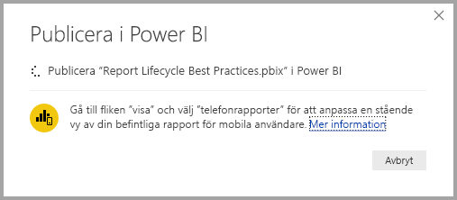
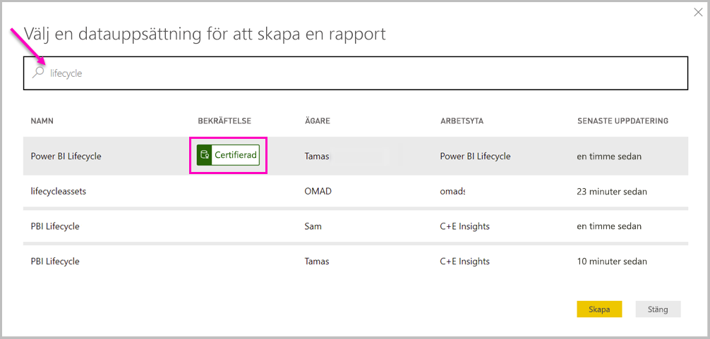

# Ansluta till datauppsättningar i Power BI-tjänsten från Power BI Desktop

Du kan upprätta en live-anslutning till en delad datauppsättning i *Power BI-tjänsten* och skapa olika rapporter från samma datauppsättning. Det här innebär att du kan skapa den perfekta datamodellen i Power BI Desktop och publicera den till Power BI-tjänsten. Sedan kan du och andra skapa flera olika rapporter (i separata *.pbix*-filer) från samma, gemensamma datamodell och spara dem på olika arbetsytor. Den här funktionen kallas *Live-anslutning till Power BI-tjänst*.

Det finns olika typer av fördelar med den här funktionen, inklusive metodtips som vi kommer att diskutera i den här artikeln. Vi rekommenderar att du läser [överväganden och begränsningar](#limitations-and-considerations) för den här funktionen.

## Använda live-anslutning till Power BI-tjänsten för livscykelhantering av rapporter

En utmaning med att Power BI är så populärt är den ökande mängden rapporter, instrumentpaneler och deras underliggande datamodeller. Anledningen är att det är enkelt att skapa intressanta rapporter i Power BI Desktop, dela ([publicera](../create-reports/desktop-upload-desktop-files.md)) rapporterna i Power BI-tjänsten och att skapa bra instrumentpaneler från dessa datauppsättningar. Eftersom många personer har gjort det, ofta med samma (eller nästan samma) datauppsättningar, blir det svårt att veta vilken rapport som baseras på vilken datauppsättning – och hur ny varje datauppsättning är. Med Live-anslutning till Power BI-tjänst löser man utmaningen genom att skapa, dela och expandera gemensamma datauppsättningsrapporter och instrumentpaneler på ett enklare och mer konsekvent sätt.

### Skapa en datauppsättning som alla kan använda och dela den sedan

Låt oss anta att Anna är en affärsanalytiker som finns i ditt team. Anna är utbildad i att skapa bra datamodeller, så kallade datauppsättningar. Anna kan skapa en datauppsättning och en rapport och sedan dela den rapporten i Power BI-tjänsten.

Alla älskar Annas rapporter och datauppsättning. Det är där problemet börjar. Alla i Annas team försöker skapa *sin egen version* av datauppsättningen och sedan dela sina egna rapporter med teamet. Plötsligt finns det mängder med rapporter (från olika datauppsättningar) på teamets arbetsyta i Power BI-tjänsten. Vilken är den senaste? Är datauppsättningarna identiska, eller bara nästan? Vilka skillnader är det? Med funktionen Live-anslutning till Power BI-tjänsten kan allt ändras till det bättre. I nästa avsnitt ser vi hur andra kan använda Annas publicerade datamängd till sina egna rapporter, på egna arbetsytor, och att alla kan använda samma granskade och publicerade datamängd när de skapar sina egna unika rapporter.

### Ansluta till en Power BI-tjänsts datauppsättning med hjälp av en live-anslutning

Anna skapar en rapport och skapar den datauppsättning som den baseras på. Anna publicerar sedan rapporten till Power BI-tjänsten. Rapporten visas i teamets arbetsyta i Power BI-tjänsten. Om Anna sparar den på en *ny arbetsyta*. Anna kan ange *Behörighet till att skapa* så att den blir tillgänglig för alla både inom och utanför arbetsytan.

Mer information om de nya upplevelsearbetsytorna finns i avsnittet om [arbetsytor](../collaborate-share/service-new-workspaces.md).

Andra medlemmar i Annas arbetsyta kan nu upprätta en live-anslutning till Annas delade datamodell med Live-anslutning till Power BI-tjänst. De kan skapa sina egna unika rapporter från *deras ursprungliga datauppsättning* i *deras egna nya arbetsytor*.

I följande bild kan du se hur Anna skapar en Power BI Desktop-rapport och publicerar den (med datamodellen) till Power BI-tjänsten. Sedan kan andra ansluta till Annas datamodell med hjälp av live-anslutning för Power BI-tjänsten och skapa egna unika rapporter på egna arbetsytor baserade på Annas datauppsättning.

> [!NOTE]
> Om du sparar din datamängd på en [klassisk delad arbetsyta](../collaborate-share/service-create-workspaces.md) så kan endast medlemmar på arbetsytan skapa rapporter baserade på datamängden. För att upprätta en live-anslutning till Power BI-tjänsten, måste datauppsättningen som du vill ansluta till finnas i en delad arbetsyta där du är medlem.
> 
> 

## Stegvisa instruktioner för att använda en live-anslutning till Power BI-tjänsten

Nu när vi vet hur användbar live-anslutningar till Power BI-tjänsten är och hur du kan använda dem för hantering av rapporternas livscykel, så kan vi gå igenom de steg som tog oss från Annas utmärkta rapport (och datauppsättning) till en delad datauppsättning som medlemmarna i hennes Power BI-team kan använda.

### Publicera en Power BI-rapport och datauppsättning

Det första steget i att hantera rapportlivscykeln med Live-anslutning till Power BI-tjänst är att ha en rapport (och datauppsättning) som gruppmedlemmarna vill använda. Så Anna måste först *publicera* rapporten från Power BI Desktop. Välj **Publicera** i menyfliksområdet **Start** i Power BI Desktop.

Om Anna inte är inloggad på Power BI-tjänstkontot uppmanas hon att göra det av Power BI.

Därifrån kan Anna välja arbetsytans mål där rapporten och datamängden ska publiceras. Kom ihåg att om Anna sparar den på en arbetsyta med den nya upplevelsen så har alla med behörigheten Skapa åtkomst till den datamängden. Du ställer in behörigheten Skapa i Power BI-tjänsten efter publiceringen. Om arbetet sparas på en klassisk arbetsyta är det bara medlemmar som har åtkomst till den arbetsyta där en rapport har publicerats som kan komma åt dess datauppsättning med hjälp av en live-anslutning för Power BI-tjänsten.

Publiceringsprocessen påbörjas och Power BI Desktop visar förloppet.

När det är klart visar Power BI Desktop detta och ger dig några länkar för att komma till själva rapporten i Power BI-tjänsten, samt en länk till Quick Insights i rapporten.

Nu när rapporten och dess datauppsättning finns i Power BI-tjänsten kan du även *höja upp* den. Detta är ett tecken på dess kvalitet och tillförlitlighet. Du kan även begära att den ska *certifieras* av en central beslutsfattare i Power BI-klientorganisationen. Med något av de här godkännandena visas datauppsättningen alltid längst upp i listan när användare söker efter datauppsättninger. Mer information finns i [Höj upp din datauppsättning](service-datasets-promote.md).

Det sista steget är att ställa in behörigheten Skapa för datauppsättningen som rapporten är baserad på. Behörigheten Skapa avgör vem som kan se och använda datamängden. Du kan ställa in den på själva arbetsytan eller när du delar en app från arbetsytan. Mer information finns i [behörigheten Skapa för delade datauppsättningar](service-datasets-build-permissions.md).

Nu ska vi se hur andra gruppmedlemmar som har åtkomst till arbetsytan där rapporten (och datauppsättningen) är publicerad kan ansluta till datauppsättningen och skapa egna rapporter.

### Gå till den publicerade datauppsättningen med en live-anslutning till Power BI-tjänsten

För att upprätta en anslutning till den publicerade rapporten och skapa en egen rapport som baseras på den publicerade datauppsättningen väljer du **Hämta data** i menyfliksområdet **Start** i Power BI Desktop. Välj **Power Platform** i det vänstra fönstret och sedan **Power BI-datauppsättningar**.

Om du inte är inloggad uppmanas du av Power BI att logga in. När du har loggat in visar Power BI vilka arbetsytor som du är medlem i. Du kan välja vilken arbetsyta som innehåller den datauppsättning som du vill upprätta en live-anslutning till Power BI-tjänst till.

Datamängderna i listan är de delade datamängder som du har behörigheten Skapa för, oavsett arbetsyta. Du kan söka efter en viss datamängd och se dess namn, ägare, arbetsytan där den finns och när den senast uppdaterades. Du ser även **GODKÄNNANDEN** för datamängder överst i listan, som antingen certifierats eller höjts upp.

När du väljer **Skapa** upprättar du en live-anslutning till den valda data mängden. Power BI Desktop läser in fälten och deras värden som du ser i Power BI Desktop i realtid.

Nu kan du (och andra) skapa och dela anpassade rapporter från samma datauppsättning. Den här metoden är lämplig om du vill låta en kunnig person, som Anna, skapa en välformulerad datauppsättning. Många personer i teamet kan använda den delade datauppsättningen för sina egna rapporter.

## Begränsningar och överväganden

När du använder Live-anslutning till Power BI-tjänst finns det några begränsningar och överväganden som du bör komma ihåg.

* Det är bara användare med behörigheten Skapa för en datauppsättning som kan ansluta till den publicerade datauppsättningen med en liveanslutning till Power BI-tjänsten.
* Användare av den kostnadsfria versionen ser endast datauppsättninger från **Min arbetsyta** och Premium-baserade arbetsytor.
* Eftersom den här anslutningen är en live-anslutning inaktiveras vänsternavigering och modellering. Du kan bara ansluta till en datauppsättning i varje rapport. Detta fungerar på samma sätt som när du är ansluten till *SQL Server Analysis Services*.
* Eftersom den här anslutningen är en live-anslutning tillämpas säkerhet på radnivå (RLS) och andra liknande anslutningsmetoder. Detta är samma som när du är ansluten till SQL Server Analysis Services.
* Om ägaren ändrar den ursprungliga delade *.pbix*-filen, kommer datauppsättningen och rapporten som delas i Power BI-tjänsten att skrivas över. Rapporter baserade på datamängden skrivs inte över, men eventuella ändringar i datamängden visas i rapporten.
* Medlemmar i en arbetsyta kan inte byta ut den ursprungliga delade rapporten. Om du försöker göra detta visas en varning som uppmanar dig att byta namn på filen och publicera.
* Om du tar bort den delade datauppsättningen i Power BI-tjänsten så fungerar inte andra rapporter som är baserade på datauppsättningen och de visuella objekten visas inte.
* För innehållspaket måste du först skapa en kopia av ett innehållspaket innan du använder det som en bas för att dela en *.pbix*-rapport och datauppsättning till Power BI-tjänsten.
* När innehållspaket från *Min organisation* har kopierats kan du inte ersätta rapporten som skapades i tjänsten, eller en rapport som skapats vid kopiering av ett innehållspaket, med en live-anslutning. Om du försöker göra detta visas en varning som uppmanar dig att byta namn på filen och publicera. I den här situationen kan du bara byta ut de publicerade live-anslutna rapporterna.
* Om du tar bort en delad datauppsättning i Power BI-tjänsten så kan ingen längre komma åt datauppsättningen från Power BI Desktop.
* Rapporter som delar en datauppsättning på Power BI-tjänsten stöder inte automatiserade distributioner med hjälp av Power BI REST API.
