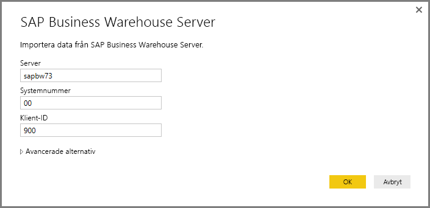
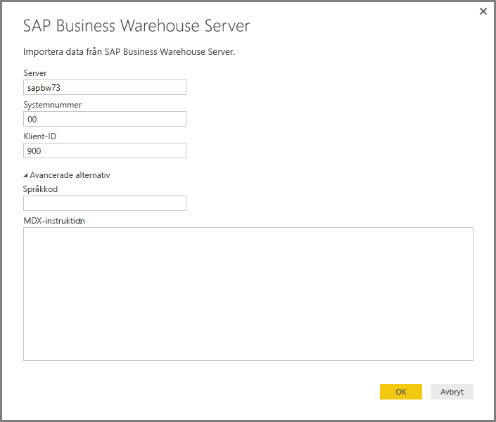
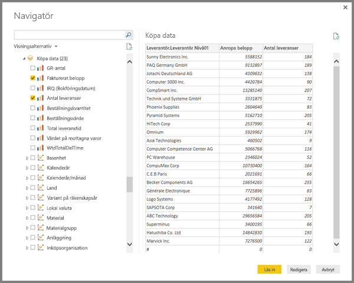
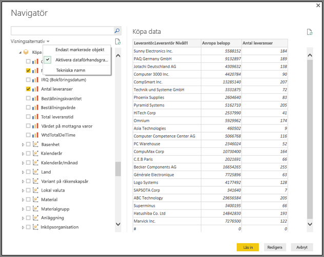
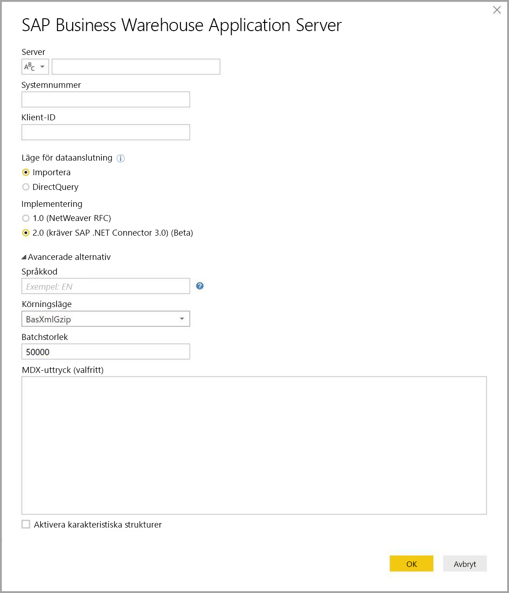

# <a name="use-the-sap-business-warehouse-connector-in-power-bi-desktop"></a>Använda anslutningsprogrammet för SAP Business Warehouse i Power BI Desktop

Med Power BI Desktop kan du komma åt *SAP Business Warehouse (BW)* -data.

Information om hur SAP-kunder kan dra nytta av att ansluta Power BI till sina befintliga SAP BW-system finns i [White paper för Power BI och SAP BW](https://aka.ms/powerbiandsapbw). Mer information om hur du använder DirectQuery med SAP BW finns i [DirectQuery och SAP Business Warehouse (BW)](desktop-directquery-sap-bw.md).

Från och med Power BI Desktop-versionen för juni 2018 (allmänt tillgänglig från oktober 2018), kan du använda *SAP BW-anslutningsprogrammet* med en implementering som innehåller viktiga prestanda- och funktionsförbättringar. Microsoft har utvecklat *Implementation 2.0* för SAP BW-anslutningsprogrammet. Välj antingen version 1 av SAP BW Connector eller Implementation 2.0 SAP Connector. I följande avsnitt beskrivs installationen av respektive version i tur och ordning. Du kan välja den ena eller den andra anslutningen när du ansluter till SAP BW från Power BI Desktop.

Vi föreslår att du använder Implementation 2.0 SAP Connector när det är möjligt.

## <a name="installation-of-version-1-of-the-sap-bw-connector"></a>Installera version 1 av SAP BW Connector

Vi rekommenderar att du använder Implementation 2.0 SAP Connector när det är möjligt. I avsnittet beskrivs hur du installerar version 1 av SAP BW Connector.

1. Installera *SAP NetWeaver*-biblioteket på din lokala dator. Du kan hämta SAP NetWeaver-biblioteket hos SAP-administratören, eller direkt från [SAP Software Download Center](https://support.sap.com/swdc). Eftersom SAP Software Download Center ofta ändrar struktur, finns det inga specifika riktlinjer för att navigera på webbplatsen. SAP NetWeaver-biblioteket ingår vanligtvis i installationen av SAP-klientverktygen.

   Du kan söka efter *SAP Note #1025361* om du vill hitta nedladdningsplatsen för den senaste versionen. Se till att arkitekturen för SAP NetWeaver-biblioteket (32-bitars eller 64-bitars) stämmer överens med din Power BI Desktop-installation. Installera alla filer som ingår i *SAP NetWeaver RFC SDK* enligt SAP Note.
2. I Power BI Desktop väljer du **Hämta data**. Alternativen i **Databas** är *SAP Business Warehouse Application Server* och *SAP Business Warehouse Message Server*.

   

## <a name="installation-of-implementation-20-sap-connector"></a>Installation av Implementation 2.0 SAP Connector

Implementation 2.0 för SAP Connector kräver SAP .NET Connector 3.0. Åtkomst till nedladdningen kräver en giltig S-användare. Kontakta ditt SAP Basis-team om du behöver SAP .NET Connector 3.0.

Du kan ladda ned [SAP .NET Connector 3.0](https://support.sap.com/en/product/connectors/msnet.html) från SAP.

Anslutningsprogrammet finns i 32-bitars och 64-bitars versioner. Välj den version som stämmer överens med din Power BI Desktop-installation. För närvarande finns två versioner tillgängliga på webbplatsen för .NET 4.0 Framework:

* SAP Connector för Microsoft .NET 3.0.22.0 för Windows 32-bitars (x86) som en ZIP-fil (6 896 kB), 1 juni 2019
* SAP Connector för Microsoft .NET 3.0.22.0 för Windows 64-bitars (x64) som en ZIP-fil (7 180 kB), 1 juni 2019

När du installerar i **valfria konfigurationssteg**, bör du kontrollera att du har valt *Installera sammansättningar till GAC*.


> [!NOTE]
> I den första versionen av SAP BW-implementeringen krävdes DLL:er för NetWeaver. Om du använder Implementation 2.0 för SAP Connector i stället för den första versionen, krävs det inte några DLL:er för NetWeaver.

## <a name="version-1-sap-bw-connector-features"></a>Funktioner för version 1 för SAP BW Connector

Med version 1 av SAP BW Connector i Power BI Desktop kan du importera data från dina *SAP Business Warehouse Server*-kuber eller använda DirectQuery.

Mer information om SAP BW Connector och hur du använder den med DirectQuery finns i [DirectQuery och SAP Business Warehouse (BW)](desktop-directquery-sap-bw.md).

När du ansluter måste du ange **Server**, **Systemnummer** och **Klient-ID** för att anslutningen ska upprättas.



Du kan också ange ytterligare två **avancerade alternativ**: **Språkkod** och ett anpassat **MDX-uttryck** som ska köras mot den angivna servern.



Om du inte anger något MDX-uttryck, visar anslutningsinställningen listan med de kuber som är tillgängliga på servern. Du kan öka detaljnivån och välja objekt från de tillgängliga kuberna, inklusive dimensioner och mått. Power BI exponerar frågor och kuber exponeras av [gränssnitten för öppen analys](https://help.sap.com/saphelp_nw70/helpdata/en/d9/ed8c3c59021315e10000000a114084/content.htm).

När du markerar ett eller flera objekt från servern, skapar dialogrutan Navigatör en förhandsgranskning av utdatatabellen.



I dialogrutan **Navigatör** finns även visningsalternativ:

* **Visa endast markerade objekt**. Som standard visar **Navigatör** alla objekt.  Det här alternativet är användbart för att verifiera den slutgiltiga objektuppsättningen. En annan metod för att visa markerade objekt är att välja kolumnnamnen i förhandsgranskningen.
* **Aktivera dataförhandsgranskningar**. Detta värde är standard. Visar dataförhandsgranskningar. Om du inaktiverar dataförhandsgranskningar minskar mängden serveranrop, eftersom data inte längre begärs för förhandsgranskningarna.
* **Tekniska namn**. SAP BW stöder begreppet *Tekniska namn* för objekt i en kub. Med tekniska namn kan en kubägare exponera *användarvänliga namn* på kubobjekten, i stället för att endast de *fysiska namnen* på objekten i kuben visas.



När du har valt alla nödvändiga objekt, kan du välja vad du vill göra härnäst genom att välja något av följande alternativ:

* Välj **Läs in** för att läsa in hela raduppsättningen för utdatatabellen till Power BI Desktop-datamodellen. Vyn **Rapport** öppnas. Du kan börja visualisera datan eller göra ytterligare ändringar med hjälp av vyerna **Data** eller **Relationer**.
* Välj **Redigera** för att öppna **Frågeredigeraren**. Ange ytterligare steg för dataomvandling och filtrering innan hela raduppsättningen hämtas till Power BI Desktop-datamodellen.

Förutom att importera data från SAP BW-kuber, kan du också importera data från en mängd andra datakällor i Power BI Desktop och sedan kombinera dem till en enda rapport. Detta ger olika sorters intressanta scenarier för rapportering och analys utöver SAP BW-data.

## <a name="using-implementation-20-sap-bw-connector"></a>Använda Implementation 2.0 SAP BW Connector

Skapa en ny anslutning som ska använda Implementation 2.0 av SAP BW Connector. Skapa en ny anslutning genom att följa stegen nedan.

1. Välj **Hämta data**. Välj antingen **SAP Business Warehouse Application Server** eller **SAP Business Warehouse Message Server** och anslut sedan.

2. I dialogrutan för ny anslutning väljer du implementeringen. Om du väljer **2.0** som **Implementering**, som du ser i bilden nedan, aktiveras **Körningsläge**, **Batchstorlek** och **Aktivera karakteristiska strukturer**.

    

3. Välj **OK**. Hädanefter är upplevelsen densamma som beskrivningen i [Funktioner för version 1 för SAP BW Connector](#version-1-sap-bw-connector-features) för anslutning till version 1 av SAP BW.

### <a name="new-options-for-implementation-20"></a>Nya alternativ för Implementation 2.0

Implementation 2.0 har stöd för följande alternativ:

* *ExecutionMode* anger det MDX-gränssnitt som används för att köra frågor på servern. Följande alternativ är giltiga:

  * `SapBusinessWarehouseExecutionMode.BasXml`
  * `SapBusinessWarehouseExecutionMode.BasXmlGzip`
  * `SapBusinessWarehouseExecutionMode.DataStream`

    Standardvärdet är `SapBusinessWarehouseExecutionMode.BasXmlGzip`.

    `SapBusinessWarehouseExecutionMode.BasXmlGzip` kan förbättra prestandan i samband med långa svarstider för stora datamängder.

* *BatchSize* anger det högsta antal rader som ska hämtas åt gången när ett MDX-uttryck körs. Ett litet antal innebär fler anrop till servern när en stor datamängd hämtas. Ett stort antal rader kan förbättra prestanda, men kan leda till minnesproblem på SAP BW-servern. Standardvärdet är 50 000 rader.

* *EnableStructures* anger om karakteristiska strukturer identifieras. Standardvärdet för det här alternativet är false. Påverkar listan med objekt som kan väljas. Stöds inte i läget Internfråga.

Alternativet *ScaleMeasures* har tagits bort i den här implementeringen. Beteendet motsvarar nu inställningen False i *ScaleMeasures* och visar alltid värden som inte har skalats.

### <a name="additional-improvements-for-implementation-20"></a>Ytterligare förbättringar i Implementation 2.0

I följande lista beskrivs ytterligare förbättringar som ingår i den nya implementeringen:

* Förbättrad prestanda.
* Möjlighet att hämta flera miljoner datarader och att finjustera parametern för batchstorlek.
* Möjligheten att växla mellan körningslägen.
* Stöd för komprimerat läge. Särskilt användbart för anslutningar med långa svarstider eller för stora datauppsättningar.
* Förbättrad identifiering av `Date`-variabler.
* [Experiment] Exponera dimensionerna `Date` (ABAP-typen DATS) och `Time` (ABAP-typen TIMS) som datum respektive tider, i stället för textvärden.
* Bättre undantagshantering. Nu exponeras fel som uppstår i BAPI-anrop.
* Kolumnvikning i BasXml- och BasXmlGzip-lägen. Om den genererade MDX-frågan exempelvis hämtar 40 kolumner, men den aktuella markeringen endast behöver 10, så skickas en begäran till servern för att hämta den mindre datauppsättningen.

### <a name="changing-existing-reports-to-use-implementation-20"></a>Ändra befintliga rapporter för användning med Implementation 2.0

Det går bara att ändra att befintliga rapporter ska använda Implementation 2.0 i importläge. Följ de här stegen:

1. Öppna en befintlig rapport, välj **Redigera frågor** i menyfliksområdet och välj sedan den SAP Business Warehouse-fråga som du vill uppdatera.

1. Högerklicka på frågan och välj **Avancerad redigerare**.

1. I **Avancerad redigerare** ändrar du `SapBusinessWarehouse.Cubes`-anropet på följande sätt:

    Se om frågan redan innehåller en alternativpost, till exempel som i följande exempel:

    

    I så fall lägger du till alternativet `Implementation` 2.0 och tar bort alternativet `ScaleMeasures` (om det finns), enligt nedan:

    

    Om frågan inte redan innehåller en alternativpost, lägger du bara till den. För följande alternativ:

    

    Ändrar du den bara till:

    

Vi har i möjligaste mån försökt att göra Implementation 2.0 för SAP BW Connector kompatibel med version 1. Dock kan det finnas skillnader på grund av de olika SAP BW MDX-körningslägen som används. Prova att växla körningsläge för att lösa eventuell inkompatibilitet.

## <a name="troubleshooting"></a>Felsökning

Det här avsnittet beskriver felsökningssituationer (och lösningar) när du använder SAP BW-anslutningsprogrammet.

1. Numeriska data från SAP BW returnerar punkter i stället för kommatecken som decimaltecken. Till exempel returneras 1 000 000 som 1.000.000.

   SAP BW returnerar decimaldata med antingen ett `,` (komma) eller en `.` som decimaltecken. För att ange vilka av dessa som SAP BW ska använda som decimalavgränsare, brukade drivrutinen som används av Power BI Desktop anropa `BAPI_USER_GET_DETAIL`. Det här anropet returnerar en struktur som kallas `DEFAULTS`. Den innehåller fältet `DCPFM` som lagrar *formatet för decimaltecken*. Fältet använder ett av följande värden:

   * ” ” (blanksteg) = Decimaltecknet är ett kommatecken: N.NNN,NN
   * ”X” = Decimaltecknet är en punkt: N,NNN.NN
   * ”Y” = Decimaltecknet är N NNN NNN,NN

   Kunder som har rapporterat problemet upptäckte att anropet till `BAPI_USER_GET_DETAIL` misslyckas för vissa användare. Felaktiga data visas med ett felmeddelande som liknade följande:

   ```xml
    You are not authorized to display users in group TI:
        <item>
            <TYPE>E</TYPE>
            <ID>01</ID>
            <NUMBER>512</NUMBER>
            <MESSAGE>You are not authorized to display users in group TI</MESSAGE>
            <LOG_NO/>
            <LOG_MSG_NO>000000</LOG_MSG_NO>
            <MESSAGE_V1>TI</MESSAGE_V1>
            <MESSAGE_V2/>
            <MESSAGE_V3/>
            <MESSAGE_V4/>
            <PARAMETER/>
            <ROW>0</ROW>
            <FIELD>BNAME</FIELD>
            <SYSTEM>CLNTPW1400</SYSTEM>
        </item>
   ```

   För att lösa det här felet måste användarna be sin SAP-administratör att tilldela SAPBW-användaren som används i Power BI behörighet att köra `BAPI_USER_GET_DETAIL`. Det kan också vara bra att kontrollera att användaren har det `DCPFM`-värde som krävs, enligt föregående beskrivning i den här felsökningen.

2. Anslutning för SAP BEx-frågor
   
   Du kan utföra BEx-frågor i Power BI Desktop genom att aktivera en specifik egenskap, enligt följande bild:
   
   
   
3. I fönstret **Navigatör** visas inte någon dataförhandsgranskning. I stället visas felmeddelandet *Objektreferensen är inte en instans av ett objekt*.
   
   SAP-användare behöver åtkomst till specifika BAPI-funktionsmoduler så att de kan få metadata och hämta data från SAP BW:s InfoProviders. Dessa moduler är:

   * BAPI_MDPROVIDER_GET_CATALOGS
   * BAPI_MDPROVIDER_GET_CUBES
   * BAPI_MDPROVIDER_GET_DIMENSIONS
   * BAPI_MDPROVIDER_GET_HIERARCHYS
   * BAPI_MDPROVIDER_GET_LEVELS
   * BAPI_MDPROVIDER_GET_MEASURES
   * BAPI_MDPROVIDER_GET_MEMBERS
   * BAPI_MDPROVIDER_GET_VARIABLES
   * BAPI_IOBJ_GETDETAIL

   Lös problemet genom att kontrollera att användaren har åtkomst till de olika MDPROVIDER-modulerna och `BAPI_IOBJ_GETDETAIL`. Du kan aktivera spårning för att ytterligare kunna felsöka detta eller liknande problem. **Välj fil** > **Alternativ och inställningar** > **Alternativ**. I **Alternativ** väljer du **Diagnostik** och sedan **Aktivera spårning**. Försök att hämta data från SAP BW medan spårning är aktivt, och granska spårningsfilen om du vill ha mer information.

## <a name="sap-bw-connection-support"></a>Stöd för SAP BW-anslutning

I följande tabell beskrivs det aktuella stödet för SAP BW.

|Produkt  |Läge  |Autentisering  |Anslutning  |SNC-bibliotek  |Stöds  |
|---------|---------|---------|---------|---------|---------|
|Power BI Desktop     |Valfri         | Användare/lösenord  | Programserver | Saknas  | Ja  |
|Power BI Desktop     |Valfri         | Windows          | Programserver | sapcrypto + gsskrb5/gx64krb5  | Ja  |
|Power BI Desktop     |Valfri         | Windows via personifiering | Programserver | sapcrypto + gsskrb5/gx64krb5  | Ja  |
|Power BI Desktop     |Valfri         | Användare/lösenord        | Meddelandeserver | Saknas  | Ja  |
|Power BI Desktop     |Valfri         | Windows        | Meddelandeserver | sapcrypto + gsskrb5/gx64krb5  | Ja  |
|Power BI Desktop     |Valfri         | Windows via personifiering | Meddelandeserver | sapcrypto + gsskrb5/gx64krb5  | Ja  |
|Power BI Gateway     |Importera      | Samma som Power BI Desktop |         |   |   |
|Power BI Gateway     |DirectQuery | Användare/lösenord        | Programserver | Saknas  | Ja  |
|Power BI Gateway     |DirectQuery | Windows via personifiering (fast användare, ingen enkel inloggning) | Programserver | sapcrypto + gsskrb5/gx64krb5  | Ja  |
|Power BI Gateway     |DirectQuery | Alternativet Använd SSO via Kerberos för DirectQuery-frågor | Programserver | sapcrypto + gsskrb5/gx64krb5   | Ja  |
|Power BI Gateway     |DirectQuery | Användare/lösenord        | Meddelandeserver | Saknas  | Ja  |
|Power BI Gateway     |DirectQuery | Windows via personifiering (fast användare, ingen enkel inloggning) | Meddelandeserver | sapcrypto + gsskrb5/gx64krb5  | Ja  |
|Power BI Gateway     |DirectQuery | Alternativet Använd SSO via Kerberos för DirectQuery-frågor | Meddelandeserver | gsskrb5/gx64krb5  | Nej  |
|Power BI Gateway     |DirectQuery | Alternativet Använd SSO via Kerberos för DirectQuery-frågor | Meddelandeserver | sapcrypto  | Ja  |

## <a name="next-steps"></a>Nästa steg

Mer information om SAP och DirectQuery finns i följande resurser:

* [DirectQuery och SAP HANA](desktop-directquery-sap-hana.md)
* [DirectQuery och SAP Business Warehouse (BW)](desktop-directquery-sap-bw.md)
* [Använd DirectQuery i Power BI](desktop-directquery-about.md)
* [Power BI-datakällor](power-bi-data-sources.md)
* [Power BI och SAP BW whitepaper](https://aka.ms/powerbiandsapbw)
