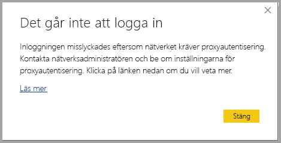
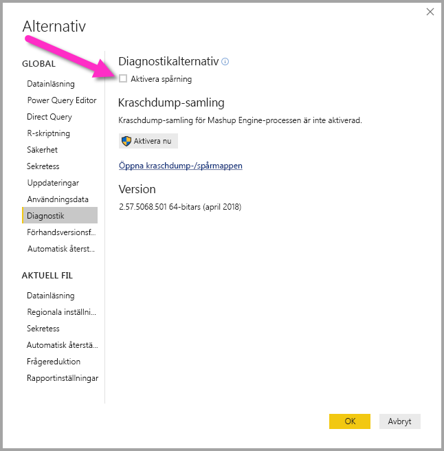
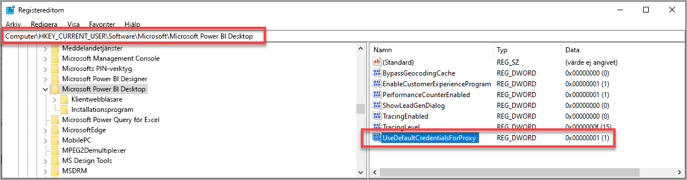

# Felsök inloggning i Power BI Desktop
Det kan finnas tillfällen när du försöker logga in på **Power BI Desktop** men stöter på fel. Det finns två primära orsaker för inloggningsproblem: **Proxy-autentiseringsfel** och **icke-HTTPS-URL omdirigeringsfel**. 

För att avgöra vilka problem som orsakar inloggningsproblemet, är det första steget att kontakta din administratör och ange diagnostisk information så att de kan fastställa orsaken till problemet. Genom att spåra problem associerade med dina inloggningsproblem, kan administratörer vilket av följande fel som gäller för dig. 

Låt oss ta en titt på var och ett av problemen i turordning. I slutet av den här artikeln hittar du en diskussion om hur du kan spara en *spårning* i Power BI Desktop som kan hjälpa dig spåra felsökningsproblem.

## Felet proxyautentisering krävs

Följande skärmbild visar ett exempel på felet *Proxyautentisering krävs*.

Följande undantag i *Power BI Desktop*-spårningsfiler är associerat med det här felet:

* *Microsoft.PowerBI.Client.Windows.Services.PowerBIWebException*
* *HttpStatusCode: ProxyAuthenticationRequired*

När det här felet uppstår är den troligaste orsaken att en proxyserver för autentisering i ditt nätverk blockerar webbegäranden som utfärdats av **Power BI Desktop**. 

Om ditt nätverk använder en proxyserver för autentisering, kan din administratör åtgärda problemet genom lägga till följande domäner i listan med tillåtna på proxyservern för autentisering:

* app.powerbi.com
* api.powerbi.com
* domäner i namnområdet *.analysis.windows.net

För kunder som ingår i ett myndighetsmoln, kan man åtgärda problemet genom att lägga till följande domäner i listan över tillåtna på proxyservern för autentisering:

* app.powerbigov.us
* api.powerbigov.us
* domäner i namnområdet *.analysis.usgovcloudapi.net

## Felet omdirigering för icke-HTTPS-URL:er stöds inte

Aktuella versioner av **Power BI Desktop** använder den aktuella versionen av Active Directory Authentication Library (ADAL), vilket inte tillåter en omdirigering till icke-säkra URL:er (icke-HTTPS). 

Följande undantag i *Power BI Desktop*-spårningsfiler är associerat med det här felet:

* *Microsoft.IdentityModel.Clients.ActiveDirectory.AdalServiceException: Omdirigering av Icke-HTTPS-URL stöds inte i webbvy*
* *ErrorCode: non_https_redirect_failed*

Om *ErrorCode: non_https_redirect_failed* inträffar, innebär det att en eller flera omdirigeringssidor eller providers i omdirigeringskedjan inte är en HTTPS-skyddad slutpunkt eller att en certifikatutfärdare för en eller flera omdirigeringar inte finns bland enhetens betrodda rotcertifikat. Alla leverantörer i en omdirigeringskedja för inloggning måste använda en HTTPS-URL. Kontakta din administratör och begär att säkra URL:er används för deras autentiseringswebbplatser för att lösa problemet. 

## Så här samlar du in ett spår i Power BI Desktop

Om du vill samla in ett spår i **Power BI Desktop** gör du följande:

1. Aktivera spårning i **Power BI Desktop** genom att gå till **Arkiv > Alternativ och inställningar > Alternativ** och sedan välja **Diagnostik** från alternativen i den vänstra rutan. I fönstret som visas, markerar du kryssrutan bredvid **Aktivera spårning**, enligt följande bild. Du kan behöva starta om **Power BI Desktop**.
   
   

2. Följ sedan de steg som återskapar felet. När detta sker lägger **Power BI Desktop** till händelser i spårningsloggen som sparas på den lokala datorn.

3. Navigera till mappen Spår på din lokala dator. Du hittar den mappen genom att välja länken i **Diagnostik** där du aktiverade spårning, visas som *Öppna kraschdump/spårningar-mappen* i föregående bild. Ofta finns det här på den lokala datorn på följande plats:

    `C:\Users/<user name>/AppData/Local/Microsoft/Power BI Desktop/Traces`

Det kan finnas många spårningsfiler i den mappen. Kontrollera att du bara skickar de senaste filerna till din administratör för att underlätta snabb identifiering av felet. 

## Använda standardautentiseringsuppgifter för systemet för webbproxy

Webbförfrågningar som utfärdats av Power BI Desktop använder inte autentiseringsuppgifter för webbproxy. I nätverk som använder en proxyserver kanske Power BI Desktop inte kan göra webbförfrågningar. 

Från och med Power BI Desktop-versionen för mars 2020 kan system- eller nätverksadministratörer tillåta att systemets standardautentiseringsuppgifter används för webbproxyautentisering. Administratörer kan skapa en registerpost med namnet **UseDefaultCredentialsForProxy** och ange värdet till ett (1) för att aktivera användning av systemets standardautentiseringsuppgifter för autentisering av webbproxy.

Registerposten kan placeras på någon av följande platser:

`[HKEY_LOCAL_MACHINE\SOFTWARE\WOW6432Node\Microsoft\Microsoft Power BI Desktop]`
`[HKEY_LOCAL_MACHINE\SOFTWARE\Microsoft\Microsoft Power BI Desktop]`

Det är inte nödvändigt att ha registerposten på båda platserna.

När registerposten har skapats (en omstart kan vara nödvändig) används proxyinställningarna som definierats i Internet Explorer när Power BI Desktop gör webbförfrågningar. 

Precis som med alla ändringar av proxy- eller autentiseringsuppgiftsinställningar finns det säkerhetsrisker med att skapa registerposten, så administratörer måste kontrollera att de har konfigurerat Internet Explorer-proxyservrarna på rätt sätt innan de aktiverar den här funktionen.         

### Begränsningar och överväganden för användning av systemets standardautentiseringsuppgifter

Det finns en samling säkerhetskonsekvenser som administratörer bör tänka på innan de aktiverar den här funktionen. 

Följande rekommendationer bör följas när du aktiverar den här funktionen för klienter:

* Använd endast **Förhandling** som autentiseringsschema på proxyservern, för att säkerställa att endast proxyservrar som är anslutna till Active Directory-nätverket används av klienten. 
* Använd inte **NTLM-återställning** på klienter som använder den här funktionen.
* Om användarna inte finns i ett nätverk med en proxy när den här funktionen är aktiverad och konfigurerad enligt rekommendationerna i det här avsnittet, används inte processen för att försöka kontakta proxyservern och använda systemets standardautentiseringsuppgifter.

[Använda systemets standardautentiseringsuppgifter för webbproxy](#using-default-system-credentials-for-web-proxy)

