# Självstudie: Analysera Facebook-data med Power BI Desktop

I den här självstudien får du lära dig hur du importerar data från Facebook och använder dem i Power BI Desktop. Du kommer att ansluta och importera data från Power BI:s Facebook-sida, använda omformningar på importerade data och använda data i rapportvisualiseringar.

> [!WARNING]
> På grund av Facebook-appens behörighetsbegränsningar fungerar inte kopplingsfunktionerna som beskrivs i den här artikeln korrekt. Vi arbetar med Facebook för att återställa den här funktionen så snart som möjligt.

## Ansluta till en Facebook-sida

I den här självstudien används data från [Microsoft Power BI:s Facebook-sida](https://www.facebook.com/microsoftbi). Du behöver inte några särskilda autentiseringsuppgifter för att ansluta och importera data från den här sidan utom ett personligt Facebook-konto.

1. Öppna Power BI Desktop och välj **Hämta data** i dialogrutan **Komma igång** eller i menyfliksområdet **Start**, välj **Hämta data** och sedan **Mer**.
   
2. I dialogrutan **Hämta data** väljer du **Facebook** i gruppen **Onlinetjänster** och sedan **Anslut**.
   
   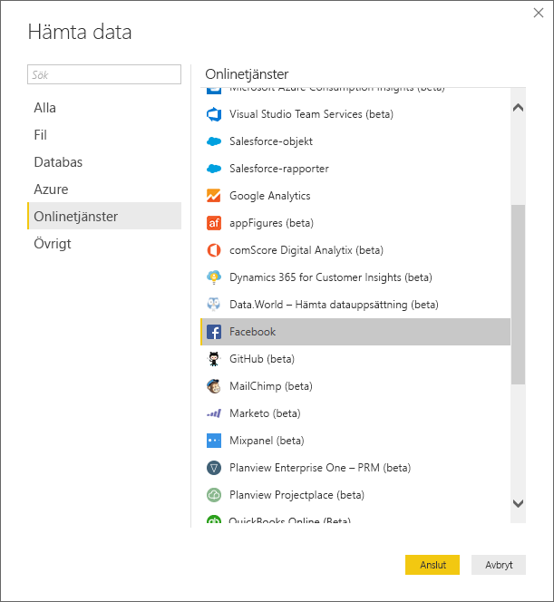
   
   Du ser en dialogruta som varnar dig om riskerna med att använda en tjänst från tredje part.
   
   
   
3. Välj **Fortsätt**. 
   
4. Ange sidnamnet **microsoftbi** som **användarnamn** i dialogrutan **Facebook**, välj **Inlägg** från listrutan **Anslutning** och välj sedan **OK**.
   
   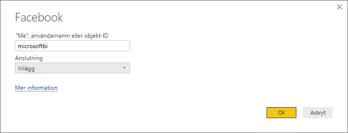
   
5. När du tillfrågas om autentiseringsuppgifter loggar du in på Facebook-kontot och ger Power BI åtkomst till ditt konto.
   
   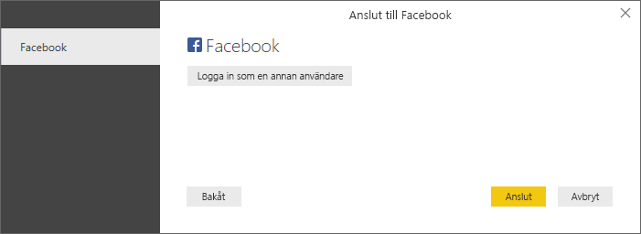

   När du har anslutit till Power BI:s Facebook-sida ser du en förhandsgranskning av sidans inläggsdata. 
   
   
   
## Forma och transformera importerade data

Anta att du vill se och visa vilka inlägg som har flest kommentarer över tid, men i förhandsgranskningen av inläggsdata märker du att **created_time**-data är svåra att läsa och förstå, och att det finns för lite kommentarsdata. Du får mer ut av funktionen om du utför en del omformning och rensar dina data. Du kan använda Power Query Editor i Power BI Desktop till att redigera data, före eller efter du importerar dem till Power BI Desktop. 

### Dela kolumnen datum/tid

Avgränsa först värdena för datum och tid i kolumnen **created_time** så att de är lättare att läsa. 

1. I Facebook:s förhandsgranskning väljer du **Redigera**. 
   
   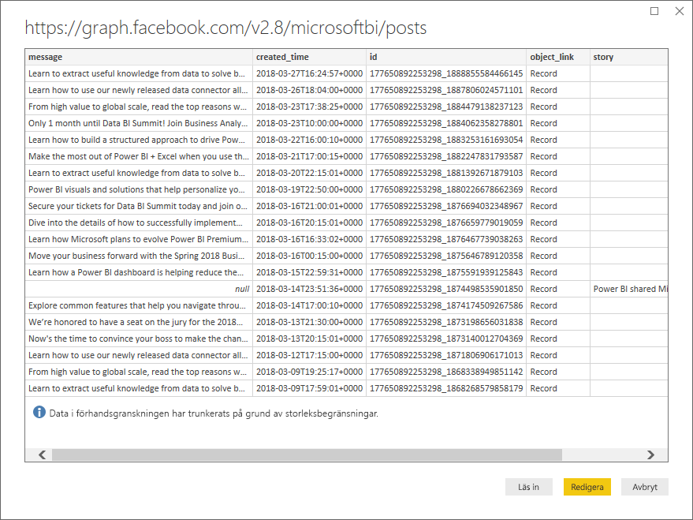
   
   Power BI Desktop Power Query Editor öppnas i ett nytt fönster och visar förhandsgranskningen från Power BI:s Facebook-sida. 
   
   
   
2. Välj kolumnen **created_time**. Observera att datatypen är **Text**, vilket du ser på ikonen **ABC** i kolumnrubriken. Högerklicka på rubriken och välj **Dela kolumn** > **Efter avgränsare** i listrutan. Du kan också välja **Dela kolumn** > **Efter avgränsare** under gruppen **Transformera** på fliken **Start** i menyfliksområdet.  
   
   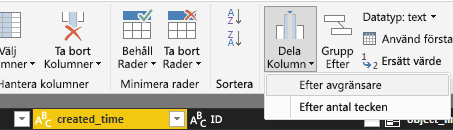
   
3. I dialogrutan **Dela upp kolumn efter avgränsare** väljer du **Anpassad** från listrutan. Ange **T** (tecknet som inleder tidsdelen av **created_time**-värden) i indatafältet och välj **OK**. 
   
   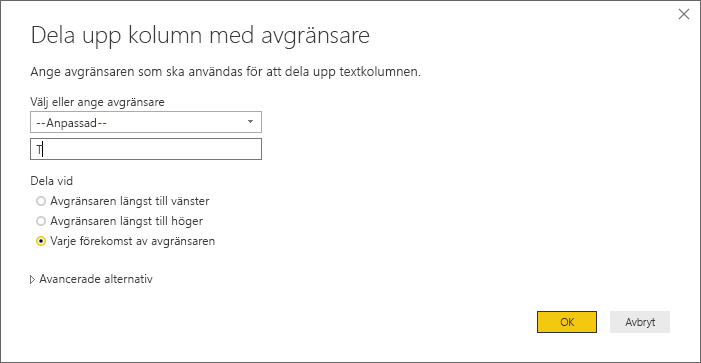
   
   Kolumnen delas upp i två kolumner som innehåller strängarna före och efter avgränsaren *T*. De nya kolumnerna får namnen **created_time.1** och **created_time.2**. Power BI har automatiskt identifierat och ändrat datatyperna till **datum** för den första kolumnen och **tid** för den andra kolumnen, och formaterat värdena för datum och tid så att de är enklare att läsa.
   
4. Byt namn på de två kolumnerna. Välj kolumnen **created_time.1** och sedan **Byt namn** i gruppen **Vilken kolumn som helst** på fliken **Transformera** i menyfliksområdet. Du kan också dubbelklicka på kolumnrubriken och ange det nya namnet, **created_date**. Upprepa för kolumnen **created_time.2** och byt namn på den till **created_time**.
   
   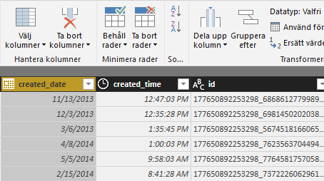
   
### Expandera den kapslade kolumnen

Nu när datum och tid är på det sätt som du vill ha dem kan du visa kommentarsdata genom att expandera en kapslad kolumn. 

1. Välj  längst upp i kolumnen **object_link** för att öppna dialogrutan **Expandera/aggregera**. Välj **anslutningar**, och välj sedan **OK**. 
   
   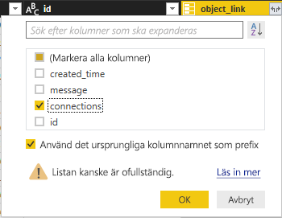
   
   Kolumnrubriken ändras till **object_link.connections**.
2. Välj  längst upp i kolumnen **object_link.connections**, välj **kommentarer** och sedan **OK**. Kolumnrubriken ändras till **object_link.connections. comments**.
   
3. Välj  längst upp i kolumnen **object_link.connections.comments** och välj **Aggregera** i stället för **Expandera** i dialogrutan. Välj **# Antal ID**, och välj sedan **OK**. 
   
   
   
   Kolumnen visar nu antalet kommentarer för varje meddelande. 
   
4. Byt namn på kolumnen **Antal object_link.connections.comments.id** till **Antal kommentarer**.
   
5. Välj nedåtpilen bredvid kolumnrubriken **Antal kommentarer** och välj **Sortera fallande** för att se inläggen från de med flest antal kommentarer till de med minst. 
   
   
   
### Granska frågesteg

När du formar och omvandlar data i **Power Query Editor** registreras varje steg i området **Tillämpade steg** i rutan **Frågeinställningar** till höger i Power Query Editor-fönstret. Du kan gå tillbaka genom **Tillämpade steg** för att se exakt vilka ändringar du har gjort och redigera, ta bort eller ordna om dem om det behövs. Var försiktig när du ändrar stegen eftersom ändringar av föregående steg kan göra att senare steg inte fungerar. 

Med de dataomvandlingar vi har gjort hittills så ska **Tillämpade steg** se ut så här:
   
   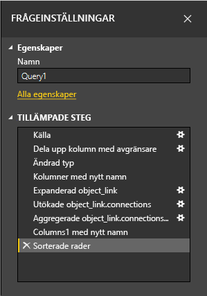
   
   >[!TIP]
   >Under **Tillämpade steg** finns formler skrivna i [Power Query-formelspråket M](https://docs.microsoft.com/powerquery-m/quick-tour-of-the-power-query-m-formula-language). Om du vill se och redigera formlerna, välj **Avancerad redigerare** i gruppen **Fråga** på fliken **Start** i menyfliksområdet. 

### Importera omvandlade data

När du är nöjd med dina data väljer du **Stäng och tillämpa** > **Stäng och tillämpa** på fliken **Start** i menyfliksområdet för att importera dem till Power BI Desktop. 
   
   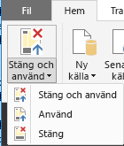
   
   Du ser förloppet för att läsa in data till Power BI Desktop-datamodellen i en dialogruta. 
   
   
   
   När data har lästs in ser du dem i vyn **Rapport** som en ny fråga i fönstret **Fält**.
   
   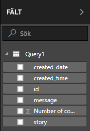
   
## Använd informationen i rapportvisualiseringarna 

Nu när du har importerat data från Facebook-sidan kan du snabbt och få enkelt insikter om dina data med visualiseringar. Det är enkelt att skapa en visualisering. Välj bara ett fält eller dra det från **fältfönstret** till rapportarbetsytan.

### Skapa ett stapeldiagram

1. I vyn **Rapport** i Power BI Desktop väljer du **meddelande** från **fältfönstret**, eller så drar du det till arbetsytan. En tabell som visar alla meddelanden visas på arbetsytan. 
   
   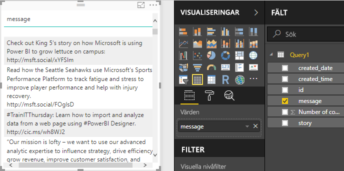
   
2. Låt tabellen vara markerad och välj även **Antal kommentarer** från **fältfönstret**, eller så drar du det till tabellen. 
   
3. Välj ikonen **Liggande stapeldiagram** i **visualiseringsfönstret**. Tabellen ändras till ett stapeldiagram som visar antal kommentarer per post. 
   
   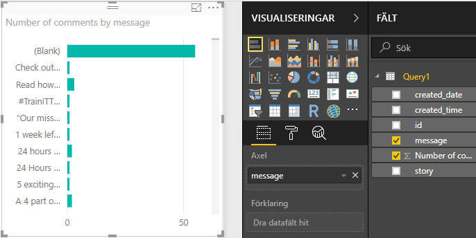
   
4. Välj **Fler alternativ** (...) bredvid visualiseringen och sedan **Sortera efter** > **Antal kommentarer** så att tabellen sorteras efter fallande antal kommentarer. 

   Observera att de flesta kommentarerna är associerade med meddelandet **(Tom)** (de här inläggen kan ha varit berättelser, länkar videoklipp eller annat innehåll utan text). 
   
5. Om du vill filtrera bort tomma rader väljer du **meddelande är (Alla)** i **filterfönstret**. Välj **Markera alla** och sedan **(Tom)** för att avmarkera. 

   **Filterfönstret** ändras till **meddelandet är inte (tomt)** och raden **(Tom)** försvinner från diagramvisualiseringen.
   
   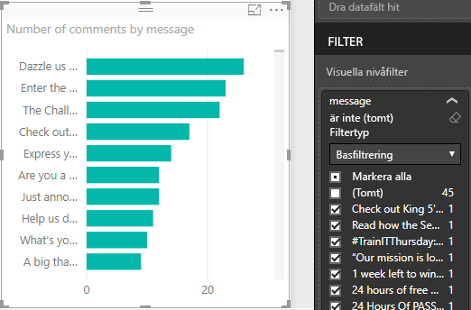
   
### Formatera diagrammet

Visualiseringen blir intressantare, men du kan inte se mycket av inläggstexten i diagrammet. För att visa mer av inläggstexten:

1. Använd handtagen till diagramvisualiseringen och gör diagrammet så stort som möjligt. 
   
2. Låt diagrammet vara markerat och välj **formatikonen** (färgrullen) i **visualiseringsfönstret**.
   
3. Välj nedåtpilen bredvid **y-axeln** och dra skjutreglaget **Maximal storlek** helt till höger (**50 %** ). 
4. Minska också **Textstorlek** till **10** punkter så att du får plats med mer text.
   
   
   
   Diagrammet visar nu mer av inläggsinnehållet. 
   
   
   
X-axeln (antalet kommentarer) i diagrammet visar inte exakta värden och ser lite bortkommen ut längst ner i diagrammet. Vi använder dataetiketter i stället: 

1. Välj **formatikonen** och ställ in skjutreglaget för **x-axeln** på **Av**. 
   
2. Ställ in skjutreglaget **Dataetiketter** på **På**. 

   Diagrammet visar nu det exakta antalet kommentarer för varje inlägg.
   
   
   
### Redigera datatyp

Det var bättre, men dataetiketterna har decimaldelen **,0**, vilket är störande och vilseledande eftersom **Antal inlägg** måste vara ett heltal. Du kan åtgärda det här genom att ändra datatypen för kolumnen **Antal inlägg** till **Heltal**:

1. Högerklicka på **Query1** i **fältfönstret** eller hovra över den och välj **Fler alternativ** (...). 

2. Välj **Redigera fråga** från snabbmenyn. Du kan också välja **Redigera frågor** > **Redigera frågor** i gruppen **Externa data** på fliken **Start** i menyfliksområdet. 
   
3. Gå till **Power Query Editor**-fönstret, välj kolumnen **Antal kommentarer** och ändra datatypen med någon av följande metoder: 
   - Välj ikonen **1.2** bredvid kolumnrubriken **Antal kommentarer** och välj **Heltal** från listrutan, eller
   - Högerklicka på kolumnrubriken och välj **Ändra typ** > **Heltal**.
   - Välj **Datatyp: Decimaltal** i gruppen **Transformera** på fliken **Start** eller i gruppen **Valfri kolumn** på fliken **Transformera** och välj **Heltal**.
   
   Ikonen i kolumnrubriken ändras till **123**, som anger datatypen **Heltal**.
   
   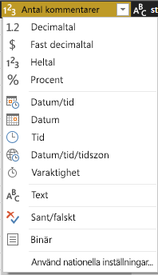
   
3. Tillämpa ändringarna genom att välja **Arkiv** > **Stäng och tillämpa**, eller **Arkiv** > **Tillämpa** om du vill behålla **Power Query Editor**-fönstret öppet. 

   När ändringarna har lästs in blir dataetiketterna i diagrammet heltal.
   
   
   
### Skapa ett datumutsnitt

Anta att du vill visualisera antalet kommentarer i inlägg över tid. Du kan skapa en utsnittsvisualisering för att filtrera diagramdata till olika tidsramar. 

1. Klicka på ett tomt område på arbetsytan och välj sedan **utsnittsikonen** i **visualiseringsfönstret**. 

   En tom utsnittsvisualisering visas.
   
   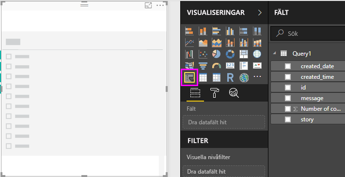
   
2. Välj fältet **created_date** från **fältlistan** eller dra det till det nya utsnittet. 

   Utsnittet ändras till ett skjutreglage för datumintervall baserat på fältets datatyp som är **Datum**.
   
   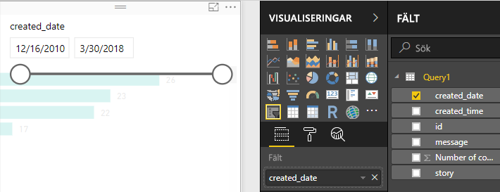
   
3. Flytta skjutreglagets handtag för att välja olika datumintervall och observera hur diagramdata filtreras därefter. Du kan också välja datumfälten i utsnittet och skriva in specifika datum eller välja dem från en kalendermeny.
    
   
   
### Formatera visualiseringar

Ge diagrammet en mer beskrivande och tilltalande rubrik: 

1. Låt diagrammet vara markerat och välj **formatikonen** i **visualiseringsfönstret**. Välj sedan listrutan bredvid **Rubrik** för att expandera den.

2. Ändra **Rubriktexten** till **Kommentarer per post**. 

3. Välj listrutan bredvid **Teckenfärg** och välj en grön färg som matchar de gröna staplarna i visualiseringen.

4. Öka **Textstorlek** till **10** punkter och ändra **Teckensnittsfamilj** till **Segoe (Bold)** .

5. Experimentera med andra formateringsalternativ och inställningar för att ändra utseendet på dina visualiseringar. 

   

## Skapa fler visualiseringar

Som du kan se är det enkelt att anpassa visualiseringar i rapporten för att visa data så som du vill. Prova till exempel att använda importerade Facebook-data till att skapa det här linjediagrammet som visar antalet kommentarer över tid.

I Power BI Desktop är det enkelt att hämta data från en stor mängd datakällor och utforma dem efter dina analysbehov för att visualisera datan på interaktiva sätt. När rapporten är färdig kan du [ladda upp den till Power BI-tjänsten](../create-reports/desktop-upload-desktop-files.md) och skapa instrumentpaneler som baseras på den, och sedan dela den med andra Power BI-användare.

## Nästa steg
* [Läs andra Power BI Desktop-självstudier](https://go.microsoft.com/fwlink/?LinkID=521937)
* [Se Power BI Desktop-videor](https://go.microsoft.com/fwlink/?LinkID=519322)
* [Besök Power BI-forumet](https://go.microsoft.com/fwlink/?LinkID=519326)
* [Läs Power BI-bloggen](https://go.microsoft.com/fwlink/?LinkID=519327)
