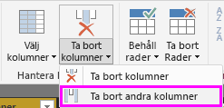
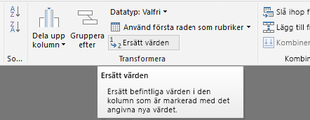
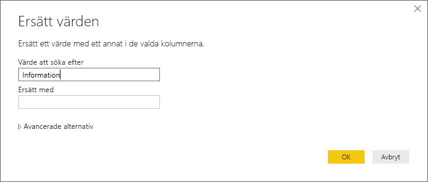
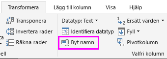

# Självstudie: Analysera webbsidedata med Power BI Desktop

Som den stora fotbollsfantast du är vill du rapportera om vinnarna i fotbolls-EM (UEFA) under årens lopp. Med Power BI Desktop kan du importera data från en webbplats till en rapport och skapa grafik som visar data. I självstudien får du lära dig hur du använder Power BI Desktop för att:

- Ansluta till en webbdatakälla och navigera mellan dess tillgängliga tabeller.
- Forma och transformera data i Power Query-redigeraren.
- Namnge en fråga och importera den till en Power BI Desktop-rapport.
- Skapa och anpassa en visualisering för en karta och ett cirkeldiagram.

## Anslut till en webbdatakälla

Du kan hämta data om EM-vinnarna från resultattabellen på Wikipedias sidan om Europamästerskapet i fotboll på https://en.wikipedia.org/wiki/UEFA_European_Football_Championship. 

Webbanslutningar upprättas endast med grundläggande autentisering. Webbplatser som kräver autentisering kanske inte fungerar korrekt med webbanslutningsappen.

Importera data:

1. I Power BI Desktop-menyfliken **Start** rulla ner pilen bredvid **Hämta data**, och välj sedan **Webb**.

    

   >[!NOTE]
   >Du kan också välja själva objektet **Hämta data**, eller välja **Hämta data** i dialogrutan Kom igång med Power BI Desktop. Välj sedan **Webb** i avsnittet **Alla** eller **Annan** i dialogrutan **Hämta data** och välj därefter **Anslut**.

1. I dialogrutan **Från webben** klistrar du in webbadressen `https://en.wikipedia.org/wiki/UEFA_European_Football_Championship` i textrutan **URL**. Välj sedan **OK**.

    

   När du har anslutit till Wikipedia-webbsidan visar dialogrutan **Navigatör** en lista med tillgängliga tabeller på sidan. Du kan välja något tabellnamn för att förhandsgranska dess data. Tabellen **Results[edit]** innehåller de data som du behöver, även om de inte är i exakt den form som du önskar. Du kommer att omforma och rensa datan innan du läser in den i rapporten.

   

   >[!NOTE]
   >Fönstret **Förhandsgranska** visar den senast valda tabellen, men alla markerade tabeller kommer att läsas in i Power Query-redigeraren när du väljer **Transformera data** eller **Läs in**.

1. Välj tabellen **Results[edit]** i listan **Navigatör** och välj sedan **Transformera data**.

   En förhandsgranskning av tabellen öppnas i **Power Query-redigeraren**, där du kan använda omvandlingar för att rensa datan.

   

## Forma data i Power Query Editor

Du vill göra informationen lättare att söka igenom genom att visa endast år och de länder som vann. Du kan använda Power Query-redigeraren till att utföra datautformning och rensning.

Först tar du bort alla kolumner förutom två från tabellen. Du kommer att byta namn på kolumnerna till *År* och *Land* senare i processen.

1. I rutnätet för **Power Query-redigeraren** markerar du kolumnerna. Använd CTRL för att markera flera objekt.

1. Högerklicka och välj **Ta bort andra kolumner** eller välj **Ta bort kolumner** > **Ta bort andra kolumner** från gruppen **Hantera kolumner** i menyfliksområdet **Start** för att ta bort alla kolumner från tabellen.

   

   eller

   

Ta sedan bort det extra ordet *Information* från de första kolumncellerna.

1. Markera den första kolumnen.

1. Högerklicka och välj **Ersätt värden**, eller välj **Ersätt värden** i gruppen **Transformera** på fliken **Start** i menyfliksområdet. Det här alternativet finns också i gruppen **Vilken kolumn som helst** på fliken **Transformera**.

    

   eller

   

1. I dialogrutan **Ersätt värden** skriver du **Information** i textrutan **Värde att söka efter**. Lämna textrutan **Ersätt med** tom och välj sedan **OK** för att ta bort ordet *Information* från kolumnen.

   

Vissa celler innehåller endast ordet ”År” i stället för årsvärden. Du kan filtrera kolumnen till att endast visa rader som inte innehåller ordet ”År”.

1. Välj filtrets listrutepil i kolumnen.

1. Rulla nedåt i den nedrullningsbara menyn och avmarkera kryssrutan bredvid alternativet **År**. Välj sedan **OK**.

   

Eftersom du endast ser finalvinnarnas data nu, kan du byta namn på den andra kolumnen till **Land**. Byt namn på kolumnen:

1. Dubbelklicka eller tryck och håll ned på den andra kolumnrubriken, eller
   - Högerklicka på kolumnrubriken och välj **Byt namn**, eller
   - Markera *kolumnen och välj **Byt namn** i gruppen **Vilken kolumn som helst** på fliken **Transformera** i menyfliksområdet.

    
  
   eller

   

1. Skriv in **Land** i sidhuvudet och tryck på **Retur** för att byta namn på kolumnen.

Du vill också filtrera bort rader som ”2020” som har null-värden i kolumnen **Land**. Du kan använda filtermenyn som du gjorde med värdena **År** eller så kan du:

1. Högerklicka på cellen **Land** i raden **2020** som har värdet *null*.

1. Välj **Textfilter** > **Är inte lika med** på snabbmenyn för att ta bort alla rader som innehåller denna cells värde.

   

## Importera frågan i rapportvyn

Nu när du har format data som du vill, är du redo att namnge din fråga ”EM-vinnare” och importera den till rapporten.

1. I fönstret **Frågeinställningar** i textrutan **Namn** skriver du **EM-vinnare**.

   

1. Välj **Stäng och tillämpa** > **Stäng och tillämpa** från fliken **Start** i menyfliksområdet.

   

Frågan läses in i Power BI Desktop-vyn *Rapport* där du kan se den i fönstret **Fält**.

   

>[!TIP]
>Du kan alltid gå tillbaka till Power Query-redigeraren för att redigera och förfina frågan genom att:
>- Välja ellipsen ( **...** ) **Fler alternativ** bredvid **EM-vinnare** i rutan **Fält** och sedan välja **Redigera fråga**, eller
>- Välja **Redigera frågor** > **Redigera frågor** i gruppen **Externa data** för menyfliken **Start** i rapportvyn. 

## Skapa en visualisering

Skapa en visualisering baserat på dina data:

1. Välj fältet **Land** i rutan **Fält** eller dra det till rapportarbetsytan. Power BI Desktop identifierar data som landsnamn och skapar automatiskt en **kart**-visualisering.

   

1. Förstora kartan genom att dra i handtagen i hörnen så visas alla vinnande landsnamn.  

   

1. Kartan visar identiska datapunkter för varje land som vann en EM-turnering. Om du vill att storleken på varje datapunkt återspeglar hur ofta landet har vunnit, dra fältet **År** till **Dra datafält hit** under **Storlek** i den nedre delen av fönstret **Visualiseringar**. Fältet ändras automatiskt till måttet **Antal år** och kartvisualiseringen visar nu större datapunkter för land som har vunnit fler turneringar.

   

## Anpassa visualiseringen

Som du kan se är det mycket enkelt att skapa visualiseringar baserade på dina data. Det är också enkelt att anpassa dina visualiseringarna för att bättre presentera data på de sätt som du önskar.

### Formatera kartan

Du kan ändra utseendet på en visualisering genom att markera den och sedan välja ikonen **Format** (roller) i fönstret **Visualiseringar**. Till exempel kan datapunkterna ”Tyskland” i din visualisering vara vilseledande, eftersom Västtyskland har vunnit två turneringar och Tyskland har vunnit en. De två punkterna på kartan skrivs över i stället för att avgränsas eller läggas ihop. Du kan färglägga de två punkterna på olika sätt för att visa detta. Du kan också ge kartan en mer beskrivande och attraktiv rubrik.

1. Med visualiseringen vald, väljer du ikonen **Formatera** och sedan **Datafärger** för att expandera datafärgsalternativen.

   

1. Ange **Visa alla** till **På** och välj sedan den nedrullningsbara menyn bredvid **Västtyskland**. Välj en gul färg.

   

1. Välj **Rubrik** för att expandera rubrikalternativ, och i fältet **Rubrik** anger du **EM-vinnare** i stället för den aktuella titeln.

1. Ändra **Teckenfärg** till röd, **Textstorlek** till **12**, och **Teckensnittsfamilj** till **Segoe (Bold)** .

   

Din kartvisualisering ser nu ut så här:

### Ändra visualiseringstyp

Du kan ändra visualiseringstyp genom att markera den och sedan välja en annan ikon överst i fönstret **Visualisering**. Till exempel saknar kartvisualiseringen data för Sovjetunionen och Tjeckoslovakien, eftersom dessa länder inte längre finns på världskartan. En annan typ av visualisering t.ex. ett treemap- eller cirkeldiagram kan vara mer exakt, eftersom de visar alla värden.

Ändra kartan till ett cirkeldiagram genom att markera kartan och sedan välja ikonen **Cirkeldiagram** i fönstret **Visualiseringar**.

>[!TIP]
>- Du kan använda formateringsalternativen **Datafärger** för att göra ”Tyskland” och ”Västtyskland” till samma färg. 
>- För att gruppera länderna med flest vinster i cirkeldiagrammet, väljer du ellipsen ( **...** ) längst upp till höger i visualiseringen. Välj sedan **Sortera efter antal år**.

I Power BI Desktop är det enkelt att hämta data från en stor mängd datakällor och utforma dem efter dina analysbehov för att visualisera datan på interaktiva sätt. När rapporten är klar kan du [ladda upp den på Power BI](../create-reports/desktop-upload-desktop-files.md) och skapa instrumentpanelen som baseras på den, och sedan dela den med andra Power BI-användare.

## Se även

* [Läs andra Power BI Desktop-självstudier](/power-bi/guided-learning/)
* [Se Power BI Desktop-videor](../fundamentals/desktop-videos.md)
* [Besök Power BI-forumet](https://go.microsoft.com/fwlink/?LinkID=519326)
* [Läs Power BI-bloggen](https://go.microsoft.com/fwlink/?LinkID=519327)
