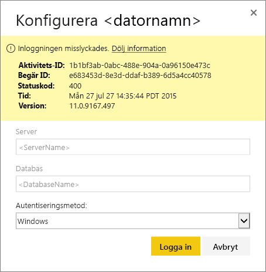
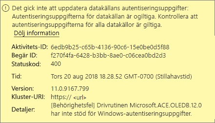
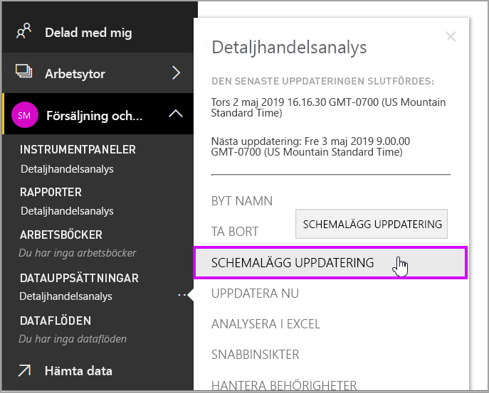
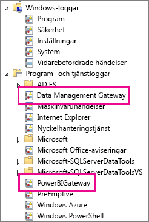
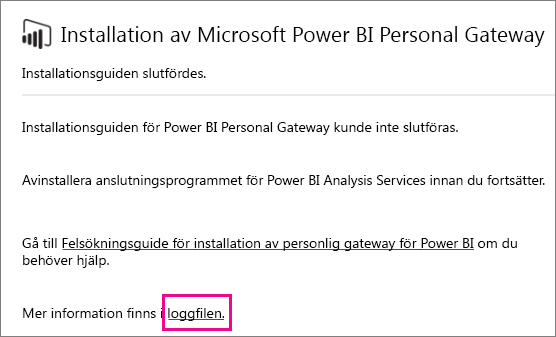

# Felsöka Power BI-gateway (personligt läge)

[!INCLUDE [gateway-rewrite](../includes/gateway-rewrite.md)]

I följande avsnitt beskrivs några vanliga problem som kan uppstå när du använder Power BI lokal datagateway (personligt läge).

## Uppdatera till den senaste versionen

Den aktuella versionen av gatewayen för personligt bruk är lokal datagateway (personligt läge). Uppdatera din installation så att du använder den här versionen.

Ett stort antal problem kan uppstå om gatewayversionen är inaktuell. Det är en allmänt bra vana att kontrollera att du har den senaste versionen. Om du inte har uppdaterat gatewayen på en månad eller längre bör du överväga att installera den senaste versionen av gatewayen. Testa sedan om du kan återskapa problemet.

## Installation
**Gateway (personligt läge) fungerar på 64-bitars versioner:** Om datorn är en 32-bitars version kan du inte installera gatewayen (personligt läge). Operativsystemet måste vara en 64-bitars version. Installera en 64-bitars version av Windows eller installera gatewayen (personligt läge) på en 64-bitars dator.

**Gateway (personligt läge) kan inte installeras som en tjänst även om du är lokal administratör för datorn:** Installationen kan misslyckas om användaren finns i datorns lokala administratörsgrupp, men grupprincip inte tillåter att användarnamnet loggar in som en tjänst. Kontrollera om grupprincipen tillåter att en användare loggar in som en tjänst. Vi arbetar på att lösa problemet. Mer information finns i artikeln om att [lägga till behörigheten Logga in som en tjänst på ett konto](https://technet.microsoft.com/library/cc739424.aspx).

**Tidsgränsen uppnåddes:** Det här meddelandet är vanligt om den dator (fysisk eller virtuell dator) som du installerar den gatewayen (personligt läge) på har en processor med bara en kärna. Stäng alla program, inaktivera alla processer som inte behövs och försök installera igen.

**Gateway för datahantering eller Analysis Services-anslutningsprogrammet kan inte installeras på samma dator som gateway (personligt läge):** Om du redan har en Analysis Services-anslutningsprogrammet eller en gateway för datahantering installerad måste du först avinstallera anslutningsprogrammet eller gatewayen. Försök sedan att installera gateway (personligt läge).

> [!NOTE]
> Om det uppstår problem under installationen kan installationsloggarna innehålla information som kan hjälpa dig att lösa det. För ytterligare information, se [Installationsloggar](#SetupLogs).
> 
> 

 **Proxykonfiguration:** Du kan stöta på problem med att konfigurera gateway (personligt läge) om miljön behöver användning av en proxy. Mer information om hur du konfigurerar proxyinformation finns i [Konfigurera proxyinställningar för den lokala datagatewayen](/data-integration/gateway/service-gateway-proxy).

## Uppdatera schema
**Fel: Autentiseringsuppgiften som lagras i molnet saknas.**

Du kan få detta fel i inställningarna för \<dataset\> om du har en schemalagd uppdatering och sedan avinstallerat och ominstallerat gatewayen (personligt läge). När du avinstallerar en gateway (personligt läge) tas datakällans autentiseringsuppgifter för en datamängd som har konfigurerats för uppdatering bort från Power BI-tjänsten.

**Lösning:** I Power BI så går du till uppdateringsinställningarna för en datauppsättning. I **Hantera datakällor** väljer du **Redigera autentiseringsuppgifter** för alla datakällor med fel. Logga sedan in på datakällan igen.

**Fel: De autentiseringsuppgifter som anges för datauppsättningen är ogiltiga. Uppdatera autentiseringsuppgifterna genom en uppdatering eller i dialogrutan Inställningar för datakälla om du vill fortsätta.**

**Lösning:** Om du får ett meddelande om autentiseringsuppgifter så kan det innebära:

* De användarnamn och lösenord du använde för att logga in till datakällor är inte aktuella. Gå till datauppsättningens uppdateringsinställningar i Power BI. I **Hantera datakällor** väljer du **Redigera autentiseringsuppgifter** för att uppdatera autentiseringsuppgifterna för datakällan.
* Kombinationsprogram mellan en molnkälla och en lokal källa misslyckas i en enskild fråga att uppdateras i gateway (personligt läge) om en av källorna använder OAuth för autentisering. Ett exempel på detta problem är ett kombinationsprogram mellan CRM Online och en lokal SQL Server-instans. Kombinationsprogrammet misslyckas eftersom CRM Online kräver OAuth.
  
  Detta fel är ett känt problem som håller på att utredas. Undvik problemet genom ha en separat fråga för molnkällan och den lokala källan. Använd sedan en sammanfognings- eller tilläggsfråga för att kombinera dem.

**Fel: Datakällan stöds inte.**

**Lösning:** Om du får ett meddelande om en datakälla som inte stöds i inställningarna för **Uppdatera schema** så kan det betyda: 

* Datakällan stöds för närvarande inte för uppdatering i Power BI. 
* Excel-arbetsboken innehåller inte en datamodell, endast kalkylbladsdata. Power BI stöder för närvarande bara uppdatering om den överförda Excel-arbetsboken innehåller en datamodell. När du importerar data med hjälp av Power Query i Excel, ska du välja alternativet **Läs in** för att läsa in data till datamodellen. Det här alternativet garanterar att data importeras till en datamodell. 

**Fel: [Det går inte att kombinera data] &lt;frågedel&gt;/&lt;…&gt;/&lt;…&gt; ansluter till datakällor som har sekretessnivåer som inte kan användas tillsammans. Återskapa den här datakombinationen.**

**Lösning:** Det här felet beror på begränsningarna av sekretessnivå och de typer av datakällor som du använder.

**Fel: Datakällsfel: Det går inte att konvertera värdet ”\[Table\]” till typen Tabell.**

**Lösning:** Det här felet beror på begränsningarna av sekretessnivå och de typer av datakällor som du använder.

**Fel: Otillräckligt med utrymme för den här raden.**

**Lösning:** Det här felet inträffar om du har en enskild rad som är större än 4 MB. Leta upp raden från din datakälla och försöka filtrera bort den eller minska dess storlek.

## Datakällor
**Dataleverantör saknas:** Gateway (personligt läge) fungerar endast på 64-bitars versioner. Det krävs att en 64-bitars version av dataprovidrarna är installerad på samma dator där gateway (personligt läge) är installerad. Exempel: Om datakällan i datauppsättningen är Microsoft Access, måste du installera din 64-bitars ACE-provider på samma dator som där du har installerat gateway (personligt läge). 

>[!NOTE]
>Om du har en 32-bitars version av Excel kan du inte installera en 64-bitars version av ACE-provider på samma dator.

**Windows-autentisering går inte att använda för Access-databas:** Power BI stöder för närvarande endast anonym autentisering för Access-databasen.

**Fel: Inloggningsfel när du anger autentiseringsuppgifter för en datakälla:** Om du får ett fel som liknar detta när du anger Windows-autentiseringsuppgifter för en datakälla: 

  

Du kanske fortfarande har en äldre version av gatewayen (personligt läge). 

**Lösning:** För ytterligare information, se [Installera den senaste versionen av Power BI gateway (personligt läge)](https://powerbi.microsoft.com/gateway/).

**Fel: Inloggningsfel när du väljer Windows-autentisering för en datakälla som använder ACE OLEDB:** Om du får följande felmeddelande när du anger autentiseringsuppgifter för en datakälla som använder en ACE OLEDB-provider:

Power BI stöder för närvarande inte Windows-autentisering för en datakälla som använder en ACE OLEDB-provider.

**Lösning:** Du kan kringgå det här felet genom att välja **Anonym autentisering**. För en äldre ACE OLEDB-provider är anonyma autentiseringsuppgifter likvärdiga med Windows-autentiseringsuppgifter.

## Paneluppdatering
Om du får ett felmeddelande när instrumentpaneler uppdateras, se [Felsöka panelfel](refresh-troubleshooting-tile-errors.md).

## Verktyg för felsökning
### Uppdateringshistorik
Med **Uppdateringshistorik** kan du se vilka fel som har inträffat och hitta användbara data om du behöver skapa en supportbegäran. Du kan visa både schemalagda uppdateringar och sådana som görs på begäran. Så här går du till **Uppdateringshistorik**.

1. Välj en datauppsättning i **Datauppsättningar** i Power BI-navigeringsfönstret. Öppna menyn och välj **Schemalägg uppdatering**.

   
1. I **Inställningar för...** väljer du **Uppdateringshistorik**. 

   
   
   

### Händelseloggar
Det finns flera händelseloggar som kan ge information. De två första, **Data Management Gateway** och **PowerBIGateway**, finns tillgängliga om du är administratör på datorn. Om du inte är administratör, och du använder datagateway (personligt läge), visas loggposterna i **programloggen**.

**Data Management Gateway**- och **PowerBIGateway**-loggarna finns under **Program- och tjänstloggar**.

### Fiddlerspårning
[Fiddler](https://www.telerik.com/fiddler) är ett kostnadsfritt verktyg från Telerik som övervakar HTTP-trafik. Du kan se kommunikationen med Power BI-tjänsten från klientdatorn. Den här kommunikationen kan visa fel och annan relaterad information.

### Installationsloggar
Om installationen av gateway (personligt läge) misslyckas visas en länk där du kan se installationsloggen. Installationsloggen innehåller information om felet. De här loggarna är Windows-installationsloggar, som även kallas MSI-loggar. De kan vara ganska komplexa och svåra att läsa. Vanligtvis visas det resulterande felet längst ned, men det är inte helt enkelt att ta reda på orsaken till felet. Det kan bero på fel i en annan logg. Det kan också vara ett resultat av ett fel högre upp i loggen.

Eller så kan du gå till Temp-mappen (%temp%) och leta efter filer som börjar med *Power\_BI\_* .

> [!NOTE]
> Om du går till %temp% kan du hamna i en undermapp till temp. *Power\_BI\_* -filerna finns i roten av Temp-katalogen. Du kan behöva gå upp en nivå eller två.
> 
> 

## Nästa steg
- [Konfigurera proxyinställningar för den lokala datagatewayen](/data-integration/gateway/service-gateway-proxy)- [Datauppdatering](refresh-data.md)  
- [Power BI gateway - Personal](service-gateway-personal-mode.md)  
- [Felsöka panelfel](refresh-troubleshooting-tile-errors.md)  
- [Felsökning av den lokala datagatewayen](service-gateway-onprem-tshoot.md) 
 
Har du fler frågor? Fråga [Power BI Community](https://community.powerbi.com/).
