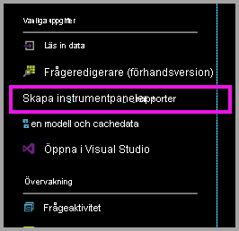
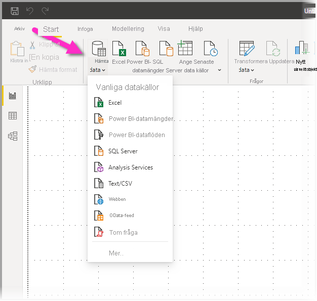
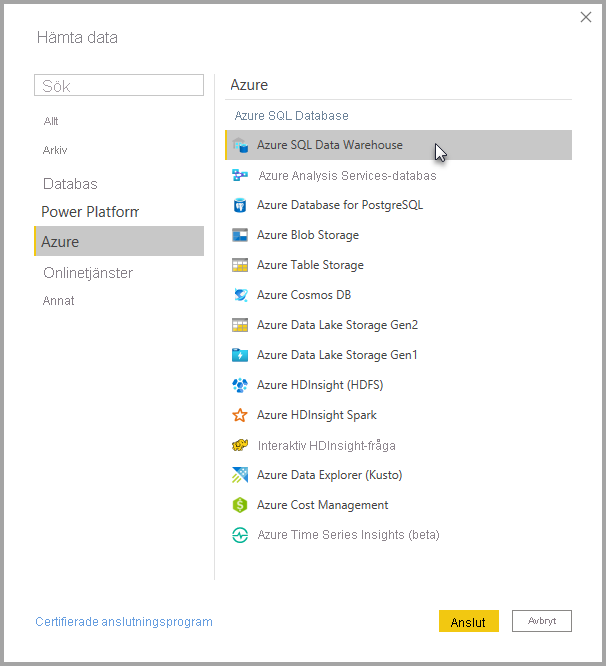
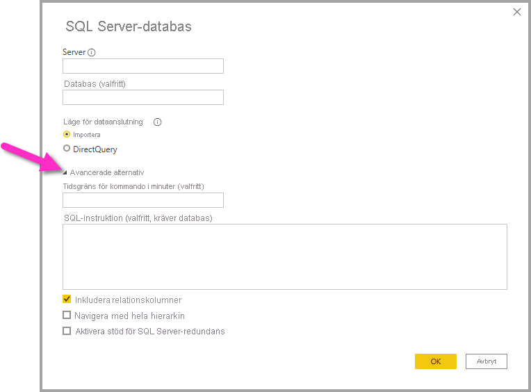

# Azure SQL Data Warehouse med DirectQuery

Med Azure SQL Data Warehouse med DirectQuery kan du skapa dynamiska rapporter baserade på data och mått som du redan har i Azure SQL Data Warehouse. Med DirectQuery skickas frågor tillbaka till din Azure SQL Data Warehouse i realtid medan du utforskar dessa data. Frågor i realtid, i kombination med skalan för SQL Data Warehouse, gör att du kan skapa dynamiska rapporter på några få minuter mot flera terabyte av data. Användare kan dessutom använda länken **Skapa instrumentpaneler och rapporter** för att skapa Power BI-rapporter med hjälp av deras SQL Data Warehouse.

När du använder SQL Data Warehouse-anslutningsprogrammet:

* Ange det fullständigt kvalificerade servernamnet vid anslutning (se nedan för information)
* Se till att brandväggsreglerna för servern är konfigurerade för ”Tillåt åtkomst till Azure-tjänster”.
* Varje åtgärd, som att markera en kolumn eller lägga till ett filter, kommer direkt att fråga informationslagret
* Paneler är inställda på att uppdateras ungefär var 15:e minut och uppdatering behöver inte schemaläggas.  Du kan justera uppdateringen i Avancerade inställningar när du ansluter.
* Frågor och svar är inte tillgängligt för DirectQuery-datauppsättningar
* Schemaändringar plockas inte upp automatiskt

Dessa begränsningar och anmärkningar kan komma att ändras allteftersom vi fortsätter att förbättra upplevelsen. Stegen för att ansluta beskrivs nedan.

## Skapa instrumentpaneler och rapporter i Power BI

> [!Important]
> Vi har förbättrat anslutningen till Azure SQL Data Warehouse. Använd Power BI Desktop för bästa möjliga anslutning till din Azure SQL Data Warehouse-datakälla. När du har skapat din modell och rapport kan du publicera den till Power BI-tjänsten. Den tidigare tillgängliga direktkopplingen för Azure SQL Data Warehouse i Power BI-tjänsten är inte längre tillgänglig.

Det enklaste sättet att flytta mellan SQL Data Warehouse och Power BI är att skapa rapporter i Power BI Desktop. Du kan använda knappen **Skapa instrumentpaneler och rapporter** på Azure-portalen.

1. Kom igång genom att ladda ned och installera Power BI Desktop. Nedladdnings- och installationsinformation finns i artikeln [Skaffa Power BI Desktop](../fundamentals/desktop-get-the-desktop.md), eller så går du direkt till nästa steg.

2. Du kan också klicka på länken **Skapa instrumentpaneler och rapporter** för att ladda ned Power BI Desktop.

    

## Ansluta via Power BI Desktop

Du kan ansluta till ett SQL Data Warehouse med hjälp av knappen **Hämta data** i Power BI Desktop. 

1. Välj knappen **Hämta data** på **Start**-menyn.  

    

2. Välj **Mer…** för att se alla tillgängliga datakällor. I fönstret som visas väljer du **Azure** i den vänstra rutan och väljer sedan **Azure SQL Data Warehouse** i listan över tillgängliga anslutningar i den högra rutan.

    

3. I fönstret som visas anger du din server, och om du vill anger du den databas som du vill ansluta till. Du kan också välja dataanslutningsläge: Import eller DirectQuery. Använd DirectQuery om du vill ha åtkomst i realtid till information i ditt Azure SQL Data Warehouse.

    

4. Om du vill visa avancerade alternativ för Azure SQL Data Warehouse-anslutningen väljer du nedpilen bredvid **Avancerade alternativ** så visas fler alternativ för anslutningen.

    

Nästa avsnitt beskriver hur du hittar parametervärden för din anslutning. 

## Hitta parametervärden

Det fullständigt kvalificerade servernamnet och databasnamnet återfinns i Azure Portal. Observera att SQL Data Warehouse bara finns på Azure-portalen just nu.

> [!NOTE]
> Om din Power BI-klient finns i samma region som Azure SQL Data Warehouse debiteras du inte för utgående trafik. Du kan se var din Power BI-klient finns genom att följa [de här instruktionerna](https://docs.microsoft.com/power-bi/service-admin-where-is-my-tenant-located).

[!INCLUDE [direct-query-sso](../includes/direct-query-sso.md)]

## Nästa steg

* [Använda DirectQuery i Power BI](desktop-directquery-about.md)
* [Vad är Power BI?](../fundamentals/power-bi-overview.md)  
* [Hämta data för Power BI](service-get-data.md)  
* [Azure SQL Data Warehouse](/azure/sql-data-warehouse/sql-data-warehouse-overview-what-is/)

Har du fler frågor? [Prova Power BI Community](https://community.powerbi.com/)
