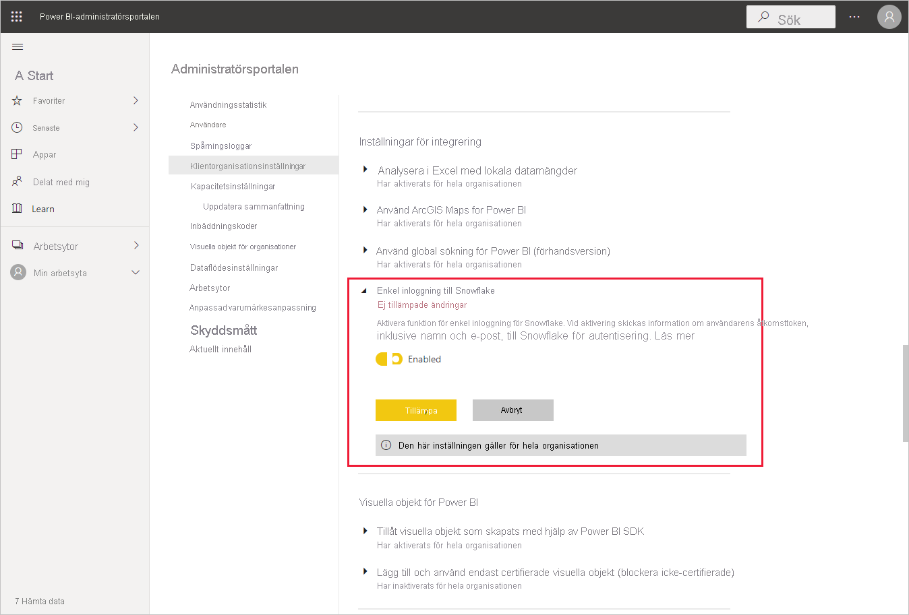
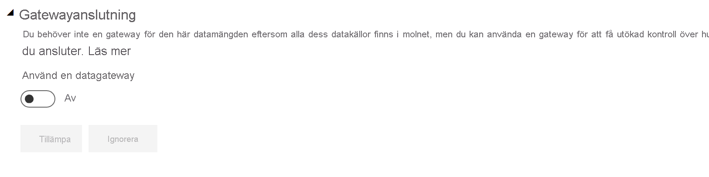
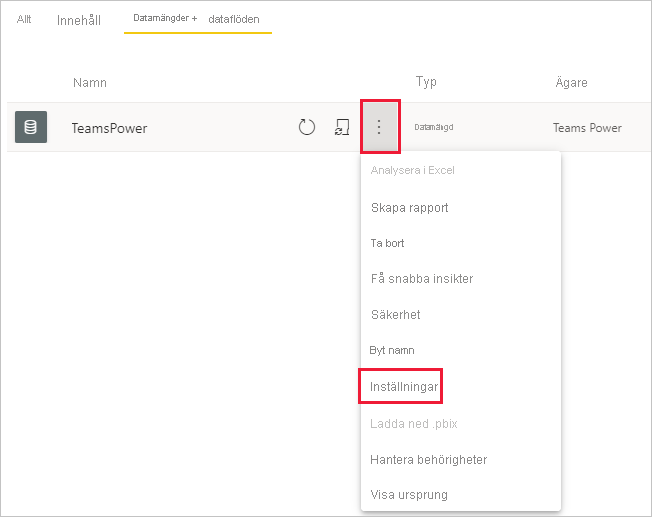
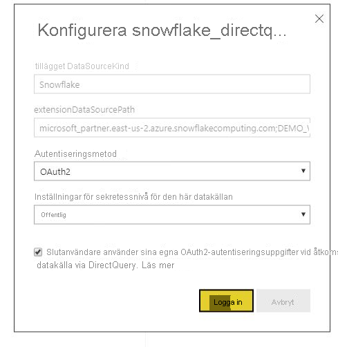

# Ansluta till Snowflake i Power BI-tjänsten

## Introduktion

Att ansluta till Snowflake i Power BI-tjänsten skiljer sig från andra anslutningar på ett sätt. Snowflake har en ytterligare funktion för Azure Active Directory (AAD) med ett alternativ för enkel inloggning. Olika delar av integreringen kräver olika administrativa roller för Snowflake, Power BI och Azure. Du kan också välja att aktivera AAD-autentisering utan att använda enkel inloggning. Grundläggande autentisering fungerar på samma sätt som för andra anslutningsprogram i tjänsten.

Följ stegen i den här artikeln om du vill konfigurera AAD-integrering och valfritt aktivera enkel inloggning:

* Om du är Snowflake-administratör läser du artikeln [Power BI enkel inloggning till Snowflake – Kom igång](https://docs.snowflake.com/en/user-guide/oauth-powerbi.html) i Snowflake-dokumentationen.
* Om du är Power BI-administratör, se [Konfiguration av Power BI-tjänsten – Admin Portal](service-connect-snowflake.md#admin-portal) för att läsa hur du aktiverar enkel inloggning.
* Om du är en Power BI-datauppsättningsskapare, se [Konfiguration av Power BI-tjänsten – konfigurera en datauppsättning med AAD](service-connect-snowflake.md#configuring-a-dataset-with-aad) för att läsa hur du aktiverar enkel inloggning.

## Konfigurera Power BI-tjänsten

### Administratörsportalen

Om du vill aktivera enkel inloggning måste en global administratör aktivera inställningen i administratörsportalen för Power BI. Den här inställningen godkänner sändning av AAD-autentiseringsuppgifter till Snowflake för autentisering för hela organisationen. Aktivera enkel inloggning genom att följa dessa steg:

1. [Logga in på Power BI](https://app.powerbi.com) med hjälp av autentiseringsuppgifter för global administratör.
1. Välj **Inställningar** på sidhuvudmenyn och välj sedan **Administratörsportalen**.
1. Välj **Klientinställningar**och bläddra sedan för att hitta **Integrationsinställningar**.

   

4. Expandera **Snowflake enkel inloggning**, växla inställningen till **Aktiverat** och välj **Använd**.

Det här steget krävs för att ge samtycke till att skicka din AAD-token till Snowflake-servrarna. När du har aktiverat inställningen kan det ta upp till en timme innan den börjar gälla.

När enkel inloggning har aktiverats kan du använda rapporter med enkel inloggning.

### Konfigurera en datamängd med AAD

När en rapport som baseras på Snowflake-kopplingen har publicerats till Power BI-tjänsten, måste datauppsättningens skapare uppdatera inställningarna för relevant arbetsyta så att den kan använda enkel inloggning.

På grund av hur Power BI är utformat så fungerar enkel inloggning bara när inga datakällor körs via den lokala datagatewayen. Begränsningarna visas nedan:

* Om du bara använder en Snowflake-källa i din datamodell kan du använda enkel inloggning om du väljer att inte använda den lokala datagatewayen.
* Om du använder en Snowflake-källa och en annan källa så kan du använda enkel inloggning om ingen av källorna använder den lokala datagatewayen.
* Om du använder en Snowflake-källa via den lokala datagatewayen, så stöds inte AAD-autentiseringsuppgifter för närvarande. Det här övervägandet kan vara relevant om du försöker komma åt ett virtuellt nätverk från en enskild IP-adress där gatewayen är installerad, snarare än från hela IP-intervallet för Power BI.
* Om du använder en Snowflake-källa och en annan källa som behöver en gateway så måste du även använda Snowflake via den lokala datagatewayen. Då kommer du inte att kunna använda enkel inloggning.

Läs mer om att använda den lokala datagatewayen i artikeln [Vad är en lokal datagateway?](service-gateway-onprem.md)

Om du inte använder gatewayen är du färdig. När du har autentiseringsuppgifter för Snowflake konfigurerade i din lokala datagateway, men bara använder den datakällan i din modell, kan du klicka på växlingsknappen på sidan Inställningar för datamängd och stänga av gatewayen för datamodellen.

Följ dessa steg om du vill aktivera enkel inloggning för en datauppsättning:

1. [Logga in på Power BI](https://app.powerbi.com) med hjälp av autentiseringsuppgifter för datauppsättningens skapare.
1. Välj lämplig arbetsyta och välj sedan **inställningar** på menyn fler alternativ som finns bredvid datauppsättningens namn.
  
1. Välj **Autentiseringsuppgifter för datakälla** och logga in. Datauppsättningen kan loggas in på Snowflake med Basic- eller OAuth2-autentiseringsuppgifter (AAD). Om du använder AAD kan du aktivera enkel inloggning i nästa steg.
1. Välj alternativet **Slutanvändare använder sina egna OAuth2-autentiseringsuppgifter när de ansluter till den här datakällan via DirectQuery**. Den inställningen aktiverar AAD enkel inloggning. Oavsett om den första användaren loggar in med Basic-autentisering eller OAuth2 (AAD) så är det AAD-autentiseringsuppgifterna som skickas för enkel inloggning.

    

När de här stegen är klara ska eventuella ytterligare användare automatiskt använda sin AAD-autentisering för att ansluta till data från den Snowflake-datauppsättningen.

Om du väljer att inte aktivera enkel inloggning så kommer de användare som uppdaterar rapporten att använda autentiseringsuppgifterna för den användare som loggade in, precis som i de flesta andra Power BI-rapporter.

### Felsökning

Om du stöter på problem med integreringen kan du läsa i [felsökningsguiden](https://docs.snowflake.com/en/user-guide/oauth-powerbi.html#troubleshooting) för Snowflake.

## Nästa steg

* [Datakällor för Power BI-tjänsten](service-get-data.md)
* [Ansluta till datauppsättningar i Power BI-tjänsten från Power BI Desktop](desktop-report-lifecycle-datasets.md)
* [Ansluta till ett Snowflake-databearbetningslager](desktop-connect-snowflake.md)