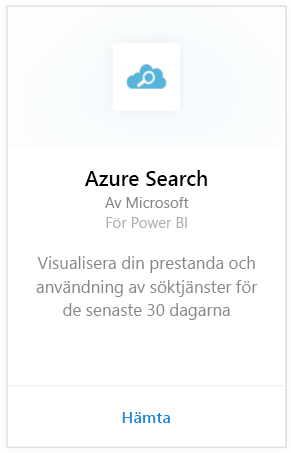
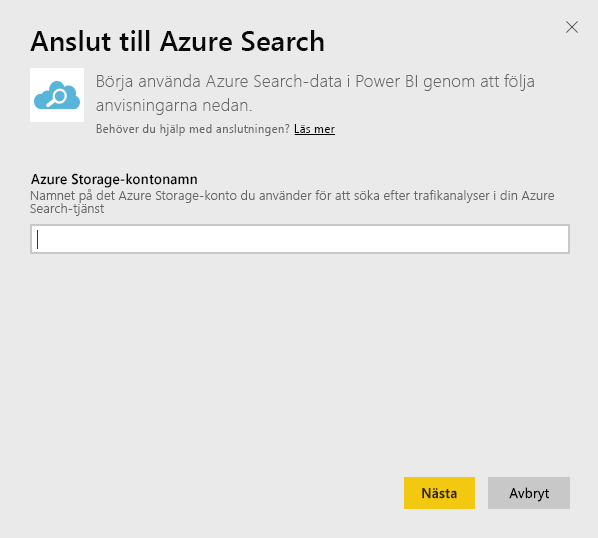
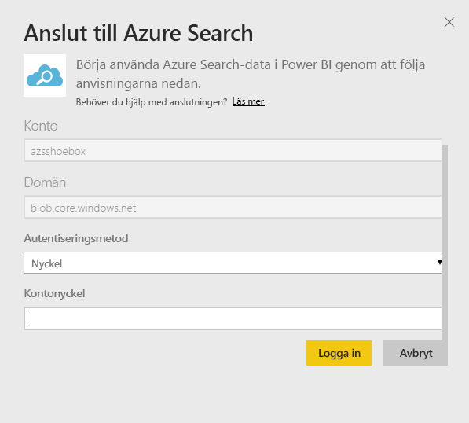
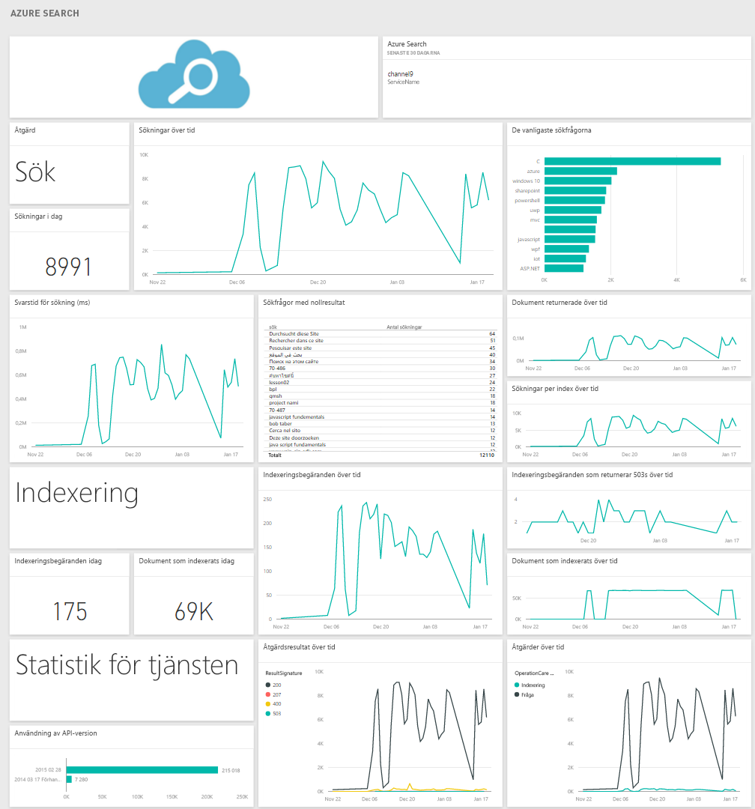

# Anslut till Azure Search med Power BI
Azure Search Traffic Analytics låter dig övervaka och förstå trafiken till din Azure Search-tjänst. Azure Search-innehållspaketet för Power BI innehåller detaljerad information om dina sökdata, inklusive sökning, indexering, statistik för tjänsten och svarstid från de senaste 30 dagarna. Mer information finns i [Azure-blogginlägget](https://azure.microsoft.com/blog/analyzing-your-azure-search-traffic/).

[!INCLUDE [include-short-name](../includes/service-deprecate-content-packs.md)]

Anslut till [Azure Search-innehållspaketet](https://app.powerbi.com/getdata/services/azure-search) för Power BI.

## Så här ansluter du
1. Välj **Hämta data** längst ned i navigeringsfönstret.
   
    
2. I rutan **Tjänster** väljer du **Hämta**.
   
    
3. Välj **Azure Search** \> **Hämta**.
   
   
4. Ange namnet på tabellagringskontot där din Azure Search-analys lagras.
   
   
5. Välj **nyckel** som autentiseringsmetod och ange din lagringskontonyckel. Klicka på **logga In** för att starta inläsningen.
   
   
6. När inläsningen är klar visas en ny instrumentpanel, rapport och modell i navigeringsfönstret. Välj instrumentpanelen för att visa dina importerade data.
   
    

**Och sedan?**

* Prova att [ställa en fråga i rutan Frågor och svar](../consumer/end-user-q-and-a.md) överst på instrumentpanelen
* [Ändra panelerna](../create-reports/service-dashboard-edit-tile.md) på instrumentpanelen.
* [Välj en panel](../consumer/end-user-tiles.md) för att öppna den underliggande rapporten.
* Medan din datauppsättning schemaläggs att uppdateras dagligen så kan du ändra uppdateringsfrekvensen eller testa att uppdatera den på begäran med **Uppdatera nu**

## Systemkrav
Azure Search-innehållspaketet kräver att Azure Search Traffic Analytics är aktiverat för kontot.

## Felsökning
Se till att lagringskontonamnet har angetts korrekt tillsammans med den fullständiga åtkomstnyckeln. Lagringskontonamnet ska motsvara det konto som har konfigurerats med Azure Search Traffic Analytics.

## Nästa steg
[Vad är Power BI?](../fundamentals/power-bi-overview.md)

[Grundläggande begrepp för designers i Power BI-tjänsten](../fundamentals/service-basic-concepts.md)
