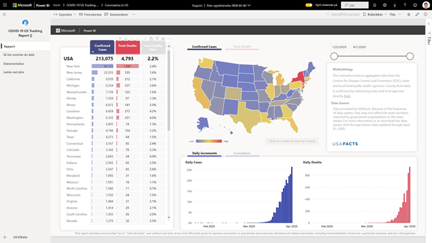
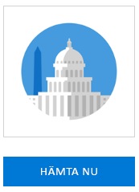
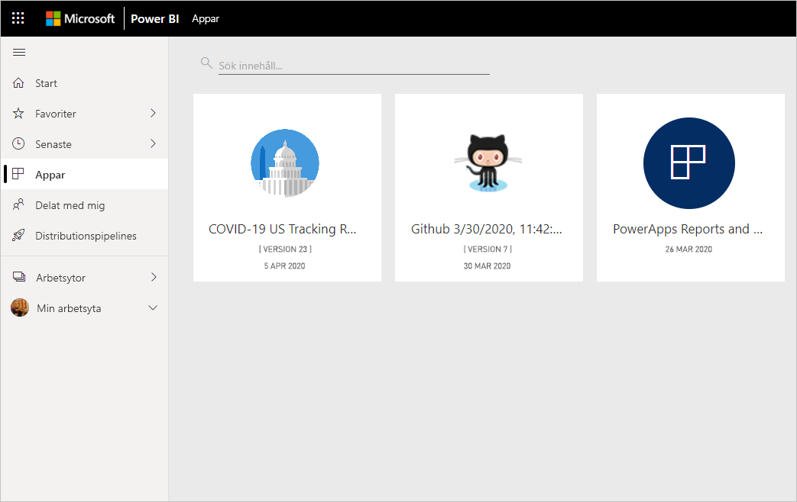
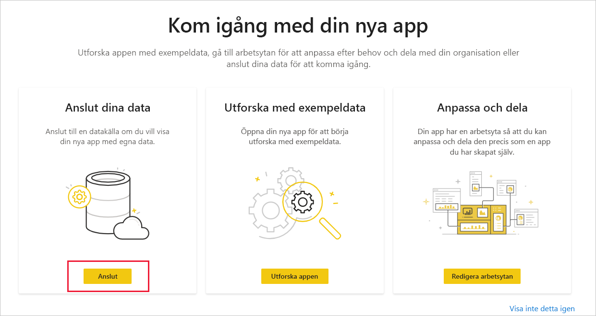
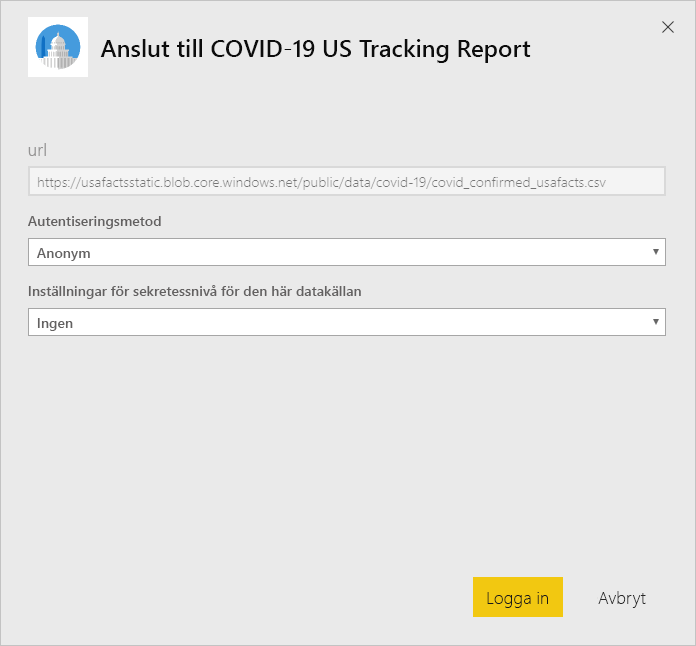
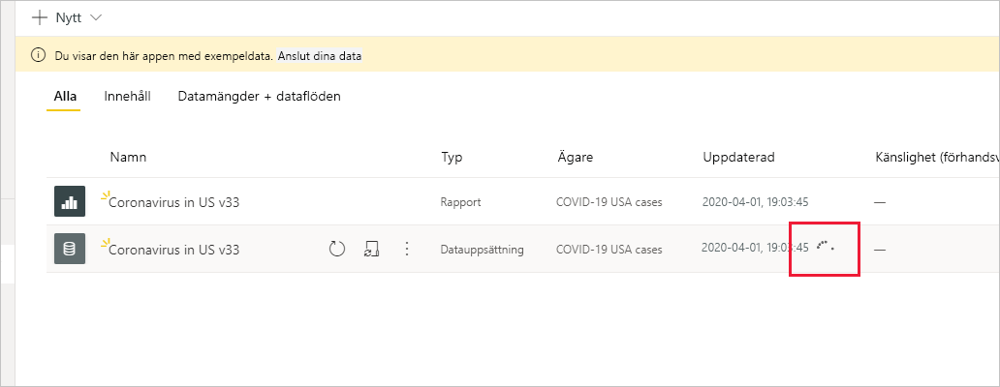

# Ansluta till uppföljningsrapport för COVID-19 för USA
I den här artikeln beskrivs hur du installerar mallappen för uppföljningsrapporten för COVID-19 och ansluter till datakällorna.

Mer detaljerad information om själva rapporten, inklusive ansvarsfriskrivningar och information om data finns i [COVID–19-spårningsexempel för myndigheter i USA på lokal och delstatsnivå](../create-reports/sample-covid-19-us.md).

När du har installerat mallappen och anslutit till datakällorna kan du anpassa rapporten efter dina behov. Sedan kan du distribuera den som en app till medarbetare i din organisation.

## Installera appen

1. Klicka på följande länk för att gå till appen: [Mallapp för uppföljningsrapport för COVID-19 för USA](https://appsource.microsoft.com/en-us/product/power-bi/pbi-contentpacks.covid19ms)

1. När du är på appens AppSource-sida klickar du på [**Hämta nu**](https://appsource.microsoft.com/en-us/product/power-bi/pbi-contentpacks.covid19ms).

    

1. Klicka på **Installera** när du uppmanas att göra det. När appen har installerats visas den på sidan Appar.

   

## Anslut till datakällor

1. Välj ikonen på sidan Appar för att öppna appen.

1. På välkomstskärmen som visas väljer du **Anslut**.

   

1. Två dialogrutor för inloggning visas, den ena efter den andra. Ange sekretessnivån Offentlig i båda dialogrutorna.

   

   Rapporten ansluter till datakällorna och fylls med aktuella data. Under den här tiden körs aktivitetsövervakaren.

   

## Schemalägga rapportuppdatering

När datauppdateringen har slutförts kommer du att vara i den arbetsyta som är associerad med appen. [Skapa ett uppdateringsschema](../connect-data/refresh-scheduled-refresh.md) för att hålla rapportdata uppdaterade.

## Anpassa och dela

Mer information finns i [Anpassa och dela appen](../connect-data/service-template-apps-install-distribute.md#customize-and-share-the-app). Läs [friskrivningar för rapporter](../create-reports/sample-covid-19-us.md#disclaimers) innan du publicerar eller distribuerar appen.

## Nästa steg
* [COVID – 19 spårningsexempel för myndigheter i USA på lokal och delstatsnivå](../create-reports/sample-covid-19-us.md)
* Har du några frågor? [Fråga Power BI Community](https://community.powerbi.com/)
* [Vad är Power BI-mallappar?](../connect-data/service-template-apps-overview.md)
* [Installera och distribuera mallappar i din organisation](../connect-data/service-template-apps-install-distribute.md)
