# Ansluta till Närvarorapportering för kriskommunikation

Den här Power BI-appen är rapporterings-/instrumentpanelsartefakten i Microsoft Power Platform-lösningen för kriskommunikation. Den spårar positionen för de som använder appen Kriskommunikation. Lösningen består av en kombination av funktioner från Power Apps, Power Automate, Teams, SharePoint och Power BI. Den kan användas på webben, i mobila enheter eller i Teams.

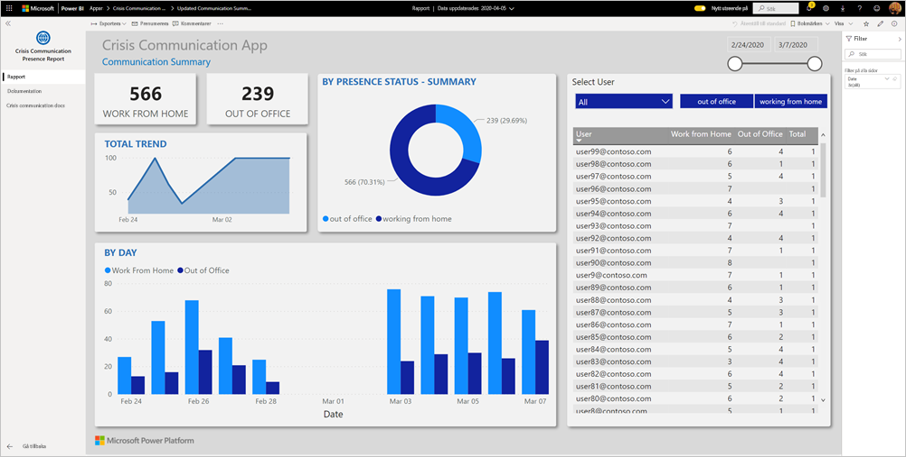

På instrumentpanelen kan akutchefer se sammanställda data i vårdsystemet så att de kan fatta rätt beslut vid rätt tidpunkt.

I den här artikeln beskrivs hur du installerar appen och ansluter till datakällorna. Mer information om appen Kriskommunikation finns i [Konfigurera och läs mer om exempelmallen Kriskommunikation i Power Apps](https://docs.microsoft.com/powerapps/maker/canvas-apps/sample-crisis-communication-app)

När du har installerat mallappen och anslutit till datakällorna kan du anpassa rapporten efter dina behov. Sedan kan du distribuera den som en app till medarbetare i din organisation.

## Förutsättningar

Innan du installerar den här mallappen måste du först installera och konfigurera [kriskommunikationsexempel](https://docs.microsoft.com/powerapps/maker/canvas-apps/sample-crisis-communication-app). När du installerar den här lösningen skapas de referenser till datakällor som behövs för att fylla appen med data.

När du installerar kriskommunikationsexemplet noterar du [sökvägen till mappen för SharePoint-listan, ”CI_Employee Status”, och list-ID:t](https://docs.microsoft.com/powerapps/maker/canvas-apps/sample-crisis-communication-app#monitor-office-absences-with-power-bi).

## Installera appen

1. Klicka på följande länk för att gå till appen: [Mallappen Närvarorapportering för kriskommunikation](https://appsource.microsoft.com/en-us/product/power-bi/pbi-contentpacks.crisiscomms)

1. På AppSource-sidan för appen väljer du [**Hämta nu**](https://appsource.microsoft.com/en-us/product/power-bi/pbi-contentpacks.crisiscomms).

    [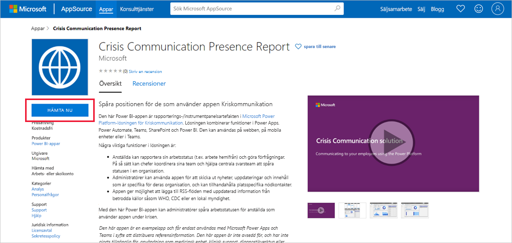](https://appsource.microsoft.com/en-us/product/power-bi/pbi-contentpacks.crisiscomms)

1. Läs informationen i **En sak till** och välj **Fortsätt**.

    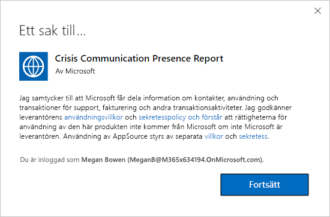

1. Välj **installera**. 

    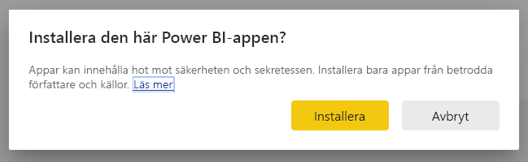

    När appen har installerats visas den på sidan Appar.

   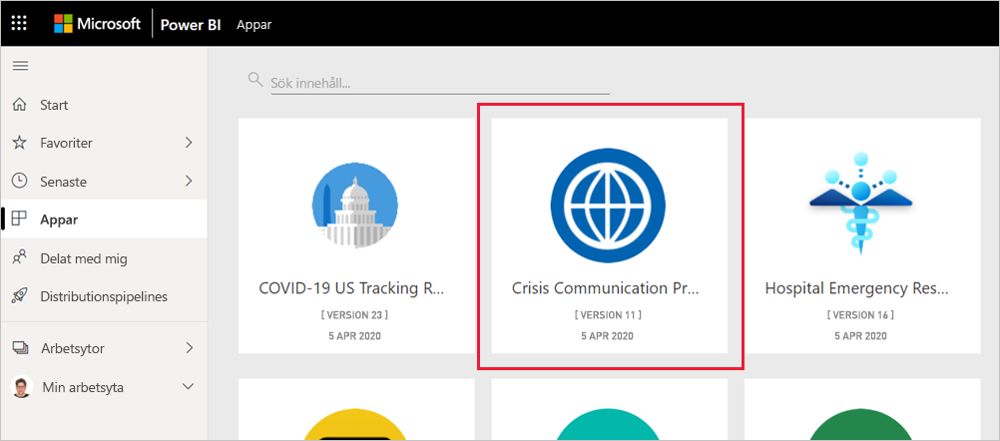

## Anslut till datakällor

1. Välj ikonen på sidan Appar för att öppna appen.

1. På välkomstskärmen väljer du **Utforska**.

   

   Appen öppnas och visar exempeldata.

1. Välj länken **Anslut dina data** på banderollen längst upp på sidan.

   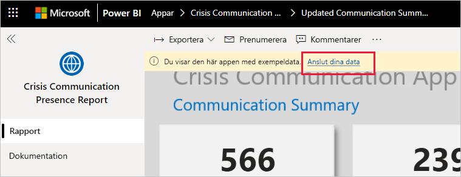

1. I dialogrutan:
   1. I fältet SharePoint_Folder anger du [”CI_Employee status”-sökvägen för SharePoint-listan](https://docs.microsoft.com/powerapps/maker/canvas-apps/sample-crisis-communication-app#monitor-office-absences-with-power-bi).
   1. I fältet List_ID anger du list-ID:t som du fick från listinställningarna. När du är klar klickar du på **Nästa**.

   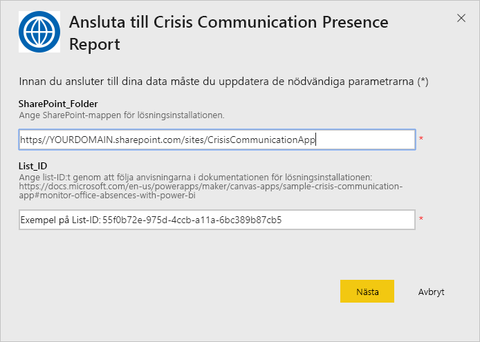

1. I nästa dialogruta som visas anger du **OAuth2** som autentiseringsmetod. Du behöver inte göra något med sekretessnivåinställningen.

   Välj **Logga in**.

   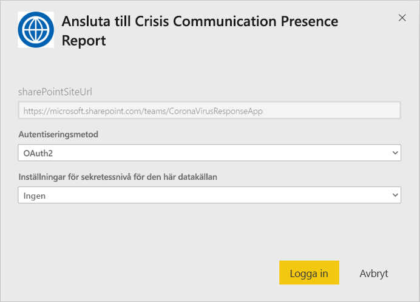

1. Logga in på Power BI på Microsoft-inloggningsskärmen.

   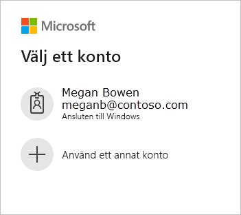

   När du har loggat in ansluter rapporten till datakällorna och fylls med aktuella data. Under den här tiden körs aktivitetsövervakaren.

   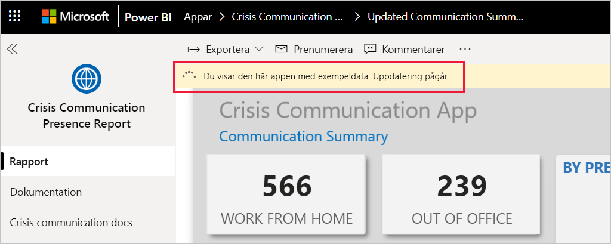

## Schemalägga rapportuppdatering

När datauppdateringen har slutförts [skapar du ett uppdateringsschema](../connect-data/refresh-scheduled-refresh.md) för att hålla rapportdata uppdaterade.

1. I det översta rubrikfältet väljer du **Power BI**.

   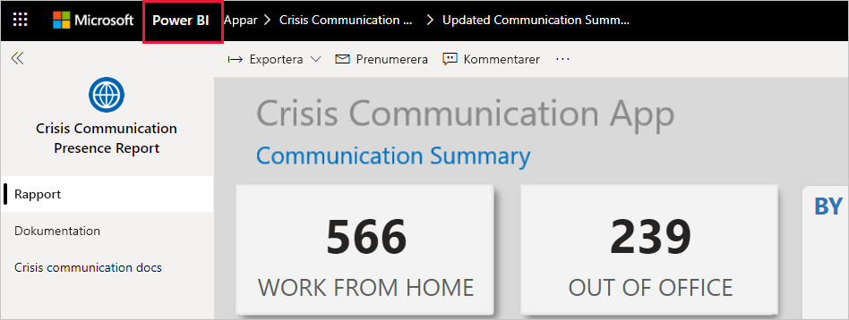

1. I det vänstra navigeringsfönstret letar du reda på arbetsytan Instrumentpanel för beslutsstöd för akutrespons för sjukhus under **Arbetsytor** och följer anvisningarna i artikeln [Konfigurera schemalagd uppdatering](../connect-data/refresh-scheduled-refresh.md).

## Anpassa och dela

Mer information finns i [Anpassa och dela appen](../connect-data/service-template-apps-install-distribute.md#customize-and-share-the-app). Läs [friskrivningar för rapporter](../create-reports/sample-covid-19-us.md#disclaimers) innan du publicerar eller distribuerar appen.

## Nästa steg
* [Konfigurera och läs mer om exempelmallen Kriskommunikation i Power Apps](https://docs.microsoft.com/powerapps/maker/canvas-apps/sample-crisis-communication-app)
* Har du några frågor? [Fråga Power BI Community](https://community.powerbi.com/)
* [Vad är Power BI-mallappar?](../connect-data/service-template-apps-overview.md)
* [Installera och distribuera mallappar i din organisation](../connect-data/service-template-apps-install-distribute.md)
