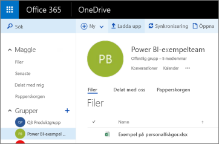
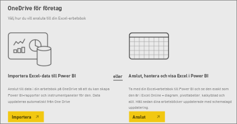

# Anslut till filer som lagras i OneDrive för din Power BI-arbetsyta
När du har [skapat en arbetsyta i Power BI](../collaborate-share/service-create-distribute-apps.md) kan du lagra dina Excel-, CSV-, och Power BI Desktop-filer i OneDrive för företag för din Power BI-arbetsyta. Du kan fortsätta att uppdatera de filer som du lagrar i OneDrive. De uppdateringarna visas automatiskt i Power BI-rapporter och instrumentpaneler som baseras på filerna. 

> [!NOTE]
> I de nya arbetsytorna har förhållandet ändrats mellan Power BI-arbetsytor och Microsoft 365-grupper. Du skapar inte automatiskt en Microsoft 365-grupp varje gång du skapar en av de nya arbetsytorna. Läs mer om att [skapa de nya arbetsytorna](../collaborate-share/service-create-the-new-workspaces.md)

Att lägga till filer på din arbetsyta är en tvåstegsprocess: 

1. Först [laddar du upp filer till OneDrive för företag](service-connect-to-files-in-app-workspace-onedrive-for-business.md#1-upload-files-to-the-onedrive-for-business-for-your-workspace) för din arbetsyta.
2. Sedan [ansluter du till dessa filer från Power BI](service-connect-to-files-in-app-workspace-onedrive-for-business.md#2-import-excel-files-as-datasets-or-as-excel-online-workbooks).

> [!NOTE]
> Arbetsytor är bara tillgängliga med [Power BI Pro](../fundamentals/service-features-license-type.md).
> 

## 1 Ladda upp filer till OneDrive för företag för din arbetsyta
1. I Power BI-tjänsten väljer du pilen bredvid Arbetsytor > och väljer ellipsen ( **…** ) bredvid namnet på din arbetsyta. 
   
   
2. Välj **Filer** för att öppna OneDrive för företag för din arbetsyta i Microsoft 365.
   
   > [!NOTE]
   > Om du inte ser **Filer** överst i menyn för arbetsytan, väljer du **Medlemmar** för att öppna OneDrive för företag för din arbetsyta. Där väljer du **filer**. Microsoft 365 ställer in en lagringsplats för OneDrive för din apps filer för grupparbetsytan. Den här processen kan ta lite tid.
   > 
   > 
3. Här kan du ladda upp dina filer till OneDrive för företag för din arbetsyta. Välj **överför**, och navigera till dina filer.
   
   

## 2 importera Excel-filer som datauppsättningar eller som Excel Online-arbetsböcker
Nu när dina filer finns i OneDrive för företag för din arbetsyta har du ett val. Du kan: 

* [Importera data från Excel-arbetsboken som en datamängd](service-get-data-from-files.md). Använd sedan data för att skapa rapporter och instrumentpaneler som du kan visa i en webbläsare och på mobila enheter.
* Eller [ansluta till en hel Excel-arbetsbok i Power BI](service-excel-workbook-files.md) och visa den exakt som den visas i Excel Online.

### Importera eller ansluta till filerna i din arbetsyta
1. Växla till arbetsytan i Power BI så att du ser arbetsytans namn uppe till vänster. 
2. Välj **Hämta data** längst ned i navigeringsfönstret. 
   
   
3. I rutan **Filer** väljer du **Hämta**.
   
   
4. Välj **OneDrive** - *arbetsytans namn*.
   
    
5. Välj den fil du vill > **ansluta**.
   
    Nu väljer du om du vill [importera data från Excel-arbetsboken](service-get-data-from-files.md) eller [ansluta till hela Excel-arbetsboken](service-excel-workbook-files.md).
6. Välj **importera** eller **anslut**.
   
    
7. Om du väljer **imporera** så visas arbetsboken i fliken **datauppsättningar**. 
   
    
   
    Om du väljer **anslut** så visas arbetsboken i fliken **arbetsböcker**.
   
    

## Nästa steg
* [Skapa appar och arbetsytor i Power BI](../collaborate-share/service-create-distribute-apps.md)
* [Importera data från Excel-arbetsböcker](service-get-data-from-files.md)
* [Ansluta till hela Excel-arbetsböcker](service-excel-workbook-files.md)
* Har du fler frågor? [Prova Power BI Community](https://community.powerbi.com/)
* Feedback? Besök [Power BI-idéer](https://ideas.powerbi.com/forums/265200-power-bi)
