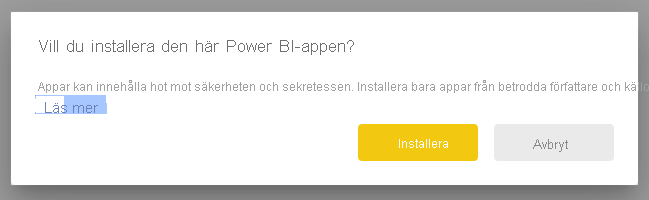
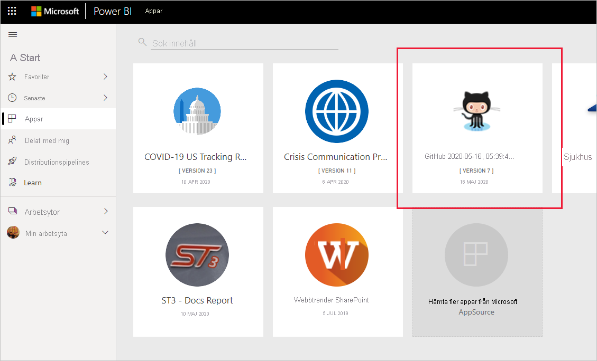
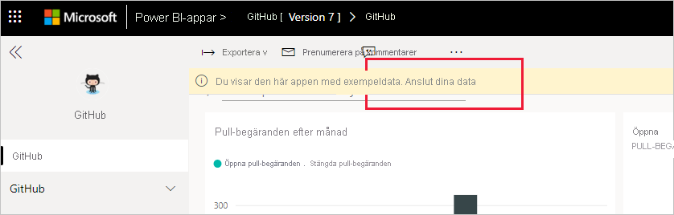
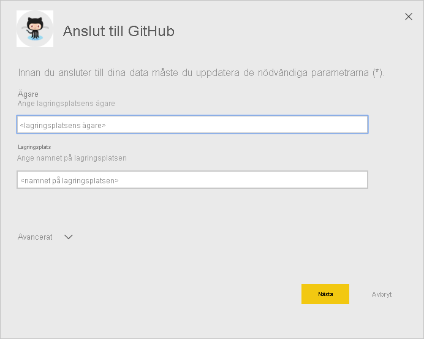
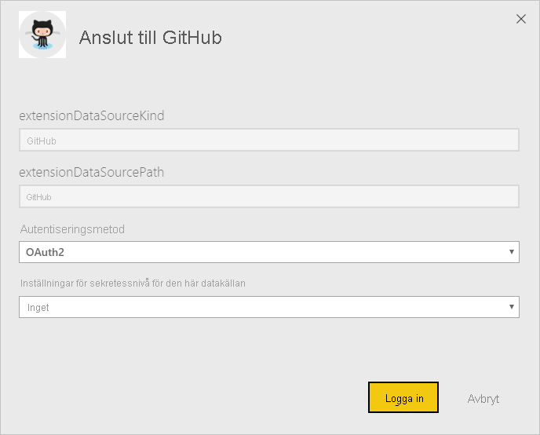
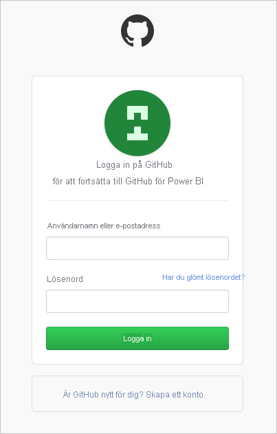
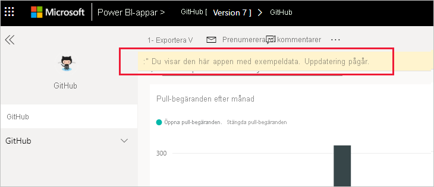
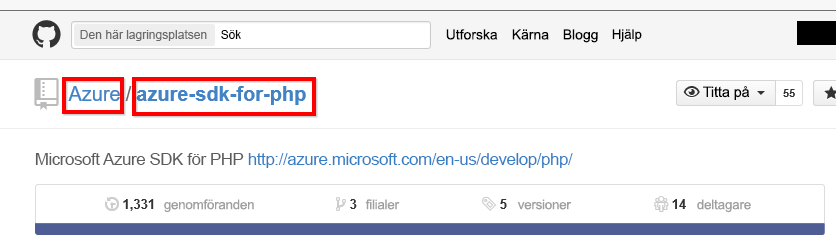

# Ansluta till GitHub med Power BI
Den här artikeln vägleder dig genom att hämta data från ditt GitHub-konto med en Power BI-mallapp. Mallappen genererar en arbetsyta med en instrumentpanel, en uppsättning rapporter samt en datamängd som gör att du kan utforska dina GitHub-data. GitHub-appen för Power BI visar insikter om din GitHub-lagringsplats, som även kallas repo, med data för bidrag, problem, pull-begäranden och aktiva användare.

När du har installerat mallappen kan du ändra instrumentpanelen och rapporten. Sedan kan du distribuera den som en app till kollegor i din organisation.

Anslut till [GitHub-mallappen](https://app.powerbi.com/groups/me/getapps/services/pbi-contentpacks.pbiapps-github) eller läs mer om [GitHub-integrering](https://powerbi.microsoft.com/integrations/github) med Power BI.

Du kan även prova [GitHub-självstudien](service-tutorial-connect-to-github.md). Den installerar verkliga GitHub-data om den offentliga lagringsplatsen för Power BI-dokumentationen.

>[!NOTE]
>Den här mallappen kräver att GitHub-kontot har åtkomst till lagringsplatsen. Mer information om kraven finns nedan.
>
>Den här mallappen stöder inte GitHub Enterprise.

## Installera appen

1. Klicka på följande länk för att gå till appen: [GitHub-mallapp](https://app.powerbi.com/groups/me/getapps/services/pbi-contentpacks.pbiapps-github)

1. På AppSource-sidan för appen väljer du [**Hämta nu**](https://app.powerbi.com/groups/me/getapps/services/pbi-contentpacks.pbiapps-github).

    

1. Välj **installera**. 

    

    När appen har installerats visas den på sidan Appar.

   

## Anslut till datakällor

1. Välj ikonen på sidan Appar för att öppna appen.

1. På välkomstskärmen väljer du **Utforska appen**.

   

   Appen öppnas och visar exempeldata.

1. Välj länken **Anslut dina data** på banderollen längst upp på sidan.

   

1. I dialogrutan som visas anger du lagringsplatsens namn och ägare. Se information om att [hitta parametrarna](#FindingParams) nedan. När du är klar klickar du på **Nästa**.

   

1. I nästa dialogruta som visas ser du till att autentiseringsmetoden är **OAuth2**. Du behöver inte göra något med sekretessinställningen. Klicka på **Logga in** när du är klar.

   

1. Ange dina autentiseringsuppgifter för GitHub och följ GitHub-autentiseringsprocessen (du kan hoppa över det här steget om du redan har loggat in med webbläsaren).

   

När du har loggat in ansluter rapporten till datakällorna och fylls med aktuella data. Under den här tiden körs aktivitetsövervakaren.

Rapportdata uppdateras automatiskt en gång per dag, såvida du inte inaktiverar detta under inloggningsprocessen. Om du vill kan du även [ställa in ett eget uppdateringsschema](./refresh-scheduled-refresh.md) för att hålla rapportdata aktuella.

## Anpassa och dela

Om du vill anpassa och dela appen väljer du pennikonen längst upp till höger på sidan.

Information om hur du redigerar artefakter i arbetsytan finns i
* [Upptäck rapportredigeraren i Power BI](../create-reports/service-the-report-editor-take-a-tour.md)
* [Grundläggande begrepp för designers i Power BI-tjänsten](../fundamentals/service-basic-concepts.md)

När du har gjort alla ändringar du vill för artefakterna i arbetsytan är du redo att publicera och dela appen. Se [Publicera din app](../collaborate-share/service-create-distribute-apps.md#publish-your-app) för att lära dig hur du gör detta.

## Vad som ingår i appen
Följande data finns tillgängliga från GitHub i Power BI:     

| Tabellnamn | Beskrivning |
| --- | --- |
| Bidrag |I bidragstabellen finns totalt antal tillägg, borttagningar och incheckningar som har godkänts av deltagaren, aggregerade per vecka. De 100 främsta deltagarna ingår. |
| Problem |En lista med alla problem för den valda lagringsplatsen med beräkningar som summa och genomsnittlig tid för att stänga ett problem, totalt antal öppna problem och totalt antal stängda problem. Den här tabellen är tom om det inte finns några problem med lagringsplatsen. |
| Pull-begäranden |Den här tabellen innehåller alla pull-begäranden för lagringsplatsen samt vem som hämtade begäran. Den innehåller även beräkningar för hur många öppna, stängda och totala pull-begäranden som finns, hur lång tid det tog för att hämta begärandena och hur lång tid det tog för en genomsnittlig pull-begäran. Den här tabellen är tom om det inte finns några problem med lagringsplatsen. |
| Användare |Tabellen innehåller en lista med GitHub-användare eller deltagare som har bidragit, arkiverat problem eller löst pull-begäranden för den valda lagringsplatsen. |
| Milstolpar |Den innehåller alla milstolpar för valda lagringsplatsen. |
| DateTable |Den här tabellen innehåller datum från i dag och för tidigare år för att du ska kunna analysera dina GitHub-data per datum. |
| ContributionPunchCard |Den här tabellen kan användas som ett stanskort för bidrag på den valda lagringsplatsen. Den visar incheckningar per veckodag och timme. Tabellen är inte ansluten till andra tabeller i modellen. |
| RepoDetails |Den här tabellen innehåller information om den valda lagringsplatsen. |

## Systemkrav
* GitHub-kontot som har åtkomst till lagringsplatsen.  
* Behörighet som beviljats till Power BI för GitHub-appen vid första inloggningen. Se nedan för information om att återkalla åtkomst.  
* Hur många tillräckliga API-anrop som finns tillgängliga för att hämta och uppdatera data.
>[!NOTE]
>Den här mallappen stöder inte GitHub Enterprise.

### Ta bort auktoriseringen för Power BI
Om du vill ta bort auktoriseringen för Power BI från att vara ansluten till GitHub-lagringsplatsen kan du återkalla åtkomsten i GitHub. Mer information finns i avsnittet [GitHub-hjälp](https://help.github.com/articles/keeping-your-ssh-keys-and-application-access-tokens-safe/#reviewing-your-authorized-applications-oauth).

## Hitta parametrar
Du kan se ägare och lagringsplats genom att titta på lagringsplatsen i själva GitHub:

Den första delen ”Azure” är ägare och den andra delen ”azure-sdk-for-php” är själva lagringsplatsen.  Du ser samma två objekt i URL-adressen för lagringsplatsen:

    <https://github.com/Azure/azure-sdk-for-php> .

## Felsökning
Om det behövs kan du verifiera dina autentiseringsuppgifter för GitHub.  

1. Gå till GitHub-webbplatsen i ett nytt webbläsarfönster och logga in på GitHub. Du ser att du är inloggad i det övre högra hörnet på GitHub-webbplatsen.    
2. I GitHub går du till webbadressen för den lagringsplats som du vill ha åtkomst till i Power BI. Exempel: https://github.com/dotnet/corefx.  
3. Tillbaka i Power BI försöker du ansluta till GitHub. I dialogrutan Konfigurera GitHub använder du namnen på lagringsplatsen och lagringsplatsens ägare för samma lagringsplats.  

## Nästa steg

* [Självstudie: Ansluta till en GitHub-lagringsplats med Power BI](service-tutorial-connect-to-github.md)
* [Skapa de nya arbetsytorna i Power BI](../collaborate-share/service-create-the-new-workspaces.md)
* [Installera och använda appar i Power BI](../consumer/end-user-apps.md)
* [Ansluta till Power BI-appar för externa tjänster](service-connect-to-services.md)
* Har du några frågor? [Fråga Power BI Community](https://community.powerbi.com/)
