# Ansluta till Instrumentpanel för beslutsstöd för akutrespons för sjukhus
Instrumentpanelen för beslutsstöd för akutrespons för sjukhus är rapporteringskomponenten i [Microsoft Power Platform-lösningen för akutrespons inom hälso- och sjukvården](https://powerapps.microsoft.com/blog/emergency-response-solution-a-microsoft-power-platform-solution-for-healthcare-emergency-response/). På instrumentpanelen kan akutchefer se sammanställda data i vårdsystemet så att de kan fatta rätt beslut vid rätt tidpunkt.

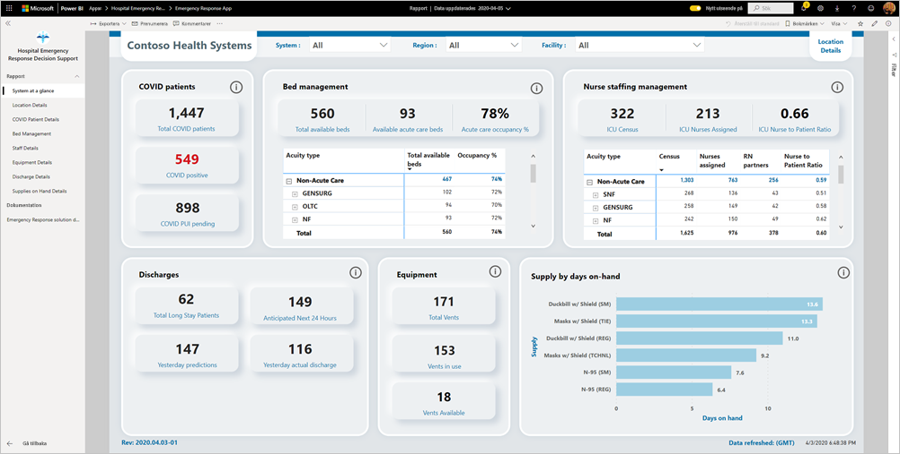

I den här artikeln beskrivs hur du installerar appen och ansluter till datakällorna. Information om hur du använder rapporten som visas i den här appen finns i [dokumentationen för Instrumentpanel för beslutsstöd för akutrespons för sjukhus](https://docs.microsoft.com/powerapps/sample-apps/emergency-response/deploy-configure#view-the-power-bi-dashboard).

När du har installerat mallappen och anslutit till datakällorna kan du anpassa rapporten efter dina behov. Sedan kan du distribuera den som en app till medarbetare i din organisation.

## Förutsättningar

Innan du installerar den här mallappen måste du först installera och konfigurera [Akutrespons-appen (Power Platform-lösning)](https://docs.microsoft.com/powerapps/sample-apps/emergency-response/deploy-configure). När du installerar den här lösningen skapas de referenser till datakällor som behövs för att fylla appen med data.

Notera [URL:en för din Common Data Services-miljöinstans](https://docs.microsoft.com/powerapps/sample-apps/emergency-response/deploy-configure#publish-the-power-bi-dashboard) när du installerar Akutrespons-appen. Du behöver den för att ansluta mallappen till data.

## Installera appen

1. Klicka på följande länk för att gå till appen: [Mallappen Instrumentpanel för beslutsstöd för akutrespons för sjukhus](https://aka.ms/AppSource_Hospital_offer)

1. På AppSource-sidan för appen väljer du [**Hämta nu**](https://aka.ms/AppSource_Hospital_offer).

    [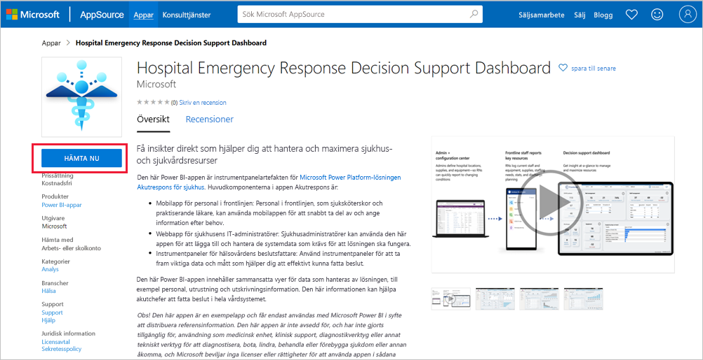](https://aka.ms/AppSource_Hospital_offer)

1. Läs informationen i **En sak till** och välj **Fortsätt**.

    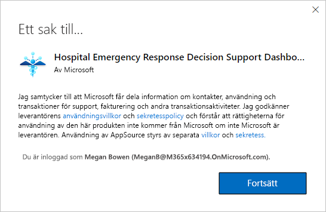

1. Välj **installera**. 

    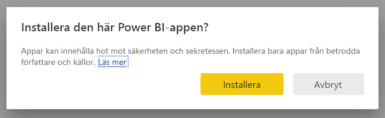

    När appen har installerats visas den på sidan Appar.

   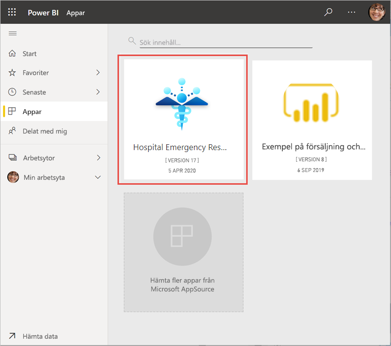

## Anslut till datakällor

1. Välj ikonen på sidan Appar för att öppna appen.

1. På välkomstskärmen väljer du **Utforska**.

   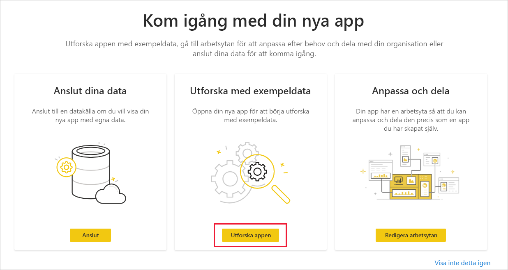

   Appen öppnas och visar exempeldata.

1. Välj länken **Anslut dina data** på banderollen längst upp på sidan.

   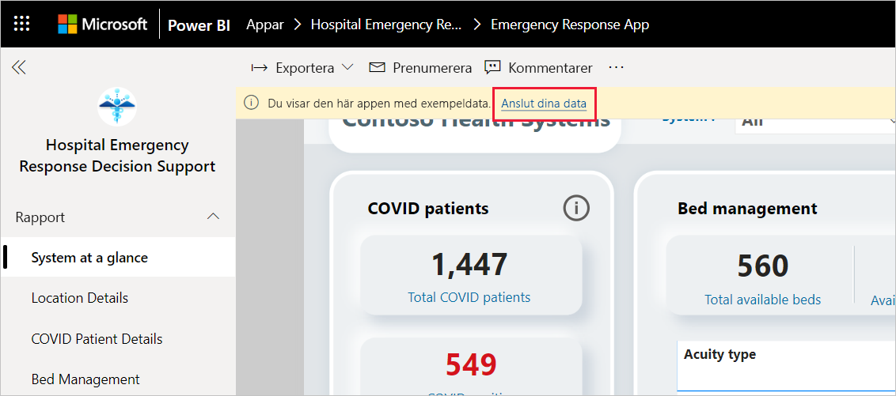

1. I dialogrutan:
   1. I fältet Organisationsnamn anger du namnet på din organisation, till exempel ”Contoso Health Systems”. Det här fältet är valfritt. Det här namnet visas längst upp till vänster på instrumentpanelen.
   1. I fältet CDS_base_solution skriver du [URL:en för din Common Data Service-miljöinstans](https://docs.microsoft.com/powerapps/sample-apps/emergency-response/deploy-configure#publish-the-power-bi-dashboard). Till exempel: https://[myenv].crm.dynamics.com. När du är klar klickar du på **Nästa**.

   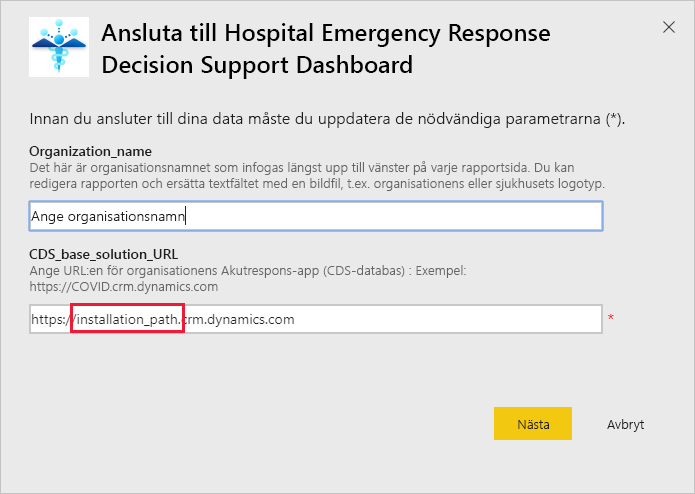

1. I nästa dialogruta som visas anger du **OAuth2** som autentiseringsmetod. Du behöver inte göra något med sekretessnivåinställningen.

   Välj **Logga in**.

   

1. Logga in på Power BI på Microsoft-inloggningsskärmen.

   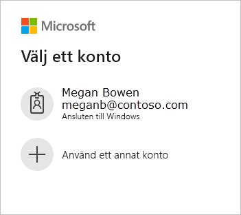

   När du har loggat in ansluter rapporten till datakällorna och fylls med aktuella data. Under den här tiden körs aktivitetsövervakaren.

   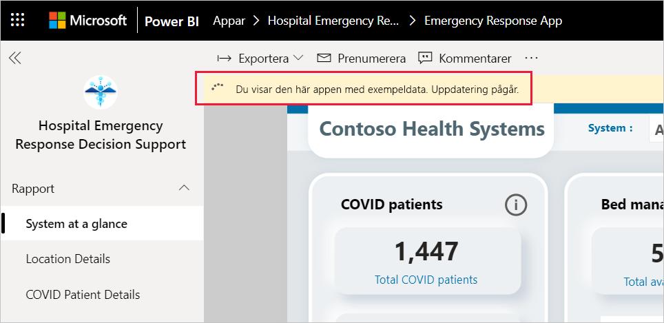

## Schemalägga rapportuppdatering

När datauppdateringen har slutförts [skapar du ett uppdateringsschema](../connect-data/refresh-scheduled-refresh.md) för att hålla rapportdata uppdaterade.

1. I det översta rubrikfältet väljer du **Power BI**.

   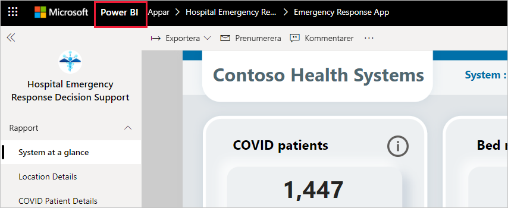

1. I det vänstra navigeringsfönstret letar du reda på arbetsytan Instrumentpanel för beslutsstöd för akutrespons för sjukhus under **Arbetsytor** och följer anvisningarna i artikeln [Konfigurera schemalagd uppdatering](../connect-data/refresh-scheduled-refresh.md).

## Anpassa och dela

Mer information finns i [Anpassa och dela appen](../connect-data/service-template-apps-install-distribute.md#customize-and-share-the-app). Läs [friskrivningar för rapporter](../create-reports/sample-covid-19-us.md#disclaimers) innan du publicerar eller distribuerar appen.

## Nästa steg
* [Förstå Akutrespons-rapporten](https://docs.microsoft.com/powerapps/sample-apps/emergency-response/deploy-configure#view-the-power-bi-dashboard)
* [Konfigurera och läs mer om exempelmallen Kriskommunikation i Power Apps](https://docs.microsoft.com/powerapps/maker/canvas-apps/sample-crisis-communication-app)
* Har du några frågor? [Fråga Power BI Community](https://community.powerbi.com/)
* [Vad är Power BI-mallappar?](../connect-data/service-template-apps-overview.md)
* [Installera och distribuera mallappar i din organisation](../connect-data/service-template-apps-install-distribute.md)
