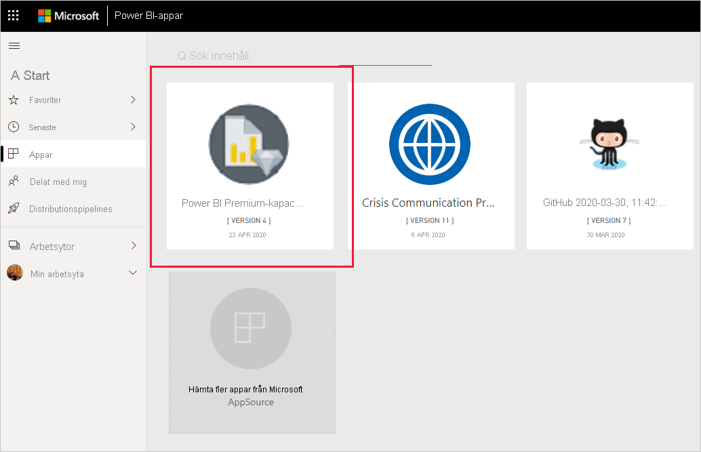
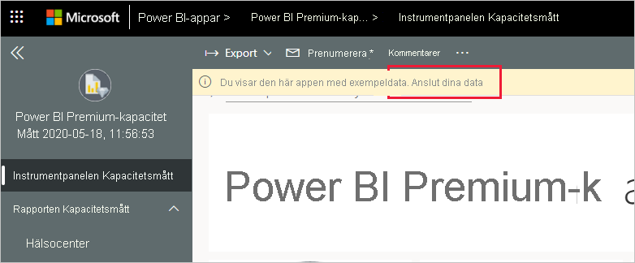
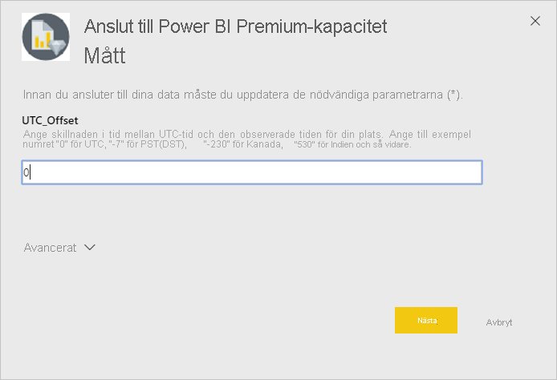
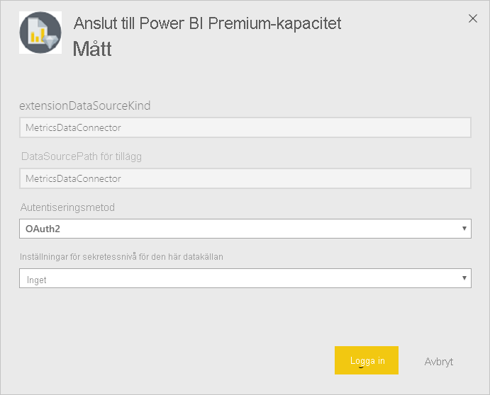
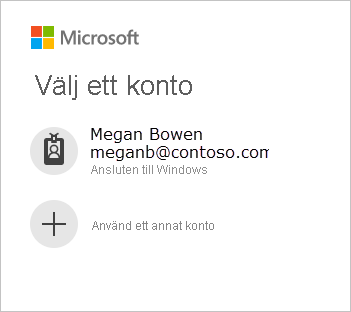
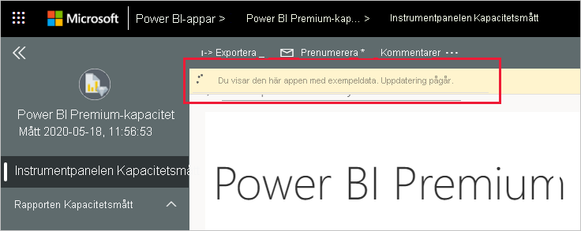
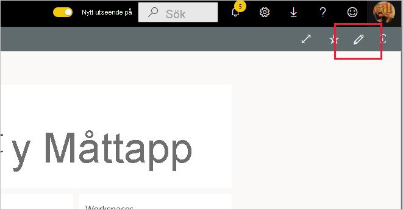

# Ansluta till Power BI Premium Capacity Metrics
Övervakning av dina kapaciteter är viktigt för att fatta välgrundade beslut om hur du bäst använder dina Premium-kapacitetsresurser. Appen Power BI Premium Capacity Metrics ger den mest djupgående informationen om hur kapaciteterna presterar.

I den här artikeln beskrivs hur du installerar appen och ansluter till datakällorna. Information om innehållet i rapporten och hur du använder den finns i [Övervaka Premium-funktioner med appen](../service-admin-premium-monitor-capacity.md) och i [blogginlägget om appen Premium Capacity Metrics](https://powerbi.microsoft.com/blog/premium-capacity-metrics-app-new-health-center-with-kpis-to-explore-relevant-metrics-and-steps-to-mitigate-issues/).

När du har installerat appen och anslutit till datakällorna kan du anpassa rapporten efter dina behov. Sedan kan du distribuera den till medarbetare i din organisation.

> [!NOTE]
> Du måste ha [behörighet](./service-template-apps-install-distribute.md#prerequisites) att installera mallappar. Kontakta klientadministratören om du inte har tillräcklig behörighet.

## Installera appen

1. Klicka på följande länk för att gå till appen: [Mallappen Power BI Premium Capacity Metrics](https://app.powerbi.com/groups/me/getapps/services/pbi_pcmm.capacity-metrics-dxt)

1. På AppSource-sidan för appen väljer du [**Hämta nu**](https://app.powerbi.com/groups/me/getapps/services/pbi_pcmm.capacity-metrics-dxt).

    

1. Välj **installera**. 

    

    > [!NOTE]
    > Om du har installerat appen tidigare får du en fråga om du vill [skriva över den installationen](./service-template-apps-install-distribute.md#update-a-template-app) eller installera till en ny arbetsyta.

    När appen har installerats visas den på sidan Appar.

   

## Anslut till datakällor

1. Välj ikonen på sidan Appar för att öppna appen.

1. På välkomstskärmen väljer du **Utforska**.

   

   Appen öppnas och visar exempeldata.

1. Välj länken **Anslut dina data** på banderollen längst upp på sidan.

   

1. I dialogrutan som visas anger du UTC-förskjutning, det vill säga skillnaden i timmar mellan UTC-tid och tiden på din plats. Klicka på **Nästa**.
  
   

1. I nästa dialogruta som visas behöver du inte göra något. Välj bara **Logga in**.

   

1. Logga in på Power BI på Microsoft-inloggningsskärmen.

   

   När du har loggat in ansluter rapporten till datakällorna och fylls med aktuella data. Under den här tiden körs aktivitetsövervakaren.

   

   Rapportdata uppdateras automatiskt en gång per dag, såvida du inte inaktiverar detta under inloggningsprocessen. Om du vill kan du även [ställa in ett eget uppdateringsschema](./refresh-scheduled-refresh.md) för att hålla rapportdata aktuella.

## Anpassa och dela

Börja anpassa appen genom att klicka på pennikonen i det övre högra hörnet.

 

Mer information finns i [Anpassa och dela appen](./service-template-apps-install-distribute.md#customize-and-share-the-app).

## Nästa steg
* [Övervaka Premium-kapaciteter med appen](../admin/service-admin-premium-monitor-capacity.md)
* [Blogginlägg om appen Premium Capacity Metrics](https://powerbi.microsoft.com/blog/premium-capacity-metrics-app-new-health-center-with-kpis-to-explore-relevant-metrics-and-steps-to-mitigate-issues/)
* [Vad är Power BI-mallappar?](./service-template-apps-overview.md)
* [Installera och distribuera mallappar i din organisation](./service-template-apps-install-distribute.md)
* Har du några frågor? [Fråga Power BI Community](https://community.powerbi.com/)