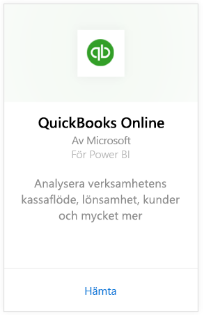
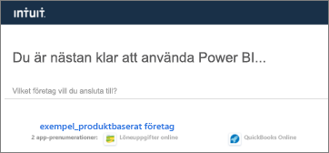
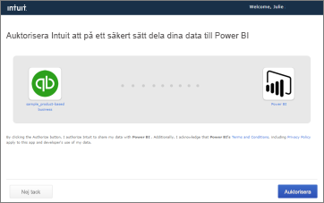
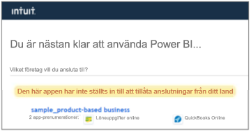

# Ansluta till QuickBooks Online med Power BI
När du ansluter till dina QuickBooks Online-data från Power BI får du omedelbart en Power BI-instrumentpanel och Power BI-rapporter som tillhandahåller insikter om verksamhetens kassaflöde, lönsamhet, kunder med mera. Använd instrumentpanelen och rapporterna som de är eller anpassa dem för att fokusera på den information du är mest intresserad av. Data uppdateras automatiskt en gång per dag.

Anslut till [QuickBooks Online-mallapp](https://dxt.powerbi.com/getdata/services/quickbooks-online) för Power BI.

>[!NOTE]
>Om du vill importera dina QuickBooks Online-data till Power BI, måste du vara administratör för ditt QuickBooks Online-konto och logga in med dina autentiseringsuppgifter som administratör för kontot. Du kan inte använda den här anslutningen med QuickBooks Desktop programvara. 

## Så här ansluter du

[!INCLUDE [powerbi-service-apps-get-more-apps](../includes/powerbi-service-apps-get-more-apps.md)]

3. Välj **QuickBooks Online**och välj **Hämta**.
   
   

4. Välj **Installera** i **Vill du installera den här Power BI-appen?** .

    

4. Välj panelen **GitHub** i fönstret **Appar**.

   

6. I **Kom igång med din nya app** väljer du **Anslut**.

    

4. Välj **oAuth2** för autentiseringsmetod och välj **Logga in**. 
5. Ange dina autentiseringsuppgifter för QuickBooks Online när du uppmanas om detta och följ autentiseringsprocessen för QuickBooks Online. Om du redan är inloggad på QuickBooks Online i webbläsaren, behöver du inte ange några autentiseringsuppgifter.
   >[!NOTE]
   >Du måste ha autentiseringsuppgifter som administratör för ditt QuickBooks Online-konto.
6. Välj det företag som du vill ansluta till Power BI på nästa skärm.
   
   

7. Välj **Auktorisera** på nästa skärm för att starta importen. Processen kan ta några minuter beroende på storleken på företagets data. 
   
   
   
8. När Power BI har importerat dessa data, visas din QuickBooks-apps innehållslista: en ny instrumentpanel, rapport och datauppsättning.
9. Starta utforskningsprocessen genom att välja QuickBooks-instrumentpanelen. Power BI skapade den här instrumentpanelen automatiskt så att dina importerade data kan visas.

    

**Och sedan?**

* Prova att [ställa en fråga i rutan Frågor och svar](../consumer/end-user-q-and-a.md) överst på instrumentpanelen
* [Ändra panelerna](../create-reports/service-dashboard-edit-tile.md) på instrumentpanelen.
* [Välj en panel](../consumer/end-user-tiles.md) för att öppna den underliggande rapporten.
* Medan din datauppsättning schemaläggs att uppdateras dagligen så kan du ändra uppdateringsfrekvensen eller testa att uppdatera den på begäran med **Uppdatera nu**

## Felsökning
**”Hoppsan! Det har uppstått ett fel”**

Om du får det här meddelandet när du har valt **Auktorisera**:

”Hoppsan! Det har uppstått ett fel.” Stäng det här fönstret och försök igen.

En annan användare prenumererar redan på programmet för det här företaget. Kontakta [admin email] om du vill göra ändringar i prenumerationen.”

... det här felet innebär att en annan administratör i ditt företag redan har anslutit till företagets data med Power BI. Be administratören att dela instrumentpanelen med dig. För närvarande kan bara en administratör ansluta ett visst QuickBooks Online-företags datauppsättning till Power BI. Efter det att Power BI har skapat instrumentpanelen, kan administratören dela den med flera kollegor på samma Power BI-klienter.

**”Den här appen har inte ställts in till att tillåta anslutningar från ditt land”**

Power BI stöder för närvarande endast USA-utgåvor av QuickBooks Online. 

## Nästa steg
[Vad är Power BI?](../fundamentals/power-bi-overview.md)

[Grundläggande begrepp för designers i Power BI-tjänsten](../fundamentals/service-basic-concepts.md)
