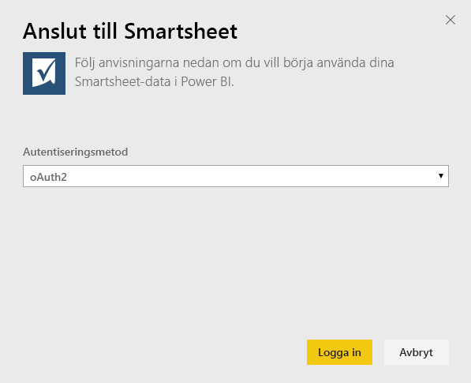
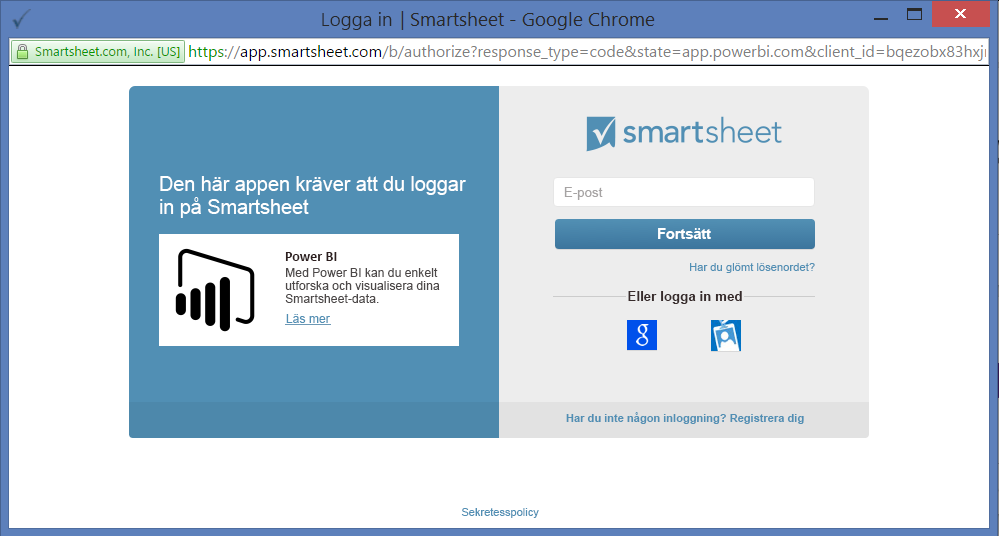
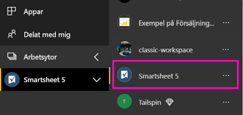
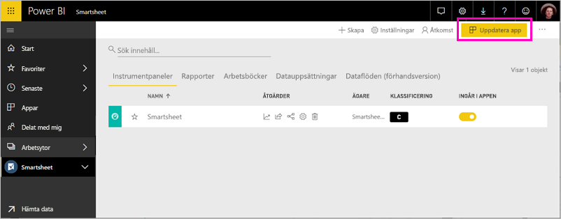

# Anslut till Smartsheet med Power BI
Den här artikeln vägleder dig genom att hämta data från ditt Smartsheet-konto med en Power BI-mallapp. Smartsheet erbjuder en enkel plattform för samarbete och fildelning. Smartsheet-mallappen för Power BI erbjuder en instrumentpanel, rapporter och datauppsättningar som visar en översikt över ditt Smartsheet-konto. Du kan också använda [Power BI Desktop](desktop-connect-to-data.md) till att ansluta direkt till enskilda blad i ditt konto. 

När du har installerat mallappen kan du ändra instrumentpanelen och rapporten. Sedan kan du distribuera den som en app till kollegor i din organisation.

Anslut till [Smartsheet-mallappen](https://app.powerbi.com/groups/me/getapps/services/pbi-contentpacks.pbiapps-smartsheet) för Power BI.

>[!NOTE]
>Du bör ha ett Smartsheet-administratörskonto om du ska ansluta till och läsa in Power BI-mallappen, eftersom den har ytterligare åtkomst.

## Så här ansluter du

[!INCLUDE [powerbi-service-apps-get-more-apps](../includes/powerbi-service-apps-get-more-apps.md)]

3. Välj **Smartsheet** \> **Hämta det nu**.
4. I **Installera den här Power BI-appen?** väljer du **Installera**.
4. Välj panelen **Smartsheet** i fönstret **Appar**.

    

6. I **Kom igång med din nya app** väljer du **Anslut**.

    

4. Som autentiseringsmetod väljer du **oAuth2 \> logga in**.
   
   När du uppmanas till det anger du dina autentiseringsuppgifter för Smartsheet och följer autentiseringsprocessen.
   
   
   
   

5. När Power BI importerar data öppnas Smartsheet-instrumentpanelen.
   
   

## Ändra och distribuera appen

Du har installerat Smartsheet-mallappen. Det innebär att du även har skapat Smartsheet-arbetsytan. På arbetsytan kan du ändra rapporten och instrumentpanelen och sedan distribuera den som en *app* till kollegor i din organisation. 

1. Om du vill visa allt innehåll på din nya Smartsheet-arbetsyta, så välj **Arbetsytor** > **Smartsheet** i navigeringsfältet. 

    

    Den här vyn är innehållslistan för arbetsytan. I det övre högra hörnet ser du **Uppdatera app**. När du är redo att distribuera din app till dina kollegor är det där du börjar. 

    

2. Välj **Rapporter** och **Datamängder** för att se de andra elementen på arbetsytan.

    Läs om hur du [distribuerar appar](../collaborate-share/service-create-distribute-apps.md) till dina kollegor.

## Det här ingår
Smartsheet-mallappen för Power BI inkluderar en översikt över ditt Smartsheet-konto, till exempel hur många arbetsytor, rapporter och ark du har, när de har ändrats och så vidare. Administratörer kan även se information om användarna i sina system, till exempel de som skapat flest ark.  

Om du vill ansluta direkt till enskilda ark i ditt konto, kan du använda Smartsheet-anslutningsprogrammet för [Power BI Desktop](desktop-connect-to-data.md).  

## Nästa steg

* [Skapa de nya arbetsytorna i Power BI](../collaborate-share/service-create-the-new-workspaces.md)
* [Installera och använda appar i Power BI](../consumer/end-user-apps.md)
* [Ansluta till Power BI-appar för externa tjänster](service-connect-to-services.md)
* Har du några frågor? [Fråga Power BI Community](https://community.powerbi.com/)