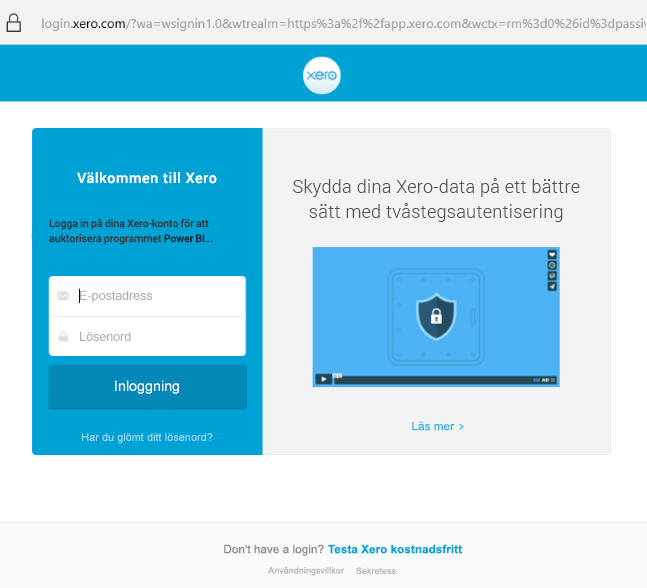

# Ansluta till Xero med Power BI
Xero är ett lättanvänt redovisningsprogram online som har specialutformats för små företag. Du kan skapa övertygande visuella objekt utifrån dina Xero-siffror med den här Power BI-mallappen. Standardinstrumentpanelen innehåller många mått för småföretag som kontantposition, inkomster och utgifter, vinst-/förlusttrend, gäldenärsdagar och räntabilitet.

Anslut till [Xero-mallappen](https://app.powerbi.com/getdata/services/xero) för Power BI eller lär dig mer om [Xero- och Power BI](https://help.xero.com/Power-BI)-integrering.

## Så här ansluter du

[!INCLUDE [powerbi-service-apps-get-more-apps](../includes/powerbi-service-apps-get-more-apps.md)]

3. Välj **Xero** \> **Hämta det nu**.
4. Välj **Installera** i **Vill du installera den här Power BI-appen?** .

    

4. Välj **Xero**-panelen i fönstret **Appar**.

   

6. I **Kom igång med din nya app** väljer du **Anslut**.

    

4. Ange ett smeknamn för organisationen som ska associeras med Xero-kontot. Du kan fylla i vad som helst, namnet är mest avsett att hjälpa användare med flera Xero-organisationer att hålla redo på de olika kontona. Läs information om hur man [hittar parametrar](#FindingParams) längre fram i den här artikeln.

    

5. Välj **OAuth** som **Autentiseringsmetod**. Logga in till ditt Xero-konto, när du uppmanas till detta, och välj vilken organisation du ska ansluta till. När inloggningen är klar startar du inläsningsprocessen genom att välja **Logga in**.
   
    
   
    
6. Efter att du har godkänt startar importen automatiskt. När den är klar visas en ny instrumentpanel, en ny rapport och en ny modell i navigeringsfönstret. Välj instrumentpanelen för att visa dina importerade data.
   
     

**Och sedan?**

* Prova att [ställa en fråga i rutan Frågor och svar](../consumer/end-user-q-and-a.md) överst på instrumentpanelen
* [Ändra panelerna](../create-reports/service-dashboard-edit-tile.md) på instrumentpanelen.
* [Välj en panel](../consumer/end-user-tiles.md) för att öppna den underliggande rapporten.
* Medan din datauppsättning schemaläggs att uppdateras dagligen så kan du ändra uppdateringsfrekvensen eller testa att uppdatera den på begäran med **Uppdatera nu**

## Det här ingår
Mallappens instrumentpanel innehåller paneler och mått från en mängd olika områden med motsvarande rapporter där du kan lära dig mer om:  

| Område | Paneler på instrumentpanelen | Rapport |
| --- | --- | --- |
| Kontanter |Dagliga kassaflöde  Kontanter in  Kontanter ut  Utgående saldo per konto  Utgående saldo idag |Bankkonton |
| Kund |Fakturerad försäljning  Fakturerad försäljning per kund  Tillväxttrend för fakturerad försäljning  Förfallna fakturor  Utestående fodringar  Förfallna fodringar |Kund  Lager |
| Leverantör |Fakturerade inköp  Fakturerade inköp per leverantör  Tillväxttrend för fakturerade inköp   Förfallna räkningar  Utestående skulder  Förfallna skulder |Leverantörs-  Lager |
| Lager |Månatligt försäljningsbelopp per produkt |Lager |
| Vinst och förlust |Vinst och förlust per månad  Nettovinst detta räkenskapsår  Nettovinst denna månad  Största utgiftskontona |Vinst och förlust |
| Balansräkning |Tillgångar totalt  Skulder totalt  Kapital |Balansräkning |
| Hälsa |Likviditetskvot  Bruttomarginal procent   Avkastning på totala tillgångar  Förhållande mellan totala skulder och kapital |Hälsa  Ordlista och teknisk information |

Datauppsättningen innehåller också följande tabeller för att anpassa dina rapporter och instrumentpaneler:  

* Adresser  
* Aviseringar  
* Kontoutdrag dagsbalans  
* Kontoutdrag  
* Kontakter  
* Utgiftsanspråk  
* Fakturaradsposter  
* Fakturor  
* Poster  
* Månadsslut  
* Organisation  
* Råbalans  
* Xero-konton

## Systemkrav
Följande roller krävs för att få åtkomst till Xero-mallappen: ”Standard + Rapporter” eller ”Advisor”.

## Hitta parametrar
Ange ett namn för din organisation som kan spåras i Power BI. Med ett specifikt namn kan du ansluta till flera olika organisationer. Du kan inte ansluta till samma organisation flera gånger, eftersom det påverkar den schemalagda uppdateringen.   

## Felsökning
* Xero-användare måste ha följande roller för att få åtkomst till Xero-mallappen för Power BI: ”Standard + Rapporter” eller ”Advisor”. Mallappen är beroende av användarbaserade behörigheter för åtkomst till rapportering av data via Power BI.
* Under inläsningen befinner sig panelerna på instrumentpanelen i ett allmänt inläsningstillstånd. De förblir på tills inläsningen har slutförts. Om du får ett meddelande om att inläsningen har slutförts men panelerna fortfarande läses in, kan du prova att uppdatera instrumentpanelens paneler med hjälp av ... i övre högra hörnet på instrumentpanelen.
* Om det inte går att uppdatera mallappen, så kontrollera om du har anslutit till samma organisation mer än en gång i Power BI. Xero tillåter endast en aktiv anslutning till en organisation och du kan se ett felmeddelande om att dina autentiseringsuppgifter är ogiltiga om du ansluter till samma mer än en gång.  
* Vid problem med att ansluta Xero-mallappen för Power BI, som felmeddelanden eller långsamma inläsningstider, kan du börja med att rensa cacheminnet/cookies, starta om webbläsaren och sedan återansluta till Power BI.  

När det gäller andra problem kan du öppna ett supportärende på https://support.powerbi.com om problemet kvarstår.

## Nästa steg
[Kom igång i Power BI](../fundamentals/service-get-started.md)

[Hämta data i Power BI](service-get-data.md)
