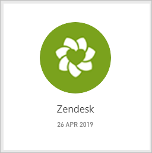
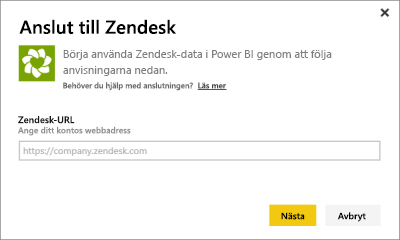
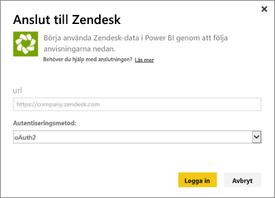
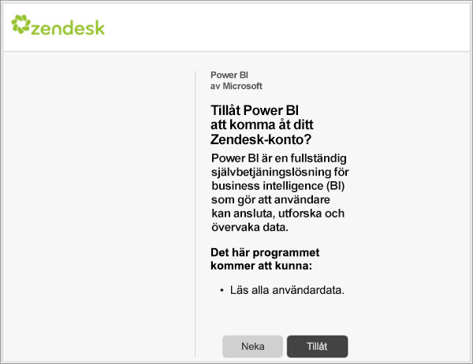
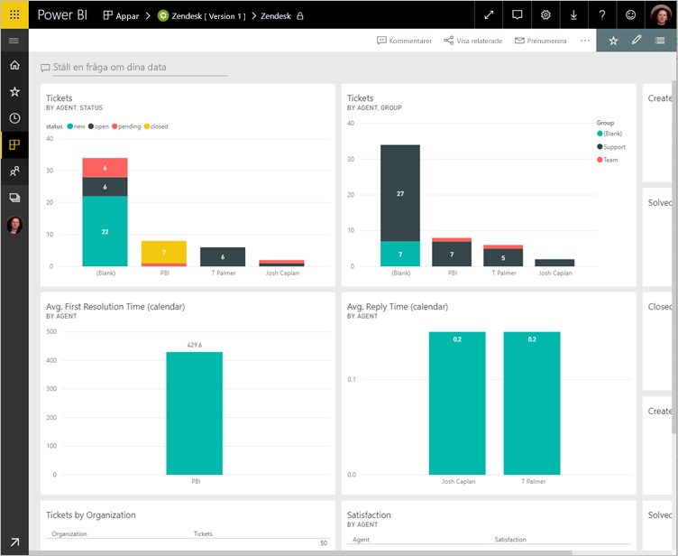
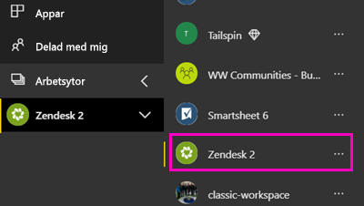
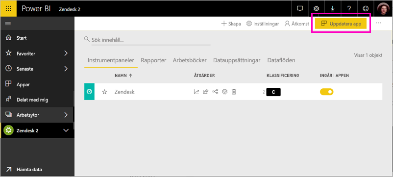

# Anslut till Zendesk med Power BI

Den här artikeln vägleder dig genom att hämta data från ditt Zendesk-konto med en Power BI-mallapp. Zendesk-appen erbjuder en Power BI-instrumentpanel och en uppsättning Power BI-rapporter som ger inblick om dina biljettvolymer och agentprestanda. Data uppdateras automatiskt en gång per dag. 

När du har installerat mallappen kan du anpassa instrumentpanelen och rapporten så att den information som är viktig för dig markeras. Sedan kan du distribuera den som en app till kollegor i din organisation.

Anslut till [Zendesk-mallappen](https://app.powerbi.com/getdata/services/zendesk) eller läs mer om [Zendesk-integrering](https://powerbi.microsoft.com/integrations/zendesk) med Power BI.

När du har installerat mallappen kan du ändra instrumentpanelen och rapporten. Sedan kan du distribuera den som en app till kollegor i din organisation.

>[!NOTE]
>Du måste ha ett Zendesk-administratörskonto för att kunna ansluta. Mer information om [kraven](#system-requirements) finns nedan.

>[!WARNING]
>Före den 15 oktober 2019 hade Zendesk stöd för att sök-API:et kunde ta emot sammanlagt 200 000 resultat med hjälp av sidnumrering av stora frågor. För att kunna anpassa sökanvändningen till dess avsedda omfattning, begränsar Zendesk nu det maximala antalet resultat som returneras till 1 000 resultat, med högst 100 resultat per sida. Det nuvarande Power BI Zendesk-anslutningsprogrammet kan dock fortfarande skapa API-anrop som överskrider dessa nya gränser, vilket kan ge missvisande resultat.

## Så här ansluter du

[!INCLUDE [powerbi-service-apps-get-more-apps](../includes/powerbi-service-apps-get-more-apps.md)]

3. Välj **Zendesk** \> **Hämta det nu**.
4. I **Installera den här Power BI-appen?** väljer du **Installera**.
4. Välj **Zendesk**-panelen i fönstret **Appar**.

    

6. I **Kom igång med din nya app** väljer du **Anslut**.

    

4. Ange den URL som är kopplad till ditt konto. URL:en har formen **https://company.zendesk.com** . Se information om att [hitta parametrarna](#finding-parameters) nedan.
   
   

5. När du uppmanas till det anger du dina Zendesk-autentiseringsuppgifter.  Välj **oAuth 2** som autentiseringsmetod och klicka på **Logga in**. Följ Zendesk-autentiseringsflödet. (Om du redan har loggat in på Zendesk i webbläsaren behöver du eventuellt inte ange några autentiseringsuppgifter.)
   
   > [!NOTE]
   > Den här mallappen kräver att du ansluter med ett Zendesk-administratörskonto. 
   > 
   
   
6. Klicka på **Tillåt** för att låta Power BI komma åt dina Zendesk-data.
   
   
7. Klicka på **Anslut** för att starta importen. 
8. När Power BI har importerat dessa data, visas din Zendesk-apps innehållslista: en ny instrumentpanel, rapport och datauppsättning.
9. Starta utforskningsprocessen genom att välja instrumentpanelen.

    
   
## Ändra och distribuera appen

Du har installerat Zendesk-mallappen. Det innebär att du även har skapat Zendesk-arbetsytan. På arbetsytan kan du ändra rapporten och instrumentpanelen och sedan distribuera den som en *app* till kollegor i din organisation. 

1. Om du vill visa allt innehåll på din nya Zendesk-arbetsyta, så välj **Arbetsytor** > **Zendesk** i navigeringsfältet. 

    

    Den här vyn är innehållslistan för arbetsytan. I det övre högra hörnet ser du **Uppdatera app**. När du är redo att distribuera din app till dina kollegor är det där du börjar. 

    

2. Välj **Rapporter** och **Datamängder** för att se de andra elementen på arbetsytan.

    Läs om hur du [distribuerar appar](../collaborate-share/service-create-distribute-apps.md) till dina kollegor.

## Systemkrav
Du måste ha ett Zendesk-administratörskonto för att få åtkomst till Zendesk-mallappen. Om du är en agent eller en slutanvändare och är intresserad av att visa dina Zendesk-data, så lägg till ett förslag och granska Zendesk-anslutningsprogrammet i [Power BI Desktop](desktop-connect-to-data.md).

## Hitta parametrar
Din Zendesk URL kommer att vara samma som den URL som du använder för att logga in på ditt Zendesk-konto. Om du inte är säker på din Zendesk-URL, kan du använda Zendesk [inloggningshjälp](https://www.zendesk.com/login/).

## Felsökning
Om du har problem med att ansluta, så kontrollera din Zendesk-URL och bekräfta att du använder ett Zendesk-administratörskonto.

## Nästa steg

* [Skapa de nya arbetsytorna i Power BI](../collaborate-share/service-create-the-new-workspaces.md)
* [Installera och använda appar i Power BI](../consumer/end-user-apps.md)
* [Ansluta till Power BI-appar för externa tjänster](service-connect-to-services.md)
* Har du några frågor? [Fråga Power BI Community](https://community.powerbi.com/)
