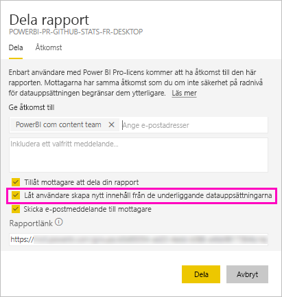
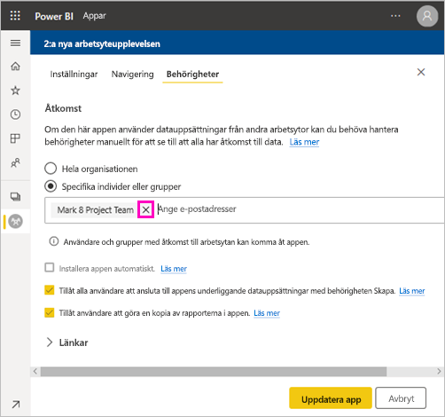
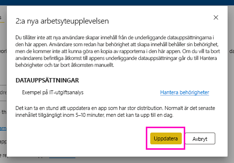

# Skapa-behörighet för delade datamängder

När du skapar en rapport i Power BI Desktop lagras data i rapporten i en *datamodell*. När du publicerar dina rapporter till Power BI-tjänsten publicerar du även data som en *datamängd*. Du kan ge andra *behörigheten Skapa* för rapporten så att de kan identifiera och återanvända den datamängd du har delat. I den här artikeln går vi igenom hur du kan styra åtkomsten till data med hjälp av behörigheten Skapa.

Behörigheten Skapa gäller för datamängder. När du ger användare behörigheten Skapa kan de skapa nytt innehåll i datamängden, som rapporter, instrumentpaneler, fästa paneler från Frågor och svar och Insights Discovery. 

Användare behöver också behörigheten Skapa för att arbeta med data *utanför* Power BI:

- till att exportera underliggande data
- till att skapa nytt innehåll i datamängden, som med [Analysera i Excel](../collaborate-share/service-analyze-in-excel.md)
- till att komma åt data via XMLA-slutpunkten.

## Sätt att ge skapa-behörighet

Du ger skapa-behörighet för en datauppsättning på några olika sätt:

- Medlemmar i en arbetsyta med minst en deltagarroll har automatiskt skapa-behörighet för datauppsättningar i den arbetsytan och behörighet att kopiera en rapport.
 
- Medlemmar i arbetsytan där datauppsättningen finns kan tilldela behörighet till specifika användare eller säkerhetsgrupper i behörighetscentret. Om du är medlem i arbetsytan väljer du **Fler alternativ** (…) bredvid en datauppsättning > **Hantera behörigheter**.

    

    Då öppnas behörighetscentret för den datamängden, där du kan ange och ändra behörigheter.

    

- En administratör eller medlem i den arbetsyta där datamängden finns kan under publicering av app bestämma att användare med behörighet för den appen även får skapa-behörighet för de underliggande datamängderna. Se [Dela en datauppsättning](service-datasets-share.md) för mer information.

- Anta att du har vidaredelnings- och skapa-behörigheter för en datauppsättning. När du delar en rapport eller instrumentpanel som skapats ovanpå den datauppsättningen kan du ange att mottagaren även får skapa-behörighet för den underliggande datauppsättningen.

    

Du kan ta bort en persons skapa-behörighet för en datauppsättning. Om du gör det kan de fortfarande se den rapport som skapats på den delade datamängden, men de kan inte längre redigera den. Mer information finns i nästa avsnitt.

## Ta bort skapa-behörighet för en datauppsättning

Du kan behöva ta bort skapa-behörighet för vissa användare av en delad datauppsättning. 

1. I en arbetsyta går du till sidan med **datauppsättningar**-listan. 
1. Välj **Fler alternativ** (...) bredvid datauppsättningen > **Hantera behörighet**.

    

1. Välj **Fler alternativ** (...) bredvid ett namn > **Ta bort skapa**.

    

    De kan fortfarande se den rapport som skapats med den delade datauppsättningen, men de kan inte längre redigera den.

### Ta bort skapa-behörighet för en datauppsättning i en app

Anta att du har distribuerat en app från en arbetsyta till en grupp med personer. Senare bestämmer du dig för att ta bort åtkomsten till appen för vissa personer. Om du tar bort deras åtkomst till appen tar det inte automatiskt bort deras bygg- och återdelnings-behörigheter. Det är ett extra steg. 

1. På en sida med en arbetytelista väljer du **Uppdatera appen**. 

    

1. På fliken **Behörigheter** trycker du på **X** för att ta bort personen eller gruppen. 

    
1. Välj **Uppdatera app**.

    Ett meddelande visas som förklarar att du måste gå till **Hantera behörigheter** för att ta bort skapa-behörighet för användare med befintlig åtkomst. 

    

1. Välj **Uppdatera**.

1. I arbetsytan går du till sidan med **Satauppsättningar**-listan. 
1. Välj **Fler alternativ** (...) bredvid datauppsättningen > **Hantera behörighet**.

    

1. Välj **Fler alternativ** (...) bredvid namnet > **Ta bort skapa**.

    

    De kan fortfarande se den rapport som skapats med den delade datauppsättningen, men de kan inte längre redigera den.

## Mer granulära behörigheter

Power BI introducerade skapa-behörigheten juni 2019 som ett komplement till de befintliga behörigheterna Läsa och Dela vidare. Alla användare som redan hade läsbehörighet för datauppsättningar via appbehörigheter, delning eller arbetsyteåtkomst vid den tidpunkten fick även skapa-behörighet för samma datauppsättningar. De fick skapa-behörighet automatiskt eftersom läsbehörighet redan gav den rätt att skapa nytt innehåll ovanpå datamängden med hjälp av Analysera i Excel eller export.

Med den här mer granulära skapa-behörigheten kan du välja vilka som endast kan se innehållet i den befintliga rapporten eller instrumentpanelen samt vilka som kan skapa innehåll som är kopplat till de underliggande datamängderna.

Om din datamängd används av en rapport utanför datamängdens arbetsyta kan du inte ta bort den datamängden. I stället visas ett felmeddelande.

Du kan ta bort skapa-behörigheter. Om du gör detta kan de personer vars behörigheter du har återkallat fortfarande se rapporten, men de kan inte längre redigera den eller exportera underliggande data. Användare med enbart läsbehörighet kan fortfarande exportera sammanfattade data. 

## Nästa steg

- [Använda datamängder på arbetsytor](service-datasets-across-workspaces.md)
- Har du några frågor? [Fråga Power BI Community](https://community.powerbi.com/)
