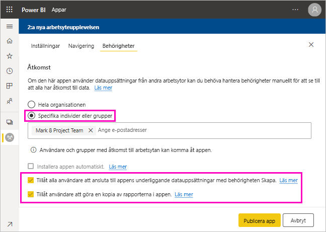

# Dela en datauppsättning

Som skapare av *datamodeller* i Power BI Desktop, skapar du *datauppsättningar* som du kan distribuera i Power BI-tjänsten. Andra rapportskapare kan därefter använda dina datauppsättningar som grund för sina egna rapporter. I den här artikeln får du lära dig hur du delar dina datauppsättningar. Information om hur du ger och tar bort åtkomst till dina delade datauppsättningar finns i [Skapa-behörighet](service-datasets-build-permissions.md).

## Steg för att dela datamängden

1. Du börja med att skapa en .pbix-fil med en datamodell i Power BI Desktop. Om du planerar att erbjuda den här datamängden till andra så att de kan skapa rapporter så skapar du kanske inte ens en rapport i .pbix-filen.

    Det är bästa praxis att spara .pbix-filen i en Microsoft 365-grupp.

1. Publicera .pbix-filen till en [arbetsyta med den nya funktionen](../collaborate-share/service-create-the-new-workspaces.md) i Power BI-tjänsten.
    
    Andra medlemmar i den här arbetsytan kan redan skapa rapporter på andra arbetsytor baserat på den här datamängden. Använd alternativet Hantera behörigheter för datamängden i arbetsytans innehållslista för att ge ytterligare användare åtkomst till datamängden. 

1. Du kan även [publicera en app](../collaborate-share/service-create-distribute-apps.md) från den här arbetsytan. När du gör det kan du på sidan **Behörigheter** ange vilka som har behörigheter och vad de kan göra.

    > [!NOTE]
    > Om du väljer **Hela organisationen** får ingen i organisationen skapa-behörighet. Det här problemet är redan känt. I stället anger du e-postadresser i **Specific individuals or groups** (Specifika personer eller grupper).  Om du vill att hela organisationen ska ha skapa-behörighet anger du ett e-postalias för hela organisationen.

    

1. Välj **Publicera app**, eller **Uppdatera app** om den redan har publicerats.

## Spåra datamängdsanvändningen

När du har en delad datamängd på din arbetsyta kan du behöva veta vilka rapporter på andra arbetsytor som baseras på den.

1. I listvyn Datamängder väljer du **Visa relaterade**.

    

1. Dialogrutan **Relaterat innehåll** visar alla relaterade objekt. I den här listan visas de relaterade objekten på den här arbetsytan och på **Andra arbetsytor**.
 
    

## Begränsningar och överväganden
Saker att tänka på när det gäller att dela datamängder:

* När du delar en datamängd genom att hantera behörigheter, genom att dela rapporter eller instrumentpaneler eller genom att publicera en app, beviljar du åtkomst till hela datamängden om inte [säkerhet på radnivå (RLS)](../admin/service-admin-rls.md) begränsar deras åtkomst. Rapportförfattare kan använda funktioner som anpassar användarupplevelsen för att visa eller interagera med rapporter. De kan till exempel dölja kolumner, begränsa åtgärderna för visuella objekt med mera. Dessa anpassade användarupplevelser begränsar inte vilka data som användare kan komma åt i datamängden. Använd [säkerhet på radnivå (RLS)](../admin/service-admin-rls.md) i datamängden så att varje persons autentiseringsuppgifter avgör vilka data de har åtkomst till.

## Nästa steg

- [Använda datamängder på arbetsytor](service-datasets-across-workspaces.md)
- Har du några frågor? [Fråga Power BI Community](https://community.powerbi.com/)
