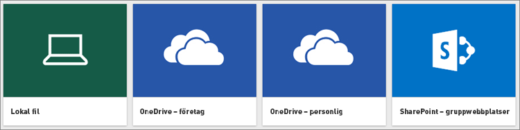
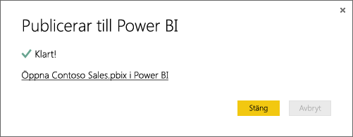

# Hämta data från Power BI Desktop-filer

**Power BI Desktop** gör affärsinformation och rapportering enkelt. Oavsett om du ansluter till många olika datakällor, ställer frågor om och omvandlar data, modellerar dina data eller skapar kraftfulla och dynamiska rapporter, gör **Power BI Desktop** ditt arbete med affärsinformation snabbt och intuitivt. Om du är nybörjare på **Power BI Desktop** bör du läsa [Komma igång med Power BI Desktop](../fundamentals/desktop-getting-started.md).

När du läst in data i **Power BI Desktop** och skapat några rapporter, är det dags att hämta din sparade fil till **Power BI-tjänsten**.

## Det spelar roll var du sparar filen
**Lokalt** – Om du sparar din fil på en lokal enhet på datorn eller en annan plats inom din organisation, kan du *importera* eller *publicera* den från Power BI Desktop för att föra dess data och rapporter till Power BI. Filen kommer att finnas kvar på den lokala enheten, så hela filen har i själva verket inte flyttats till Power BI. Det som händer är att en ny datauppsättning skapas i Power BI och data och datamodellen från Power BI Desktop-filen läses in i datauppsättningen. Om din fil innehåller rapporter, kommer de att visas på din Power BI-webbplats under Rapporter.

**OneDrive – företag**  – Om du har OneDrive för företag och du loggar in med samma konto som du använder för Power BI, är detta det mest effektiva sättet att hålla ditt arbete i Power BI Desktop och din datauppsättning, rapporter och dina instrumentpaneler i Power BI synkroniserat. Eftersom både Power BI och OneDrive finns i molnet, *ansluter* Power BI till din fil på OneDrive ungefär en gång i timmen. Om det finns ändringar uppdateras dina datauppsättningar, rapporter och instrumentpaneler i Power BI automatiskt.

**OneDrive – personlig** – Om du sparar filer på ditt eget OneDrive-konto får du många av de fördelar som du får med OneDrive för företag. Den största skillnaden är att när du första gången ansluter till din fil (med Hämta data > Filer > OneDrive – personlig) måste du logga in i OneDrive med ditt Microsoft-konto som vanligtvis skiljer sig från det konto du använder för att logga in i Power BI. När du loggar in i OneDrive med ditt Microsoft-konto, måste du markera alternativet Jag vill förbli inloggad. På så sätt kan Power BI ansluta till din fil ungefär en gång i timmen och kontrollera att din datauppsättning i Power BI är synkroniserad.

**SharePoint-gruppwebbplatser** – Du sparar Power BI Desktop-filer på SharePoint-gruppwebbplatser ungefär på samma sätt som på OneDrive för företag. Den största skillnaden är hur du ansluter till filen från Power BI. Du kan ange en URL eller ansluta till rotmappen.

## Importera eller ansluta till en Power BI Desktop-fil från Power BI
>[!IMPORTANT]
>Den maximala filstorlek som du kan importera till Power BI är 1 GB.

1. I Power BI, i navigeringsfönstret, klickar du på ** Hämta data**.
   
   
2. I **Filer**, klickar du på **Hämta**.
   
   
3. Hitta din fil. Power BI Desktop-filer har tillägget .PBIX.
   
   

## Publicera en fil från Power BI Desktop till din Power BI-webbplats
Att använda Publicera från Power BI Desktop är ungefär detsamma som att använda Hämta data i Power BI för att importera fildata från en lokal enhet eller ansluta till den i OneDrive. Det finns dock skillnader: om du laddar upp från en lokal enhet ska du uppdatera dessa data ofta för att säkerställa att dina data är online och att lokala kopior av data är aktuella. 

Här visas en snabb beskrivning av hur du gör, men du kan läsa mer i [Publicera från Power BI Desktop](../create-reports/desktop-upload-desktop-files.md) om du vill få mer information.

1. I Power BI Desktop klickar du på **Fil** > **Publicera** > **Publicera till Power BI** eller klickar på **Publicera** i menyfliksområdet.
   
   
2. Logga in i Power BI. Du behöver bara göra detta första gången.
   
   När du är klar får du en länk för att öppna rapporten på din Power BI-webbplats.
   
   

## Nästa steg
**Utforska dina data** – När du har hämtat dina data och rapporter från filen till Power BI, är det dags att börja utforska. Om det redan finns rapporter i filen visas de i navigeringsfönstret i **Rapporter**. Om filen bara innehåller data, kan du skapa nya rapporter. Högerklicka bara på den nya datauppsättningen och klicka sedan på **Utforska**.

**Uppdatera externa datakällor** – Om Power BI Desktop-filen ansluter till externa datakällor, kan du konfigurera schemalagd uppdatering för att säkerställa att din datauppsättning alltid är uppdaterad. I de flesta fall är det ganska enkelt att ställa in schemalagd uppdatering, men det ligger utanför omfånget för den här artikeln att gå in på detaljer. Du kan läsa mer i [Datauppdatering i Power BI](refresh-data.md).
