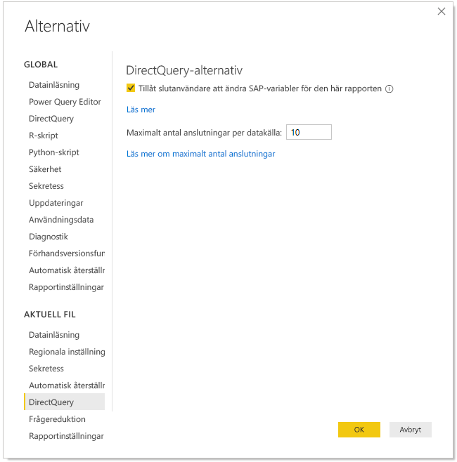
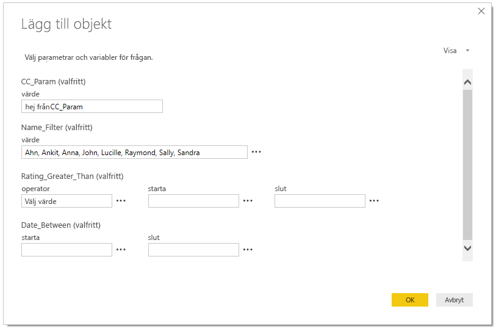
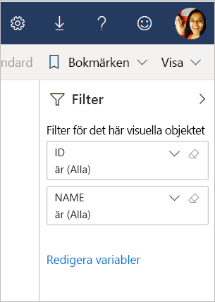

# Redigera SAP-variabler i Power BI-tjänsten

Vid användning av SAP Business Warehouse eller SAP HANA med DirectQuery, kan rapportförfattare nu tillåta att slutanvändare redigerar SAP-variabler i **Power BI-tjänsten** för Premium-arbetsytor och delade arbetsytor. Observera att den här funktionen INTE fungerar för rapporter på fliken Delat med mig i Min arbetsyta och appar som skapats på V1-arbetsytor. 

I det här dokumentet beskrivs kraven för att redigera variabler i Power BI, hur du aktiverar funktionen, samt var du kan redigera variabler i Power BI-tjänsten.

## Krav för redigering av SAP-variabler

Det finns några krav för användning av funktionen för att redigera SAP-variabler. I följande lista beskrivs dessa krav.

**Nya filterupplevelsen krävs** – du måste ha [den nya filterupplevelsen](../create-reports/power-bi-report-filter.md) aktiverad för rapporten. Så här kan du aktivera den för din rapport i Power BI Desktop:
- I Power BI Desktop väljer du **Arkiv** > **Alternativ och inställningar** > **Alternativ**
- I navigeringsfönstret under **Aktuell fil** väljer du **Rapportinställningar**.
- Under **Filtreringsupplevelse** väljer du **Aktivera det uppdaterade filterfönstret**.

**DirectQuery-anslutningar krävs** – du måste ansluta till SAP-datakällan med hjälp av DirectQuery. Importanslutningar stöds inte.

**Konfiguration av enkel inloggning krävs** – för att den här funktionen ska fungera måste enkel inloggning vara konfigurerad. Mer information finns i [översikten av enkel inloggning (SSO)](service-gateway-sso-overview.md).

**Nya gatewaybitar** krävs – ladda ned den senaste gatewayen och uppdatera din befintliga gateway. Mer information finns i [tjänstgateway](service-gateway-onprem.md).

**Flerdimensionellt endast för SAP HANA** – för SAP HANA fungerar funktionen för att redigera SAP-variabler endast med flerdimensionella modeller och fungerar inte för relationskällor.

**Stöds ej i nationella moln** – för närvarande är Power Query Online inte tillgängligt i nationella moln. Därför stöds den här funktionen heller inte i nationella moln.

## Så aktiverar du funktionen

Om du vill aktivera funktionen för att **redigera SAP-variabler** ansluter du i Power BI Desktop till en SAP HANA- eller SAP BW-datakälla. Gå sedan till **Arkiv > Alternativ och inställningar > Alternativ** och välj **DirectQuery** i avsnittet Aktuell fil i det vänstra fönstret. När du väljer detta visas DirectQuery-alternativ i det högra fönstret samt en kryssruta där du kan markera **Tillåt slutanvändare att ändra SAP-variabler i rapporten**, enligt vad som visas i följande bild.

## Använda redigering av SAP-variabler i Power BI Desktop

När du använder redigering av SAP-variabler i Power BI Desktop kan du redigera variablerna genom att välja länken Redigera variabler i menyn **Redigera frågor** i menyfliksområdet. Därifrån visas följande dialogruta. Den här funktionen har varit tillgänglig i Power BI Desktop ett tag. Rapportskapare kan välja variabler för rapporten med hjälp av följande dialogruta.

## Använda redigering av SAP-variabler i tjänsten

När rapporten har publicerats till Power BI-tjänsten kan användarna se länken **Redigera variabler** i det nya filterfönstret. Om du publicerar rapporten för första gången kan det ta upp till 5 minuter innan länken Redigera variabler visas. Om länken inte visas behöver du uppdatera datamängden manuellt.
Det gör du på följande sätt:

1. I Power BI-tjänsten väljer du fliken **Datamängder** i innehållslistan för en arbetsyta.

2. Leda upp den datamängd som du behöver uppdatera och välj ikonen **Uppdatera**.

    

3. Om du väljer länken Redigera variabler öppnas dialogrutan **Redigera variabler**, där användare kan åsidosätta variabler. Om du väljer knappen **Återställ** återställs variablerna till de ursprungliga värden som visades när den här dialogrutan öppnades.

    

4. Eventuella ändringar i dialogrutan **Redigera variabler** bevaras endast för den här användaren (vilket liknar annat beteende för bevarande i Power BI). Om du väljer **Återställ till standard**, vilket visas i följande bild, återställs rapporten till rapportskaparens ursprungliga tillstånd, inklusive variablerna.

    

Vid arbete med en publicerad rapport i Power BI-tjänsten som använder SAP HANA eller SAP BW med funktionen för att **redigera variabler** aktiverad kan rapportägaren ändra de standardvärdena. Ägaren till rapporten kan ändra variablerna i redigeringsläge och spara rapporten så att dessa inställningar kan bli de *nya standardinställningarna* för den rapporten. Alla andra användare som kommer åt rapporten efter att dessa ändringar har gjorts av rapportägaren ser de nya inställningarna som standardinställningar.

## Nästa steg

Mer information om SAP HANA, SAP BW eller DirectQuery finns i följande artiklar:

- [Använda SAP HANA i Power BI Desktop](desktop-sap-hana.md)
- [DirectQuery och SAP Business Warehouse (BW)](desktop-directquery-sap-bw.md)
- [DirectQuery och SAP HANA](desktop-directquery-sap-hana.md)
- [Använd DirectQuery i Power BI](desktop-directquery-about.md)
