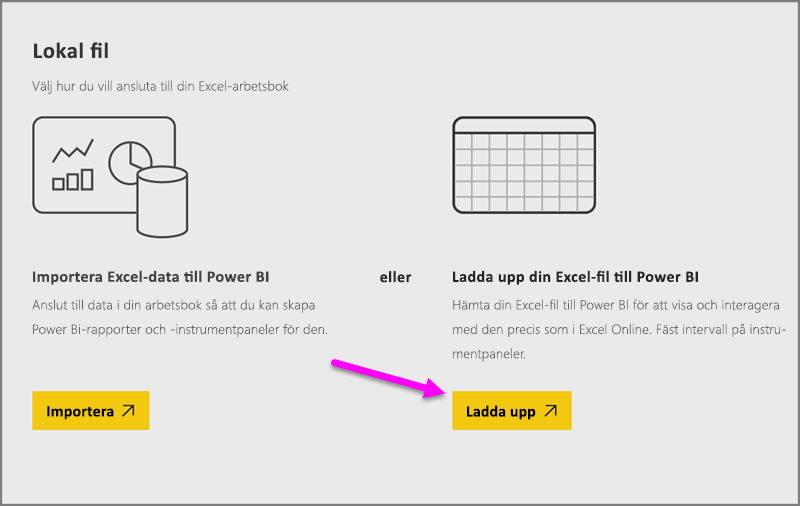
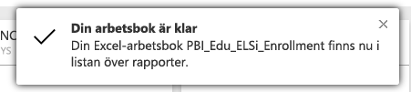
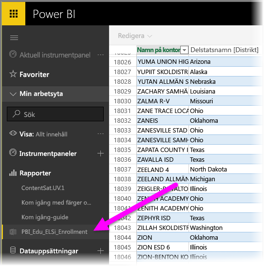

# Hämta data från Excel-arbetsboksfiler

Microsoft Excel är ett av världens mest använda affärsprogram. Det är också ett av de vanligaste sätt att få dina data i Power BI.

## Vilka typer av arbetsböcker stöds i Power BI?
Power BI stöder importer eller anslutning till arbetsböcker som har skapats i Excel 2007 och senare. Arbetsböcker måste sparas som filtyperna .xlsx eller .xlsm och vara under 1 GB. Vissa funktioner som beskrivs i den här artikeln är bara tillgängliga i senare versioner av Excel.

### Arbetsböcker med dataintervall eller datatabeller
Om din arbetsbok har enkla kalkylblad med dataintervall måste du formatera dessa intervall som tabeller för att få ut det mesta av dina data i Power BI. På så vis kan du se tabeller och kolumner med namn i fönstret Fält när du skapar rapporter i Power BI, vilket gör det enklare att visualisera dina data.

### Arbetsböcker med datamodeller
Arbetsböcker som kan innehålla en datamodell med en eller flera tabeller som har lästs in med länkade tabeller, Power Query (Hämta & transformera i Excel 2016) eller Power Pivot. Power BI stöder alla data modellegenskaper, till exempel relationer, mått, hierarkier och KPI:er.

> [!NOTE]
> Arbetsböcker med datamodeller kan inte delas mellan Power BI-klienter. Till exempel en användare som loggar in på Power BI med hjälp av ett *contoso.com*-konto kan inte dela en Excel-arbetsbok med en användare som loggar in med ett Power BI-konto för inloggning från *woodgrovebank.com*.
> 
> 

### Arbetsböcker med anslutningar till externa datakällor
Om du använder Excel för att ansluta till en extern datakälla kan du skapa rapporter och instrumentpaneler som är baserade på data från den anslutna datakällan när arbetsboken är i Power BI. Du kan också konfigurera Schemalagd uppdatering för att ansluta till datakällan och hämta uppdateringar automatiskt. Du behöver inte längre uppdatera data manuellt från menyfliksområdet Data i Excel. Alla visuella objekt i rapporter och paneler i instrumentpaneler som är baserade på data från datakällan uppdateras automatiskt. Läs mer i [datauppdatering i Power BI](refresh-data.md).

### Arbetsböcker med Power View-blad, pivottabeller och diagram
Sättet som PowerView-blad och pivottabeller och diagram visas eller inte visas i Power BI beror på var din arbetsbokfil sparas och hur du hämtar den i Power BI. Vi ska titta närmare på detta längre fram.

## Datatyper
Power BI stöder följande datatyper: Heltal, decimaltal, valuta, datum, True/False, text. Genom att markera data som specifika datatyper i Excel förbättras Power BI-upplevelsen.

## Förbered din arbetsbok för Power BI
Det här användbara videoklippet visar dig hur du kan förbereda dina Excel-arbetsböcker för Power BI.

<iframe width="500" height="281" src="https://www.youtube.com/embed/l2wy4XgQIu0" frameborder="0" allowfullscreen></iframe>

## Det spelar roll vart du sparar arbetsbokfilen
**Lokalt** – Om du sparar din arbetsbokfil till en lokal enhet på datorn eller en annan plats inom din organisation, från Power BI så kan du hämta den till Power BI. Filen kommer att finnas kvar på den lokala enheten, så hela filen har i själva verket inte importerats till Power BI. Det som händer är att en ny datauppsättning skapas i Power BI och data och datamodellen (i förekommande fall) i arbetsboken läses in i datauppsättningen. Om din arbetsbok innehåller rapporter kommer de att visas på Power BI-webbplatsen under Rapporter. Excel 2016 också har funktionen **Publicera** (under menyn **Arkiv**). Funktionen **Publicera** är detsamma som att använda **Hämta Data > Filer > Lokal fil** från Power BI, men det är ofta lättare att uppdatera datamängden i Power BI om du regelbundet gör ändringar i arbetsboken.

**OneDrive företag**  – om du har OneDrive för företag och du loggar in med samma konto som du använder för Power BI, är detta det mest effektiva sättet att behålla ditt arbete i Excel och din datauppsättning, rapporter och instrumentpaneler i Power BI synkroniserade. Eftersom både Power BI och OneDrive finns i molnet, *ansluter* Power BI till din arbetsboksfil på OneDrive någon gång i timmen. Om det finns ändringar uppdateras dina datauppsättningar, rapporter och instrumentpaneler i Power BI automatiskt. Precis som om du har sparat arbetsboken till en lokal enhet kan du också Publicera för att uppdatera datauppsättningen och rapporter i Power BI omedelbart. Annars synkroniseras Power BI automatiskt, vanligen inom en timme.

**OneDrive – personlig** – om du sparar arbetsboksfiler på ditt eget OneDrive-konto får du många av de fördelar som du får med OneDrive för företag. Den största skillnaden är att när du första gången ansluter till din fil (med Hämta data > Filer > OneDrive – personlig) måste du logga in i OneDrive med ditt Microsoft-konto som vanligtvis skiljer sig från det konto du använder för att logga in i Power BI. När du loggar in i OneDrive med ditt Microsoft-konto, måste du markera alternativet Jag vill förbli inloggad. På så sätt kan Power BI ansluta till din arbetsboksfil ungefär en gång i timmen och kontrollera att din datauppsättning och dina rapporter i Power BI är synkroniserade.

**SharePoint-gruppwebbplatser** – Du sparar Power BI Desktop-filer på SharePoint-gruppwebbplatser ungefär på samma sätt som på OneDrive för företag. Den största skillnaden är hur du ansluter till filen från Power BI. Du kan ange en URL eller ansluta till rotmappen.

## En Excel-arbetsbok – två sätt att använda den
Om du sparar arbetsbokfilerna i **OneDrive**, finns det ett par olika sätt att utforska dina data i Power BI

### Importera Excel-data till Power BI
När du väljer **Importera** importeras alla data som stöds i tabeller och/eller en datamodell till en ny datauppsättning i Power BI. Om du har några Power View-blad kommer de att skapas igen i Power BI som rapporter.

Du kan fortsätta att redigera din arbetsbok. När ändringarna sparas kommer de att synkroniseras med datauppsättningen i Power BI, vanligtvis inom en timme. Om du behöver använda dem snabbare kan du klicka på Publicera igen för att exportera dina ändringar direkt. Alla visualiseringar som finns i rapporter och instrumentpaneler uppdateras också.

Välj det här alternativet om du har använt Hämta och transformera data eller Power Pivot för att läsa in data i en datamodell, eller om arbetsboken har Power View-blad med visualiseringar som du vill se i Power BI.

I Excel 2016 kan du också använda Publicera > Exportera. Det är ganska långt samma sak. Läs mer i [Publicera till Power BI från Excel 2016](service-publish-from-excel.md).

### Anslut, hantera och visa Excel i Power BI
När du väljer **Anslut** visas arbetsboken i Power BI precis som den skulle ha gjort i Excel Online. Men till skillnad från i Excel Online har du några bra funktioner som hjälper dig fästa element från kalkylbladen direkt på instrumentpanelerna.

Du kan inte redigera din arbetsbok i Power BI. Men om du behöver göra några ändringar kan du välja Redigera och sedan välja att redigera din arbetsbok i Excel Online eller öppna den i Excel på datorn. Alla ändringar du gör sparas i arbetsboken på OneDrive.

Välj det här alternativet om du enbart har data i kalkylbladen eller om du har intervall, pivottabeller och diagram som du vill fästa på instrumentpaneler.

I Excel 2016 kan du också använda Publicera > Överför. Det är ganska långt samma sak. Läs mer i [Publicera till Power BI från Excel 2016](service-publish-from-excel.md).

## Importera eller ansluta till en Excel-arbetsbok från Power BI
1. Klicka på **Hämta data** i navigeringsfönstret i Power BI.
   
   
2. I Filer klickar du på **Hämta**.
   
   
3. Hitta din fil.
   
   
4. Om din arbetsboksfil finns på OneDrive eller SharePoint - gruppwebbplatser väljer du **Importera** eller **Anslut**.

## Lokala Excel-arbetsböcker
Du kan också använda en lokal Excel-fil och överföra den till Power BI. Välj bara **Lokal fil** från föregående meny och gå till platsen där du har sparat dina Excel-arbetsböcker.

När du har valt detta kan du välja att överföra din fil till Power BI.

När din arbetsbok överförs får du ett meddelande om att arbetsboken är klar.

När arbetsboken är klar hittar du den på området **Rapporter** i Power BI.

## Publicera från Excel 2016 till Power BI-webbplats
Funktionen **Publicera Power BI** i Excel 2016 är praktiskt taget samma som att använda **hämta Data** i Power BI för att importera eller ansluta till din fil. Vi kommer inte gå in på större detaljer här, men du kan läsa [Publicera till Power BI från Excel 2016](service-publish-from-excel.md) om du vill veta mer.

## Felsökning
Är arbetsboken för stor? Läs [Minska storleken på en Excel-arbetsbok för att visa den i Power BI](reduce-the-size-of-an-excel-workbook.md).

För närvarande när du väljer Importera importerar Power BI endast data som ingår i en namngiven tabell eller en datamodell. Därmed, om arbetsboken inte innehåller namngivna tabeller, Power View-blad eller Excel-datamodeller kan följande felmeddelande visas: **”Det gick inte att hitta några data i din Excel-arbetsbok”** . [Den här artikeln](service-admin-troubleshoot-excel-workbook-data.md) förklarar hur du åtgärdar din arbetsbok och importerar den igen.

## Nästa steg
**Utforska dina data** – När du har hämtat dina data och rapporter från filen till Power BI, är det dags att börja utforska. Högerklicka bara på den nya datauppsättningen och klicka sedan på Utforska. Om du vill ansluta till en arbetsboksfil på OneDrive i steg 4 visas din arbetsbok i rapporter. Den öppnas när du klickar på den Power BI, precis som i Excel Online.

**Schemalägg uppdatering** – om din Excel-arbetsboksfil ansluter till externa datakällor eller har importerats från en lokal enhet kan du konfigurera schemalagd uppdatering så att din datauppsättning eller rapport alltid är uppdaterad. I de flesta fall är det ganska enkelt att ställa in schemalagd uppdatering, men det ligger utanför omfånget för den här artikeln att gå in på detaljer. Du kan läsa mer i [Datauppdatering i Power BI](refresh-data.md).

[Publicera till Power BI från Excel 2016](service-publish-from-excel.md)

[Datauppdatering i Power BI](refresh-data.md)
