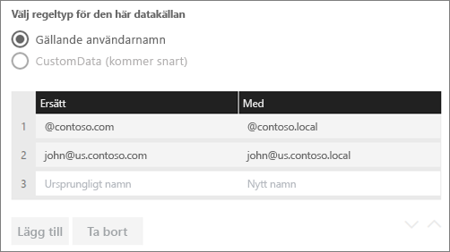
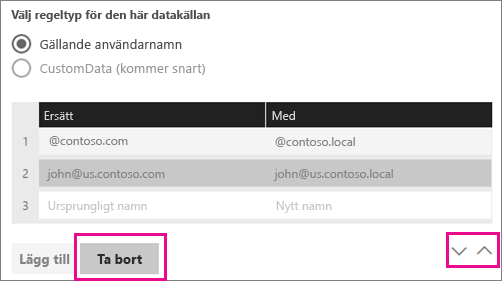
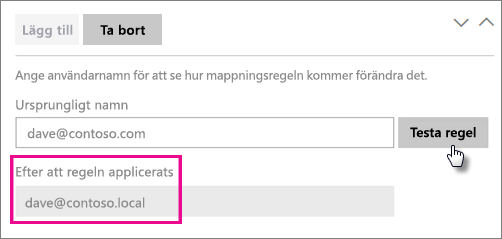

# <a name="manage-your-data-source---analysis-services"></a>Hantera din datakälla – Analysis Services

[!INCLUDE [gateway-rewrite](../includes/gateway-rewrite.md)]

När du har [installerat den lokala datagatewayen](/data-integration/gateway/service-gateway-install) behöver du [lägga till datakällor](service-gateway-data-sources.md#add-a-data-source) som kan användas med gatewayen. Den här artikeln handlar om hur du kan arbeta med gatewayer och SQL Server Analysis Services-datakällor (SSAS) som används för antingen schemalagd uppdatering eller live-anslutningar.

[Titta på den här videon](https://www.youtube.com/watch?v=GPf0YS-Xbyo&feature=youtu.be) om du vill veta mer om hur du konfigurerar en live-anslutning till Analysis Services.

> [!NOTE]
> Om du har en Analysis Services-datakälla måste du installera gatewayen på en dator som ingår i samma skog/domän som Analysis Services-servern.

## <a name="add-a-data-source"></a>Lägga till en datakälla

Information om hur du lägger till en datakälla finns i [Lägga till en datakälla](service-gateway-data-sources.md#add-a-data-source). Välj **Analysis Services** som **Typ av datakälla** om du ansluter till en flerdimensionell server eller tabellserver.


Fyll i informationen för datakällan, vilket innefattar **Server** och **Databas**. Den information du anger för **användarnamn** och **lösenord** används av gatewayen för att ansluta till Analysis Services-instansen.

> [!NOTE]
> Det Windows-konto som du anger måste ha serveradministratörsbehörighet för den instans som du ansluter till. Om det här kontots lösenord upphör att gälla, kan användaren få ett anslutningsfel om lösenordet inte uppdateras för datakällan. Mer information om hur autentiseringsuppgifter lagras finns i [Lagra krypterade autentiseringsuppgifter i molnet](service-gateway-data-sources.md#store-encrypted-credentials-in-the-cloud).


När du har fyllt i allt väljer du **Lägg till**. Du kan nu använda den här datakällan för schemalagd uppdatering eller realtidsanslutningar mot en lokal Analysis Services-instans. *Anslutningen lyckades* visas om anslutningen lyckades.


### <a name="advanced-settings"></a>Avancerade inställningar

Om du vill kan du konfigurera sekretessnivån för datakällan. Den här inställningen styr hur data kan kombineras. Den används endast vid schemalagd uppdatering. Sekretessnivåinställningen gäller inte för realtidsanslutningar. Mer information om sekretessnivåer för datakälla finns i [Sekretessnivåer (Power Query)](https://support.office.com/article/Privacy-levels-Power-Query-CC3EDE4D-359E-4B28-BC72-9BEE7900B540).


## <a name="user-names-with-analysis-services"></a>Användarnamn med Analysis Services

<iframe width="560" height="315" src="https://www.youtube.com/embed/Qb5EEjkHoLg" frameborder="0" allowfullscreen></iframe>

Varje gång en användare interagerar med en rapport ansluten till Analysis Services, skickas användarnamnet till gatewayen och sedan vidare till den lokala Analysis Services-servern. Den e-postadress som du använder för att logga in på Power BI skickas till Analysis Services som den gällande användaren. Den skickas i anslutningsegenskapen [EffectiveUserName](https://msdn.microsoft.com/library/dn140245.aspx#bkmk_auth). 

E-postadressen måste matcha ett definierat UPN (användarens huvudnamn) i den lokala Active Directory-domänen. UPN är en egenskap för ett Active Directory-konto. Windows-kontot måste finnas i en Analysis Services-roll. Inloggningen misslyckas om ingen matchning hittas i Active Directory. Mer information om Active Directory och namngivning av användare finns i [Attribut för namngivning av användare](https://msdn.microsoft.com/library/ms677605.aspx).

Du kan även [mappa ditt Power BI-inloggningsnamn med en lokal katalog-UPN](service-gateway-enterprise-manage-ssas.md#map-user-names-for-analysis-services-data-sources).

## <a name="map-user-names-for-analysis-services-data-sources"></a>Mappa användarnamn för Analysis Services-datakällor

<iframe width="560" height="315" src="https://www.youtube.com/embed/eATPS-c7YRU" frameborder="0" allowfullscreen></iframe>

Power BI tillåter mappning av användarnamn för Analysis Services-datakällor. Du kan konfigurera regler för att mappa ett användarnamn som är inloggat på Power BI till ett namn som har skickats för EffectiveUserName på Analysis Services-anslutningen. Funktionen för mappning av användarnamn är till stor hjälp när användarnamnet i Azure Active Directory (Azure AD) inte matchar ett UPN i din lokala Active Directory-instans. Om din e-postadress t.ex. är nancy@contoso.onmicrsoft.com, mappar du den till nancy@contoso.com, och det värdet skickas då till gatewayen.

Du kan mappa användarnamn för Analysis Services på två olika sätt:

* Manuell användarommappning
* Lokal Active Directory-egenskapssökning för att mappa om Azure AD UPN:er till Active Directory-användare (Active Directory-sökningsmappning)

Det går att utföra manuell mappning med den andra metoden, men det kan vara tidskrävande och svårt att underhålla. Det är särskilt svårt när det inte räcker med mönstermatchning. Exempel på detta är om domännamnen skiljer sig mellan Azure AD och lokala Active Directory eller om användarkontonamnen skiljer sig mellan Azure AD och Active Directory. Därför rekommenderas inte manuell mappning med den andra metoden.

Dessa två metoder beskrivs i turordning i följande två avsnitt.

### <a name="manual-user-name-remapping"></a>Manuell mappning av användarnamn

Du kan konfigurera anpassade UPN-regler för Analysis Services-datakällor. Anpassade regler hjälper dig om dina inloggningsuppgifter för Power BI-tjänsten inte överensstämmer med din lokala katalog-UPN. Om du till exempel loggar in i Power BI med john@contoso.com, men din lokala katalog-UPN är john@contoso.local, kan du konfigurera en mappningsregel för att skicka john@contoso.local till Analysis Services.

Gör följande för att komma till UPN-mappningsskärmen.

1. Gå till kugghjulsikonen och välj **Hantera gatewayer**.
2. Expandera den gateway som innehåller Analysis Services-datakällan. Om du inte har skapat Analysis Services-datakällan än, kan du göra det nu.
3. Välj datakällan och välj sedan fliken **Användare**.
4. Välj **Mappa användarnamn**.

    

Alternativ för att lägga till regler och test för en viss användare visas.

> [!NOTE]
> Du kan hända att du oavsiktligt ändrar en användare. Om till exempel **Ersätt (ursprungligt värde)** är contoso.com och **Med (nytt namn)** är @contoso.local, kommer alla användare med en inloggning som innehåller @contoso.com att ersättas med @contoso.local. Om **Ersätt (ursprungligt namn)** är dave@contoso.com och **Med (nytt namn)** är dave@contoso.local, skickas en användare med inloggningen v-dave@contoso.com som v-dave@contoso.local.

### <a name="active-directory-lookup-mapping"></a>Active Directory-sökningsmappning

Följ stegen i det här avsnittet om du vill mappa om Azure AD UPN:er till Active Directory-användare för att utföra en lokal Active Directory-egenskapssökning. Vi börjar med att titta närmare på hur det här fungerar.

Följande inträffar i Power BI-tjänsten:

* För varje fråga från en Power BI Azure AD-användare till en lokal SSAS-server skickas en UPN-sträng vidare, exempelvis: firstName.lastName@contoso.com.

> [!NOTE]
> Alla manuella UPN-användarmappningar som definierats i Power BI-datakällans konfiguration används fortfarande *innan* användarnamnssträngen skickas till den lokala datagatewayen.

Gör följande på den lokala datagatewayen med konfigurerbar anpassad användarmappning.

1. Hitta Active Directory för att söka. Du kan använda automatiskt eller konfigurerbart.
2. Leta upp attributet för Active Directory-personen (till exempel e-post) från Power BI-tjänsten. Attributet baseras på en inkommande UPN-sträng som firstName.lastName@contoso.com.
3. Om Active Directory-sökningen misslyckas, försöker den använda det vidareskickade UPN:et som EffectiveUser till SSAS.
4. Om Active Directory-sökningen lyckas, hämtas UserPrincipalName för Active Directory-personen.
5. Den vidarebefordrar e-postadress för UserPrincipalName som EffectiveUser till SSAS, exempelvis Alias@corp.on-prem.contoso.

Så här konfigurerar du gatewayen för att utföra Active Directory-sökningen:

1. [Ladda ned och installera den senaste gatewayen](/data-integration/gateway/service-gateway-install).

2. I gatewayen ändrar du den lokala datagatewaytjänsten så att den körs med ett domänkonto (i stället för ett lokalt tjänstkonto). Annars fungerar inte Active Directory-sökningen korrekt vid körning. Gå till [appen för lokal datagateway](/data-integration/gateway/service-gateway-app) på datorn och gå sedan till **Tjänstinställningar** > **Byt servicekonto**. Kontrollera att du har återställningsnyckeln för gatewayen eftersom du behöver återställa den på samma dator om du inte vill skapa en ny gateway i stället. Starta om gatewaytjänsten så att ändringen börjar gälla.

3. Gå till installationsmappen för gatewayen, *C:\Program\Lokal datagateway*, som administratör så att du har skrivbehörighet. Öppna filen *Microsoft.PowerBI.DataMovement.Pipeline.GatewayCore.dll.config*.

4. Redigera följande två konfigurationsvärden enligt *dina* Active Directory-attributkonfigurationer för Active Directory-användarna. Följande konfigurationsvärden är exempel. Ange värdena utifrån din Active Directory-konfiguration. De här konfigurationerna är skiftlägeskänsliga, så se till att de matchar värdena i Active Directory.

    

    Om inget värde har angetts för ADServerPath-konfigurationen använder gatewayen den globala katalogen (standard). Du kan också ange flera värden för ADServerPath. Varje värde måste vara avgränsat med semikolon, som du ser i följande exempel:

    ```xml
    <setting name="ADServerPath" serializeAs="String">
        <value> >GC://serverpath1; GC://serverpath2;GC://serverpath3</value>
    </setting>
    ```

    Gatewayen parsar värdena för ADServerPath från vänster till höger tills den hittar en matchning. Om ingen matchning hittas används det ursprungliga UPN:et. Kontrollera att det konto som kör gatewaytjänsten (PBIEgwService) har behörighet att skicka frågor till alla Active Directory-servrar som du angett i ADServerPath.

    Gatewayen stöder två typer av ADServerPath (se följande exempel):

    **WinNT**

    ```xml
    <value="WinNT://usa.domain.corp.contoso.com,computer"/>
    ```

    **GC**

    ```xml
    <value> GC://USA.domain.com </value>
    ```

5. Starta om den lokala datagatewaytjänsten så att konfigurationsändringen börjar gälla.

### <a name="work-with-mapping-rules"></a>Arbeta med mappningsregler

För att skapa en mappningsregel anger du ett värde för **Ursprungligt namn** och **Nytt namn** och väljer sedan **Lägg till**.

| Field | Beskrivning |
| --- | --- |
| Ersätt (ursprungligt namn) |Den e-postadress som du använde för att logga in på Power BI. |
| Med (nytt namn) |Det värde som du vill ersätta det med. Resultatet av ersättningen skickas till egenskapen EffectiveUserName för Analysis Services-anslutningen. |



När du markerar ett objekt i listan kan du välja att ordna om det med hjälp av sparrikonerna. Eller så kan du ta bort posten.



### <a name="use-a-wildcard"></a>Använda ett jokertecken

Du kan använda ett jokertecken (*) för din **Ersätt (ursprungligt namn)** -sträng. Det kan bara användas på egen hand och inte med någon annan strängdel. Använd ett jokertecken om du vill ta med alla användare och skicka ett enda värde till datakällan. Den här metoden är användbar när du vill att alla användare i din organisation ska använda samma användare i den lokala miljön.

### <a name="test-a-mapping-rule"></a>Testa en mappningsregel

Om du vill verifiera vad ett ursprungligt namn ersätts med anger du ett värde för **ursprungligt namn**. Välj **Testa regel**.



> [!NOTE]
> Det tar några minuter för tjänsten att börja använda de regler som sparas. Regeln fungerar omedelbart i webbläsaren.

### <a name="limitations-for-mapping-rules"></a>Begränsningar för mappningsregler

Mappningen gäller för den specifika datakälla som konfigureras. Det är inte en global inställning. Om du har flera Analysis Services-datakällor måste du mappa användarna för varje datakälla.

## <a name="authentication-to-a-live-analysis-services-data-source"></a>Autentisering till en levande Analysis Services-datakälla

Varje gång en användare interagerar med Analysis Services skickas det gällande användarnamnet till en gateway och sedan vidare till den lokala Analysis Services-servern. UPN, vilket vanligtvis är den e-postadress som du använder för att logga in på molnet, skickas till Analysis Services som den gällande användaren. UPN skickas i anslutningsegenskapen EffectiveUserName. 

E-postadressen måste matcha en definierad UPN inom den lokala Active Directory-domänen. UPN är en egenskap för ett Active Directory-konto. Det Windows-kontot måste finnas i en Analysis Services-roll för att få åtkomst till servern. Inloggningen misslyckas om ingen matchning hittas i Active Directory.

Analysis Services kan också tillhandahålla filtrering baserat på det här kontot. Filtrering kan uppstå med rollbaserad säkerhet eller säkerhet på radnivå.

## <a name="role-based-security"></a>Rollbaserad säkerhet

Modeller tillhandahåller säkerhet utifrån användarroller. Roller definieras för ett visst modellprojekt under redigering i SQL Server Data Tools – Business Intelligence, eller efter det att en modell har distribuerats med SQL Server Management Studio. Roller innehåller medlemmar efter Windows-användarnamn eller Windows-grupp. Rollerna definierar de behörigheter för en användare har när det gäller att fråga eller utföra åtgärder i modellen. De flesta användare tillhör en roll med läsbehörighet. Andra roller är avsedda för administratörer med behörighet att bearbeta objekt, hantera databasfunktioner och hantera andra roller.

## <a name="row-level-security"></a>Säkerhet på radnivå

Säkerhet på radnivå är specifik för Analysis Services-säkerhet på radnivå. Modeller kan tillhandahålla dynamisk säkerhet på radnivå. Till skillnad från att ha minst en roll som användarna tillhör, så krävs inte dynamisk säkerhet för tabellmodeller. På hög nivå definierar dynamisk säkerhet en användares läsbehörighet för data direkt ned till en viss rad i en viss tabell. I likhet med roller så bygger dynamisk säkerhet på radnivå på en användares Windows-användarnamn.

En användares möjlighet att fråga och visa modelldata bestäms av:

- De roller som användarens Windows-användarkonto är medlem i.
- Dynamisk säkerhet på radnivå, om det har konfigurerats.

Rollimplementering och dynamisk säkerhet på radnivå i modeller ligger utanför den här artikelns fokus. Mer information finns i [Roles (SSAS tabular)](https://msdn.microsoft.com/library/hh213165.aspx) och [Security roles (Analysis Services - Multidimensional data)](https://msdn.microsoft.com/library/ms174840.aspx) på MSDN. Om du vill ha riktigt djup förståelse av säkerhet för tabellmodeller kan du ladda ned och läsa [white paper om BI-semantikmodellen för tabeller](https://msdn.microsoft.com/library/jj127437.aspx).

## <a name="what-about-azure-ad"></a>Om Azure AD

Microsofts molntjänster använder [Azure AD](/azure/active-directory/fundamentals/active-directory-whatis) för att hantera autentiseringen av användare. Azure AD är den klient som innehåller användarnamn och säkerhetsgrupper. Normalt är den e-postadress som en användare loggar in med densamma som kontots UPN-namn.

## <a name="what-is-the-role-of-my-local-active-directory-instance"></a>Vilken roll har min lokala Active Directory-instans?

För att Analysis Services ska kunna avgöra om en användare som ansluter tillhör en roll med behörighet att läsa data måste servern konvertera det effektiva användarnamn som skickades från Azure AD till gatewayen och vidare till Analysis Services-servern. Analysis Services-servern skickar det effektiva användarnamnet till en Windows Active Directory-domänkontrollant (DC). Active Directory-domänkontrollanten verifierar sedan att det gällande användarnamnet är ett giltigt UPN på ett lokalt konto. Den returnerar användarens Windows-användarnamn tillbaka till Analysis Services-servern.

EffectiveUserName kan inte användas på en Analysis Services-server som inte är domänansluten. Analysis Services-servern måste vara ansluten till en domän för att undvika eventuella inloggningsfel.

## <a name="how-do-i-tell-what-my-upn-is"></a>Hur vet jag vilken UPN jag har?

Du kanske inte vet vad ditt UPN är, och du är kanske inte domänadministratör. Du kan använda följande kommando från din arbetsstation för att ta reda på ditt kontos UPN.

    whoami /upn

Resultatet ser ut ungefär som en e-postadress, men detta är det UPN som finns på ditt domänkonto. Om du använder en Analysis Services-datakälla för realtidsanslutningar, och detta UPN inte stämmer överens med den e-postadress som du använder för att logga in på Power BI, kan du läsa mer om hur du [mappar användarnamn](#map-user-names-for-analysis-services-data-sources).

## <a name="synchronize-an-on-premises-active-directory-with-azure-ad"></a>Synkronisera ett lokalt Active Directory med Azure AD

Om du planerar att använda Analysis Services-realtidsanslutningar måste dina lokala Active Directory-konton matcha Azure AD. UPN måste matcha mellan kontona.

Molntjänsterna känner bara till konton i Azure AD. Det spelar ingen roll om du har lagt till ett konto i din lokala Active Directory-instans. Kontot kan inte användas om det inte finns i Azure AD. Det finns olika sätt på vilka du kan matcha dina lokala Active Directory-konton med Azure AD:

- Du kan lägga till konton manuellt till Azure AD.

   Du kan skapa ett konto på Azure-portalen eller i administrationscentret för Microsoft 365, och kontonamnet matchar UPN-namnet för det lokala Active Directory-kontot.

- Med verktyget [Azure AD Connect](/azure/active-directory/hybrid/how-to-connect-sync-whatis) kan du synkronisera lokala konton med din Azure AD-klient.

   Verktyget Azure AD Connect erbjuder alternativ för katalogsynkronisering och konfigurering av autentisering. Alternativen innefattar synkronisering av lösenordshash, direktautentisering och federation. Om du inte är klientadministratör eller lokal domänadministratör måste du kontakta IT-administratören för att få hjälp med konfigurationen.

   Med Azure AD Connect säkerställer du att UPN matchar mellan Azure AD och din lokala Active Directory-instans.

> [!NOTE]
> När du synkroniserar konton med verktyget Azure AD Connect skapas nya konton i Azure AD-klienten.

## <a name="use-the-data-source"></a>Använda datakällan

När du har skapat datakällan går den att använda med realtidsanslutningar eller med schemalagd uppdatering.

> [!NOTE]
> Server- och databasnamnen måste överensstämma mellan Power BI Desktop och datakällan i den lokala datagatewayen.

Länken mellan din datauppsättning och datakällan i gatewayen är baserad på servernamnet och databasnamnet. Dessa namn måste matcha. Om du exempelvis anger en IP-adress för servernamnet i Power BI Desktop måste du använda den IP-adressen för datakällan i gatewaykonfigurationen. Om du använder *SERVER\INSTANS* i Power BI Desktop, måste du använda den i den datakälla som konfigureras för gatewayen.

Detta krav gäller för både realtidsanslutningar och schemalagd uppdatering.

### <a name="use-the-data-source-with-live-connections"></a>Använda datakällan med realtidsanslutningar

Se till att server- och databasnamnet överensstämmer mellan Power BI Desktop och den konfigurerade datakällan för gatewayen. Du behöver även kontrollera att användaren finns med på fliken **Användare** för datakällan för att datamängder med realtidsanslutning ska kunna publiceras. Valet rörande realtidsanslutningar sker i Power BI Desktop när du importerar data för första gången.

När du har publicerat, antingen från Power BI Desktop eller **Hämta Data**, borde dina rapporter fungera. Det kan ta ett par minuter efter att du har skapat datakällan i gatewayen innan anslutningen kan användas.

### <a name="use-the-data-source-with-scheduled-refresh"></a>Använda datakällan med schemalagd uppdatering

Om du finns med på fliken **Användare** för den datakälla som konfigurerats i gatewayen, och om server- och databasnamnen matchar, visas gatewayen som ett alternativ för användning med schemalagd uppdatering.


### <a name="limitations-of-analysis-services-live-connections"></a>Begränsningar för Analysis Services realtidsanslutningar

Du kan använda en realtidsanslutning för tabell- eller flerdimensionella instanser.

| **Serverversion** | **Obligatorisk SKU** |
| --- | --- |
| 2012 SP1 CU4 eller senare |Business Intelligence och Enterprise SKU |
| 2014 |Business Intelligence och Enterprise SKU |
| 2016 |Standard-SKU eller högre |

* Formatering på cellnivå och översättningsfunktioner stöds inte.
* Åtgärder och namngivna mängder exponeras inte för Power BI. Men du kan ansluta till flerdimensionella kuber som också innehåller åtgärder eller namngivna mängder och skapa visuella objekt och rapporter.

## <a name="next-steps"></a>Nästa steg

* [Felsökning av den lokala datagatewayen](/data-integration/gateway/service-gateway-tshoot)
* [Felsöka gatewayer – Power BI](service-gateway-onprem-tshoot.md)

Fler frågor? Testa [Power BI Community](https://community.powerbi.com/).
