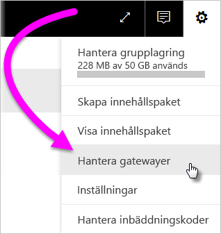
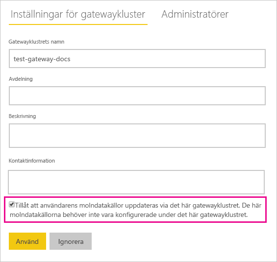

# Slå ihop eller lägga till lokala och molnbaserade datakällor

[!INCLUDE [gateway-rewrite](../includes/gateway-rewrite.md)]

Du kan använda den lokala datagatewayen för att slå ihop eller lägga till lokala och molnbaserade datakällor i samma fråga. Den här lösningen är praktisk om du vill kombinera data från flera källor utan att använda separata frågor.

>[!NOTE]
>Den här artikeln gäller endast datamängder som har molnbaserade och lokala datakällor som sammanslagits eller lagts till i en enda fråga. För datamängder som innehåller separata frågor – en som ansluter till en lokal datakälla och en annan som ansluter till en molndatakälla – kör gatewayen inte frågan för molndatakällan.

## Förutsättningar

- En [gateway som har installerats](/data-integration/gateway/service-gateway-install) på en lokal dator.
- En Power BI Desktop-fil med frågor som kombinerar lokala och molnbaserade datakällor.

>[!NOTE]
>För att få åtkomst till molndatakällor måste du se till att gatewayen har åtkomst till de datakällorna.

1. Välj kugghjulsikonen  > **Hantera gatewayer** i det övre högra hörnet av Power BI-tjänsten.

    

2. Välj den gateway som du vill konfigurera.

3. Välj **Tillåt att användarens datakällor i molnet uppdateras via det här gatewayklustret** > **Använd** under **Inställningar för gatewaykluster**.

    

4. Lägg till [lokala datakällor](service-gateway-enterprise-manage-scheduled-refresh.md#add-a-data-source) som används i dina frågor under gatewayklustret. Du behöver inte lägga till de molnbaserade datakällorna här.

5. Ladda upp Power BI Desktop-filen med frågorna som kombinerar lokala och molnbaserade datakällor till Power BI-tjänsten.

6. På sidan **Datamängdsinställningar** för den nya datauppsättningen:

   - Som lokal källa väljer du gatewayen som associeras med den här datakällan.
   - Redigera autentiseringsuppgifterna för den molnbaserade datakällan efter behov under **Autentiseringsuppgifter för datakälla**.

    Se till att sekretessnivåer för både molndatakällor och lokala datakällor är korrekt inställda för att säkerställa att kopplingarna hanteras på ett säkert sätt.

     

7. När du har angett autentiseringsuppgifter för molnet kan du uppdatera datauppsättningen med hjälp av alternativet **Uppdatera nu**. Eller så kan du schemalägga en regelbunden uppdatering.

## Nästa steg

Mer information om datauppdatering för gateways finns i [Använda datakällan med schemalagd uppdatering](service-gateway-enterprise-manage-scheduled-refresh.md#use-the-data-source-for-scheduled-refresh).
