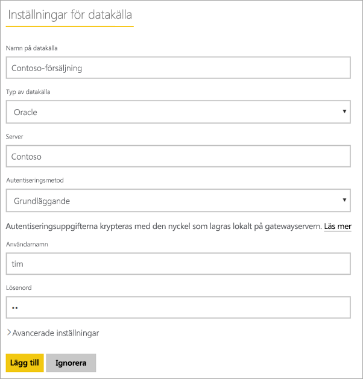
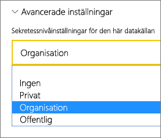
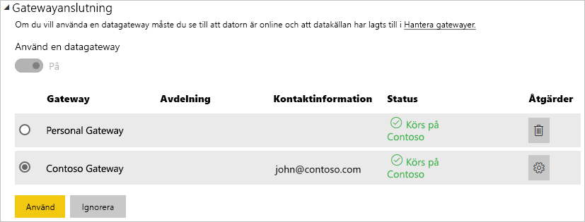

# Hantera din datakälla – Oracle

[!INCLUDE [gateway-rewrite](../includes/gateway-rewrite.md)]

När du har [installerat den lokala datagatewayen](/data-integration/gateway/service-gateway-install) behöver du [lägga till datakällor](service-gateway-data-sources.md#add-a-data-source) som kan användas med gatewayen. Den här artikeln handlar om hur du arbetar med gatewayer och Oracle-datakällor, antingen för schemalagd uppdatering eller för DirectQuery.

## Anslut till en Oracle-databas
För att ansluta till en Oracle-databas med den lokala datagatewayen måste rätt Oracle-klientprogramvara vara installerad på datorn som kör gatewayen. Vilken Oracle-klientprogramvara du använder beror på Oracle-serverversionen, men kommer alltid att matcha 64-bitars gatewayen.

Oracle-versioner som stöds: 
- Oracle Server 9 och senare
- ODAC-programvara (Oracle Data Access Client) 11.2 och senare

## Installera Oracle-klienten
- [Hämta och installera 64-bitars Oracle-klienten](https://www.oracle.com/database/technologies/odac-downloads.html).

> [!NOTE]
> Välj en version av Oracle Data Access Client (ODAC) som är kompatibel med din Oracle-server. Till exempel stöder ODAC 12.x inte alltid Oracle Server version 9.
> Välj Windows-installationsprogrammet för Oracle-klienten.
> Under installationen av Oracle-klienten kontrollerar du att du aktiverat *Configure ODP.NET and/or Oracle Providers for ASP.NET at machine-wide level* (Konfigurera ODP.NET och/eller Oracle-providers för ASP.NET på datoromfattande nivå) genom att markera motsvarande kryssruta under installationsguiden. I vissa versioner av Oracle-klientguiden markeras kryssrutan som standard, och i andra inte. Kontrollera att kryssrutan är markerad så att Power BI kan ansluta till Oracle-databasen.
 
När klienten har installerats och ODAC har konfigurerats korrekt rekommenderar vi att du använder PowerBI Desktop eller en annan testklient för att testa installationen och konfigurationen på gatewayen.

## Lägga till en datakälla

Mer information om hur du lägger till en datakälla finns i [Lägga till en datakälla](service-gateway-data-sources.md#add-a-data-source). Välj **Oracle** under **Typ av datakälla**.

När du har valt Oracle-datakälltypen fyller du i uppgifterna för datakällan, däribland **Server** och **Databas**. 

Du kan antingen välja **Windows** eller **Grundläggande** under **Autentiseringsmetod**. Välj **Grundläggande** om du planerar att använda ett konto som har skapats i Oracle i stället för Windows-autentisering. Ange sedan de autentiseringsuppgifter som ska användas för datakällan.

> [!NOTE]
> Alla frågor till datakällan kommer att köras med dessa autentiseringsuppgifter. Mer information om hur autentiseringsuppgifter lagras finns i [Lagra krypterade autentiseringsuppgifter i molnet](service-gateway-data-sources.md#store-encrypted-credentials-in-the-cloud).

När du har fyllt i allt väljer du **Lägg till**. Nu kan du använda den här datakällan för schemalagd uppdatering, eller DirectQuery mot en lokal Oracle-Server. *Anslutningen lyckades* visas om anslutningen lyckades.

### Avancerade inställningar

Om du vill kan du konfigurera sekretessnivån för datakällan. Den här inställningen styr hur data kan kombineras. Den används endast vid schemalagd uppdatering. Sekretessnivåinställningen gäller inte för DirectQuery. Mer information om sekretessnivåer för datakälla finns i [Sekretessnivåer (Power Query)](https://support.office.com/article/Privacy-levels-Power-Query-CC3EDE4D-359E-4B28-BC72-9BEE7900B540).

## Använda datakällan

När du har skapat datakällan går den att använda med DirectQuery eller med schemalagd uppdatering.

> [!WARNING]
> Server- och databasnamnen måste överensstämma mellan Power BI Desktop och datakällan i den lokala datagatewayen.

Länken mellan din datauppsättning och datakällan i gatewayen är baserad på servernamnet och databasnamnet. Dessa namn måste matcha. Om du exempelvis anger en IP-adress för servernamnet i Power BI Desktop måste du använda den IP-adressen för datakällan i gatewaykonfigurationen. Det här namnet måste även matcha ett alias som har definierats i filen tnsnames.ora. Mer information om tnsnames.org-filen finns i [Installera Oracle-klienten](#install-the-oracle-client).

Det här kravet gäller både DirectQuery och schemalagd uppdatering.

### Använda datakällan med DirectQuery-anslutningar

Se till att server- och databasnamnen överensstämmer mellan Power BI Desktop och den konfigurerade datakällan för gatewayen. Du behöver även kontrollera att användaren finns med på fliken **Användare** för datakällan för att DirectQuery-datamängder ska kunna publiceras. Valet för DirectQuery uppstår i Power BI Desktop när du importerar data första gången. Mer information om hur DirectQuery används finns i [Använda DirectQuery i Power BI Desktop](desktop-use-directquery.md).

När du har publicerat, antingen från Power BI Desktop eller **Hämta Data**, borde dina rapporter fungera. Det kan ta ett par minuter efter att du har skapat datakällan i gatewayen innan anslutningen kan användas.

### Använda datakällan med schemalagd uppdatering

Om du finns med på fliken **Användare** för den datakälla som konfigurerats i gatewayen, och om servernamnet och databasnamnet matchar, visas gatewayen som ett alternativ för användning med schemalagd uppdatering.

## Felsökning

Det kan uppstå fel i Oracle om namnsyntaxen är felaktig eller inte har konfigurerats korrekt:

* ORA-12154: TNS: det gick inte att matcha angivet anslutnings-ID.
* ORA-12514: TNS: lyssnaren känner för närvarande inte till tjänsten som begärdes i anslutningsbeskrivningen.
* ORA-12541: TNS: det finns ingen lyssnare.
* ORA-12170: TNS: det uppstod en anslutningstimeout.
* ORA-12504: TNS: lyssnaren har inte angetts SERVICE_NAME i CONNECT_DATA.

Dessa fel kan inträffa antingen om Oracle-klienten inte är installerad eller om den inte har konfigurerats korrekt. Om den är installerad bör du kontrollera att filen tnsnames.ora är korrekt konfigurerad och att du använder rätt net_service_name. Du behöver även se till att net_service_name är samma mellan den dator som använder Power BI Desktop och den dator som kör gatewayen. Mer information finns i [Installera Oracle-klienten](#install-the-oracle-client).

Du kan också stöta på problem med kompatibiliteten mellan Oracle-serverversionen och Oracle Data Access Client-versionen. Vanligtvis vill du att dessa versioner ska matcha, eftersom vissa kombinationer är inkompatibla. Till exempel stöder ODAC 12.x inte Oracle Server version 9.

För att diagnostisera anslutningsproblem mellan datakällservern och gatewaydatorn rekommenderar vi att du installerar en klient (till exempel PowerBI Desktop eller Oracle ODBC Test) på gatewaydatorn. Du kan använda klienten för att kontrollera anslutningen till datakällservern.

Ytterligare felsökningsinformation som är relaterad till gateway finns i [Felsökning av lokal datagateway](/data-integration/gateway/service-gateway-tshoot).

## Nästa steg

* [Felsöka gatewayer – Power BI](service-gateway-onprem-tshoot.md)
* [Power BI Premium](../admin/service-premium-what-is.md)

Har du fler frågor? Fråga [Power BI Community](https://community.powerbi.com/).
