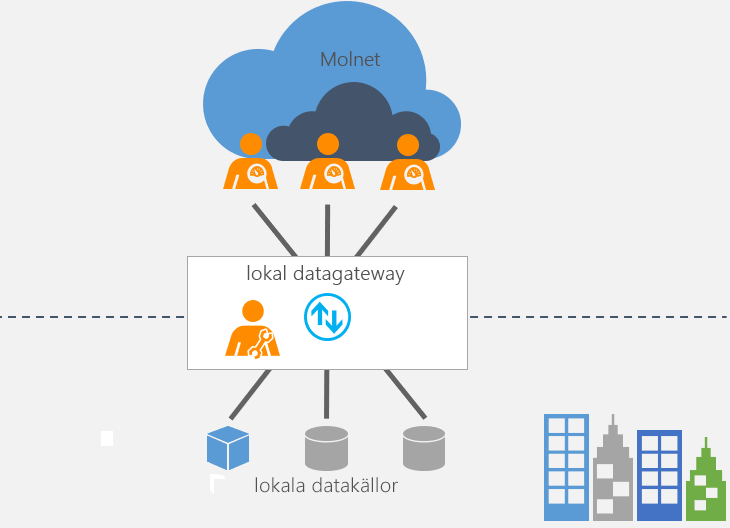

# Vad är en lokal datagateway?

[!INCLUDE [gateway-rewrite](../includes/gateway-rewrite.md)]

En lokal datagateway fungerar som en brygga med snabb och säker dataöverföring mellan lokala data (data som inte finns i molnet) och flera molntjänster från Microsoft. Dessa molntjänster omfattar Power BI, Power Apps, Power Automate, Azure Analysis Services och Azure Logic Apps. Genom att använda en gateway kan organisationer förvara databaser och andra datakällor i sina lokala nätverk, men ändå använda dessa lokala data i molntjänster.

## Så här fungerar gatewayen

Mer information om hur gatewayen fungerar finns i [Arkitektur för lokal datagateway](/data-integration/gateway/service-gateway-onprem-indepth).

## Typer av gatewayer

Det finns två olika typer av gatewayer för varsitt scenario:

* **Lokal datagateway** – flera användare kan ansluta till flera lokala datakällor. Du kan använda en lokal datagateway med alla tjänster som stöds, men en enda gatewayinstallation. Den här gatewayen är väl lämpad för komplexa scenarier där flera personer har åtkomst till flera olika datakällor.

* **Lokal datagateway (personligt läge)** – en användare kan ansluta till källor och kan inte delas med andra. En lokal datagateway (personligt läge) kan bara användas med Power BI. Den här gatewayen är väl lämpad för scenarier där du är den enda personen som skapar rapporter och du inte behöver datakällor med andra.

## Använda en gateway

Det finns fyra huvudsakliga steg för att använda en gateway.

1. [Ladda ned och installera gatewayen](/data-integration/gateway/service-gateway-install) på en lokal dator.
1. [Konfigurera](/data-integration/gateway/service-gateway-app) gatewayen utifrån brandväggen och andra nätverkskrav.
1. [Lägg till gatewayadministratörer](/data-integration/gateway/service-gateway-manage) som också kan hantera och administrera andra nätverkskrav.
1. [Använd gatewayen](service-gateway-sql-tutorial.md) till att uppdatera en lokal datakälla.
1. [Felsök](service-gateway-onprem-tshoot.md) gatewayen i händelse av fel.

## Nästa steg

* [Installera den lokala datagatewayen](/data-integration/gateway/service-gateway-install)

Fler frågor? [Prova Power BI Community](https://community.powerbi.com/)
