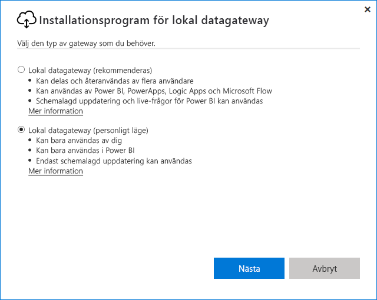

# <a name="use-personal-gateways-in-power-bi"></a>Använda personliga gatewayer i Power BI

[!INCLUDE [gateway-rewrite](../includes/gateway-rewrite.md)]

Lokal datagateway (personligt läge) är en version av den lokala datagatewayen som endast fungerar med Power BI. Du kan använda en personlig gateway om du vill installera en gateway på din egen dator och få tillgång till lokala data.

> [!NOTE]
> Du kan bara köra en gateway i personligt läge för varje Power BI-användare. Om du installerar en annan gateway i personligt läge för samma användare, även om det är på en annan dator, ersätter den senaste installationen den befintliga tidigare installationen.

## <a name="on-premises-data-gateway-vs-on-premises-data-gateway-personal-mode"></a>Lokal datagateway kontra lokal datagateway (personligt läge)

I följande tabell beskrivs skillnaderna mellan en lokal datagateway och en lokal datagateway (personligt läge).

|   |Lokal datagateway | Lokal datagateway (personligt läge) |
| ---- | ---- | ---- |
|Molntjänster som stöds |Power BI, PowerApps, Azure Logic Apps, Power Automate, Azure Analysis Services, dataflows |Power BI |
|Körningar |Enligt konfiguration av användare som har åtkomst till gatewayen |Som dig för Windows-autentisering och enligt konfiguration av dig för andra autentiseringstyper |
|Kan endast installeras som datoradministratör |Ja |Nej |
|Centraliserad gateway och hantering av datakällor |Ja |Nej |
|Importera data och schemalägg uppdatering |Ja |Ja |
|DirectQuery-stöd |Ja |Nej |
|LiveConnect-stöd för Analysis Services |Ja |Nej |

## <a name="install-the-on-premises-data-gateway-personal-mode"></a>Installera lokal datagateway (personligt läge)

Så här installerar du lokal datagateway (personligt läge):

1. [Ladda ned den lokala datagatewayen](https://go.microsoft.com/fwlink/?LinkId=820925&clcid=0x409).

2. I installationsprogrammet väljer du lokal datagateway (personligt läge) och sedan **Nästa**.

   

Gateway-filerna installeras i _"%localappdata%\Microsoft\Lokal datagateway (personligt läge)_ . När installationen har slutförts och du har loggat in visas följande skärm.


## <a name="use-fast-combine-with-the-personal-gateway"></a>Använda Kombinera snabbt med personlig gateway

Kombinera snabbt på en personlig gateway gör att du kan ignorera angivna sekretessnivåer medan du kör frågor. Så här gör du att Kombinera snabbt fungerar med lokal datagateway (personligt läge):

1. Öppna följande fil i Utforskaren:

   `%localappdata%\Microsoft\On-premises data gateway (personal mode)\Microsoft.PowerBI.DataMovement.Pipeline.GatewayCore.dll.config`

2. Lägg till följande text längst ned i filen:

    ```xml
    <setting name="EnableFastCombine" serializeAs="String">
       <value>true</value>
    </setting>
    ```

3. När det är klart börjar inställningen gälla efter cirka en minut. För att kontrollera att den fungerar kan du försöka att uppdatera på plats i Power BI-tjänsten och bekräfta att Kombinera snabbt fungerar.

## <a name="frequently-asked-questions-faq"></a>Vanliga frågor och svar

**Fråga:** Kan jag köra den lokala datagatewayen (personligt läge) sida vid sida med en lokal datagateway (kallades tidigare för företagsgatewayen)?
  
**Svar:** Ja, båda gatewayerna kan köras samtidigt.

**Fråga:** Kan jag köra lokal datagateway (personligt läge) som en tjänst?
  
**Svar:** Nej. Lokal datagateway (personligt läge) kan endast köras som ett program. Om du behöver köra gatewayen som en tjänst eller i adminläge bör du överväga en [lokal datagateway](/data-integration/gateway/service-gateway-onprem) (kallades tidigare för en företagsgateway).

**Fråga:** Hur ofta uppdateras lokal datagateway (personligt läge)?
  
**Svar:** Vi planerar att uppdatera din personliga gateway varje månad.

**Fråga:** Varför måste jag ange autentiseringsuppgifter?
  
**Svar:** Många situationer kan utlösa en begäran om autentiseringsuppgifter. Det vanligaste är att du har ominstallerat den lokala datagatewayen (personligt läge) på en annan dator än din Power BI Gateway – Personal. Det kan också vara ett problem i datakällan och Power BI kunde inte utföra en test-anslutning eller också uppstod ett avbrott eller systemfel. Om du vill uppdatera dina autentiseringsuppgifter i Power BI-tjänsten väljer du kugghjulsikonen och **Inställningar** > **Datauppsättningar**. Leta reda på datauppsättningen och välj **Datakällans autentiseringsuppgifter**.

**Fråga:** Hur länge kommer min tidigare personliga gateway vara offline under uppgraderingen?
  
**Svar:** Det tar bara ett par minuter att uppgradera den personliga gatewayen till den nya versionen.

**Fråga:** Jag använder R- och Python-skript. Stöds de?
  
**Svar:** R- och Python-skript stöds för personligt läge.

## <a name="next-steps"></a>Nästa steg

* [Konfigurera proxyinställningar för den lokala datagatewayen](/data-integration/gateway/service-gateway-proxy)  

Har du fler frågor? Testa [Power BI Community](https://community.powerbi.com/).
