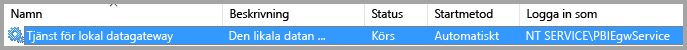
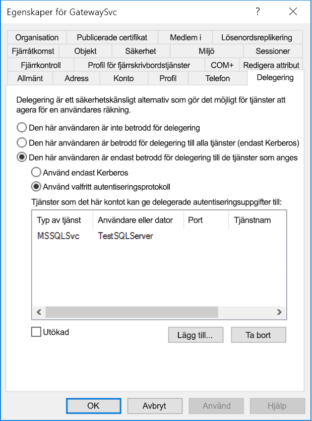
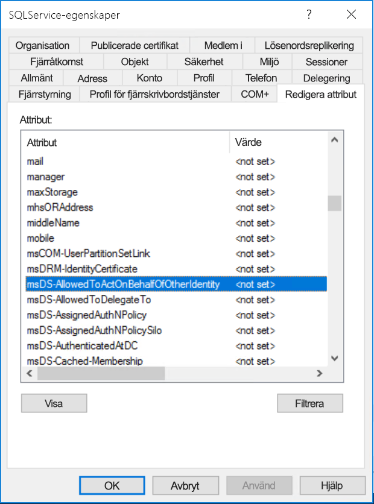
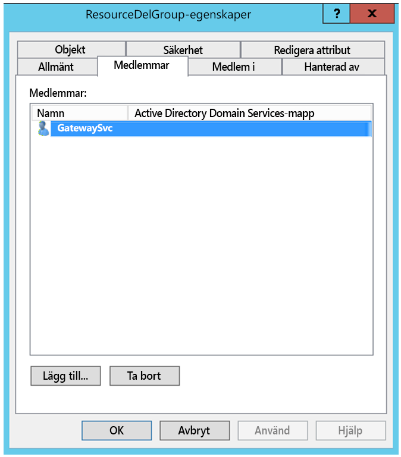
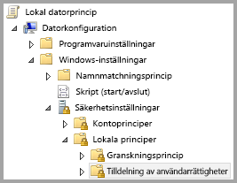
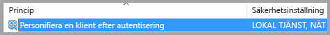
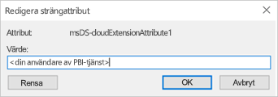

# <a name="configure-kerberos-based-sso-from-power-bi-service-to-on-premises-data-sources"></a>Konfigurera Kerberos-baserad enkel inloggning från Power BI-tjänsten till lokala datakällor

När enkel inloggning aktiveras blir det enkelt för Power BI-rapporter och instrumentpaneler att uppdatera data från lokala källor samtidigt som behörigheter på användarnivå på dessa källor respekteras. Använd [Kerberos-begränsad delegering](/windows-server/security/kerberos/kerberos-constrained-delegation-overview) för att aktivera sömlös anslutning med enkel inloggning. 

## <a name="prerequisites"></a>Förutsättningar

Flera objekt måste konfigureras för att Kerberos-begränsad delegering ska fungera korrekt, inklusive _Tjänsternas huvudnamn_ (SPN) och delegeringsinställningar för tjänstkonton.

### <a name="install-and-configure-the-microsoft-on-premises-data-gateway"></a>Installera och konfigurera den lokala Microsoft-datagatewayen

Den lokala datagatewayen stöder en uppgradering på plats samt _inställningsövertagande_ för befintliga gatewayer.

### <a name="run-the-gateway-windows-service-as-a-domain-account"></a>Kör gatewayens Windows-tjänst som ett domänkonto

I en standardinstallation körs gatewayen som ett lokalt tjänstkonto, **NT Service\PBIEgwService**.



För att aktivera Kerberos-begränsad delegering måste gatewayen köras som ett domänkonto, såvida inte din Azure Active Directory-instans redan har synkroniserats med din lokala Active Directory-instans (med Azure AD DirSync/Connect). Information om hur du växlar till ett domänkonto finns i [ändra gatewaytjänstkontot](/data-integration/gateway/service-gateway-service-account).

> [!NOTE]
> Om Azure AD Connect har konfigurerats och användarkonton har synkroniserats behöver inte gatewaytjänsten utföra några lokala Azure AD-sökningar vid körningen. I stället kan du helt enkelt använda lokalt tjänst-SID för gatewaytjänsten till att slutföra all nödvändig konfiguration i Azure AD. De konfigurationssteg för Kerberos-begränsad delegering som beskrivs i den här artikeln motsvarar de konfigurationssteg som krävs i Azure AD-kontexten. De tillämpas på gatewayens datorobjekt (enligt identifiering av lokalt tjänst-SID) i Azure AD, i stället för på domänkontot.

## <a name="obtain-domain-admin-rights-to-configure-spns-setspn-and-kerberos-constrained-delegation-settings"></a>Skaffa domänadministratörsbehörighet för att konfigurera SPN:er (SetSPN) och Kerberos-begränsade delegeringsinställningar

När det gäller att konfigurera inställningar för SPN och Kerberos-delegering bör inte domänadministratörer ge behörighet till någon som inte har administratörsbehörighet för domänen. I följande avsnitt beskriver vi de rekommenderade konfigurationsstegen i detalj.

## <a name="configure-kerberos-constrained-delegation-for-the-gateway-and-data-source"></a>Konfigurera Kerberos-begränsad delegering för gatewayen och datakällan

Om det behövs kan du konfigurera ett SPN för gatewaytjänstens domänkonto som domänadministratör och konfigurera delegeringsinställningar för gatewaytjänstens domänkonto.

### <a name="configure-an-spn-for-the-gateway-service-account"></a>Konfigurera ett SPN för gatewaytjänstkontot

Börja med att kontrollera om ett SPN redan har skapats för det domänkonto som används som gatewayens tjänstkonto:

1. Starta MMC-snapin-modulen **Active Directory - användare och datorer** som domänadministratör.

2. Högerklicka på domännamnet i den vänstra rutan, välj **Sök** och ange gatewaytjänstens kontonamn.

3. Högerklicka på gatewaytjänstens konto i sökresultatet och välj **Egenskaper**.

4. Om du ser fliken **Delegering** i dialogrutan **Egenskaper** har ett SPN redan skapats, och du kan gå vidare till [Välja typ av Kerberos-begränsad delegering](#decide-on-the-type-of-kerberos-constrained-delegation-to-use).

5. Om du inte ser fliken **Delegering** i dialogrutan **Egenskaper** kan du skapa ett SPN för kontot manuellt för att aktivera det. Använd [setspn-verktyget](https://technet.microsoft.com/library/cc731241.aspx) som medföljer Windows (du måste ha domänadministratörsbehörighet för att kunna skapa ett SPN).

   Anta till exempel att gatewaytjänstkontot är **Contoso\GatewaySvc** och att gatewaytjänsten körs på datorn **MyGatewayMachine**. Då skulle du ange SPN för gatewaytjänstkontot med följande kommando:

   ```setspn -a gateway/MyGatewayMachine Contoso\GatewaySvc```

   Ett sätt att ange SPN är med MMC-snapin-modulen **Active Directory - användare och datorer**.
   
### <a name="add-gateway-service-account-to-windows-authorization-and-access-group-if-required"></a>Lägg till gatewaytjänstkontot i auktoriserings- och åtkomstgruppen för Windows om det behövs

I vissa fall måste gatewaytjänstkontot läggas till i auktoriserings- och åtkomstgruppen för Windows. De här scenarierna omfattar säkerhetshärdning av Active Directory-miljön och när gatewaytjänstkontot och de användarkonton som gatewayen ska personifiera finns i separata domäner eller skogar. Du kan också lägga till gatewaytjänstkontot i auktoriserings- och åtkomstgruppen för Windows i situationer då domänen/skogen inte har härdats, men detta är inte obligatoriskt.

Mer information finns i [auktoriserings- och åtkomstgruppen för Windows](/windows/security/identity-protection/access-control/active-directory-security-groups#bkmk-winauthaccess).

För att slutföra det här konfigurationssteget för varje domän som innehåller Active Directory-användare som du vill att gatewaytjänstkontot ska kunna personifiera:
1. Logga in på en dator i domänen och starta MMC-snapin-modulen Active Directory-användare och -datorer.
2. Leta upp gruppen **auktoriserings- och åtkomstgruppen för Windows** som vanligtvis finns i containern **Builtin**.
3. Dubbelklicka på gruppen och klicka på fliken **Medlemmar**.
4. Klicka på **Lägg till**och ändra domänplatsen till den domän där gatewaytjänstkontot finns.
5. Ange kontonamnet för gatewaytjänsten och klicka på **Kontrollera namn** för att kontrollera att gatewaytjänstkontot är tillgängligt.
6. Klicka på **OK**.
7. Klicka på **Godkänn**.
8. Starta om gatewaytjänsten.

### <a name="decide-on-the-type-of-kerberos-constrained-delegation-to-use"></a>Bestäm vilken typ av Kerberos-begränsad delegering som ska användas

Du kan konfigurera delegeringsinställningar för antingen standardmässig eller resursbaserad Kerberos-begränsad delegering. Använd resursbaserad delegering (du behöver Windows Server 2012 eller senare) om datakällan tillhör en annan domän än din gateway. Mer information om skillnaderna mellan de två delegeringsmetoderna finns i artikeln [Översikt över Kerberos-begränsad delegering](/windows-server/security/kerberos/kerberos-constrained-delegation-overview).

 Fortsätt till något av följande avsnitt beroende på vilken metod du vill använda. Slutför inte båda avsnitten:
 - [Konfigurera gatewaytjänstkontot för standardmässig Kerberos-begränsad delegering](#configure-the-gateway-service-account-for-standard-kerberos-constrained-delegation)
- [Konfigurera gatewaytjänstkontot för resursbaserad Kerberos-begränsad delegering](#configure-the-gateway-service-account-for-resource-based-kerberos-constrained-delegation). 

## <a name="configure-the-gateway-service-account-for-standard-kerberos-constrained-delegation"></a>Konfigurera gatewaytjänstkontot för standardmässig Kerberos-begränsad delegering

> [!NOTE]
> Slutför stegen i det här avsnittet om du vill aktivera [standardmässig Kerberos-begränsad delegering](/windows-server/security/kerberos/kerberos-constrained-delegation-overview). Om du i stället vill aktivera resursbaserad Kerberos-begränsad delegering slutför du stegen i [Konfigurera gatewaytjänstkontot för resursbaserad Kerberos-begränsad delegering](#configure-the-gateway-service-account-for-resource-based-kerberos-constrained-delegation).

Nu anger vi delegeringsinställningarna för gatewaytjänstkontot. Det finns flera olika verktyg som du kan använda för att utföra dessa steg. Här använder vi MMC-snapin-modulen **Active Directory - användare och datorer** till att administrera och publicera information i katalogen. Den här modulen är tillgänglig som standard i domänkontrollanter, men du kan även aktivera den via konfiguration av Windows-funktionen på andra datorer.

Vi behöver konfigurera Kerberos-begränsad delegering med protokollövergång. Med begränsad delegering måste du uttryckligen ange vilka tjänster du vill tillåta att gatewayen presenterar delegerade autentiseringsuppgifter för. Till exempel accepterar endast SQL Server eller SAP HANA-servern delegeringsanrop från gatewayens tjänstkonto.

Det här avsnittet förutsätter att du redan har konfigurerat SPN:er för dina underliggande datakällor (till exempel SQL Server, SAP HANA, SAP BW, Teradata eller Spark). Du kan läsa om att konfigurera datakällservrarnas SPN i den tekniska dokumentationen för respektive databasserver och i avsnittet *Vilket SPN behöver din app?* i blogginlägget [Min checklista för Kerberos](https://techcommunity.microsoft.com/t5/SQL-Server-Support/My-Kerberos-Checklist-8230/ba-p/316160).

I följande steg förutsätter vi att det finns en lokal miljö med två datorer i samma domän: en gatewaydator och en databasserver som kör SQL Server som redan har konfigurerats för Kerberos-baserad enkel inloggning. Stegen kan användas för en av de andra datakällorna som stöds, förutsatt att datakällan redan har konfigurerats för Kerberos-baserad enkel inloggning. I det här exemplet använder vi följande inställningar:

* Active Directory-domän (NetBIOS): **Contoso**
* Gatewaydatorns namn: **MyGatewayMachine**
* Gatewaytjänstkonto: **Contoso\GatewaySvc**
* Datornamn för SQL Server-datakällan: **TestSQLServer**
* Tjänstkonto för SQL Server-datakällan: **Contoso\SQLService**

Så här konfigurerar du delegeringsinställningarna:

1. Öppna MMC-snapin-modulen **Active Directory - användare och datorer** med behörighet som domänadministratör.

2. Högerklicka på gatewaytjänstkontot (**Contoso\GatewaySvc**) och välj **Egenskaper**.

3. Välj fliken **delegering**.

4. Välj **Lita på den här datorn enbart för delegering till angivna tjänster** > **Använd valfritt autentiseringsprotokoll**.

5. Under **Tjänster som det här kontot kan ge delegerade autentiseringsuppgifter till** väljer du **Lägg till**.

6. I den nya dialogrutan väljer du **Användare eller datorer**.

7. Ange tjänstkontot för datakällan och välj sedan **OK**.

   En SQL Server-datakälla kan till exempel ha ett tjänstkonto som *Contoso\SQLService*. Ett lämpligt SPN för datakällan bör redan ha angetts för det här kontot. 

8. Välj det SPN som du skapade för databasservern. 

   I vårt exempel börjar SPN:et med *MSSQLSvc*. Om du har lagt till både FQDN- och NetBIOS-SPN:et för din databastjänst, väljer du båda. Du kanske bara ser ett av dem.

9. Välj **OK**. 

   Du bör nu se SPN i listan över tjänster som gatewaytjänstkontot kan ge delegerade autentiseringsuppgifter till.

    

10. Fortsätt med installationen genom att gå vidare till [Bevilja gatewaytjänstkontot lokala principrättigheter på gatewaydatorn](#grant-the-gateway-service-account-local-policy-rights-on-the-gateway-machine).

## <a name="configure-the-gateway-service-account-for-resource-based-kerberos-constrained-delegation"></a>Konfigurera gatewaytjänstkontot för resursbaserad Kerberos-begränsad delegering

> [!NOTE]
> Slutför stegen i det här avsnittet om du vill aktivera [resursbaserad Kerberos-begränsad delegering](/windows-server/security/kerberos/kerberos-constrained-delegation-overview#resource-based-constrained-delegation-across-domains). Om du i stället vill aktivera standardmässig Kerberos-begränsad delegering slutför du stegen i [Konfigurera gatewaytjänstkontot för standardmässig Kerberos-begränsad delegering](#configure-the-gateway-service-account-for-standard-kerberos-constrained-delegation).

Du använder [resursbaserad Kerberos-begränsad delegering](/windows-server/security/kerberos/kerberos-constrained-delegation-overview#resource-based-constrained-delegation-across-domains) till att aktivera anslutning med enkel inloggning för Windows Server 2012 och senare. Med den här typen av delegering kan tjänster i klientdelen och serverdelen ligga i olika domäner. För att det ska fungera så måste domänen med serverdelens tjänster lita på domänen med klientdelens tjänster.

I följande steg förutsätter vi att det finns en lokal miljö med två datorer i olika domäner: en gatewaydator och en databasserver som kör SQL Server som redan har konfigurerats för Kerberos-baserad enkel inloggning. Stegen kan användas för en av de andra datakällorna som stöds, förutsatt att datakällan redan har konfigurerats för Kerberos-baserad enkel inloggning. I det här exemplet använder vi följande inställningar:

* Active Directory-domän på klientsidan (NetBIOS): **ContosoFrontEnd**
* Active Directory-domän på serversidan (NetBIOS): **ContosoBackEnd**
* Gatewaydatorns namn: **MyGatewayMachine**
* Gatewaytjänstkonto: **ContosoFrontEnd\GatewaySvc**
* Datornamn för SQL Server-datakällan: **TestSQLServer**
* Tjänstkonto för SQL Server-datakällan: **ContosoBackEnd\SQLService**

Utför följande konfigurationssteg:

1. Använd MMC-snapin-modulen **Active Directory - användare och datorer** i domänkontrollanten för domänen **ContosoFrontEnd** och se till att inga delegeringsinställningar tillämpas för gatewaytjänstkontot.

    

2. Använd **Active Directory - användare och datorer** i domänkontrollanten för domänen **ContosoBackEnd** och se till att inga delegeringsinställningar tillämpas för kontot för serverdelens tjänster.

    

3. Öppna fliken **Redigera attribut** i kontoegenskaperna och kontrollera att attributet **msDS-AllowedToActOnBehalfOfOtherIdentity** inte är angivet.

    

4. Skapa en grupp i **Active Directory - användare och datorer** i domänkontrollanten för domänen **ContosoBackEnd**. Lägg till gatewaytjänstkontot **GatewaySvc** i gruppen **ResourceDelGroup**. 

    

5. Öppna en kommandotolk och kör följande kommandon i domänkontrollanten för domänen **ContosoBackEnd** för att uppdatera attributet **msDS-AllowedToActOnBehalfOfOtherIdentity** för serverdelstjänstkontot:

    ```powershell
    $c = Get-ADGroup ResourceDelGroup
    Set-ADUser SQLService -PrincipalsAllowedToDelegateToAccount $c
    ```

6. Öppna **Active Directory - användare och datorer** och kontrollera att uppdateringen återges på fliken **Redigera attribut** i egenskaperna för serverdelstjänstkontot. 

## <a name="grant-the-gateway-service-account-local-policy-rights-on-the-gateway-machine"></a>Bevilja gatewaytjänstkontot lokala principrättigheter på gatewaydatorn

På den dator som kör gatewaytjänsten (**MyGatewayMachine** i vårt exempel) ska du slutligen bevilja det lokala gatewaytjänstkontot den lokala principen **Personifiera en klient efter autentisering** samt **Agera som en del av operativsystemet (SeTcbPrivilege)** . Utför den här konfigurationen med Redigeraren för lokala grupprinciper (**gpedit.msc**).

1. Kör **gpedit.msc** på gatewaydatorn.

2. Gå till **Lokal datorprincip** &gt; **Datorkonfiguration** &gt; **Windows-inställningar** &gt; **Säkerhetsinställningar** &gt; **Lokala principer** &gt; **Tilldelning av användarrättigheter**.

    

3. I principlistan under **Tilldelning av användarrättigheter** väljer du **Personifiera en klient efter autentisering**.

    
    
4. Högerklicka på principen, öppna **Egenskaper** och visa listan med konton. 

    Listan måste innehålla gatewaytjänstkontot (**Contoso\GatewaySvc** eller **ContosoFrontEnd\GatewaySvc**, beroende på typen av begränsad delegering).

5. Under **Tilldelning av användarrättigheter** i listan med principer väljer du **Agera som del av operativsystemet (SeTcbPrivilege)** . Se till att gatewaytjänstkontot även finns med i listan med konton.

6. Starta om den **lokala datagatewaytjänsten**.

### <a name="set-user-mapping-configuration-parameters-on-the-gateway-machine-if-necessary"></a>Ange konfigurationsparametrar för användarmappning på gatewaydatorn (om det behövs)

Om du inte har konfigurerat Azure AD Connect följer du dessa steg för att mappa en Power BI-tjänstanvändare till en lokal Azure AD-användare. Varje Active Directory-användare som mappas på det här sättet måste ha behörigheter för enkel inloggning för din datakälla. Mer information finns i [Guy in a Cube-videon](https://www.youtube.com/watch?v=NG05PG9aiRw).

1. Öppna gatewayens huvudsakliga konfigurationsfil, Microsoft.PowerBI.DataMovement.Pipeline.GatewayCore.dll. Som standard finns den här filen på C:\Program Files\On-premises data gateway (Lokal datagateway).

1. Sätt **ADUserNameLookupProperty** till ett oanvänt Active Directory-attribut. Vi använder `msDS-cloudExtensionAttribute1` i följande steg. Det här attributet är bara tillgängligt i Windows Server 2012 och senare. 

1. Sätt **ADUserNameReplacementProperty** till `SAMAccountName` och spara sedan konfigurationsfilen.

1. På fliken **Tjänster** i Aktivitetshanteraren högerklickar du på gatewaytjänsten och väljer **Starta om**.

    

1. För varje Power BI-tjänstanvändare du vill aktivera enkel inloggning med Kerberos för sätter du egenskapen `msDS-cloudExtensionAttribute1` för den lokala Active Directory-användaren (med behörighet för enkel inloggning till din datakälla) till det fullständiga användarnamnet för Power BI-tjänstanvändaren. Om du till exempel loggar in på Power BI-tjänsten som test@contoso.com och vill mappa den här användaren till en lokal Active Directory-användare med behörighet för enkel inloggning, till exempel test@LOCALDOMAIN.COM, sätter du attributet `msDS-cloudExtensionAttribute1` för den här användaren till test@contoso.com.

    Du kan ställa in egenskapen `msDS-cloudExtensionAttribute1` med MMC-snapin-modulen Active Directory - användare och datorer:
    
    1. Starta **Active Directory-användare och datorer** som domänadministratör.
    
    1. Högerklicka på domännamnet, välj **Sök** och ange sedan kontonamnet för den lokala Active Directory-användare du vill mappa.
    
    1. Välj fliken **Redigera attribut**.
    
        Leta upp `msDS-cloudExtensionAttribute1`-egenskapen och dubbelklicka på den. Sätt värdet till det fullständiga användarnamnet (UPN) för den användare du använder för att logga in i Power BI-tjänsten.
    
    1. Välj **OK**.
    
        
    
    1. Välj **Tillämpa**. Kontrollera att rätt värde har angetts i kolumnen **Värde**.

## <a name="complete-data-source-specific-configuration-steps"></a>Slutför de datakällsspecifika konfigurationsstegen

SAP HANA och SAP BW har ytterligare datakällsspecifika konfigurationskrav och förutsättningar som behöver uppfyllas innan du kan upprätta en anslutning med enkel inloggning via gatewayen till dessa datakällor. Mer information finns på [sidan för SAP HANA-konfiguration](service-gateway-sso-kerberos-sap-hana.md) och [sidan för konfiguration av SAP BW – CommonCryptoLib (sapcrypto.dll)](service-gateway-sso-kerberos-sap-bw-commoncryptolib.md). Även om du kan [konfigurera SAP BW för användning med SNC-biblioteket gx64krb5](service-gateway-sso-kerberos-sap-bw-gx64krb.md) så rekommenderas inte det här biblioteket eftersom det inte längre stöds av SAP. Du bör använda CommonCryptoLib _eller_ gx64krb5 som SNC-bibliotek. Slutför inte konfigurationsstegen för båda biblioteken.

> [!NOTE]
> Även om andra SNC-bibliotek också kan fungera för BW SSO så stöds de inte officiellt av Microsoft.

## <a name="run-a-power-bi-report"></a>Köra en Power BI-rapport

När du har slutfört alla konfigurationssteg kan du använda sidan **Hantera gateway** i Power BI till att konfigurera datakällan för SSO-användning. Om du har flera gatewayer ska du välja den gateway som du har konfigurerat för enkel inloggning med Kerberos. Under **Avancerade inställningar** för datakällan ser du sedan till att **Använd SSO via Kerberos för DirectQuery-frågor** eller **Använd SSO via Kerberos för DirectQuery och importera frågor** är markerat för DirectQuery-baserade rapporter och **Använd SSO via Kerberos för DirectQuery och importera frågor** är markerat för uppdateringsbaserade rapporter.


Om du publicerar en DirectQuery-baserad rapport från Power BI Desktop och mappar den till en datakälla som har **Använd SSO via Kerberos för DirectQuery-frågor** eller **Använd SSO via Kerberos för DirectQuery och importera frågor** markerad använder den här rapporten data som är tillgängliga för den användare som är mappad till Active Directory-användaren i Azure som loggar in i Power BI-tjänsten.

Om du publicerar en uppdateringsbaserad rapport från Power BI Desktop och mappar den till en datakälla som har **Använd SSO via Kerberos för DirectQuery och importera frågor** markerat behöver du inte heller ange några autentiseringsuppgifter. Uppdateringen körs under datamängdens ägares Active Directory-kontext.

Om du däremot mappar den till en datakälla där **Använd SSO via Kerberos för DirectQuery och importera frågor** inte är markerat använder uppdateringen de autentiseringsuppgifter du angav i fälten **Användarnamn** och **Lösenord** när du skapade datakällan. Med andra ord används *inte* enkel inloggning med Kerberos. 

 När du publicerar ska du välja den gateway du har konfigurerat för enkel inloggning om du har flera gatewayer. 

Den här konfigurationen fungerar i de flesta fall. Med Kerberos kan det dock förekomma olika konfigurationer beroende på din miljö. Om rapporten inte kan läsas in ska du kontakta domänadministratören för att undersöka saken vidare. Om din datakälla är SAP BW kan du läsa felsökningsavsnitten på de datakällsspecifika konfigurationssidorna för [CommonCryptoLib](service-gateway-sso-kerberos-sap-bw-commoncryptolib.md#troubleshooting) och [gx64krb5/gsskrb5](service-gateway-sso-kerberos-sap-bw-gx64krb.md#troubleshooting), beroende på vilket SNC-bibliotek du har valt.

## <a name="next-steps"></a>Nästa steg

Du kan läsa mer om den lokala datagatewayen och DirectQuery i de här resurserna:

* [Vad är en lokal datagateway?](/data-integration/gateway/service-gateway-onprem)
* [DirectQuery i Power BI](desktop-directquery-about.md)
* [Datakällor som stöds av DirectQuery](power-bi-data-sources.md)
* [DirectQuery och SAP BW](desktop-directquery-sap-bw.md)
* [DirectQuery och SAP HANA](desktop-directquery-sap-hana.md)
