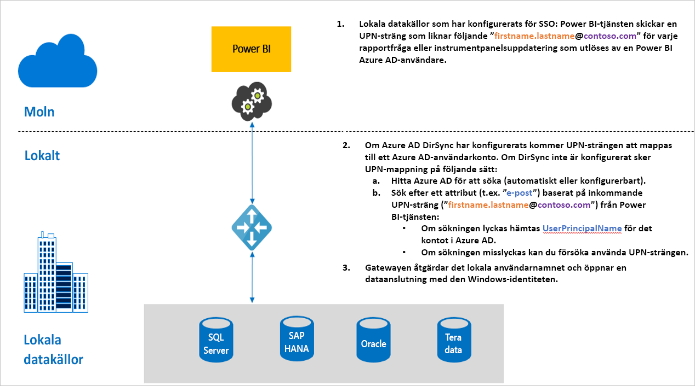

# Översikt över enkel inloggning (SSO) för gatewayer i Power BI

Du kan få en smidig anslutning med enkel inloggning så att rapporter och instrumentpaneler i Power BI kan uppdateras med lokala data i realtid, genom att du konfigurerar din lokala datagateway. Du kan välja att konfigurera din gateway med antingen [Kerberos](service-gateway-sso-kerberos.md)-begränsad delegering eller Security Assertion Markup Language ([SAML](service-gateway-sso-saml.md)). Den lokala datagatewayen har stöd för enkel inloggning med hjälp av [DirectQuery](desktop-directquery-about.md) eller uppdatering, som ansluter till lokala datakällor. 

Power BI har stöd för följande datakällor:

* SQL Server (Kerberos)
* SAP HANA (Kerberos och SAML)
* SAP BW Application Server (Kerberos)
* SAP BW-meddelandeserver (Kerberos) 
* Oracle (Kerberos) 
* Teradata (Kerberos)
* Spark (Kerberos)
* Impala (Kerberos)

Enkel inloggnings stöds för närvarande inte för [M-tillägg](https://github.com/microsoft/DataConnectors/blob/master/docs/m-extensions.md).

När en användare interagerar med en DirectQuery-rapport i Power BI-tjänsten så kan varje åtgärd relaterad till korsfiltrering, utsnitt, sortering och rapportredigering resultera i frågor som körs i realtid mot den underliggande lokala datakällan. När du konfigurerar enkel inloggning för datakällan körs frågorna under identiteten för den användare som interagerar med Power BI (det vill säga via webbläsaren eller Power BI-mobilappen). Det innebär att alla användare ser precis de data från den underliggande datakällan som de har behörighet för. 

Du kan också konfigurera att en rapport som är förberedd för uppdatering i Power BI-tjänsten ska använda SSO. När du konfigurerar SSO för den här datakällan körs frågor med datamängdsägarens identitet i Power BI. Uppdateringen görs därför utifrån datamängdsägarens behörigheter för den underliggande datakällan. Uppdatering med SSO är för närvarande bara aktiverat för datakällor som använder begränsad delegering i [Kerberos](service-gateway-sso-kerberos.md) 

## Frågesteg vid körning av enkel inloggning

En fråga som körs med SSO (enkel inloggning) består av tre steg, vilket visas i följande diagram.

Här visas mer information om respektive steg:

1. För varje fråga inkluderar Power BI-tjänsten *användarens huvudnamn (UPN)* , som är det fullständiga kvalificerade namnet för användaren som för närvarande är inloggad i Power BI-tjänsten, när en frågebegäran skickas till den konfigurerade gatewayen.

2. Gatewayen måste mappa UPN-namnet i Microsoft Azure Active Directory till en lokal Active Directory-identitet:

   a. Om Azure AD DirSync (även kallat *Azure AD Connect*) har konfigurerats fungerar mappningen automatiskt i gatewayen.

   b.  I annat fall kan gatewayen söka upp och mappa Microsoft Azure AD UPN:en till en lokal AD-användare genom att utföra en sökning mot den lokala Active Directory-domänen.

3. Gatewaytjänstprocessen personifierar den mappade lokala användaren, öppnar anslutningen till den underliggande databasen och skickar sedan frågan. Du behöver inte installera gatewayen på samma dator som databasen.

## Nästa steg

Nu när du förstår grunderna angående att aktivera enkel inloggning via gatewayen kan du läsa mer detaljerad information om Kerberos och SAML:

* [Enkel inloggning (SSO) – Kerberos](service-gateway-sso-kerberos.md)
* [Enkel inloggning (SSO) – SAML](service-gateway-sso-saml.md)
