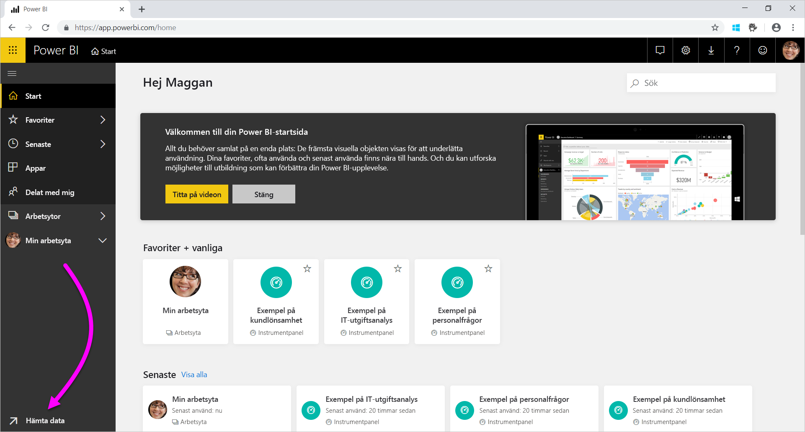
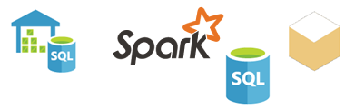

# Datakällor för Power BI-tjänsten
Datan finns centralt i Power BI. Vi antar att du utforskar data. Det kan du göra genom att skapa diagram och instrumentpaneler eller genom att ställa frågor med **Q&A**. De visualiseringar och svar du ser får sina underliggande data från en datamängd. Men var kommer datauppsättningen från? Jo, den kommer från en datakälla.

I den här artikeln ska vi gå igenom de olika typer av datakällor du kan ansluta till från Power BI-tjänsten. Kom ihåg att det även finns många andra typer av datakällor som du kan hämta data från. Om du väljer dessa datakällor kan du behöva använda Power BI Desktop eller Excels avancerade datafrågor och modelleringsfunktioner först. Vi går igenom det senare. Just nu ska vi titta på de olika typer av datakällor som är tillgängliga direkt från Power BI-tjänstens webbplats.

Du kan hämta data från alla de här datakällorna i Power BI genom att välja **Hämta data** nere till vänster på sidan.

 

När du har valt **Hämta data** kan du välja vilka data du vill använda

## Upptäck innehåll

I avsnittet **Upptäck innehåll** hittar du alla data och rapporter du behöver, och de har redan förberetts åt dig. Det finns två typer av innehållspaket i Power BI: Organisation och Tjänster. 

**Organisation**: Om du och andra användare i organisationen har ett Power BI Pro-konto kan du skapa, dela och använda innehållspaket. Läs mer i [Introduktion till organisationsinnehållspaket](../collaborate-share/service-organizational-content-pack-introduction.md).

**Tjänster**: Det finns bokstavligt talat dussintals tjänster med innehållspaket för Power BI och fler läggs hela tiden. För de flesta tjänster måste du ha ett konto. Läs mer i [Ansluta till tjänster du använder med Power BI](service-connect-to-services.md).

## Skapa nytt innehåll

I avsnittet **Skapa nytt innehåll** hittar du alternativ för att skapa och importera innehåll själv. Det finns två sätt att skapa eller importera eget innehåll i Power BI: Filer och Databaser. 

### Filer

**Excel** ( *.xlsx*, *.xlsm*) – I Excel kan en arbetsbok innehålla olika datatyper. Den kan till exempel innehålla data som du har lagt in i kalkylbladen själv. Den kan även innehålla data som du har kört frågor om och läst in från externa datakällor med Power Query. Power Query är tillgängligt via **Hämta & transformera** i Excel 2016 eller Power Pivot. Du kan importera data från tabeller i kalkylblad eller från en datamodell. Mer information finns i [Hämta data från filer för Power BI](service-get-data-from-files.md).

**Power BI Desktop** ( *.pbix*) – Du kan använda Power BI Desktop till att köra frågor mot och läsa in data från externa datakällor och skapa rapporter. Du kan också utöka datamodellen med mått och relationer eller importera din Power BI Desktop-fil till Power BI-webbplatsen. Power BI Desktop passar bäst för mer avancerade användare. Sådana användare har normalt god förståelse för sina datakällor. De förstår också datafrågor och transformeringar samt de begrepp som används inom datamodellering. Läs mer i [Ansluta till data i Power BI Desktop](desktop-connect-to-data.md).

**Kommaavgränsat värde** ( *.csv*) – De här filerna är enkla textfiler med datarader. Varje rad kan innehålla ett eller flera värden som är avgränsade med kommatecken. En *.csv*-fil med namn och adresser kan till exempel innehålla många rader. Varje rad kan innehålla värden för förnamn, efternamn, gatuadress, ort, kommun och så vidare. Du kan inte importera data till en *.csv*-fil, men många program som exempelvis Excel kan spara enkla tabelldata som *.csv*-filer.

För andra filtyper som XML-tabeller ( *.xml*) eller textfiler ( *.txt*), kan du använda **Hämta och transformera** till att köra frågor mot, transformera och läsa in data till en Excel- eller Power BI Desktop-fil först. Du kan sedan importera Excel- eller Power BI Desktop-filen till Power BI.

Var du lagrar dina filer gör också en stor skillnad. OneDrive för företag erbjuder störst flexibilitet och integrering med Power BI. Det är OK om du vill spara filerna lokalt. Om du behöver uppdatera dina data krävs dock några extra steg. Du kan läsa mer i artikellänkarna nedan.

### Databaser

**Databaser i molnet** – Från Power BI-tjänsten kan du liveansluta till:

* Azure SQL Database
* Azure SQL Data Warehouse
* Spark på Azure HDInsight

Anslutningar från Power BI till dessa databaser sker live. Vi antar att du ansluter till Azure SQL Database. Sedan börjar du utforska data genom att skapa rapporter i Power BI. När du gör utsnitt av dina data eller lägger till ytterligare ett fält i en visualisering skickar Power BI en fråga direkt till databasen. Läs mer i [Azure och Power BI](service-azure-and-power-bi.md).

**Databaser lokalt** – Från Power BI-tjänsten kan du ansluta direkt till tabellmodelldatabaser i SQL Server Analysis Services. Om du vill göra det behöver du en Power BI Enterprise-gateway. Om du är osäker på hur du ansluter till organisationens tabellmodelldatabas tar du kontakt med din administratör eller IT-avdelning. Läs mer i [SQL Server Analysis Services-realtidsdata i Power BI](sql-server-analysis-services-tabular-data.md).

För andra typer av databaser i organisationen måste du först använda Power BI Desktop eller Excel för att ansluta till, köra frågor mot och läsa in data i en datamodell. Sedan kan du importera filen till Power BI där du har en datamängd. Om du har konfigurerat schemalagd uppdatering använder Power BI konfigurationen och anslutningsinformationen från filen till att ansluta direkt till datakällan och fråga efter uppdateringar. Power BI läser sedan in uppdateringarna i datamängden. Läs mer i [Ansluta till data i Power BI Desktop](desktop-connect-to-data.md).

## Vad gör jag om mina data kommer från en annan källa?
Det finns hundratals olika datakällor som du kan använda med Power BI. Oavsett var du hämtar data från så måste data vara i ett format som Power BI-tjänsten kan hantera. Om du har data i ett giltigt format kan Power BI-tjänsten skapa rapporter och instrumentpaneler, besvara frågor med **Q&A** och så vidare.

Vissa datakällor har redan data som är formaterade för Power BI-tjänsten. Sådana källor fungerar som innehållspaket från tjänstleverantörer som Google Analytics och Twilio. Tabellmodelldatabaser i SQL Server Analysis Services kan också användas. Du kan även ansluta live till databaser i molnet som Azure SQL Database och Spark i HDInsight.

I andra fall kan det vara nödvändigt att fråga efter och läsa in de data som du vill använda i en fil. Anta till exempel att du har logistikdata i organisationen. Du kan lagra dessa data i en informationslagerdatabas på en server. Du kan inte ansluta direkt till databasen i Power BI-tjänsten för att utforska dina data om det inte är en tabellmodelldatabas. Du kan däremot använda Power BI Desktop eller Excel till att köra frågor mot och läsa in dina logistikdata i en datamodell som du sedan sparar som en fil. Därefter kan du importera filen till Power BI där du har en datamängd.

Du tänker förmodligen att ”Logistikdata i den databasen ändras ju varje dag. Hur uppdaterar jag min Power BI-datamängd?” När du importerar data till datamängden importerar du även anslutningsinformationen från antingen Power BI Desktop- eller Excel-filen.

Vi antar att du konfigurerar en schemalagd uppdatering eller uppdaterar datamängden manuellt. Power BI använder anslutningsinformationen från datamängden tillsammans med några andra inställningar för att ansluta direkt till databasen. Sedan körs en fråga om uppdateringar och uppdateringarna läses in i datamängden. Du behöver förmodligen en Power BI-gateway för att skydda dataöverföringen mellan din lokala server och Power BI. När överföringen är färdig uppdateras alla visualiseringar i rapporter och på instrumentpaneler automatiskt.

Bara för att du inte kan ansluta till din datakälla direkt från Power BI-tjänsten så kan du fortfarande hämta dessa data till Power BI. Det krävs bara några fler steg och kanske viss hjälp från IT-avdelningen. Se [Datakällor i Power BI Desktop](desktop-data-sources.md) om du vill veta mer.

## Visa mer information
Du har säkert sett att termerna datauppsättning och datakälla används mycket i Power BI. De används ofta som synonymer. Fast även om de är relaterade så är de inte samma sak.

Du skapar en **datamängd** automatiskt i Power BI när du använder **Hämta data**. Med **Hämta data** ansluter du till och importerar data från ett innehållspaket, en fil eller via en livedatakälla. En datamängd innehåller information om datakällan och datakällans autentiseringsuppgifter. I många fall innehåller den även en delmängd data som kopieras från datakällan. När du skapar visualiseringar i rapporter och på instrumentpaneler tittar du ofta på data i datamängden.

En **datakälla** är den plats där data i en datamängd kommer från. Data kan till exempel komma från:

* En onlinetjänst som Google Analytics eller QuickBooks
* En databas i molnet som Azure SQL Database
* En databas eller fil som lagras lokalt på en dator eller server i organisationen

## Datauppdatering
Du kanske sparar filer lokalt eller på en enhet någonstans i organisationen. Du kan behöva en Power BI-gateway så att du kan uppdatera datamängden i Power BI. Datorn där filen lagras måste vara igång när en uppdatering görs. Du kan importera filen på nytt eller använda Publicera från Excel eller Power BI Desktop, men de här alternativen är inte automatiserade processer.

Om du sparar filer på OneDrive för företag eller SharePoint – gruppwebbplatser kan du ansluta till eller importera dem till Power BI. Då är din datamängd, dina rapporter och instrumentpaneler alltid uppdaterade. Eftersom både OneDrive och Power BI finns i molnet kan Power BI ansluta direkt till den sparade filen. Power BI ansluter ungefär en gång i timmen och söker efter uppdateringar. Datamängden och alla visualiseringar uppdateras automatiskt om det finns några uppdateringar.

Innehållspaket från tjänster uppdateras automatiskt. I de flesta fall uppdateras de en gång om dagen. Du kan uppdatera manuellt, men om du ser några uppdaterade data beror på tjänstleverantören. Uppdateringar av innehållspaket från personer i organisationen beror på vilka datakällor som används. De beror även på hur personen som skapade innehållspaketet har konfigurerat uppdateringen.

Azure SQL Database, Azure SQL Data Warehouse och Spark på Azure HDInsight är datakällor i molnet. Power BI-tjänsten finns också i molnet, så Power BI kan ansluta till de här datakällorna live via **DirectQuery**. Det du ser i Power BI är alltid synkroniserat och du behöver inte konfigurera någon schemalagd uppdatering.

När du ansluter till SQL Server Analysis Services från Power BI är det en liveanslutning precis som en Azure-databas i molnet. Skillnaden är själva databasen ligger på en server i organisationen. För den här typen av anslutning behöver du en Power BI-gateway, som normalt konfigureras av IT-avdelningen.

Datauppdatering är en mycket viktig del av Power BI och det blir för mycket att gå igenom allt här. Om du vill ha en djupare kunskap kan du läsa mer i [Datauppdatering i Power BI](refresh-data.md).

## Överväganden och begränsningar
Följande begränsningar gäller för alla datakällor som används i Power BI-tjänsten. Det finns andra begränsningar som gäller för specifika funktioner, men listan nedan gäller för hela Power BI-tjänsten:

* **Storleksgräns för datamängder** – Det finns en storleksgräns på 1 GB för datamängder som lagras i delade kapaciteter i Power BI-tjänsten. Om du behöver större datamängder kan du använda [Power BI Premium](../admin/service-premium-what-is.md).

* **Distinkta värden i en kolumn**  – När data cachelagras i en Power BI-datamängd (kallas ibland ”importläge”), finns det en gräns på 1 999 999 997 för antalet distinkta värden som kan lagras i en kolumn.

* **Radgräns**  – När du använder **DirectQuery** har Power BI en gräns för frågeresultaten som skickas till den underliggande datakällan. Om frågan som skickas till datakällan returnerar fler än en miljon rader visas ett felmeddelande och frågan misslyckas. Dina underliggande data kan ändå innehålla fler än en miljon rader. Det är inte säkert att du uppnår den här gränsen eftersom de flesta rapporter sammanställer datan till mindre resultatuppsättningar.

* **Gräns för antal kolumner** – det maximala antalet kolumner som tillåts i en datamängd för alla tabeller i datamängden är 16 000. Den här gränsen gäller för Power BI-tjänsten och för datamängder som används i Power BI Desktop. Power BI spårar antalet kolumner och tabeller i datamängden på det här sättet, så det maximala antalet kolumner är 16 000 minus ett för varje tabell i datamängden.
