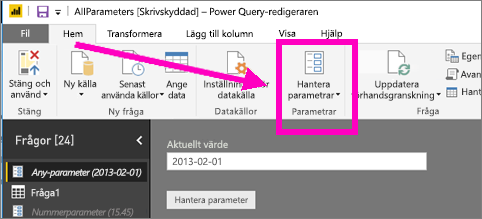
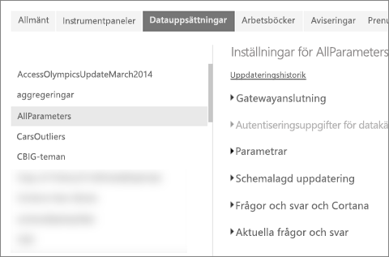

# Redigera parameterinställningar i Power BI-tjänsten
Rapportskapare lägger till i frågeparametrar till rapporter i Power BI Desktop. Med parametrar kan de göra så att delar av en rapport är beroende av en eller flera *parametervärden*. Rapportens skapare kan till exempel skapa en parameter som begränsar data till ett land/en region, eller en parameter som definierar godkända format för fält som datum, tid och text.

## Granska och redigera parametrar i Power BI-tjänsten

Som rapportskapare definierar du parametrar i Desktop. När du [publicerar rapporten till Power BI-tjänsten](../create-reports/desktop-upload-desktop-files.md) flyttas parameterinställningar och val med den. Du kan granska och redigera vissa parameterinställningar i Power BI-tjänsten – inte parametrar som begränsar tillgängliga data, men däremot de parametrar som definierar och beskriver godkända värden.

1. Välj kugghjulsikonen i Power BI-tjänsten  för att öppna **Inställningar**.

2. Välj fliken **Datauppsättningar** och markera en datauppsättning i listan. 
    
    

3. Expandera **Parametrar**.  Om den valda datauppsättningen inte har några parametrar, visas ett meddelande med en länk till mer information om frågeparametrar. Om datauppsättningen har parametrar visas dessa när rubriken **Parametrar** expanderas. 

    

    Granska parameterinställningarna och gör ändringar om det behövs. Gråtonade fält kan inte redigeras. 

## Nästa steg
Ett ad hoc-sätt att lägga till enkla parametrar är att [ändra URL:en](../collaborate-share/service-url-filters.md).