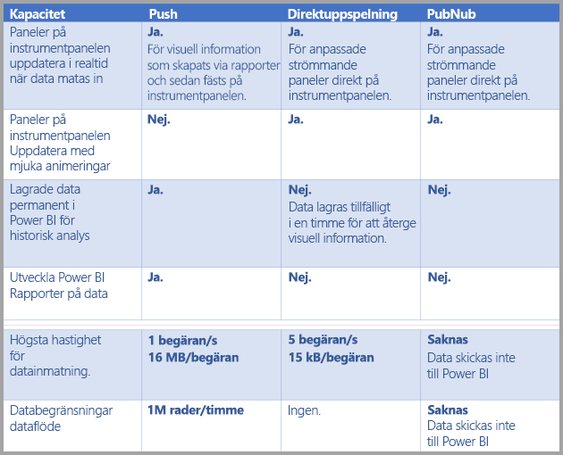
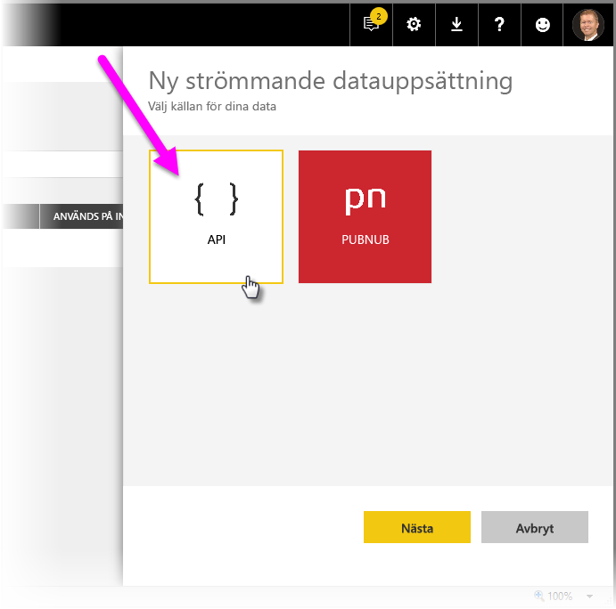
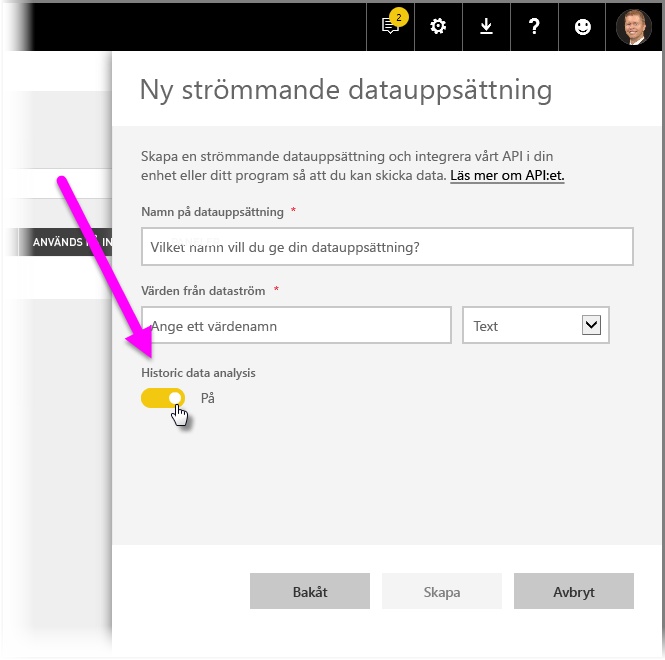
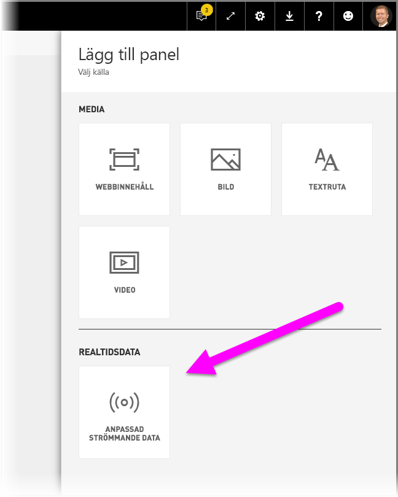
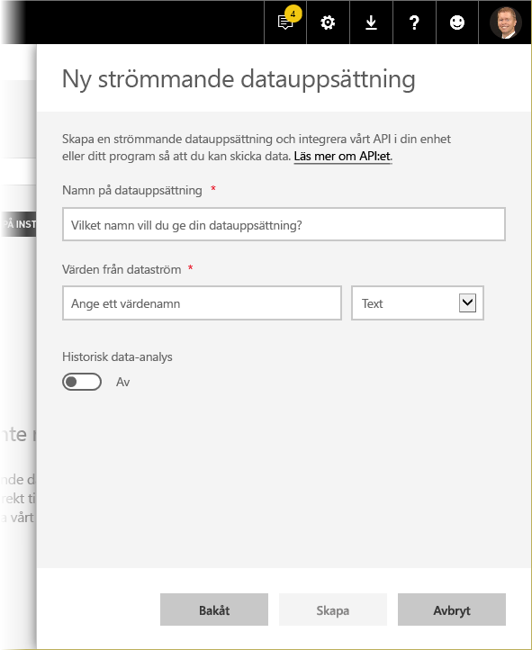
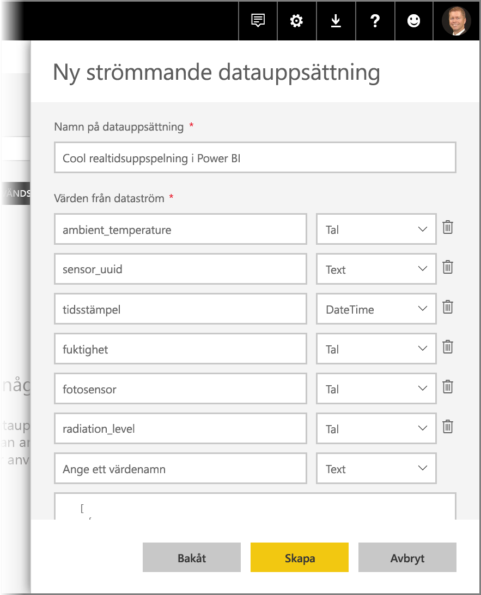

# Realtidsuppspelning i Power BI
Med direktuppspelning i realtid för Power BI, kan du strömma data och uppdatera instrumentpaneler i realtid. Visuella objekt och instrumentpaneler som skapas i Power BI kan visa och uppdatera data och visuella objekt i realtid. Enheter och datakällor för strömmande data kan vara fabrikssensorer, sociala mediekällor, tjänstanvändningsmått och många andra insamlare och överförare av tidskänsliga data.

Den här artikeln visar hur man ställer in en strömmande datauppsättning i realtid i Power BI. För det första är det viktigt att förstå de typer av datamängder i realtid som har skapats att visas i paneler (och instrumentpaneler) och hur dessa datamängder skiljer sig åt.

## Typer av datauppsättningar i realtid
Det finns tre typer av datamängder i realtid som skapats för visning på instrumentpaneler i realtid:

* Push-datauppsättning
* Strömmande datauppsättning
* PubNub-strömmande datauppsättning

Först ska vi gå igenom hur de här datauppsättningarna skiljer sig från varandra (det här avsnittet), därefter ska vi prata om hur man pushar data in i de olika datauppsättningarna.

### Push-datauppsättning
Med en **push-datauppsättning**, pushas data till Power BI-tjänsten. När datauppsättningen skapas, skapar Power BI-tjänsten automatiskt en ny databas i tjänsten för att lagra data. Eftersom det finns en underliggande databas som fortsätter att lagra data allteftersom de kommer in, kan rapporter skapas med dessa data. Rapporterna och deras visuella objekt är precis som alla andra visuella rapportobjekt, vilket innebär att du kan använda alla Power BI:s funktioner för rapportskapande för att skapa visuella objekt, inklusive visuella objekt från Power BI, dataaviseringar, fästa instrumentpaneler och mycket mer.

När du skapar en rapport med push-datauppsättningen kan du fästa dess visuella objekt på en instrumentpanel. På den visualiseringen uppdateras sedan visualiseringarna i realtid närhelst data uppdateras. Inom tjänsten, utlöser instrumentpanelen en uppdateringen av panelen varje gång nya data tas emot.

Det finns två saker att tänka på med fästa paneler från en push-datauppsättning:

* Om du fäster en hel rapport med alternativet *fäst live-sida* så resulterar det **inte** i att data uppdateras automatiskt.
* När en visualisering har fästs på en instrumentpanel, kan du använda **frågor och svar** för att ställa frågor till push-datauppsättningen på naturligt språk. När du ställer en **frågor och svar**-fråga, kan du fästa tillbaka den resulterande visualiseringen till instrumentpanelen och instrumentpanelen kommer *också* uppdateras i realtid.

### Strömmande datauppsättning
Med en **strömmande datauppsättning** pushas data också till Power BI-tjänsten med en viktig skillnad: Power BI lagrar endast data i ett tillfälligt cacheminne som snabbt förfaller. Det tillfälliga cacheminnet används bara för att visa visuella objekt med en tillfällig historisk information, till exempel ett linjediagram med ett tidsfönster på en timma.

Med en **strömmande datauppsättning**, finns det *ingen* underliggande databas så du *kan* skapa rapportvisualiseringar med data som flödar in från strömmen. Du kan inte använda rapportfunktionaliteter som filtrering, visuella Power BI-objekt och andra rapportfunktioner.

Det enda sättet du kan visualisera en strömmande datamängd på är att lägga till en panel och använda den strömmande datamängden som en **anpassad strömmande datakälla**. De anpassade strömmande panelerna som baseras på en **strömmande datauppsättning** är optimerade för att snabbt visa data i realtid. Det är låg fördröjning mellan när data pushas till Power BI-tjänsten och när det visuella objektet uppdateras, eftersom inga data behöver matas in i eller läsas från en databas.

I praktiken är strömmande datauppsättningar och deras tillhörande strömmande visuella information bäst i situationer när det är viktigt att minimera fördröjning mellan när data pushas och visualiseras. Dessutom är det praxis att pusha data i ett format som kan visualiseras som det är utan ytterligare tillägg. Exempel på data som är klar som de är inkluderar temperaturer och förberäknade genomsnitt.

### PubNub-strömmande datauppsättning
Med en **PubNub** strömmande datamängd använder Power BI-webbklienten sig av PubNub SDK:n för att läsa en befintlig PubNub-dataström. Power BI-tjänst lagrar inte några data. Eftersom det här anropet görs direkt från webbklienten skulle du behöva lista trafik till PubNub som tillåten om du endast tillåter vitlistad utgående trafik från nätverket. Läs anvisningarna i supportartikeln om [Vitlistning av utgående trafik för PubNub](https://support.pubnub.com/support/solutions/articles/14000043522-can-i-whitelist-ips-for-pubnub-traffic-).

Precis som med den **strömmande datauppsättningen** så har den **PubNub-strömmande datauppsättningen** ingen underliggande databas i Power BI. Det går därmed inte att skapa rapportvisualiseringar mot de data som flödar in och du kan inte dra nytta av rapportfunktioner som filtrering, visuella Power BI-objekt och så vidare. Därmed kan den **PubNub-strömmande datauppsättningen** också bara visualiseras genom att lägga till en panel på instrumentpanelen och konfigurera en PubNub-dataström som källa.

Paneler baserade på en **PubNub-strömmande datauppsättning** är optimerade för att snabbt visa data i realtid. Eftersom Power BI är direkt ansluten till PubNub-dataströmmen, finns det låg fördröjning mellan när data pushas till Power BI-tjänsten och när det visuella objektet uppdateras.

### Matris över strömmande datauppsättningar
Följande tabell (eller matris, om du vill) beskriver de tre typerna av datauppsättningar för strömning i realtid listar deras funktioner och begränsningar.

> [!NOTE]
> Se [den här artikeln](../developer/automation/api-rest-api-limitations.md) för information om **push**-begränsningar för hur mycket data som kan pushas in.

## Skickar data till datauppsättningar
I föregående avsnitt beskrevs de tre primära typerna av datauppsättningar i realtid som du kan använda för realtidsströmning samt hur de skiljer sig åt. Det här avsnittet beskriver hur man skapar och pushar data till de datauppsättningarna.

Det finns tre primära sätt som du kan pusha data till en datauppsättning:

* Med Power BI REST-API:er
* Med hjälp av användargränssnittet för strömmande datauppsättningar
* Använd Azure Stream Analytics

Låt oss ta en titt på var och en av dessa metoder.

### Använd Power BI REST API:er för att pusha data
Du kan använda **Power BI REST-API:er** till att skapa och skicka data till **push**-datauppsättningar och **strömmande** datauppsättningar. När du skapar en datauppsättning med Power BI REST API:er, anger flaggan *defaultMode* om datauppsättningen är push eller strömmande. Om ingen *defaultMode*-flagga har angetts, blir datauppsättningen **push** som standard.

Om värdet *defaultMode* är satt till *pushStreaming* så är datauppsättningen både **push-baserad** *och* **strömmande**, vilket ger dig bägge datauppsättningstypernas fördelar. 

> [!NOTE]
> När du använder datauppsättningar med *defaultMode* -flaggan satt till *pushStreaming* och om en begäran överskrider storleksbegränsningen på 15Kb för en **strömmande** datauppsättning, men är mindre än storleksbegränsningen på 16 MB för en **push**-datauppsättning, kommer begäran att lyckas och data kommer att uppdateras i push-datauppsättningen. Eventuella strömmande paneler kommer dock tillfälligt att misslyckas.

När du har skapat en datauppsättning, använder du REST-API:er för att pusha data med hjälp av API:et [**PostRows**](https://docs.microsoft.com/rest/api/power-bi/pushdatasets/datasets_postrows).

Alla begäranden till REST API:er är skyddade med **Azure AD OAuth**.

### Använd användargränssnittet för strömmande datauppsättningar för att pusha data
I Power BI-tjänsten kan du skapa en datauppsättning genom att välja **API**-metoden enligt följande bild.

När du skapar nya strömmande datauppsättning, du kan välja att aktivera **historisk dataanalys** enligt nedan, vilket har en betydande inverkan.

När **historisk dataanalys** är inaktiverat, vilket är inaktiverat som standard, kan du skapa en **strömmande datamängd** så som beskrivs tidigare i den här artikeln. När **historisk dataanalys** är *aktiverat*, blir den skapade datauppsättningen både en **strömmande datauppsättning** och en **push-datauppsättning**. Det här motsvarar att använda Power BI REST API:er för att skapa en datauppsättning med sitt *defaultMode* inställt på *pushStreaming*, som det beskrivs tidigare i den här artikeln.

> [!NOTE]
> För strömmande datauppsättningar som skapats med gränssnittet för Power BI-tjänsten, som det beskrivs i föregående stycke, krävs ingen Azure AD-autentisering. I sådana datauppsättningar, tar datauppsättningens ägare emot en URL med en radnyckel som låter begäraren pusha data till datauppsättningen utan någon Azure AD OAuth-ägartoken. Tillvägagångssättet med Azure AD (AAD) fungerar dock fortfarande för att pusha data till datauppsättningen.
> 
> 

### Använd Azure Stream Analytics för att pusha data
Du kan lägga till Power BI som utdata i **Azure Stream Analytics** (ASA) och sedan visualisera dessa dataströmmar i Power BI-tjänsten i realtid. Det här avsnittet beskriver teknisk information om hur den här processen sker.

Azure Stream Analytics använder Power BI REST-API:er för att skapa sin utdataström till Power BI med *defaultMode* satt till *pushStreaming*, vilket resulterar i en datamängd som kan dra nytta av både **push** och **direktuppspelning**. När datamängden har skapats ställer Azure Stream Analytics in flaggan **retentionPolicy** på *basicFIFO*. Med den inställningen lagrar databasen, som stöder push-datamängden, 200 000 rader, och raderna släpps enligt FIFO-metoden (First-In First-Out).

> [!CAUTION]
> Om din Azure Stream Analytics-fråga resulterar i mycket snabba utdata till Power BI (till exempel en eller två gånger per sekund), börjar Azure Stream Analytics batchbearbeta dessa utdata till en enskild begäran. Detta kan göra att begärans storlek överskrider gränsen för den strömmande panelen. I det fallet kommer, som tidigare nämnts, de strömmande panelerna att misslyckas med att renderas. I sådana fall är ett metodtips att sakta ner hastigheten för utdata till Power BI. Istället för ett maxvärde varje sekund till exempel, kan du ange det till ett max var 10:e sekund.
> 
> 

## Ställ in din strömmande datauppsättning i realtid i Power BI
Nu när vi har gått igenom de tre primära typerna av datauppsättningar för strömning i realtid och de tre sätten på vilka du kan pusha data till en datauppsättning, är det dags att få din strömmande datauppsättning i realtid att fungera i Power BI.

Om du vill komma igång med strömning i realtid, måste du välja ett av de två sätten som strömmande data kan användas i Power BI:

* **paneler** med visuella objekt från strömmande data
* **datauppsättningar** skapade från strömmande data som kvarhålls i Power BI

Bägge alternativen kräver att du ställer in **strömmande data** i Power BI. Du gör detta i din instrumentpanel (antingen en befintlig instrumentpanel eller en ny) genom att välja **lägg till en panel** och därefter välja **anpassade strömmande data**.

Oroa dig inte om du inte har strömmande datauppsättning inställt ännu, du kan välja **hantera data** för att komma igång.

På den här sidan kan du ange slutpunkten för din strömmande datauppsättning om du redan har skapat en (i textrutan). Om du inte har en strömmande datauppsättning ännu, väljer du plusikonen ( **+** ) i det övre högra hörnet för att se tillgängliga alternativ för att skapa en strömmande datauppsättning.

När du klickar på **+** -ikonen, visas två alternativ:

Nästa avsnitt går igenom de här alternativen och innehåller mer information om hur du skapar en strömmande **panel** eller hur du skapar en **datauppsättning** från den strömmande datakällan som du sedan kan använda för att skapa rapporter.

## Skapa din strömmande datauppsättning med det alternativ du gillade bäst
Det finns två sätt att skapa ett strömmande dataflöde i realtid som kan användas och visualiseras av Power BI:

* **Power BI REST API** med hjälp av en strömmande slutpunkt i realtid
* **PubNub**

Nästa avsnitt går igenom varje alternativ i tur och ordning.

### Med hjälp av POWER BI REST API
**Power BI REST API** De senaste förbättringarna av Power BI REST API har skapats för att göra strömning i realtid enklare för utvecklare. När du väljer **API** från det **nya strömmande datauppsättnings**fönstret så får du se poster som låter Power BI ansluta till och använda din slutpunkt:

Om du vill att Power BI ska lagra de data som skickas via den här dataströmmen, aktiverar du *analys av historiska data* så kommer du att kunna göra rapporter och analyser på den insamlade dataströmen. Du kan också [läsa mer om API:et](https://docs.microsoft.com/rest/api/power-bi/).

När du har skapat din dataström, får du en REST API URL-slutpunkt som ditt program kan anropa med *POST*-begäranden för att pusha dina data till den Power BI-datauppsättningen med **strömmande data** som du skapat.

När du gör *POST*-begäranden, bör du kontrollera att begärandetexten matchar den exempel-JSON som tillhandahölls av Power BI-användargränssnittet. Omslut till exempel dina JSON-objekt i en matris.

### Med hjälp av PubNub
Integreringen av **PubNub**-strömning med Power BI låter dig använda dina **PubNub**-dataströmmar med låg latens (eller skapa nya) och använda dem i Power BI. När du väljer **PubNub** och sedan väljer **nästa**, får du upp följande fönster:

> [!WARNING]
> PubNub-kanaler kan skyddas med en autentiseringsnyckel från PubNub Access Manager (PAM). Den här nyckeln kommer att delas med alla användare som har åtkomst till instrumentpanelen. Du kan [läsa mer om PubNub-åtkomstkontroll](https://www.pubnub.com/docs/web-javascript/pam-security).
> 
> 

**PubNub**-dataströmmar är ofta högvolym och lämpar sig inte alltid i sin ursprungliga form för lagring och historisk analys. Om du vill använda Power BI för historisk analys av PubNub-data, behöver du sammanställa PubNub-rådataströmmen och skicka den till Power BI. Ett sätt att göra det är med [Azure Stream Analytics](https://azure.microsoft.com/services/stream-analytics/).

## Exempel på realtidsströmning i Power BI
Här är ett enkelt exempel på hur realtidsströmning i Power BI fungerar. Du kan följa med i det här exemplet för att själv se värdet av realtidsströmning.

I det här exemplet, använder vi en offentligt tillgänglig ström från **PubNub**. Gör så här:

1. I **Power BI-tjänsten**, väljer du en instrumentpanel (eller skapa en ny) och välj **Lägg till panel** > **anpassade strömmande data** och välj sedan **nästa**-knappen.
   
   
2. Om du inte har några källor för direktuppspelning ännu, så välj länken **hantera data** (precis ovanför knappen **Nästa**), och välj sedan **+ Lägg till strömmande data** via länken i fönstrets övre högra hörn. Välj **PubNub** och välj sedan **nästa**.
3. Skapa ett namn för din datauppsättning och klistra sedan in följande värden i fönstret som visas, välj sedan **nästa**:
   
   *Prenumerationsnyckel:*
   
       sub-c-5f1b7c8e-fbee-11e3-aa40-02ee2ddab7fe
   *Kanal:*
   
       pubnub-sensor-network
   
   
4. I följande fönster väljer du standardinställningarna (som fylls i automatiskt), välj sedan **skapa**.
   
   
5. I din Power BI-arbetsyta skapar du sedan en ny instrumentpanel och lägger till en panel (se ovanstående steg om du behöver dem). Nu när du skapar en panel och väljer **anpassade strömmande data**, får du en strömmande datauppsättning att arbeta med. Experimentera med den. Om du lägger till *siffer*fälten till linjediagram och därefter lägger till andra paneler så får du en instrumentpanel i realtid som ser ut ungefär såhär:
   
   

Prova att experimentera med exempel-datauppsättningen. Gå sedan skapa dina egna datauppsättningar och strömma realtidsdata till Power BI.

## Frågor och svar
Här är några vanliga frågor om realtidsströmning i Power BI och svar.

#### Kan jag använda filter på push-datauppsättningen? Eller den strömmande datauppsättningen?
Tyvärr stöder inte strömmande datauppsättningar filtrering. För push-datauppsättningar, kan du skapa en rapport, filtrera rapporten och därefter fästa filtrerade visuella objekt till en instrumentpanel. Det finns dock inget sätt att ändra filtret på det visuella objektet när det väl finns på instrumentpanelen.

Du kan separat fästa liverapportpanelen på instrumentpanelen så du kan ändra filtren. Livepaneler kommer dock inte att uppdateras i realtid allteftersom data pushas in – du måste manuellt uppdatera visuella objekt genom att använda alternativet *uppdatera instrumentpaneler* i **mer**-menyn.

När du tillämpar filter för att pusha datauppsättningar med *DateTime*-fält med en noggrannhet på millisekunder, stöds inte *likvärdighets*-operatorer. Dock fungerar operatorer som större än (>) eller mindre än (<) korrekt.

#### Hur ser jag det senaste värdet för en push-datauppsättning? Eller den strömmande datauppsättningen?
Strömmande datauppsättningar är utformade för att visa de senaste data. Du kan använda den strömmande visualiseringen **kort** för att enkelt se de senaste numeriska värdena. Kortet stöder dock inte data av typen *DateTime* eller *Text*.

För push-datamängder kan du försöka skapa ett visuellt rapporobjekt med det senaste N-filtret, förutsatt att du har en tidsstämpel i schemat.

#### Kan jag ansluta till push- eller strömmande datauppsättningar i Power BI Desktop?
Push-datamängder och hybriddatamängder kan live-anslutas i Power BI Desktop. Övriga strömmande datamängder kan inte anslutas i Power BI Desktop.

#### Med tanke på föregående fråga, hur kan jag modellera realtids-datauppsättningar?
Det går inte att modellera en strömmande datauppsättning, eftersom data inte lagras permanent. För en push-datamängd kan du använda ”skapa datamängds-REST API” när du vill skapa en datamängd med relationer och mått och/eller använda uppdateringstabellens REST-API:er för att lägga till mått i en befintlig tabell. 

#### Hur kan jag rensa alla värden i en push-datauppsättning? Eller den strömmande datauppsättningen?
På en push-datauppsättning kan du använda REST API-anropet ta bort rader. För tillfället finns det inget sätt att rensa data från en strömmande datauppsättning. Data rensas dock av sig självt efter en timme.

#### Jag har skapat Azure Stream Analytics-utdata till Power BI, men det visas inte i Power BI. Vad är fel?
Här är en checklista som du kan använda för att felsöka problemet:

1. Starta om Azure Stream Analytics-jobbet (jobb som skapats innan den strömmande GA-versionen kräver en omstart)
2. Försök att auktorisera om din Power BI-anslutning i Azure Stream Analytics
3. Vilken arbetsyta angav du för Azure Stream Analytics-utdata? Checkar du in den (samma) arbetsytan i Power BI-tjänsten?
4. Matas Azure Stream Analytics-frågan uttryckligen ut till Power BI-utdata? (med nyckelordet INTO)
5. Har Azure Stream Analytics-jobbet data som flödar genom det? Datamängden skapas bara när data överförs.
6. Kan du kolla Azure Stream Analytics-loggarna och se om det finns några varningar eller fel?

## Automatisk siduppdatering

Automatisk siduppdatering används på nivån för rapportsidan och innebär att du kan ange ett uppdateringsintervall för visuella objekt som bara är aktiva när sidan används. Automatisk siduppdatering är endast tillgängligt för DirectQuery-datakällor. Det lägsta uppdateringsintervallet beror på vilken typ av arbetsyta som rapporten publiceras på, samt kapacitetsadministratörsinställningarna för Premium-arbetsytor.

Läs mer om automatisk siduppdatering i artikeln [om automatisk siduppdatering](../create-reports/desktop-automatic-page-refresh.md).

## Nästa steg
Här är några länkar som kan vara användbara när du arbetar med realtidsströmning i Power BI:

* [Översikt över Power BI REST-API:t med realtidsdata](https://docs.microsoft.com/rest/api/power-bi/)
* [Azure Stream Analytics](https://azure.microsoft.com/services/stream-analytics/)
