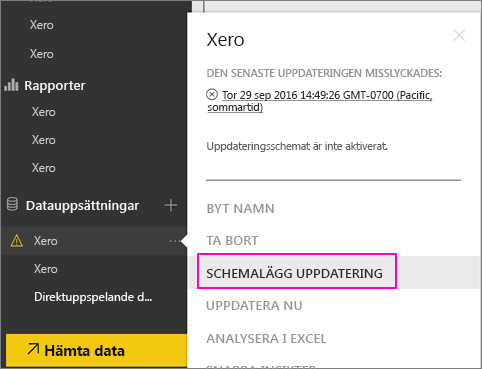
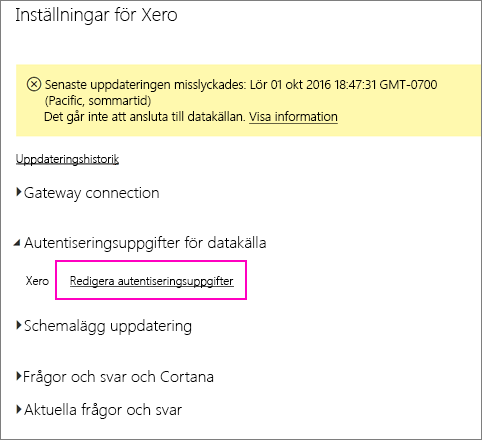
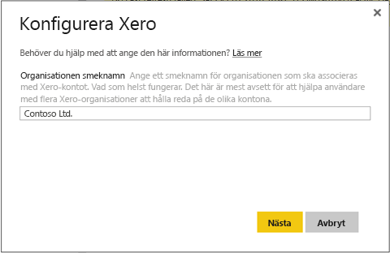
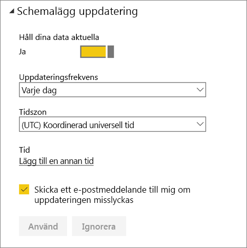
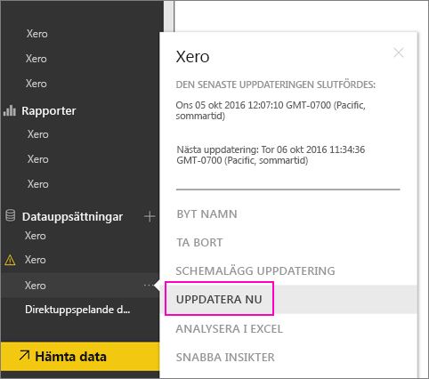

# Så här uppdaterar du dina innehållspaketautentiseringsuppgifter för Xero om uppdateringen misslyckades
Om du använder Xero Power BI-innehållspaketet kan du ha stött på problem med innehållspaketets dagliga uppdateringar på grund av en nyligen inträffad incident i Power BI-tjänsten.

Du kan se om ditt innehållspaket har uppdaterats genom att kontrollera den senaste uppdateringsstatusen för din Xero-datauppsättning som visas på skärmbilden nedan.

Om du ser att uppdateringen har misslyckats, så förnya ditt innehållspakets autentiseringsuppgifter genom att följa dessa steg.

1. Klicka på **Fler alternativ** (...) bredvid Xero-datamängden och klicka sedan på **Schemalägg uppdatering**. Då öppnas inställningssidan för Xero-innehållspaketet.
   
    
2. Välj **Datakällans autentiseringsuppgifter** > **Redigera autentiseringsuppgifter** på sidan **Inställningar för Xero**.
   
    
3. Ange ditt organisationsnamn > **Nästa**.
   
    
4. Logga in med ditt Xero-konto.
   
    
5. Nu när dina autentiseringsuppgifter har uppdaterats, så kontrollera att uppdateringsschemat är inställt på att köras varje dag. Kontrollera detta genom att klicka på **Fler alternativ** (...) bredvid Xero-datauppsättningen och sedan klicka på **Schemalägg uppdatering** igen.
   
    
6. Du kan också välja att uppdatera datauppsättningen direkt. Klicka på **Fler alternativ** (...) bredvid Xero-datamängden och klicka sedan på **Uppdatera nu**.
   
    

Om du fortfarande har uppdateringsproblem så tveka inte att kontakta oss på [https://support.powerbi.com](https://support.powerbi.com) 

Om du vill veta mer om Xero-innehållspaketet för Power BI kan du besöka hjälpsidan för [Xero-innehållspaket](service-connect-to-xero.md).

### Nästa steg
* Har du fler frågor? [Prova Power BI Community](https://community.powerbi.com/)

