# Installera och distribuera mallappar i organisationen

Är du Power BI-analytiker? I så fall kan du läsa den här artikeln om att installera [mallappar](service-template-apps-overview.md) och ansluta dem till många av de tjänster du använder i verksamheten, som Salesforce, Microsoft Dynamics och Google Analytics. Du kan sedan modifiera mallappens inbyggda instrumentpanel och rapporter enligt organisationens behov och sedan distribuera dem till dina kollegor som [appar](../consumer/end-user-apps.md). 

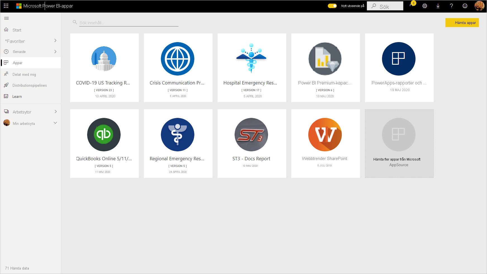

Om du är intresserad av att skapa mallappar som du själv kan distribuera utanför organisationen, kan du läsa [Skapa en mallapp i Power BI](service-template-apps-create.md). Power BI-partner kan skapa Power BI-appar nästan helt utan kodning och distribuera dem till Power BI-kunder. 

## Förutsättningar  

Om du vill installera, anpassa och distribuera en mallapp behöver du: 

* En [Power BI Pro-licens](../fundamentals/service-self-service-signup-for-power-bi.md).
* Behörighet att installera mallappar på klientorganisationen.
* En giltig installationslänk för appen, som du får antingen från AppSource eller från appskaparen.
* Kunskap om [grundläggande begrepp i Power BI](../fundamentals/service-basic-concepts.md).

## Installera en mallapp

1. Välj **Appar** > **Hämta appar** i navigeringsfönstret i Power BI-tjänsten.

    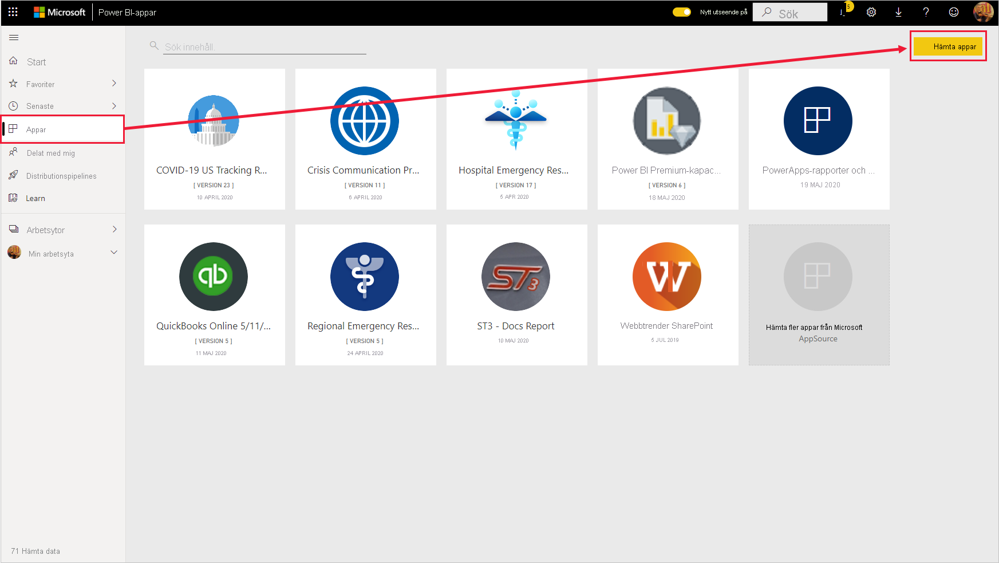

1. I AppSource-fönstret som visas väljer du **Appar**. Bläddra eller sök efter appen du vill använda och välj sedan **Hämta nu**.

    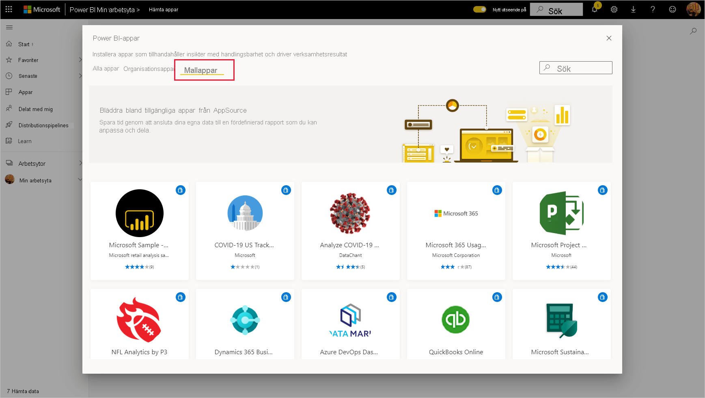

1. I dialogrutan som visas väljer du **Installera**.

    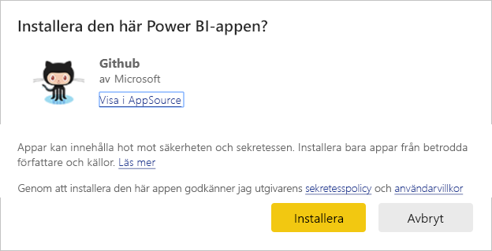
    
    Appen installeras med en associerad arbetsyta. **Om du bestämmer dig för att anpassa appen gör du det i den associerade arbetsytan**.

    > [!NOTE]
    > Om du använder en installationslänk för en app som inte finns i AppSource, visas dialogrutan för validering där du uppmanas att bekräfta valet.
    >
    >För att kunna installera en mall som inte visas i AppSource, måste du begära relevanta behörigheter från din administratör. Se [Mallappinställningar](../admin/service-admin-portal.md#template-apps-settings) i Power BI-administratörsportalen för mer information.

    När installationen har slutförts visas ett meddelande som anger att din nya app är klar.

    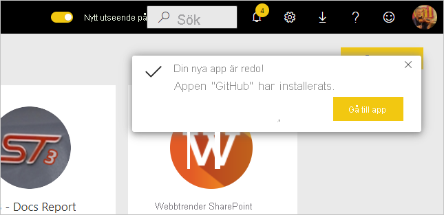

## Ansluta till data

1. Välj **Gå till app**.

1. Välj **Utforska** i fönstret **Kom igång med din nya app**.

   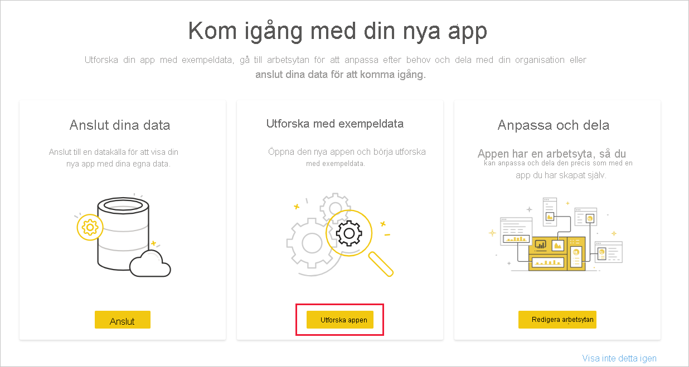

   Appen öppnas och visar exempeldata.

1. Välj länken **Anslut dina data** på banderollen längst upp på sidan.

   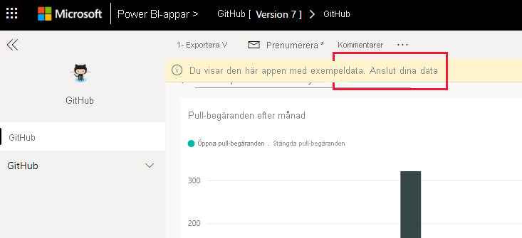

    
    Då öppnas en dialogruta eller serie med dialogrutor där du kan ändra datakällan från exempeldata till din egen datakälla. Det betyder vanligtvis att du definierar om datauppsättningsparametrar och autentiseringsuppgifter för datakällan. Se [Kända begränsningar](service-template-apps-overview.md#known-limitations).
    
    I exemplet nedan involverar anslutningen till data två dialogrutor.

   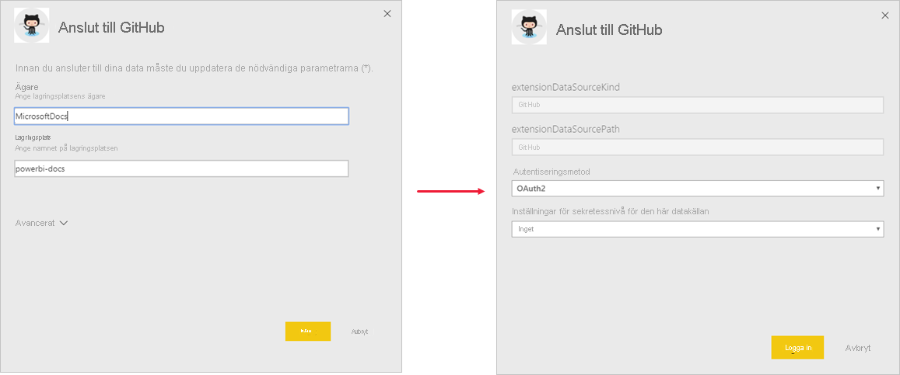

    När du har fyllt i anslutningsdialogrutorna startar anslutningsprocessen. En banderoll informerar dig om att data uppdateras och att du under tiden visar exempeldata.

    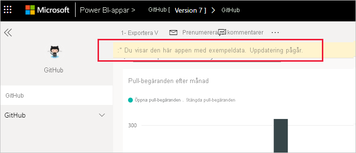

   Rapportdata uppdateras automatiskt en gång per dag, såvida du inte inaktiverar detta under inloggningsprocessen. Om du vill kan du även [ställa in ett eget uppdateringsschema](./refresh-scheduled-refresh.md) för att hålla rapportdata aktuella.

## Anpassa och dela appen

När du har anslutit till dina data och datauppdateringen är klar kan du anpassa rapporterna eller instrumentpanelerna i appen och dela appen med dina medarbetare. Kom dock ihåg att alla ändringar du gör kommer att skrivas över när du uppdaterar appen med en ny version, om du inte sparar de objekt som du har ändrat under olika namn. [Se information om att skriva över](#overwrite-behavior).

Om du vill anpassa och dela appen väljer du pennikonen längst upp till höger på sidan.

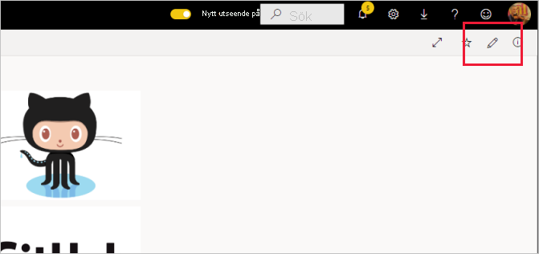

Information om hur du redigerar artefakter i arbetsytan finns i
* [Upptäck rapportredigeraren i Power BI](../create-reports/service-the-report-editor-take-a-tour.md)
* [Grundläggande begrepp för designers i Power BI-tjänsten](../fundamentals/service-basic-concepts.md)

När du har gjort alla ändringar du vill för artefakterna i arbetsytan är du redo att publicera och dela appen. Se [Publicera din app](../collaborate-share/service-create-distribute-apps.md#publish-your-app) för att lära dig hur du gör detta.

## Uppdatera en mallapp

Då och då släpper skapare av mallappar nya förbättrade versioner av sina mallappar, antingen via AppSource, direktlänk eller både och.

Om du ursprungligen laddade ned appen från AppSource när en ny version av Template-appen blir tillgänglig får du ett meddelande på två sätt:
* En uppdateringsbanderoll visas i Power BI-tjänsten som informerar dig om att det finns en ny version av appen.
  
* Du får ett meddelande i Power BI-meddelandefönstret.

  

>[!NOTE]
>Om du ursprungligen fick appen via direktlänk i stället för via AppSource, kan du bara få reda på om en ny version är tillgänglig genom att kontakta skaparen av mallappen.

  Om du vill installera uppdateringen klickar du antingen på **Hämta** i meddelandebanderollen eller meddelandecentret eller söker efter appen igen i AppSource och väljer **Hämta nu**. Om du har en direktlänk för uppdateringen från den som skapat mallappen, klickar du bara på länken.
  
  Du får en fråga om du vill skriva över den aktuella versionen eller installera den nya versionen i en ny arbetsyta. Överskrivning är valt som standard.

  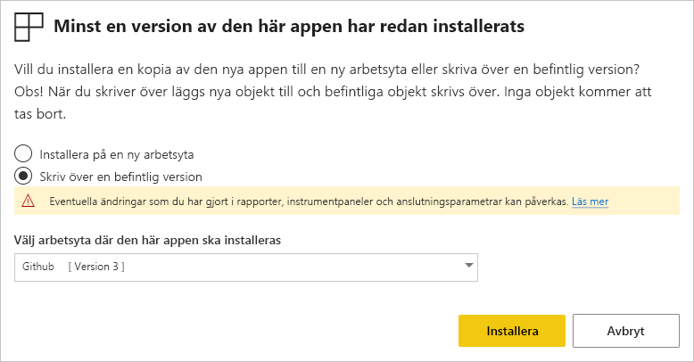

- **Skriv över en befintlig version:** Skriver över den befintliga arbetsytan med den uppdaterade versionen av mallappen. [Se information om att skriva över](#overwrite-behavior).

- **Installera på en ny arbetsyta:** Installerar en ny version av arbetsytan och appen som du måste konfigurera om (det vill säga ansluta till data, definiera navigering och behörigheter).

### Överskrivningsfunktioner

* Att skriva över uppdaterar rapporterna, instrumentpanelerna och datauppsättningen på arbetsytan, inte i appen. När du skriver över ändras inte appnavigeringen, konfigurationen och behörigheterna.
* När du har uppdaterat arbetsytan **måste du uppdatera appen för att tillämpa ändringar från arbetsytan till appen**.
* Överskrivning behåller konfigurerade parametrar och autentisering. Efter uppdatering startar en automatisk uppdatering av datauppsättningen. **Under uppdateringen visas exempeldata i appen, rapporterna och på instrumentpanelerna**.

  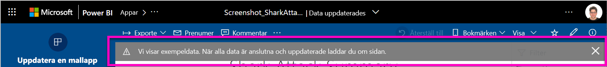

* Vid överskrivning visas alltid exempeldata tills uppdateringen är klar. Om mallappens skapare har gjort ändringar i datauppsättningen eller parametrarna kommer användare av arbetsytan och appen inte att se nya data förrän uppdateringen är klar. I stället kommer de fortfarande att se exempeldata under den här tiden.
* Överskrivning tar aldrig bort nya rapporter eller instrumentpaneler som du har lagt till i arbetsytan. De ursprungliga rapporterna och instrumentpanelerna skrivs endast över med ändringar från den ursprungliga skaparen.

>[!IMPORTANT]
>Kom ihåg att [uppdatera appen](#customize-and-share-the-app) efter överskrivning för att tillämpa ändringar på rapporterna och instrumentpanelen för användarna av organisationsappen.

## Nästa steg

[Skapa arbetsytor med dina kollegor i Power BI](../collaborate-share/service-create-the-new-workspaces.md)
