# Självstudie: Skapa en maskininlärningsmodell i Power BI

I den här självstudieartikeln använder du **automatiserad maskininlärning** till att skapa och tillämpa en modell för binär förutsägelse i Power BI. Självstudien innehåller vägledning om hur du skapar ett Power BI-dataflöde och använder de entiteter som definieras i dataflödet för att träna och validera en maskininlärningsmodell direkt i Power BI. Vi använder sedan den modellen till att poängsätta nya data och skapa förutsägelser.

Först skapar du en maskininlärningsmodell för binär förutsägelse i syfte att förutsäga inköpsavsikten hos onlinekonsumenter baserat på en uppsättning av deras onlinesessionsattribut. En maskininlärningsdatamängd för prestandatestning används i den här övningen. När en modell har tränats genererar Power BI automatiskt en valideringsrapport som förklarar modellens utfall. Du kan sedan granska valideringsrapporten och tillämpa modellen på dina data för poängsättning.

Den här självstudien består av följande steg:
> [!div class="checklist"]

> * Skapa ett dataflöde med indata
> * Skapa och träna en maskininlärningsmodell
> * Granska modellens valideringsrapport
> * Tillämpa modellen på en dataflödesentitet
> * Använda det poängsatta utfallet från modellen i en Power BI-rapport

## Skapa ett dataflöde med indata

Den första delen av den här självstudien är att skapa ett dataflöde med indata. Såsom det visas i följande avsnitt består processen av några steg som börjar med hämtning av data.

### Hämta data

Det första steget i att skapa ett dataflöde är att förbereda datakällorna. I vårt fall använder vi en maskininlärningsdatamängd från en uppsättning onlinesessioner, varav vissa resulterade i ett köp. Datamängden innehåller en uppsättning attribut om dessa sessioner, som vi kommer att använda för att träna modellen.

Du kan ladda ned datamängden från webbplatsen för UC Irvine. För den här självstudien finns den även tillgänglig via följande länk: [online_shoppers_intention.csv](https://raw.githubusercontent.com/santoshc1/PowerBI-AI-samples/master/Tutorial_AutomatedML/online_shoppers_intention.csv).

### Skapa entiteterna

Logga in i Power BI-tjänsten för att skapa entiteter i ditt dataflöde, och navigera till en arbetsyta i din dedikerade kapacitet som har AI aktiverat.

Om du inte redan har en arbetsyta kan du skapa en genom att välja **Arbetsytor** på navigeringsmenyn i Power BI-tjänsten och sedan välja **Skapa arbetsyta** längst ned i det fönster som visas. Då öppnas en panel till höger där du kan ange arbetsytans information. Ange ett namn på arbetsytan och välj **Avancerat**. Bekräfta att arbetsytan använder dedikerad kapacitet med hjälp av alternativknappen samt att den tilldelas till en instans av dedikerad kapacitet där AI-förhandsgranskningen är aktiverad. Välj sedan **Spara**.

När arbetsytan har skapats kan du välja **Hoppa över** längst ned till höger på välkomstskärmen enligt följande bild.

 Välj knappen **Skapa** längst upp till höger på arbetsytan och välj sedan **Dataflöden**.

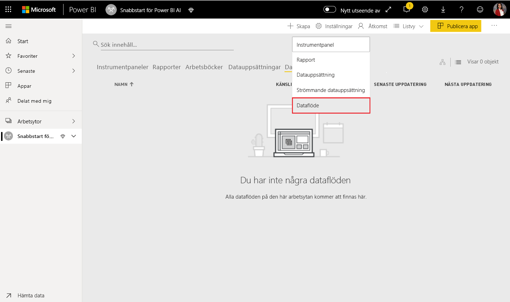

Välj **Lägg till nya entiteter**. Detta startar en **Power Query**-redigerare i webbläsaren.

Välj **Text-/CSV-fil** som datakälla enligt följande bild.

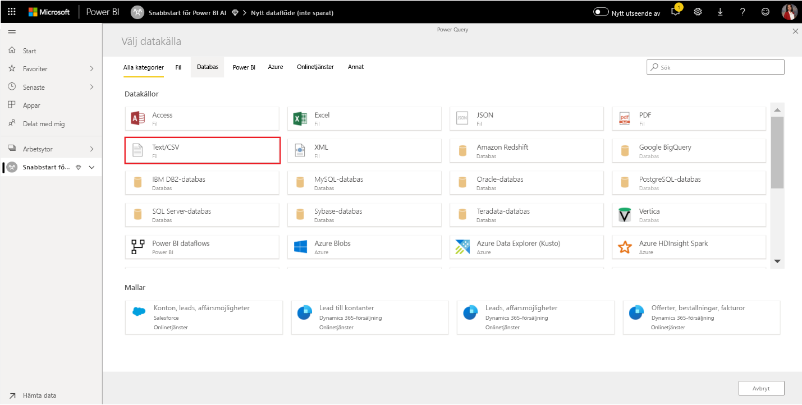

På sidan **Anslut till en datakälla** som sedan visas klistrar du in följande länk till _online_shoppers_intention.csv_ i rutan **Filsökväg eller URL** och väljer **Nästa**.

`https://raw.githubusercontent.com/santoshc1/PowerBI-AI-samples/master/Tutorial_AutomatedML/online_shoppers_intention.csv`

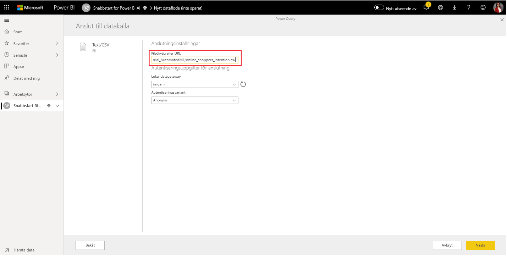

Power Query-redigeraren visar en förhandsgranskning av data från CSV-filen. Du kan ge frågan ett mer användarvänligt namn genom att ändra värdet i rutan Namn i det högra fönstret. Du kan till exempel ändra frågans namn till _Online Visitors_ (onlinebesökare).

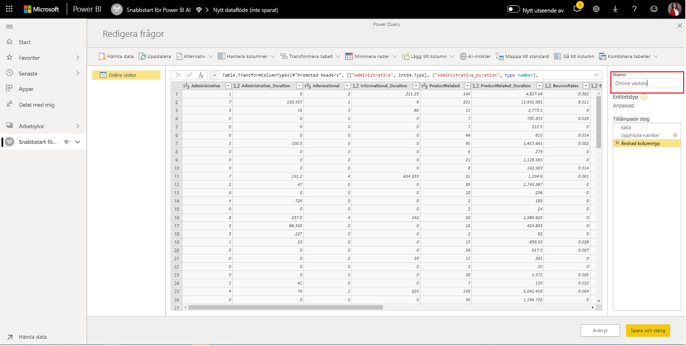

Power Query härleder kolumntyperna automatiskt. Du kan ändra kolumntypen genom att klicka på ikonen för attributtyp längst upp i kolumnrubriken. I det här exemplet ändrar vi typen för kolumnen Revenue till True/False.

Välj knappen **Stäng och spara** för att stänga Power Query-redigeraren. Ange ett namn för dataflödet och välj **Spara** i dialogrutan, som i följande bild.

## Skapa och träna en maskininlärningsmodell

Du lägger till en maskininlärningsmodell genom att välja knappen **Tillämpa ML-modell** i listan **Åtgärder** för den basentitet som innehåller dina träningsdata och din märkningsinformation, och välj sedan **Lägg till en maskininlärningsmodell**.

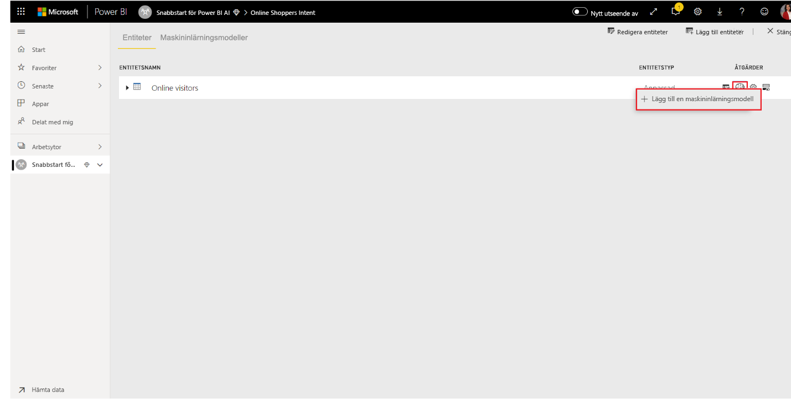

Det första steget när du ska skapa en egen maskininlärningsmodell är att identifiera historiska data, inklusive det utfallsfält som du vill förutsäga. Modellen skapas genom inlärning från dessa data.

För den datamängd som vi använder är detta fältet **Revenue** (intäkter). Välj **Revenue** (intäkter) som utfallsfält och välj sedan **Nästa**.

Därefter måste vi välja vilken typ av maskininlärningsmodell som ska skapas. Power BI analyserar värdena i utfallsfältet du har identifierat och föreslår några typer av maskininlärningsmodeller som kan skapas för att förutsäga värden i fältet.

Eftersom vi förutsäger ett binärt utfall för huruvida en användare kommer att genomföra ett köp eller inte rekommenderas Binär förutsägelse. Eftersom vi är intresserade av att förutsäga om användare kommer att genomföra ett köp väljer du True som det utfall vi är mest intresserade av. Du kan också ange användarvänliga etiketter för de utfall som ska användas i den automatiskt genererade rapport där resultatet av modellens validering sammanfattas. Välj sedan Nästa.

Sedan gör Power BI en preliminär skanning av ett urval av data och föreslår indata som kan ge bättre förutsägelser. Om Power BI inte rekommenderar ett fält anges en förklaring intill det. Du kan välja att ändra urvalet så att du bara tar med de fält du vill studera, eller så kan du välja alla fält genom att markera kryssrutan bredvid namnet på entiteten. Välj **Nästa** för att godkänna indata.

I det sista steget anger vi ett namn på modellen. Ge modellen namnet _Purchase Intent Prediction_ (förutsägelse av köpavsikt). Du kan välja att minska inlärningstiden om du vill få resultat snabbare, eller att öka tiden för att få fram bästa möjliga modell. Välj sedan **Spara och träna** för att börja träna upp modellen.

Träningsprocessen börjar med sampling och normalisering av dina historiska data samt indelning av datamängden i två nya entiteter, _Purchase Intent Prediction Training Data_ (Träningsdata för förutsägelse av inköpsavsikt) och _Purchase Intent Prediction Testing Data_ (Testningsdata för förutsägelse av inköpsavsikt).

Beroende på datamängdens storlek kan träningsprocessen ta allt från några minuter till den maxtid du angav på föregående skärm. Nu kan du se modellen på fliken **Maskininlärningsmodeller** för dataflödet. Statusen Redo anger att modellen har ställts i kö för träning eller håller på att tränas.

Du kan bekräfta att modellen tränas och valideras via statusen för dataflödet. Detta visas som en pågående datauppdatering på fliken **Dataflöden** för arbetsytan.

När modellträningen är klar visar dataflödet en uppdaterad uppdateringstid. Du kan bekräfta att modellen har tränats genom att gå till fliken **Maskininlärningsmodeller** i dataflödet. Modellen du skapade bör ha statusen **Tränad**, och tiden för **Senast tränad** bör ha uppdaterats.

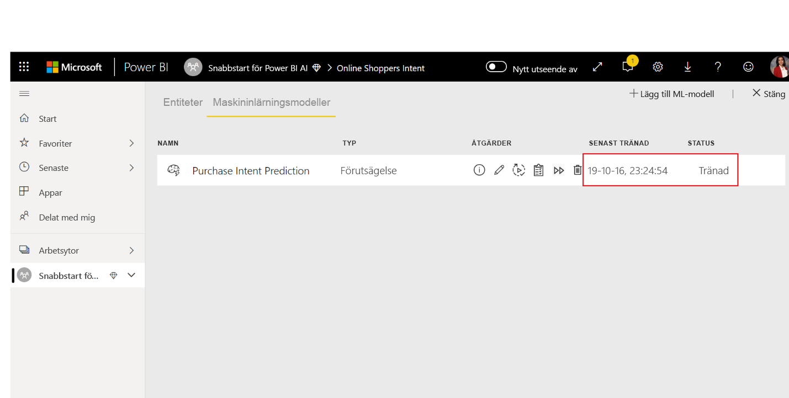

## Granska modellens valideringsrapport
Du kan granska modellens valideringsrapport genom att välja knappen Visa prestandarapport i kolumnen Åtgärder för modellen på fliken Maskininlärningsmodeller. I den här rapporten beskrivs sannolik prestanda för din maskininlärningsmodell.

På sidan **Modellprestanda** i rapporten väljer du **See top predictors** (visa de viktigaste faktorerna) för att visa de främsta förutsägande faktorerna för din modell. Du kan välja en av de förutsägande faktorerna för att se den utfallsfördelning som är associerad med faktorn.

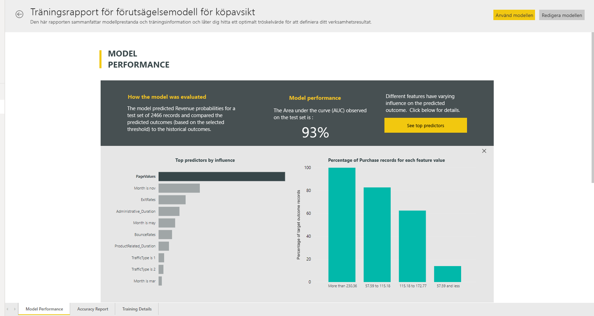

Du kan använda utsnittet **Sannolikhetströskel** på sidan Modellprestanda för att undersöka dess inverkan på modellens precision och träffsäkerhet.

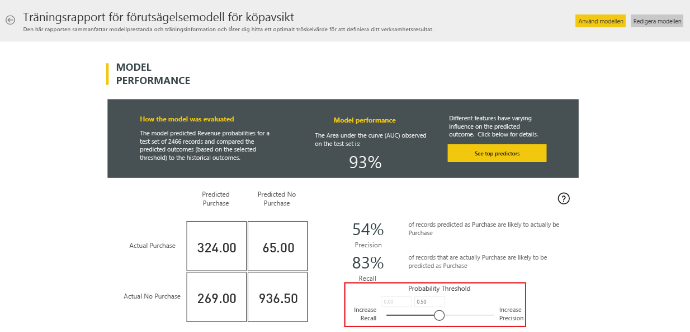

De andra sidorna i rapporten beskriver modellens statistiska prestandamått.

Rapporten innehåller även en sida med träningsinformation som beskriver de olika iterationer som kördes, hur egenskaperna extraherades från indata samt de hyperparametrar som användes för den slutliga modellen.

## Tillämpa modellen på en dataflödesentitet

Välj knappen **Tillämpa modell** överst i rapporten för att anropa den här modellen. I dialogrutan **Tillämpa** kan du ange den målentitet som innehåller de källdata som modellen ska tillämpas på.

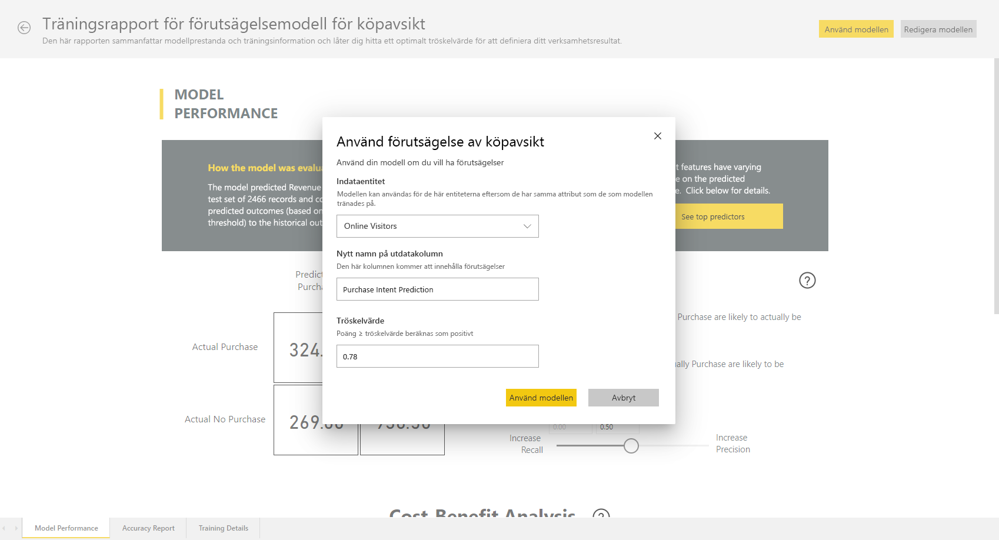

När du uppmanas måste du **Uppdatera** dataflödet för att förhandsgranska resultatet av modellen.

När du tillämpar modellen skapas två nya entiteter med suffixen **enriched <modellnamn>** och **enriched <modellnamn> explanations**. När vi i vårt fall tillämpar modellen på entiteten **Online Visitors** skapar **Online Visitors enriched Purchase Intent Prediction** med förutspådda utfall från modellen, och **Online Visitors enriched Purchase Intent Prediction explanations** med de främsta postspecifika förutsägande faktorerna. 

När du tillämpar en modell för binär förutsägelse läggs fyra kolumner med förutsagt utfall, sannolikhetspoäng, de främsta postspecifika förutsägande faktorerna och ett förklaringsindex, som var och en får det angivna kolumnnamnet som prefix.  

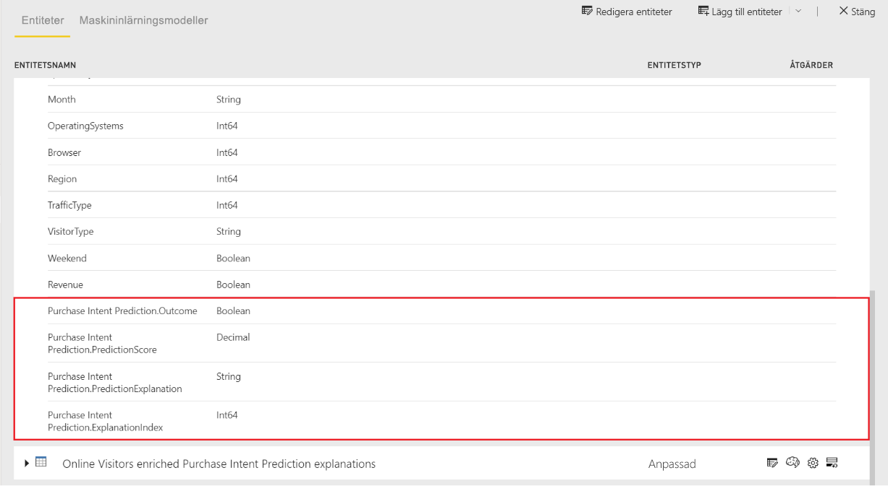

När dataflödet har uppdaterats kan du välja entiteten **OnlineShoppers enriched Purchase Intent Prediction** för att visa resultatet.

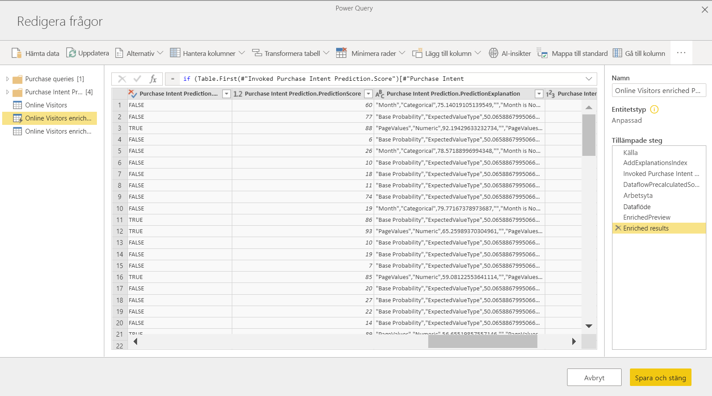

Du kan också anropa valfri AutoML-modell på arbetsytan direkt från Power Query-redigeringsprogrammet i ditt dataflöde. Om du vill ha åtkomst till Azure ML-modellerna väljer du knappen Redigera för den entitet som du vill utöka med insikter från din AutoML-modell, så som visas på följande bild.

Genom att välja knappen Redigera öppnas Power Query Editor för entiteter i ditt dataflöde. Välj AI Insights-knappen i menyfliksområdet.

 Välj mappen Power BI Machine Learning-modeller på menyn i navigeringsfönstret. Alla AutoML-modeller som du har åtkomst till visas här som Power Query-funktioner. Dessutom mappas automatiskt AutoML-modellens indataparametrar som parametrar för motsvarande Power Query-funktion. Observera att automatisk mappning av parametrar endast sker om namnet och parameterns datatyp är identiska.
 
Du kan ange någon av den valda entitetens kolumner som indata från listrutan när du vill anropa en AutoML-modell. Du kan också ange ett konstant värde som ska användas som indata genom att klicka på kolumnikonen till vänster om dialogrutan Indata.

Välj Använd om du vill visa förhandsversionen av AutoML-modellens utdata som en ny kolumn i entitetstabellen. Du kan även se modellanropet som ett tillämpat steg för frågan.

När du sparar ditt dataflöde anropas modellen automatiskt när dataflödet uppdateras, för alla nya eller uppdaterade rader i entitetstabellen.

## Använda det poängsatta utfallet från modellen i en Power BI-rapport

Om du vill använda det poängsatta utfallet från maskininlärningsmodellen kan du ansluta till ditt dataflöde från Power BI Desktop med hjälp av anslutningsprogrammet för dataflöden. Nu kan du använda entiteten **Online Visitors enriched Purchase Intent Prediction** och ta med förutsägelserna från din modell i Power BI-rapporter.

## Nästa steg

I den här självstudien skapade och tillämpade du en modell för binär förutsägelse i Power BI med hjälp av följande steg:

* Skapa ett dataflöde med indata
* Skapa och träna en maskininlärningsmodell
* Granska modellens valideringsrapport
* Tillämpa modellen på en dataflödesentitet
* Använda det poängsatta utfallet från modellen i en Power BI-rapport

Mer information om automatiserad maskininlärning i Power BI finns i [Automatiserad maskininlärning i Power BI](../transform-model/service-machine-learning-automated.md).
