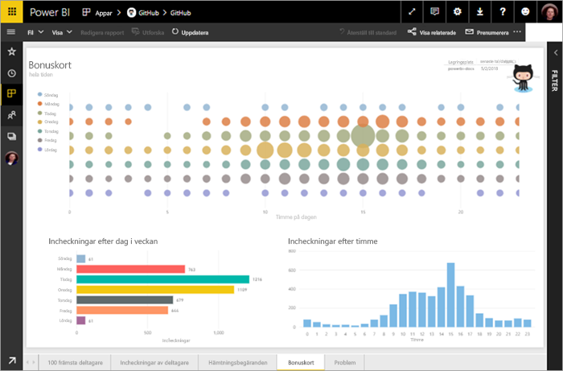
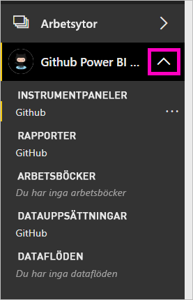
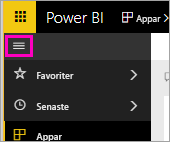
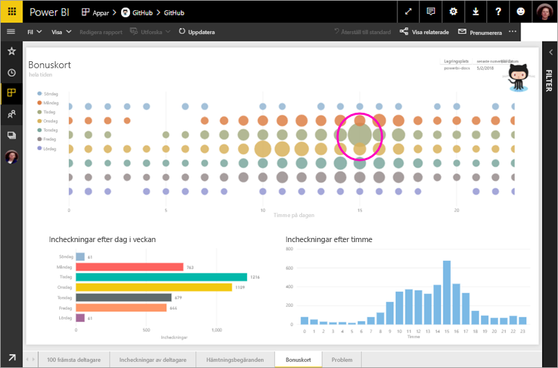
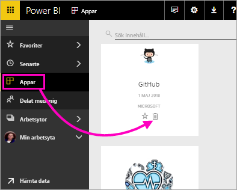

# Självstudie: Ansluta till en GitHub-lagringsplats med Power BI
I den här självstudien ska du ansluta till verkliga data i GitHub-tjänsten med Power BI, så skapar Power BI automatiskt instrumentpaneler och rapporter. Du ansluter till den offentliga lagringsplatsen (även kallad *databas*) för Power BI-innehåll och hittar svar på frågor som: Hur många personer bidrar till det offentliga Power BI-innehållet? Vem bidrar med mest innehåll? Vilken dag i veckan har flest bidrag? Och andra frågor. 

I den här självstudien går du igenom följande steg:

> [!div class="checklist"]
> * Registrera dig för ett GitHub-konto om du inte redan har ett 
> * Logga in på ditt Power BI-konto, eller registrera dig om du inte redan har ett konto
> * Öppna Power BI-tjänsten
> * Leta upp GitHub-appen
> * Ange informationen för den offentliga GitHub-lagringsplatsen för Power BI
> * Visa instrumentpanelen och rapporten med GitHub-data
> * Rensa resurser genom att ta bort appen

Om du inte har registrerat dig för Power BI [registrerar du dig för en kostnadsfri utvärderingsversion](https://app.powerbi.com/signupredirect?pbi_source=web) innan du börjar.

## Förutsättningar

I den här kursen behöver du ett GitHub-konto om du inte redan har ett. 

- Registrera dig för ett [GitHub-konto](https://docs.microsoft.com/contribute/get-started-setup-github).

## Så här ansluter du
1. Logga in på Power BI-tjänsten (`https://app.powerbi.com`. 
2. Välj **Appar** i navigeringsfönstret och sedan **Hämta appar**.
   
    

3. Välj **Appar**, skriv **GitHub** i sökrutan > **Get it now** (Hämta nu).
   
    

4. I **Installera den här Power BI-appen?** väljer du **Installera**.
5. I **Din nya app är klar** väljer du **Gå till app**.
6. I **Kom igång med din nya app** väljer du **Anslut**.

    

7. Ange lagringsplatsens namn och ägare. URL:en för den här lagringsplatsen är https://github.com/MicrosoftDocs/powerbi-docs. **Lagringsplatsägare** är alltså **MicrosoftDocs** och **Lagringsplats** är **powerbi-docs**. 
   
    

5. Ange autentiseringsuppgifterna för GitHub som du skapade. Power BI kan hoppa över det här steget om du redan är inloggad i GitHub i din webbläsare. 

6. Som **Autentiseringsmetod** låter du **oAuth2** vara markerat \>**Logga in**.

7. Följ autentiseringsskärmarna i GitHub. Ge Power BI behörighet till GitHub-data.
   
   Nu kan Power BI ansluta till GitHub och till informationen.  Data uppdateras en gång om dagen.

8. När Power BI har importerat data ser du innehållet på din nya GitHub-arbetsyta. 
9. Välj pilen intill arbetsytans namn i navigeringsfältet. Arbetsytan innehåller en instrumentpanel och en rapport. 

    

10. Välj **Fler alternativ** (...) bredvid instrumentpanelens namn > **Byt namn** > skriv **GitHub instrumentpanel**.
 
     

8. Minimera navigeringsfönstret genom att välja ikonen för global navigering, så att du får mer plats.

    

10. Välj din nya GitHub-instrumentpanel.
    
    Eftersom GitHub-instrumentpanelen innehåller realtidsdata kanske du ser andra värden.

    

    

## Ställ en fråga

1. Placera markören i **Ställ en fråga om dina data**. I Power BI finns **frågor för att komma igång**. 

1. Välj **how many users are there** (hur många användare är det).
 
    

13. Mellan **how many** (hur många) och **users are there** (användare är det), skriv **pull requests per** (pull-begäranden per). 

     Power BI skapar ett stapeldiagram som visar antalet pull-begäranden efter person.

    

13. Välj nålen för att fästa den på din instrumentpanel, och välj sen **Exit Q&A** (Avsluta frågor och svar).

## Visa GitHub-rapporten 

1. Öppna stapeldiagrammet **Pull Requests by Month** (Pull-begäranden efter månad) på GitHub-instrumentpanelen för att öppna den relaterade rapporten.

    

2. Välj ett användarnamn i diagrammet **Total pull requests by user** (antal pull-begäranden efter användare). I det här exemplet ser vi att de flesta av deras timmar gjordes i februari.

    

3. Visa nästa sida i rapporten genom att välja fliken **Punch Card** (Hålkort). 
 
    

    Tydligen lämnas flest *bidrag* på tisdagar kl. 15, när användarna skickar in arbete.

## Rensa resurser

Nu när du är klar med självstudien kan du ta bort GitHub-appen. 

1. Välj **Appar** i navigeringsfönstret.
2. Hovra över GitHub-ikonen och välj papperskorgen (**Ta bort**).

    

## Nästa steg

I den här självstudien har du anslutit till en offentlig GitHub-lagringsplats och hämtat data, som konverterades till en instrumentpanel och en rapport i Power BI. Du har besvarat några frågor om informationen genom att utforska instrumentpanelen och rapporten. Nu kan du läsa mer om hur du ansluter till andra tjänster, till exempel Salesforce, Microsoft Dynamics och Google Analytics. 
 
> [!div class="nextstepaction"]
> [Ansluta till onlinetjänster som du använder](service-connect-to-services.md)

