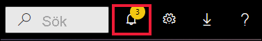
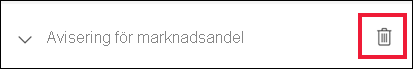

# Självstudie: Ställa in aviseringar för instrumentpaneler i Power BI

[!INCLUDE[consumer-appliesto-yynn](../includes/consumer-appliesto-yynn.md)]

[!INCLUDE [power-bi-service-new-look-include](../includes/power-bi-service-new-look-include.md)]

Ställ in aviseringar i Power BI-tjänsten som meddelar dig när data ändras på en instrumentpanel så att de överskrider eller underskrider de gränser du har angett. Aviseringar kan endast konfigureras på paneler som har fästs från visuella objekt i rapporter och endast på mätare, KPI:er och kort. 

Du kan skapa aviseringar på instrumentpaneler:
- som du har skapat och sparat på **Min arbetsyta**
- som har delats med dig i en [Premium-kapacitet](end-user-license.md). 
- på alla arbetsytor som du har åtkomst till, om du har en Power BI Pro-licens.    

Aviseringar fungerar bara på data som ska uppdateras. När data uppdateras söker Power BI för att se om en avisering har angetts för dessa data. Om data har uppnått ett tröskelvärde utlöses en avisering. 

Den här funktionen här fortfarande under utveckling, så [Läs avsnittet tips och felsökning nedan](#tips-and-troubleshooting).

Du kan endast se aviseringar som du anger, även om du delar din instrumentpanel. Datavarningar är helt synkroniserade på plattformar. Ställ in och visa datavarningar [i Power BI-appar](mobile/mobile-set-data-alerts-in-the-mobile-apps.md) och i Power BI-tjänsten. 

> [!WARNING]
> De här aviseringarna ger information om dina data. Om du visar dina Power BI-data på en mobilenhet och den blir stulen, bör du använda Power BI-tjänsten för att inaktivera alla aviseringar.
> 

Den här självstudien beskriver följande.
> [!div class="checklist"]
> * Vem kan ställa in aviseringar?
> * Vilka visuella objekt har stöd för aviseringar?
> * Vem kan se mina aviseringar?
> * Fungerar aviseringar i Power BI Desktop och Mobile?
> * Så här skapar du en avisering
> * Var får jag mina aviseringar?

## Förutsättningar

Om du inte har registrerat dig för Power BI [registrerar du dig för en kostnadsfri utvärderingsversion](https://app.powerbi.com/signupredirect?pbi_source=web) innan du börjar.

1. I det här exemplet används en instrumentpanels kortpanel från försäljnings- och marknadsföringsexemplet. Öppna Power BI-tjänsten (app.powerbi.com), logga in och öppna **Min arbetsyta**.    
    

2. Längst ned i vänster hörn väljer du **Hämta data**.

    

3. Välj **Exempel** på sidan Hämta data.

4. Markera Exempel på försäljning och marknadsföring och välj sedan **Anslut**.

    

5. När Power BI har anslutit till exemplet väljer du **Gå till instrumentpanelen** i den dialogruta som visas.     
    

## Lägg till en avisering till en ikon på instrumentpanelen

1. Välj ellipserna (tre punkter) från en mätare, KPI eller kortpanel på instrumentpanelen.
   
   

2. Välj aviseringsikonen  eller **Hantera aviseringar** om du vill lägga till en eller flera aviseringar för kortet **Marknadsandel**.

   

   
1. I fönstret **Hantera aviseringar** väljer du **+Lägg till regel för avisering**.  Se till att skjutreglaget är inställt på **På** och ge aviseringen ett namn. Namnet hjälper dig att identifiera aviseringarna.
   
   
4. Bläddra nedåt och ange detaljerad information om aviseringen.  I det här exemplet ska vi skapa en avisering som meddelar oss en gång om dagen om vår marknadsandel ökar till 40 eller högre. Aviseringar visas i [Meddelandecenter](end-user-notification-center.md). Power BI kommer också att skicka ett e-postmeddelande.
   
   

5. Välj **Spara och stäng**.
 

   > 

## Ta emot aviseringar
När data som spåras når något av dina angivna tröskelvärden sker flera saker. Först kontrollerar Power BI om mer än en timme eller mer än 24 timmar har gått (beroende på vilket alternativ som du valde) sedan den senaste aviseringen skickades. Så länge data har passerat tröskelvärdet får du en avisering.

Därefter skickar Power BI en avisering till Meddelandecenter och, om du vill, via e-post. Varje avisering innehåller en direktlänk till dina data. Välj länken för att se relevant panel.  

1. Om du har valt att skicka ett e-postmeddelande kommer du att se följande i din inkorg. Det här är en avisering vi har konfigurerat för kortet **Sentiment**.
   
   
2. Power BI lägger också till ett meddelande i ditt **meddelandecenter**.
   
   
3. Öppna meddelandecentret om du vill se detaljerad information om aviseringen.
   
    
   
  

## Hantera aviseringar

Det finns flera sätt du kan hantera dina aviseringar på: från paneler på instrumentpanelen, Power BI-inställningsmenyn, på en enskild panel i [Power BI-mobilappen på iPhone](mobile/mobile-set-data-alerts-in-the-mobile-apps.md) eller i [Power BI-mobilappen för Windows 10](mobile/mobile-set-data-alerts-in-the-mobile-apps.md).

### Från själva panelen

1. Om du behöver ändra eller ta bort en avisering för en panel öppnar du fönstret **Hantera aviseringar** på nytt genom att välja aviseringsikonen . Alla aviseringar som du har angett för panelen visas.
   
    .
2. Om du vill ändra en avisering, väljer du pilen till vänster om aviseringens namn.
   
    .
3. Om du vill ta bort en avisering, väljer du papperskorgen till höger om aviseringens namn.
   
      

### På inställningsmenyn för Power BI

1. Välj kugghjulsikonen från menyfältet i Power BI.
   
    .
2. Välj **Aviseringar** under **Inställningar**.
   
    
3. Härifrån kan du aktivera och inaktivera aviseringar, öppna fönstret **Hantera aviseringar** för att ändra eller ta bort aviseringen.

## Tips och felsökning 

* Om du inte kan konfigurera en avisering för en mätare, KPI eller ett kort kan du kontakta klientadministratören eller IT-supporten och be om hjälp. Ibland är aviseringar inaktiverade eller otillgängliga för instrumentpanelen eller för vissa typer av paneler på instrumentpanelen.
* Aviseringar fungerar bara på data som ska uppdateras. De fungerar inte på statiska data. De flesta av de exempel som tillhandahålls av Microsoft är statiska. 
* För att ta emot och visa delat innehåll behövs en Power BI Pro- eller Premium-licens. Mer information finns i [Vilken licens har jag?](end-user-license.md).
* Aviseringar kan konfigureras för visuella objekt som skapats från direktuppspelande datamängder som du fäster från en rapport på en instrumentpanel. Aviseringar kan inte konfigureras på direktuppspelande paneler som skapats direkt på instrumentpanelen med hjälp av **Lägg till panel** > **Anpassade direktuppspelande data**.

## Rensa resurser
Instruktioner för att ta bort aviseringar beskrivs ovan. Du väljer kugghjulsikonen från menyfältet i Power BI. Välj **Aviseringar** under **Inställningar** och ta bort aviseringen.

> [!div class="nextstepaction"]
> [Ställa in dataaviseringar på din mobilenhet](mobile/mobile-set-data-alerts-in-the-mobile-apps.md)

