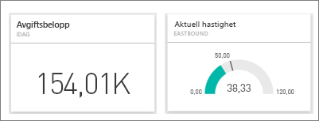
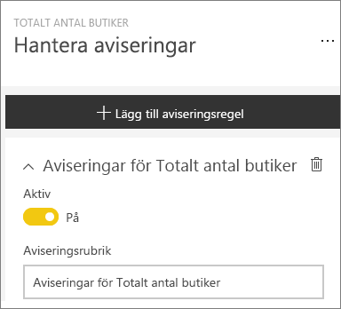
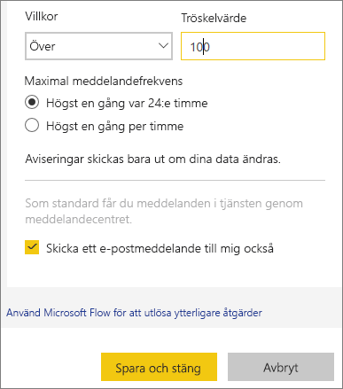
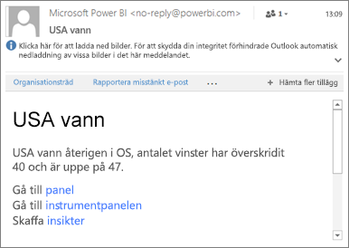
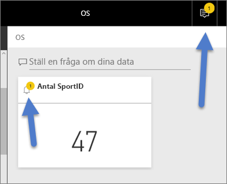
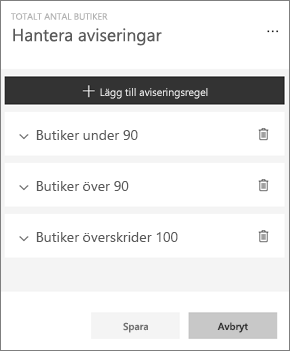
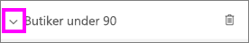
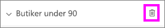
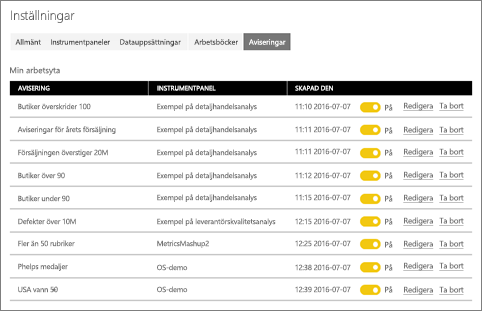

# Självstudie: Ange datavarningar i Power BI-tjänsten
Ställ in aviseringar som meddelar dig när data i dina instrumentpaneler har ändrats så att de överskrider de gränser du har angett. 

Du kan ställa in aviseringar på paneler om du har en Power BI Pro-licens, eller om någon har delat en instrumentpanel med dig från en [Premium-kapacitet](../service-premium.md). Aviseringar kan endast ställas in på paneler som har fästs från rapportvisualiseringar och endast på mätare, KPI:er och kort. Aviseringar kan ställas in på visuella objekt som skapats från direktuppspelande datauppsättningar som har fästs från en rapport till en instrumentpanel, men kan inte anges för direktuppspelande paneler som skapas direkt på en instrumentpanel med hjälp av **Lägg till panel** > **Anpassade direktuppspelande data**. 

Du kan endast se aviseringar som du anger, även om du delar din instrumentpanel. Datavarningar är helt synkroniserade på plattformar. Ställ in och visa datavarningar [i Power BI-appar](mobile/mobile-set-data-alerts-in-the-mobile-apps.md) och i Power BI-tjänsten. 

> [!WARNING]
> Datadrivna aviseringar ger information om dina data. Om du visar dina Power BI-data på en mobilenhet och den blir stulen, bör du använda Power BI-tjänsten för att inaktivera alla datadrivna aviseringar.
> 

Den här självstudien beskriver följande.
> [!div class="checklist"]
> * Vem kan ställa in aviseringar?
> * Vilka visuella objekt har stöd för aviseringar?
> * Vem kan se mina aviseringar?
> * Fungerar aviseringar i Power BI Desktop och Mobile?
> * Hur skapar jag en avisering?
> * Var får jag mina aviseringar?

Om du inte har registrerat dig för Power BI [registrerar du dig för en kostnadsfri utvärderingsversion](https://app.powerbi.com/signupredirect?pbi_source=web) innan du börjar.

## Ange datavarningar i Power BI-tjänsten
Se när Amanda lägger till aviseringar i paneler på sin instrumentpanel. Prova sedan själv genom att följa de stegvisa anvisningarna under videon.

<iframe width="560" height="315" src="https://www.youtube.com/embed/JbL2-HJ8clE" frameborder="0" allowfullscreen></iframe>

I det här exemplet används en kortpanel från exempelinstrumentpanelen [Detaljhandelsanalys](http://go.microsoft.com/fwlink/?LinkId=529778).

1. Välj ellipserna (tre punkter) från en mätare, KPI eller kortpanel på instrumentpanelen.
   
   
2. Välj klockikonen  eller **Hantera aviseringar** för att lägga till en eller flera aviseringar för **Totalt antal butiker**.
   
1. I fönstret **Hantera aviseringar** väljer du **+Lägg till regel för avisering**.  Se till att skjutreglaget är inställt på **På** och ge aviseringen ett namn. Namnet hjälper dig att identifiera aviseringarna.
   
   
4. Bläddra nedåt och ange detaljerad information om aviseringen.  I det här exemplet ska vi skapa en avisering som meddelar oss en gång om dagen om antalet totala butiker går över 100. Aviseringar visas i meddelandecentret. Power BI kommer också att skicka ett e-postmeddelande.
   
   
5. Välj **Spara och stäng**.

## Ta emot aviseringar
När data som spåras når något av dina angivna tröskelvärden sker flera saker. Först kontrollerar Power BI om mer än en timme eller mer än 24 timmar har gått (beroende på vilket alternativ som du valde) sedan den senaste aviseringen skickades. Så länge data har passerat tröskelvärdet får du en avisering.

Därefter skickar Power BI en avisering till meddelandecentret och, om du vill, via e-post. Varje avisering innehåller en direktlänk till dina data. Välj länken för att se relevant panel.  

1. Om du har valt att skicka ett e-postmeddelande kommer du att se följande i din inkorg.
   
   
2. Power BI lägger till ett meddelande i **meddelandecentret** och lägger till en ny aviseringsikon i den berörda panelen.
   
   
3. Öppna meddelandecentret om du vill se detaljerad information om aviseringen.
   
    
   
   > [!NOTE]
   > Aviseringar fungerar bara på data som ska uppdateras. När data uppdateras söker Power BI för att se om en avisering har angetts för dessa data. Om data har uppnått ett tröskelvärde utlöses en avisering.
   > 
   > 

## Hantera aviseringar
Det finns många sätt att hantera dina aviseringar: Från paneler i instrumentpanelen, Power BI-inställningsmenyn och på en enskild panel i [Power BI-mobilappen på iPhone](mobile/mobile-set-data-alerts-in-the-mobile-apps.md) eller i [Power BI-mobilappen för Windows 10](mobile/mobile-set-data-alerts-in-the-mobile-apps.md).

### Från själva panelen
1. Om du behöver ändra eller ta bort en avisering för en panel öppnar du fönstret **Hantera aviseringar** på nytt genom att välja klockikonen . Alla aviseringar som du har angett för panelen visas.
   
    .
2. Om du vill ändra en avisering, väljer du pilen till vänster om aviseringens namn.
   
    .
3. Om du vill ta bort en avisering, väljer du papperskorgen till höger om aviseringens namn.
   
      

### På inställningsmenyn för Power BI
1. Välj kugghjulsikonen från menyfältet i Power BI.
   
    .
2. Välj **Aviseringar** under **Inställningar**.
   
    
3. Härifrån kan du aktivera och inaktivera aviseringar, öppna fönstret **Hantera aviseringar** för att ändra eller ta bort aviseringen.

## Tips och felsökning
* Aviseringar stöds inte för närvarande för Bing paneler eller kortpaneler med datum-/tidsmått.
* Aviseringar fungerar bara med numeriska datatyper.
* Aviseringar fungerar bara på data som ska uppdateras. De fungerar inte på statiska data.
* Aviseringar fungerar bara på direktöverförda datauppsättningar om du bygger en mätare-KPI/kort för det visuella objektet och fäster det visuella objektet på instrumentpanelen.

## Rensa resurser
Instruktioner för att ta bort aviseringar beskrivs ovan. Du väljer kugghjulsikonen från menyfältet i Power BI. Välj **Aviseringar** under **Inställningar** och ta bort aviseringen.

> [!div class="nextstepaction"]
> [Ställa in dataaviseringar på din mobilenhet](mobile/mobile-set-data-alerts-in-the-mobile-apps.md)

