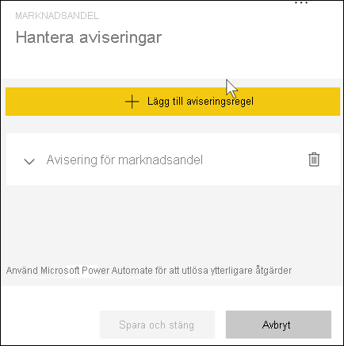

# Självstudie: Ställa in aviseringar för instrumentpaneler i Power BI

[!INCLUDE[consumer-appliesto-ynny](../includes/consumer-appliesto-ynny.md)]

[!INCLUDE [power-bi-service-new-look-include](../includes/power-bi-service-new-look-include.md)]

Ställ in aviseringar som meddelar dig när data i dina instrumentpaneler har ändrats så att de överskrider eller underskrider de gränser du har angett. Aviseringar fungerar för mätare, KPI: er och kort. Den här funktionen här fortfarande under utveckling, så [Läs avsnittet tips och felsökning nedan](#tips-and-troubleshooting).

Du kan endast se aviseringar som du anger, även om du delar din instrumentpanel. Datavarningar är helt synkroniserade på plattformar. Ställ in och visa datavarningar [i Power BI-appar](mobile/mobile-set-data-alerts-in-the-mobile-apps.md) och i Power BI-tjänsten. 

> [!WARNING]
> De här aviseringarna ger information om dina data. Om du visar dina Power BI-data på en mobilenhet och den blir stulen, bör du använda Power BI-tjänsten för att inaktivera alla aviseringar.
> 

Den här självstudien beskriver följande.
> [!div class="checklist"]
> * Vem kan ställa in aviseringar?
> * Vilka visuella objekt har stöd för aviseringar?
> * Vem kan se mina aviseringar?
> * Fungerar aviseringar i Power BI Desktop och Mobile?
> * Så här skapar du en avisering
> * Var får jag mina aviseringar?

Om du inte har registrerat dig för Power BI [registrerar du dig för en kostnadsfri utvärderingsversion](https://app.powerbi.com/signupredirect?pbi_source=web) innan du börjar.

I det här exemplet används en instrumentpanels kortpanel från appen Försäljnings- och marknadsföringsexempel. Appen finns tillgänglig på [Microsoft AppSource](https://appsource.microsoft.com). Information om hur du hämtar appen finns i [Installera och använda appar med Power BI](end-user-app-view.md).

1. Välj ellipserna (tre punkter) från en mätare, KPI eller kortpanel på instrumentpanelen.
   
   
2. Välj klockikonen  eller **Hantera aviseringar** för att lägga till en eller flera aviseringar för **Totalt antal butiker**.

   

   
1. I fönstret **Hantera aviseringar** väljer du **+Lägg till regel för avisering**.  Se till att skjutreglaget är inställt på **På** och ge aviseringen ett namn. Namnet hjälper dig att identifiera aviseringarna.
   
   
4. Bläddra nedåt och ange detaljerad information om aviseringen.  I det här exemplet ska vi skapa en avisering som meddelar oss en gång om dagen om vår marknadsandel ökar till 35 eller högre. Aviseringar visas i meddelandecentret. Power BI kommer också att skicka ett e-postmeddelande.
   
   
5. Välj **Spara och stäng**.
 
   > [!NOTE]
   > Aviseringar fungerar bara på data som ska uppdateras. När data uppdateras söker Power BI för att se om en avisering har angetts för dessa data. Om data har uppnått ett tröskelvärde utlöses en avisering. 
   > 

## Ta emot aviseringar
När data som spåras når något av dina angivna tröskelvärden sker flera saker. Först kontrollerar Power BI om mer än en timme eller mer än 24 timmar har gått (beroende på vilket alternativ som du valde) sedan den senaste aviseringen skickades. Så länge data har passerat tröskelvärdet får du en avisering.

Därefter skickar Power BI en avisering till Meddelandecenter och, om du vill, via e-post. Varje avisering innehåller en direktlänk till dina data. Välj länken för att se relevant panel.  

1. Om du har valt att skicka ett e-postmeddelande kommer du att se följande i din inkorg. Den här aviseringen ställer vi in på en annan instrumentpanel, som spårar uppgifter som utförts av användbarhetsteamet.
   
   
2. Power BI lägger till ett meddelande i **meddelandecentret** och lägger till en ny aviseringsikon i den berörda panelen.
   
   
3. Öppna meddelandecentret om du vill se detaljerad information om aviseringen.
   
    
   
  

## Hantera aviseringar

Det finns många sätt att hantera dina aviseringar: Från paneler i instrumentpanelen, Power BI-inställningsmenyn och på en enskild panel i [Power BI-mobilappen på iPhone](mobile/mobile-set-data-alerts-in-the-mobile-apps.md) eller i [Power BI-mobilappen för Windows 10](mobile/mobile-set-data-alerts-in-the-mobile-apps.md).

### Från själva panelen

1. Om du behöver ändra eller ta bort en avisering för en panel öppnar du fönstret **Hantera aviseringar** på nytt genom att välja klockikonen . Alla aviseringar som du har angett för panelen visas.
   
    .
2. Om du vill ändra en avisering, väljer du pilen till vänster om aviseringens namn.
   
    .
3. Om du vill ta bort en avisering, väljer du papperskorgen till höger om aviseringens namn.
   
      

### På inställningsmenyn för Power BI

1. Välj kugghjulsikonen från menyfältet i Power BI.
   
    .
2. Välj **Aviseringar** under **Inställningar**.
   
    
3. Härifrån kan du aktivera och inaktivera aviseringar, öppna fönstret **Hantera aviseringar** för att ändra eller ta bort aviseringen.

## Tips och felsökning 

* Aviseringar kan bara ställas in på mätare, KPI:er och kort.
* Om du inte kan ställa in en avisering för en mätare, KPI eller ett kort kan du kontakta systemadministratören och be om hjälp. Ibland är aviseringar inaktiverade eller otillgängliga för instrumentpanelen eller för vissa typer av paneler på instrumentpanelen.
* Aviseringar fungerar bara på data som ska uppdateras. De fungerar inte på statiska data. De flesta av de exempel som tillhandahålls av Microsoft är statiska. 
* *Användare* skapar inte några egna instrumentpaneler utan *designers* skapar instrumentpaneler som delas med användarna. För att ta emot och visa delat innehåll behövs en Power BI Pro- eller Premium-licens. Mer information finns i [Vilken licens har jag?](end-user-license.md) 

## Rensa resurser
Instruktioner för att ta bort aviseringar beskrivs ovan. Du väljer kugghjulsikonen från menyfältet i Power BI. Välj **Aviseringar** under **Inställningar** och ta bort aviseringen.

> [!div class="nextstepaction"]
> [Ställa in dataaviseringar på din mobilenhet](mobile/mobile-set-data-alerts-in-the-mobile-apps.md)

