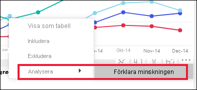
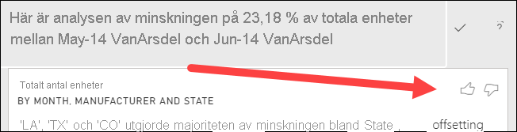
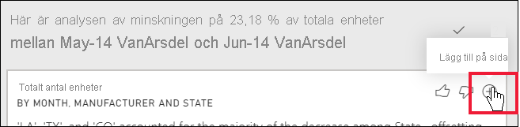

# Använd funktionen analysera för att förklara variationer i visuella rapportobjekt (förhandsversion)

[!INCLUDE[consumer-appliesto-ynnn](../includes/consumer-appliesto-ynnn.md)]

Ofta ser du i visuella rapportobjekt en stor ökning och sedan ett brant fall i värden och undrar vad dessa variationer beror på. Med **Analysera** i **Power BI-tjänsten** så kan du få reda på orsaken med bara några klick.

Överväg till exempel följande visuella objekt som visar *Totalt antal enheter* efter *Månad* och *Tillverkare*. VanArsdel slår sina konkurrenter, men upplever en ordentlig dipp under juni 2014. I sådana fall kan du utforska data för att förklara förändringen. 

Du kan be Power BI-tjänsten att förklara ökningar, minskningar eller ovanliga distributioner i visuella objekt och få snabba, automatiserade, insiktsfulla analyser om dina data. Det är bara att högerklicka på en datapunkt och välja **Analysera > Förklara minskningen** (eller ökningen, om den tidigare stapeln var lägre), eller **Analysera > Hitta var den här distributionen skiljer sig** så får du insikten i ett lättanvänt fönster.

Analysera-funktionen är sammanhangsberoende och bygger på den direkt föregående datapunkten, till exempel föregående stapel eller kolumn.

> [!NOTE]
> Den här funktionen är en förhandsversion och kan komma att ändras. Funktionen insikter är aktiverat som standard (du behöver inte markera kryssrutan Förhandsgranskning för att aktivera den).

### Vilka faktorer och kategorier som väljs

Efter att ha undersökt de olika kolumnerna väljer och visar Power BI de som uppvisar den största förändringen av relativt bidrag. För varje kolumn framhävs i beskrivningen värdena med den mest betydande bidragsförändringen. Dessutom framhävs även värdena med de största faktiska ökningarna och minskningarna.

Använd rullningslisten om du vill se alla insikter som genererats av Power BI. Ordningen rangordnas och den viktigaste deltagaren visas först. 

## Använda insikter
Om du vill använda insikter för att förklara trender i visuella objekt högerklickar du på en datapunkt i ett stapel- eller linjediagram och väljer **Analysera**. Välj sedan det alternativ som visas: **förklara ökningen**, **förklara minskningen** eller **förklara skillnaden**.

Power BI kör sedan maskininlärningsalgoritmer för dessa data och fyller ett fönster med ett visuellt objekt och en beskrivning som visar vilka kategorier som har påverkat ökningen, minskningen eller skillnaden mest.  I det här exemplet är den första insikten ett vattenfallsdiagram.

Genom att välja små ikoner längst ned i vattenfallsdiagrammet kan du låta insikterna visas som ett punktdiagram, stående stapeldiagram eller ett diagram i menyfliksområdet.

Använd ikonerna *tummen upp* och *tummen ned* överst på sidan för att ge feedback om det visuella objektet och funktionen.  

Du kan använda insikter när rapporten är i läs- eller redigeringsvy, vilket gör det flexibelt både för dataanalys och för att skapa visuella objekt som du enkelt kan lägga till i dina rapporter. Om rapporten är öppen i redigeringsvyn visas en plus-ikon bredvid tum-ikonerna. Välj plus-ikonen för att lägga till insikter i rapporten som ett nytt visuellt objekt. 

## Information om de returnerade resultaten

Informationen som returneras av insikterna är tänkt att markera vad skillnaden var mellan de två tidsperioderna, så att du kan förstå förändringen mellan dem.  

Algoritmen kan betraktas som att den tar alla andra kolumner i modellen och gör en detaljberäkning efter den kolumnen för tidsperioderna *före* och *efter*, där det fastställs hur stor förändring som skedde på den detaljnivån, och returnerar sedan kolumnerna med den största förändringen. Till exempel har *Delstat* valts i vattenfallsinsikten ovan, eftersom det bidrag som gjorts av Louisiana, Texas och Colorado sjönk 13 % till 19 % från juni till juli, och bidragit till minskningen i *Totala enheter*.  

För varje returnerad insikt finns det fyra visuella objekt som kan visas. Tre av dessa visuella objekt är tänkta att markera förändringen i bidrag mellan de två tidsperioderna. Till exempel förklaringen av ökningen från *Qtr 2* (Kvartal 2) till *Qtr 3* (Kvartal 3). Menyfliksområdesdiagrammet visar ändring både före och efter den markerade datapunkten.

### Punktdiagram

Punktdiagrammet visar värdet av måttet i den första tidsperioden (på x-axeln) mot värdet av måttet i den andra tidsperioden (på y-axeln) för varje värde i kolumnen (i det här fallet *Delstat*). Datapunkter visas i den gröna regionen om värdet har ökat och i den röda regionen om det har minskat. 

Den prickade linjen anger den bästa inpassningen och datapunkterna ovanför den här linjen ökade mer än den övergripande trenden och de nedanför linjen med mindre.  

Observera att dataobjekt vars värden var tomma i någon av perioderna inte visas i punktdiagrammet.

### 100 % stående stapeldiagram

Det 100 % stående stapeldiagrammet visar värdet för bidraget till totalsumman (100 %), för den valda datapunkten och föregående. På så sätt kan du göra en jämförelse sida-vid-sida av varje datapunkts bidrag. I det här exemplet visar knappbeskrivningarna det faktiska bidraget för det valda värdet Texas. Eftersom listan över tillstånd är lång, hjälper knappbeskrivningar dig att se detaljerna. Med hjälp av knappbeskrivningarna ser vi att Texas har bidragit med samma procent till totalt antal enheter (31 % och 32 %), men det faktiska totala antalet enheter minskade från 89 till 71. Kom ihåg att Y-axeln är en procentandel och inte en totalsumma och att varje kolumnband är ett procenttal, inte ett värde. 

### Banddiagram

Banddiagrammet visar också värdet av måttet före och efter. Det är särskilt användbart för att visa förändringarna i bidrag när *ordningen* på bidragare har förändrats (till exempel om *LA* har fallit från andra bidragare till nummer elva).  Men även om *TX* representeras av ett bred band som visar att det är den viktigaste bidragaren före och efter så visar fallet att värdet på bidraget minskade både under den valda perioden och efter.

### Vattenfallsdiagram

Det fjärde visuella objektet är ett vattenfallsdiagram som visar faktiska ökningar eller minskningar mellan perioderna. Det här visuella objektet visar tydligt en betydande bidragare till minskningen under juni 2014, i det här fallet **Delstat**. Och specifikationerna för **Delstaters** påverkan på totala enheter som minskade i Louisiana, Texas och Colorado spelade mest betydelsefull roll.      

 

## Överväganden och begränsningar
Eftersom dessa insikter baseras på ändringar från tidigare datapunkter är de inte tillgängliga när du väljer den första datapunkten i ett visuellt objekt. 

**Analysera** finns inte tillgängligt för alla typer av visuella objekt. 

Följande lista är en samling av de scenarier för tillfället inte stöds **Analysera – förklara ökningen/minskningen/skillnaden**:

* TopN-filter
* Inkludera/exkludera filter
* Måttfilter
* Icke-numeriska mått
* Användning av ”Visa värde som”
* Filtrerade mått – Filtrerade mått är beräkningar på visuell nivå med ett specifikt filter (till exempel *totalförsäljningen för Frankrike*), och används i vissa visuella objekt som skapas av funktionen Insikter
* Kategoriska kolumner på x-axeln, såvida inte den definierar en skalär sortering enligt kolumn. Om du använder en hierarki måste alla kolumner i den aktiva hierarkin matcha det här villkoret

## Nästa steg
[Vattenfallsdiagram](../visuals/power-bi-visualization-waterfall-charts.md)    
[Punktdiagram](../visuals/power-bi-visualization-scatter.md)
[Kolumndiagram](../visuals/power-bi-report-visualizations.md)
[Banddiagram](../visuals/desktop-ribbon-charts.md)
