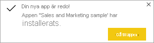

# Installera och använda exempelappen Sales & Marketing i Power BI-tjänsten

[!INCLUDE[consumer-appliesto-yyny](../includes/consumer-appliesto-yyny.md)]

Nu när du har [grundläggande förståelse för hur du hämtar Power BI-innehåll](end-user-app-view.md) ska vi hämta appen Marketing and Sales från Microsoft AppSource. 

## Hämta appen från Microsoft AppSource

1. Öppna [https://appsource.microsoft.com](https://appsource.microsoft.com).

   

1. Ange **Marketing** i sökfältet och markera **Förfina efter produkt > Power BI-appar**. 

    

1. Välj apptiteln **Microsoft Sample Sales & Marketing**. Du kan också läsa igenom översikten och recensionerna samt ta en titt på bilderna.  Välj sedan **Hämta nu**.

   

1. Bekräfta att du vill installera den här appen.

   

5. När appen har installerats visar Power BI-tjänsten ett meddelande om att det är klart. Välj **Gå till app** för att öppna appen. Beroende på hur designern har skapat appen visas antingen appens instrumentpanel eller appens rapport.

    

    Du kan också öppna appen direkt från applistan genom att välja **Appar** och sedan titeln **Sales & Marketing**.

    

6. Välj om du vill ansluta dina egna data, utforska med exempeldata eller anpassa och dela din nya app. Eftersom vi har valt en Microsoft-exempelapp börjar vi med att utforska. 

    

7.  Din nya app öppnas med en instrumentpanel. Appens *designer* skulle ha kunnat konfigurera appen så att den öppnas i en rapport i stället.  

    

## Interagera med instrumentpaneler och rapporter i appen
Ägna en stund åt att utforska data på de instrumentpaneler och i de rapporter som ingår i appen. Du har åtkomst till alla Power BI-standardinteraktioner som filtrering, syntaxmarkering, sortering och detaljinformation.  Är du fortfarande lite osäker på skillnaden mellan instrumentpaneler och rapporter?  Läs [artikeln om instrumentpaneler](end-user-dashboards.md) och [artikeln om rapporter](end-user-reports.md).  

## Nästa steg
* [Gå tillbaka till översikten över appar](end-user-apps.md)    
* [Visa en Power BI-rapport](end-user-report-open.md)    
* [Andra sätt att dela innehåll med dig](end-user-shared-with-me.md)
