# Installera och använda appar med instrumentpaneler och rapporter i Power BI
Nu när du har en [grundläggande förståelse av appar](end-user-apps.md) ska vi gå igenom hur du öppnar och interagerar med appar. 

## Olika sätt att skaffa en ny app
Du kan skaffa en ny app på olika sätt. En rapportdesignerkollega kan installera appen automatiskt på ditt Power BI-konto eller skicka dig en direktlänk till en app. Du kan också gå till AppSource och söka efter appar tillgängliga för dig från appdesigners både inom och utanför företaget. 

I Power BI på din mobila enhet kan du bara installera en app från en direktlänk och inte från AppSource. Om appdesignern installerar appen automatiskt visas den i din lista över appar.

## Installera en app från en direktlänk
Det enklaste sättet att själv installera en ny app är genom att få en direktlänk, i ett e-postmeddelande, från appdesignern.  

**På datorn** 

När du väljer länken i ett e-postmeddelande öppnar Power BI-tjänsten ([https://powerbi.com](https://powerbi.com)) appen i din webbläsare. 

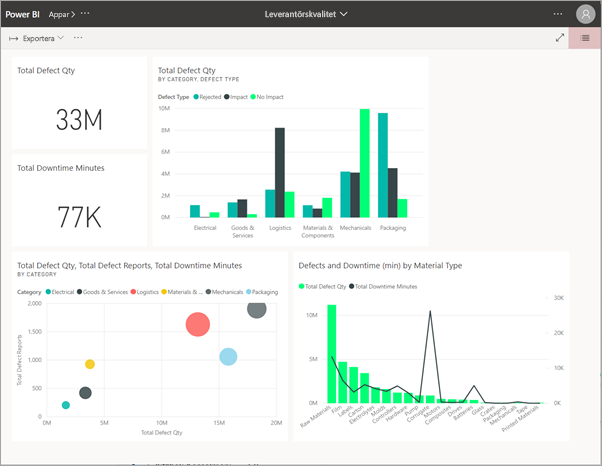

**På iOS- eller mobila Android-enheter** 

När du väljer länken i ett e-postmeddelande på din mobila enhet så installeras appen automatiskt och öppnas i mobilappen. Du kan behöva logga in först. 

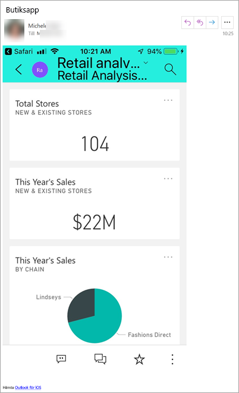

## Hämta appen från Microsoft AppSource
Du hittar även och kan installera appar i Microsoft AppSource. Det är bara appar du har åtkomst till (dvs. där appförfattaren har gett dig eller alla behörighet) som visas.

1. Välj **Appar**  > **Hämta appar**. 
   
    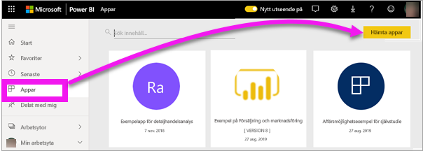    
2. I AppSource under **Min organisation** kan du söka för att begränsa resultaten och hitta den apn som du letar efter.
   
    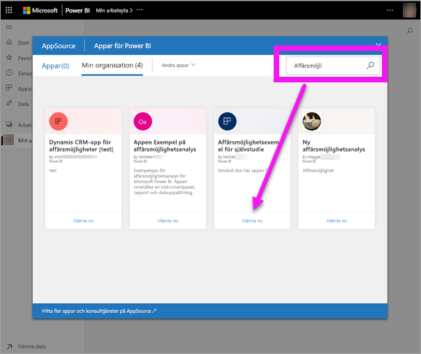
3. Välj **Hämta den nu** om du vill lägga till den i din innehållslista i Appar. 

## Hämta en app från webbplatsen Microsoft AppSource (https://appsource.microsoft.com)
I det här exemplet öppnar vi en av Microsofts exempelappar. På AppSource hittar du appar för många av de tjänster som du använder för att bedriva din verksamhet.  Tjänster som Salesforce, Microsoft Dynamics, Google Analytics, GitHub, Zendesk, Marketo och många fler. Mer information finns i [Appar för tjänster du använder med Power BI](../service-connect-to-services.md). 

1. Öppna https://appsource.microsoft.com i en webbläsare och välj **Power BI-appar**.

    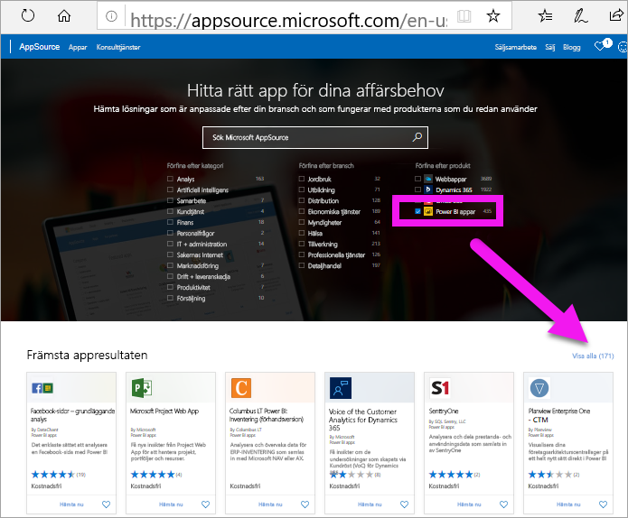

2. Välj **Visa alla** för att visa listan över alla Power BI-appar som för tillfället finns tillgängliga på AppSource. Bläddra eller sök efter appen med namnet **Microsoft-exempel – Försäljning och marknadsföring**.

    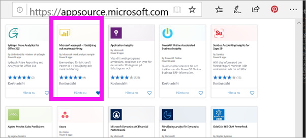

3. Välj **Hämta nu** och godkänn användningsvillkoren.

    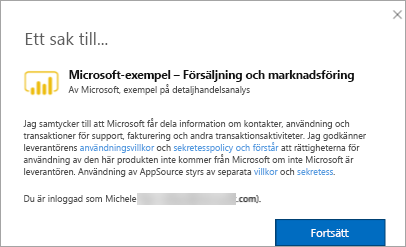

4. Bekräfta att du vill installera den här appen.

    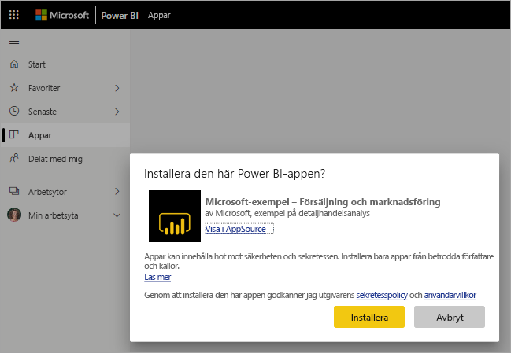

5. När appen har installerats visas ett meddelande om att det är klart i Power BI-tjänsten. Välj **Gå till app** för att öppna appen. Beroende på hur designern har skapat appen visas antingen appens instrumentpanel eller appens rapport.

    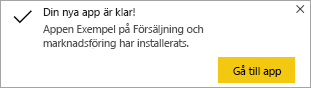

    Du kan också öppna appen direkt från din innehållslista för appar genom att markera **Appar** och välja **Försäljning och marknadsföring**.

    

6. Välj om du vill utforska eller anpassa och dela din nya app. Eftersom vi har valt en Microsoft-exempelapp börjar vi med att utforska. 

    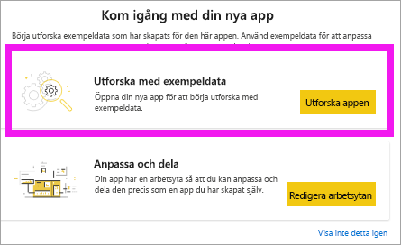

7.  Din nya app öppnas med en instrumentpanel. Appens *designer* skulle ha kunnat konfigurera appen så att den öppnas i en rapport i stället.  

    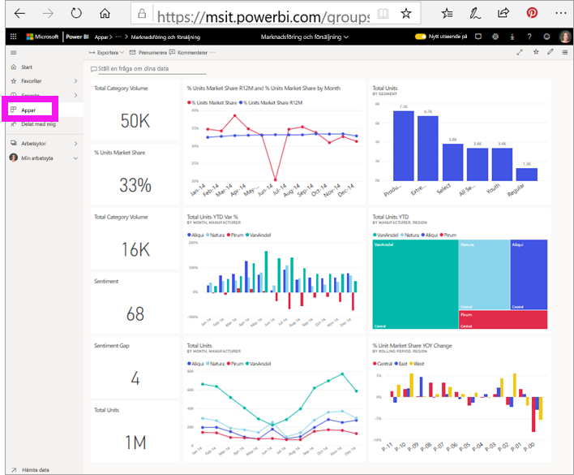

## Interagera med instrumentpaneler och rapporter i appen
Ägna en stund åt att utforska data på de instrumentpaneler och i de rapporter som ingår i appen. Du har åtkomst till alla Power BI-standardinteraktioner som filtrering, syntaxmarkering, sortering och detaljinformation.  Är du fortfarande lite osäker på skillnaden mellan instrumentpaneler och rapporter?  Läs [artikeln om instrumentpaneler](end-user-dashboards.md) och [artikeln om rapporter](end-user-reports.md).  

## Nästa steg
* [Gå tillbaka till översikten över appar](end-user-apps.md)
* [Visa en Power BI-rapport](end-user-report-open.md)
* [Andra sätt att dela innehåll med dig](end-user-shared-with-me.md)
