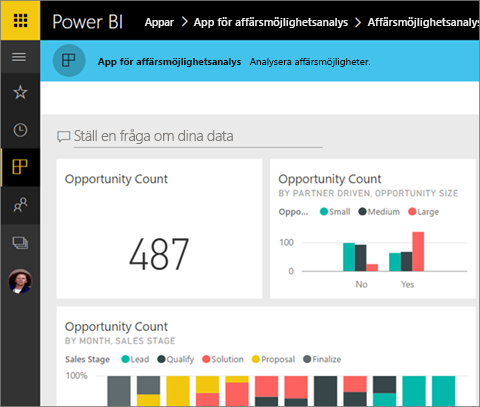
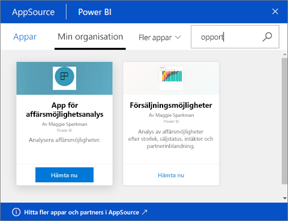
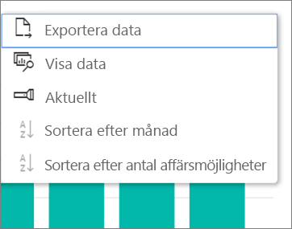

# Installera och använda appar med instrumentpaneler och rapporter i Power BI
Nu när du har en [grundläggande förståelse av appar](end-user-apps.md) ska vi gå igenom hur du öppnar och interagerar med appar. 

## Olika sätt att skaffa en ny app
Kom ihåg att du kan skaffa en ny app på olika sätt. En rapportdesignerkollega kan installera appen automatiskt på ditt Power BI-konto eller skicka dig en direktlänk till en app. Och du kan gå till AppSource och söka efter appar tillgängliga för dig från både inom och utanför företaget. 

I Power BI på din mobila enhet kan du bara installera en app från en direktlänk och inte från AppSource. Om appförfattaren installerar appen automatiskt, så visas den i din lista över appar.

### Installera en app från en direktlänk
Det enklaste sättet att själv installera en ny app är genom att få en direktlänk, i ett e-postmeddelande, från appförfattaren.  

**På datorn** 

När du väljer länken i ett e-postmeddelande öppnas Power BI-tjänsten ([https://powerbi.com](https://powerbi.com)) i en webbläsare. Bekräfta att du vill installera appen, så öppnas Power BI på applandningssidan.

**På iOS- eller mobila Android-enheter** 

När du väljer länken i ett e-postmeddelande på din mobila enhet, så installeras appen automatiskt och öppnar appens innehållslista i mobilappen. 

### Hämta appen från Microsoft AppSource
Du hittar även och kan installera appar i Microsoft AppSource. Det är bara appar du har åtkomst till (dvs. där appförfattaren har gett dig eller alla behörighet) som visas.

1. Välj **Appar**  > **Hämta appar**. 
   
     
2. I AppSource under **Min organisation** kan du söka för att begränsa resultaten och hitta den apn som du letar efter.
   
     
3. Välj **Hämta den nu** om du vill lägga till den i din innehållslista i Appar. 

## Interagera med instrumentpaneler och rapporter i appen
Nu kan du utforska data i instrumentpanelerna och rapporterna i appen. Du har åtkomst till alla Power BI-standardinteraktioner som filtrering, syntaxmarkering, sortering och detaljinformation. Du kan även [exportera data till Excel ](end-user-export-data.md) från en tabell eller annat visuellt objekt i en rapport. Läs mer i [Interagera med rapporter i Power BI](end-user-reading-view.md). 

## Nästa steg
* [Power BI-appar för externa tjänster](end-user-connect-to-services.md)
* Har du några frågor? [Fråga Power BI Community](http://community.powerbi.com/)

