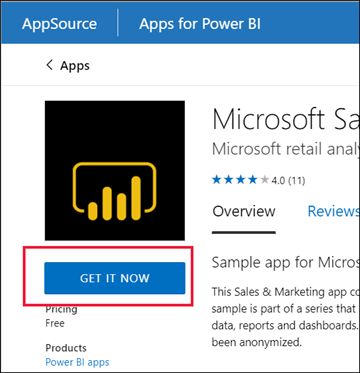

# Installera och använda appar med instrumentpaneler och rapporter i Power BI

[!INCLUDE[consumer-appliesto-ynny](../includes/consumer-appliesto-ynny.md)]

[!INCLUDE [power-bi-service-new-look-include](../includes/power-bi-service-new-look-include.md)]

Nu när du har en [grundläggande förståelse av appar](end-user-apps.md) ska vi gå igenom hur du öppnar och interagerar med appar. 

## Olika sätt att skaffa en ny app
Det finns flera sätt att skaffa en ny app:
* Du kan hämta den från Marketplace för Power BI-appar i Power BI-tjänsten.
* Du kan använda en direktlänk till en app som du har fått från appdesignern. 
* En appdesigner i organisationen kan installera appen automatiskt på ditt Power BI-konto.

Med Power BI Mobile kan du bara installera appar via direktlänk. Om appdesignern installerar appen automatiskt visas den i din lista över appar.

## Appar och licenser
Alla Power BI-användare kan inte visa och interagera med appar. 
- Om du har en kostnadsfri licens kan du öppna appar som lagras i en Premium-kapacitet och som delats med dig.  
- Om du har en Pro-licens kan du öppna appar som har delats med dig.

Kontakta administratören eller supportavdelningen om du inte kan öppna appar. Information om licensiering finns i [Power BI-licensiering](end-user-license.md).

## Hämta appen från Marketplace för Power BI-appar

Du kan söka efter och installera appar från Marketplace för Power BI-appar. I marketplace för appar kan du hämta både organisationsappar och mallappar.

- En *organisationsapp* är tillgänglig för Power BI-användare inom organisationen. Sådana appar kan även ha färdiga instrumentpaneler och rapporter som du kan använda i befintligt skick eller anpassa och dela med andra. Din organisation kan ha appar för att spåra försäljning, mäta resultat eller analysera nyanställda.
- En *mallapp* har färdiga instrumentpaneler och rapporter som du kan använda till att ansluta till många av de tjänster du använder i verksamheten, som Salesforce, Microsoft Dynamics och Google Analytics.

1. [Logga in på Power BI-tjänsten](./end-user-sign-in.md) om du inte redan har loggat in. 

1. När Power BI-tjänsten är öppen väljer du **Appar > Hämta appar**. 

    

1. Marketplace för Power BI-appar öppnas.

   

   Det finns tre flikar tillgängliga för användning:
   * **Alla appar** – Sök efter både mallappar och alla organisationsappar som finns tillgängliga för dig. Mallappar särskiljs med en shoppingbag-ikon i det övre högra hörnet på panelerna.
   * **Organisationsappar** – Sök efter organisationsappar som har delats med dig. 
   * **Mallappar** – bläddra bland mallappar som finns på AppSource.

   Du kan också använda sökrutan för att hämta ett filtrerat urval av appar. Om du skriver en del av namnet på en app eller en kategori som ekonomi, analys, marknadsföring osv., så blir det lättare för dig att hitta det objekt som du letar efter. 

   Sökrutan är känslig för fliken du har öppen – endast appar av den valda typen returneras. Om fliken **Alla appar** är öppen, returneras både organisationsappar och mallappar. Detta kan vara förvirrande när en organisationsapp och en mallapp har samma namn. Kom bara ihåg att mallappens paneler har en shoppingbag-ikon i det övre högra hörnet.

När du hittar den app du vill använda väljer du **Hämta nu** för att installera den.

   

* Om du installerar en organisationsapp läggs den omedelbart till i din lista med appar.
* Om du installerar en mallapp kommer du att gå till mallenapperbjudandet i AppSource. Se [ett exempel](end-user-app-marketing.md) på hur du laddar ner och installerar en exempelmallapp från Marketplace för Power BI-appar. Appen installeras tillsammans med en arbetsyta med samma namn.

   > [!NOTE]
   > Om du använder en kostnadsfri användarlicens kan du ladda ned appar, men du kan inte visa dem om du inte uppgraderar till ett Power BI Pro-konto. Annars måste appen lagras i en delad Premium-kapacitet. Mer information finns i [Licenser för företagsanvändare](end-user-license.md).

## Installera en app från en direktlänk
Du kan också installera en organisationsapp från en direktlänk i ett e-postmeddelande från App Designer.  

**På datorn** 

När du väljer länken i ett e-postmeddelande öppnar Power BI-tjänsten ([https://app.powerbi.com](https://app.powerbi.com)) appen i din webbläsare. 

**På iOS- eller mobila Android-enheter** 

När du väljer länken i ett e-postmeddelande på din mobila enhet så installeras appen automatiskt och öppnas i mobilappen. Du kan behöva logga in först. 

## Interagera med instrumentpaneler och rapporter i appen
Ägna en stund åt att utforska data på de instrumentpaneler och i de rapporter som ingår i appen. Du har åtkomst till alla Power BI-standardinteraktioner som filtrering, syntaxmarkering, sortering och detaljinformation.  Är du fortfarande lite osäker på skillnaden mellan instrumentpaneler och rapporter?  Läs [artikeln om instrumentpaneler](end-user-dashboards.md) och [artikeln om rapporter](end-user-reports.md).  

### Öppna en app

Du har installerat en app eller fått en app från en kollega. Om du vill visa appen öppnar du innehållslistan för appar genom att välja **Appar** i navigeringsfönstret.

Hovra över och välj den app du vill öppna. Beroende på appen kan du få ett meddelande som ser ut ungefär så här:

I [Installera mallappar](../connect-data/service-template-apps-install-distribute.md) kan du få hjälp med vad du ska välja.

Hovra över appen om du vill visa information och välj appkortet för att öppna appen.

Appen öppnas. Alla appar är olika. De har olika layout, kontroller, färger och alternativ. Alla appar har dock några gemensamma funktioner.

1. Appens namn och tiden för senaste uppdatering. Välj listrutan om du vill visa ägaren och hjälpkontakten.
1. Välj **Power BI** för att återgå till [Home](end-user-home.md).
1. Ditt åtgärdsfält. 
1. Rapportsidans arbetsyta.
1. Appnavigeringsfönstret.  Under appens namn hittar du listan med rapportsidor. Välj namnet på en rapportsida om du vill öppna den. För närvarande är sidan *Return rate* öppen. 
1. Välj pilen för att expandera rutan **Filter** .

Du kan också utforska den tillhörande arbetsytan. [Läs mer om arbetsytor](end-user-workspaces.md) Välj **Power BI** (nummer 2) för att återgå till **Start** och välj **Arbetsytor**. 

## Uppdatera en app 

Ibland kan appdesigners släppa nya versioner av sina appar. Ditt sätt att skaffa den nya versionen beror på hur du fick den ursprungliga versionen. 

* Om du fick appen från din organisation är uppdateringen av den nya versionen helt transparent – du behöver inte göra något. 

* Om du fick appen från AppSource visas en meddelandebanderoll nästa gång du öppnar appen. Meddelandet handlar om att en ny version är tillgänglig. 

    1. Välj **Hämta** för att uppdatera.  

        <!-- -->

    2. När du uppmanas att installera den uppdaterade appen väljer du **Installera**. 

         

    3. Eftersom du redan har en version av den här appen väljer du om du vill ersätta den befintliga versionen eller installera den uppdaterade appen på en ny arbetsyta.   

         

     > [!NOTE] 
     > När du installerar en ny version skrivs alla ändringar du har gjort av rapporter och instrumentpaneler över. Om du vill behålla dina uppdaterade rapporter och instrumentpaneler kan du spara dem med ett annat namn eller på en annan plats innan du installerar. 

    4. När du har installerat den uppdaterade versionen väljer du **Uppdatera app** för att slutföra uppdateringsprocessen. 

## Överväganden och felsökning

- Power BI-administratören kan aktivera och avaktivera möjligheten att installera appar. Kontakta IT-avdelningen eller supportavdelningen om du behöver aktivera den här funktionen.    
- För användning av appar behöver du antingen en Pro-licens, eller så måste appen vara lagrad i en delad Premium-kapacitet. [Läs mer om licenser](end-user-license.md).

## Nästa steg
* [Gå tillbaka till översikten över appar](end-user-apps.md)
* [Visa en Power BI-rapport](end-user-report-open.md)
* [Andra sätt att dela innehåll med dig](end-user-shared-with-me.md)

