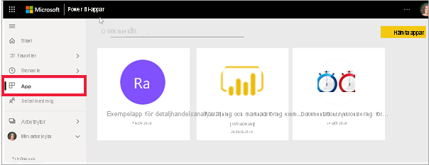
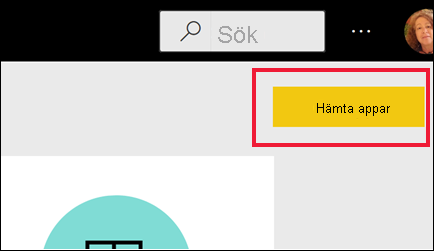
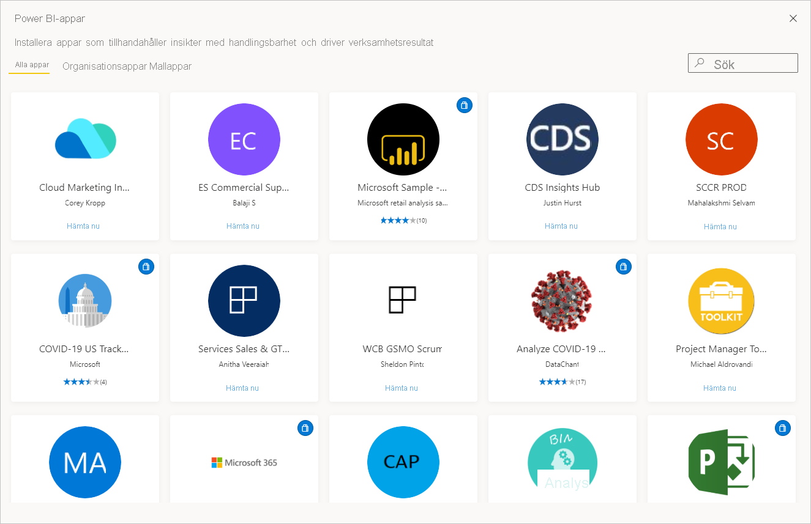

# Appar i Power BI

[!INCLUDE[consumer-appliesto-ynny](../includes/consumer-appliesto-ynny.md)]

[!INCLUDE [power-bi-service-new-look-include](../includes/power-bi-service-new-look-include.md)]

## Vad är en Power BI-app?
En *app* är en Power BI-innehållstyp som kombinerar relaterade instrumentpaneler och rapporter, samlat på en plats. En app kan ha en eller flera instrumentpaneler och en eller flera rapporter, alla samlade. Appar skapas av Power BI-*designers* som distribuerar och delar apparna med *konsumenter* som du. 

Apparna är ordnade i innehållslistan i **Appar**. Du väljer bara **Appar** för att visa dina appar. Hovra över en app för att se senaste uppdaterade datum och ägare. 

Om du vill använda appfunktionen behöver du en Power BI Pro-licens. Ett alternativ är att appen lagras i en Premium-kapacitet och delas med dig. Mer information om licenser och Premium-kapacitet finns i [Licenser för konsumenter](end-user-license.md).

## *Appdesigners* och *appkonsumenter*
Beroende på din roll kan du vara någon som skapar appar (*designer*) för eget bruk eller för att dela med kollegor. Eller så kanske du är någon som tar emot och laddar ned appar (*konsument*) som andra har skapat. Den här artikeln är för *appkonsumenter*.

## Fördelar med appar
Appar är ett enkelt sätt att dela olika typer av innehåll samtidigt. *Designers* av appar skapar instrumentpaneler och rapporter och samlar dem i en app. Samma *designers* kan sedan dela eller publicera appen till en plats där du, *konsumenten*, får åtkomst till den. Eftersom relaterade instrumentpaneler och rapporter samlas tillsammans blir det enklare för dig att hitta och installera dem, både i Power BI-tjänsten ([https://powerbi.com](https://powerbi.com)) och på din mobila enhet. När du har installerat en app behöver du inte längre komma ihåg namnet på en massa olika instrumentpaneler och rapporter, eftersom de har samlats tillsammans i en och samma app, i din webbläsare eller på din mobila enhet.

Och när appförfattare släpper uppdateringar, så ser du dem automatiskt. Författaren också styr också hur ofta data schemaläggs för uppdatering, så du inte behöver bry dig om att hålla det uppdaterat. 

<!-- add conceptual art -->
## Hämta en ny app
Det finns flera olika sätt att hämta en ny app. Du kan söka efter och installera appar, eller så kan de som skapat en app dela den med dig. 

### Söka efter och installera appar från marknadsplatsen för Power BI-appar
Ett sätt att hitta appar är att välja **Hämta app** på skärmen Appar i Power BI. 

Bläddra i listan med appar på marknadsplatsen för Power BI-appar tills du hittar en du vill installera. Välj från **Organisatoriska appar**, som endast är tillgängliga för personer inom företaget, eller **Mallappar**, som publiceras av Microsoft och communityn och som alla Power BI-användare kan installera. 

Det finns några andra sätt att hämta appar. Några av metoderna visas nedan. Behöver du detaljerade steg-för-steg-instruktioner för att hämta och utforska en app kan du i stället läsa [Öppna och interagera med en app](end-user-app-view.md).

* Appdesignern kan installera appen automatiskt på ditt Power BI-konto, och nästa gång du öppnar Power BI-tjänsten så visas den nya appen i innehållslistan i **Appar**. 
* Appdesignern kan skicka dig en direktlänk till en app via e-post. När du väljer länken öppnas appen i Power BI-tjänsten.
* I Power BI på din mobila enhet kan du bara installera en app via en direktlänk och inte från marknadsplatsen för appar. Om appförfattaren installerar appen automatiskt, så visas den i din lista över appar. 

## Nästa steg
* [Öppna och interagera med en app](end-user-app-view.md)
* [Andra sätt att dela innehåll](end-user-shared-with-me.md)

