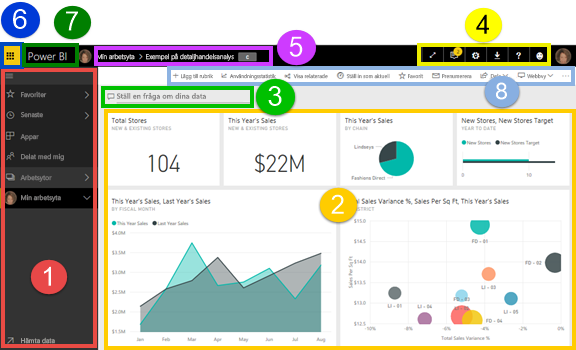
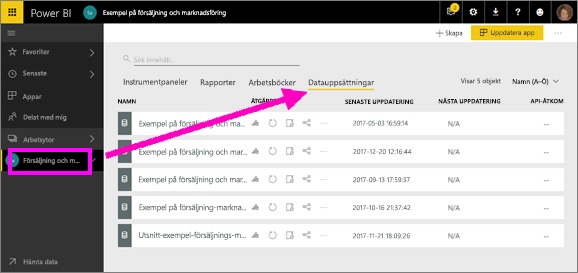
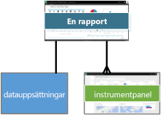
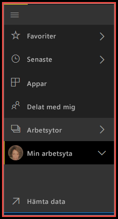

# Power BI – grundläggande begrepp för Power BI-tjänsten

Den här artikeln förutsätter att du redan har [registrerat dig för Power BI](../service-self-service-signup-for-power-bi.md)-tjänsten och [lagt till vissa data](../service-get-data.md).

När du öppnar Power BI-tjänsten, visas en ***instrumentpanel***. Instrumentpaneler är något som särskiljer Power BI-tjänsten från Power BI Desktop.

De viktigaste funktionerna i Power BI-tjänstens användargränssnitt är följande:

1. navigeringsfönster (vänster navigering)
2. arbetsyta (i det här fallet instrumentpanel med paneler)
3. ruta för frågor och svar
4. ikonknappar, inklusive för hjälp och feedback
5. panel på instrumentpanelen (navigeringssökväg, även kallat synlig sökväg)
6. Startprogram för Office 365-app
7. Power BI-hemknapp
8. Märkta ikonknappar

Vi går in på dessa senare, men först ska vi gå igenom några Power BI-begrepp.

Eller så kanske du vill se den här videon innan du läser resten av artikeln.  Videon går igenom de grundläggande begreppen och ger en genomgång av Power BI-tjänsten.

<iframe width="560" height="315" src="https://www.youtube.com/embed/B2vd4MQrz4M" frameborder="0" allowfullscreen></iframe>

## Power BI-begrepp
De fyra huvudsakliga byggblocken i Power BI är ***instrumentpaneler***, ***rapporter***, ***arbetsböcker*** och ***datauppsättningar***. Och alla är uppdelade i ***arbetsytor***. Det är viktigt att förstå sig på arbetsytorna innan vi går vidare till de fyra byggstenarna, så vi börjar där. 

## Arbetsytor
Arbetsytor är containrar för instrumentpaneler, rapporter, arbetsböcker och datauppsättningar i Power BI. Det finns två typer av arbetsytor: *Min arbetsyta* och *apparbetsytor*. Så, vad är en *app*? En *Power BI-app* är en samling av instrumentpaneler och rapporter som skapats för att leverera nyckelvärden för din organisation. Appar är interaktiva men kan inte redigeras. 

- *Min arbetsyta* är en personlig arbetsyta där vilken Power BI-kund som helst kan arbeta med sitt eget innehåll. Bara du har åtkomst till Min arbetsyta. Du kan dela instrumentpaneler och rapporter från Min arbetsyta. Om du vill samarbeta på instrumentpaneler och rapporter, eller skapa en app, vill du kanske sedan arbeta på en apparbetsyta.      
-  *Apparbetsytor* används för att samarbeta och dela innehåll med kollegor. Det är också där du skapar, publicerar och hanterar appar för din organisation. Du kan se dem som mellanlagringsområden och containrar för det innehåll som ska utgöra en Power BI-app. Du kan lägga till kollegor till dina apparbetsytor och samarbeta kring instrumentpaneler, rapporter, arbetsböcker och datauppsättningar. Alla apparbetsytans medlemmar behöver Power BI Pro-licenser, men appkonsumenterna (de kollegor som har tillgång till apparna) behöver inte nödvändigtvis Pro-licenser.  

Mer information finns i avsnittet **Dela ditt arbete** i innehållsförteckningen med början i [Hur ska jag samarbeta kring och dela instrumentpaneler och rapporter?](../service-how-to-collaborate-distribute-dashboards-reports.md)

Nu går vi vidare till Power BI-byggstenarna. Du kan inte ha instrumentpaneler och rapporter utan data (eller, du kan ha tomma instrumentpaneler och tomma rapporter, men de är inte användbara förrän de har data), så vi börjar med **datauppsättningar**.

## Datauppsättningar
En *datauppsättning* är en samling data som du *importerar* eller *ansluter* till. Med Power Bi kan du ansluta till och importera alla typer av datauppsättningar och placera dem tillsammans på en och samma plats.  

Datauppsättningar är associerade med *arbetsytor* och en enskild datauppsättning kan ingå i många arbetsytor. När du öppnar en arbetsyta, visas de associerade datauppsättningarna under fliken **Datauppsättningar**. Varje listad datauppsättning representerar en enskild datakälla, till exempel en Excel-arbetsbok på OneDrive, eller en lokal SSAS tabular-datauppsättning eller en Salesforce-datauppsättning. Det finns många olika datakällor som stöds och vi lägger till nya hela tiden. [Visa en lista över datauppsättningstyper som kan användas med Power BI](../service-get-data.md).

I exemplet nedan har jag markerat apparbetsytan ”Försäljning och marknadsföring” och klickat på fliken för **Datauppsättningar**.

**EN** datauppsättning ...

* kan användas flera gånger på en eller flera arbetsytor.
* kan användas i olika rapporter.
* Visualiseringar från denna enda datauppsättning kan visas på många olika instrumentpaneler.
  
  

För att [ansluta till eller importera en datauppsättning](../service-get-data.md) väljer du **Hämta data** (längst ned i det vänstra navigeringsfönstret) eller väljer **+ Skapa > Datauppsättning** (i det övre högra hörnet). Följ instruktionerna för att ansluta till eller importera den specifika källan och lägga till datauppsättningen till den aktiva arbetsytan. Nya datauppsättningar markeras med en gul asterisk. Ditt arbete i Power BI ändrar inte den underliggande datauppsättningen.

Om du [ingår i en ***app-arbetsyta***](../service-collaborate-power-bi-workspace.md), är datauppsättningar som lagts till av en medlem i arbetsytan tillgängliga för de andra medlemmarna på arbetsytan.

Datauppsättningar kan uppdateras, döpas om, utforskas och tas bort. Du kan använda en datauppsättning för att skapa en rapport från grunden eller genom att köra [Quick Insights](end-user-insights.md).  Om du vill se vilka rapporter och instrumentpaneler som redan använder en datauppsättning, väljer du **Visa relaterade**. Välj datauppsättningen för att utforska den. Vad du faktiskt gör är att öppna datauppsättningen i rapportredigeraren där du verkligen kan börja utforska data och skapa visualiseringar. Så låt oss gå vidare till nästa avsnitt  – rapporter.

### Gå djupare
* [Power BI Premium – vad är det?](../service-premium.md)
* [Hämta data för Power BI](../service-get-data.md)
* [Exempel på datauppsättningar för Power BI](../sample-datasets.md)

## Rapporter
En Power BI-rapport är en eller flera sidor av visualiseringar (tabeller och diagram som linjediagram, cirkeldiagram, treemap-diagram med fler). Visualiseringar kallas också ***visuella objekt***. Alla visualiseringar i en rapport kommer från en enda datauppsättning. Rapporter kan skapas från grunden i Power BI, importeras med instrumentpaneler som kollegor delar med dig eller skapas när du ansluter till datauppsättningar från Excel, Power BI Desktop, databaser, SaaS-program och [appar](../service-get-data.md).  När du ansluter till en Excel-arbetsbok med Power View-blad, skapar Power BI en rapport baserad på dessa blad. Och när du ansluter till ett SaaS-program, importerar Power BI en förskapad rapport.

Det finns två lägen för att visa och interagera med rapporter: [läsvyn och redigeringsvyn](end-user-reading-view.md).  Endast den person som skapade rapporten, delägare och de som beviljats behörighet, har åtkomst till alla funktionerna för utforskning, design, version och delning i rapportens ***Redigeringsvy***. Och de personer som de delar rapporten med kan utforska och interagera med rapporten med hjälp av ***Läsvy***.   

När du öppnar en arbetsyta, visas de associerade rapporterna under fliken **Rapporter**. Varje listad rapport representerar en eller flera sidor med visualiseringar baserade på endast en av de underliggande datauppsättningarna. Om du vill öppna en rapport, markerar du den. 

När du öppnar en app, visas en instrumentpanel.  För att komma åt en underliggande rapport väljer du en panel i instrumentpanelen (mer information om dessa senare) som har fästs från en rapport. Tänk på att inte alla paneler är fästa från rapporter, så du kan behöva klicka på några paneler för att hitta en rapport. 

Som standard öppnas rapporten i Läsvy.  Du behöver bara välja **Redigera rapport** för att öppna den i redigeringsvyn (om du har nödvändig behörighet). 

I exemplet nedan har jag markerat apparbetsytan ”Försäljning och marknadsföring” och klickat på fliken för **Rapporter**.

**EN** rapport ...

* ingår i en enda arbetsyta
* kan associeras med flera instrumentpaneler på den arbetsytan (paneler fästa från en rapport kan visas på flera instrumentpaneler).
* kan skapas med hjälp av data från en datauppsättning. (ett litet undantaget är att Power BI Desktop kan kombinera fler än en datauppsättning i en rapport och att rapporten inte kan importeras till Power BI)
  
  

### Gå djupare
* [Rapporter i Power BI-tjänsten och Power BI Desktop](end-user-reports.md)
* [Rapporter i Power BI-mobilappar](mobile/mobile-reports-in-the-mobile-apps.md)

## Instrumentpaneler
En *instrumentpanel* är något som du skapar **i Power BI-tjänsten** eller något en kollega skapar **i Power BI-tjänsten** och delar med dig. Det är en enda arbetsyta som innehåller noll eller flera paneler och widgetar. Varje panel som fästs från en rapport eller från [Frågor och svar](end-user-q-and-a.md) visar en enskild [visualisering](../visuals/power-bi-report-visualizations.md) som har skapats från en datauppsättning och fästs på instrumentpanelen. Hela rapportsidor kan också fästas på en instrumentpanel som en enskild panel. Det finns många sätt att lägga till paneler i instrumentpanelen; för många för att omfattas i det här översiktsavsnittet. Läs mer i [Paneler på instrumentpanelen i Power BI](end-user-tiles.md). 

Varför skapar man instrumentpaneler?  Här är några av orsakerna:

* för att få en överblick över all information som behövs för att fatta beslut
* för att övervaka den viktigaste informationen om verksamheten
* för att se till att alla kollegor är på samma sida och ser och använder samma information
* för att övervaka hälsotillståndet för ett företag, en produkt, en affärsenhet, en marknadsföringskampanj o.s.v.
* för att skapa en anpassad vy av en större instrumentpanel – alla mått som är viktiga för dig

När du öppnar en arbetsyta, visas de associerade instrumentpanelerna under fliken **Instrumentpaneler**. Välj en instrumentpanel för att öppna den. När du öppnar en app, visas en instrumentpanel.  Varje instrumentpanel representerar en anpassad vy av någon delmängd av den eller de underliggande datauppsättningarna.  Om du äger instrumentpanelen, har du också åtkomst för redigering till underliggande datauppsättning(ar) och rapporter.  Om instrumentpanelen har delats med dig kan du interagera med den och alla underliggande rapporter, men kan inte spara några ändringar.

Det finns många olika sätt som du eller en kollega kan [dela en instrumentpanel](../service-share-dashboards.md). Power BI Pro krävs för att dela en instrumentpanel och kan krävas för att visa en delad instrumentpanel.

> [!NOTE]
> Fästning och paneler beskrivs i detalj nedan under rubriken ”instrumentpanel med paneler”.
> 

**EN** instrumentpanel ...

* är kopplad till en enskild arbetsyta
* kan visa visualiseringar från många olika datauppsättningar
* kan visa visualiseringar från många olika rapporter
* kan visa visualiseringar som fästs från andra verktyg (t.ex. Excel)
  
  

### Gå djupare
* [Skapa en ny tom instrumentpanel och hämta sedan data](../service-dashboard-create.md) .
* [Duplicera en instrumentpanel](../service-dashboard-copy.md) 
* [Skapa en telefonvy av en instrumentpanel](../service-create-dashboard-mobile-phone-view.md)

## Arbetsböcker
Arbetsböcker är en särskild typ av datauppsättning. Om du har läst avsnittet **Datauppsättningar** ovan, vet du nästan allt du behöver veta om arbetsböcker. Men du kanske undrar varför Power BI ibland klassificerar en Excel-arbetsbok som **datauppsättning** och andra gånger som **arbetsbok**. 

När du använder **Hämta data** för Excel-filer, har du möjlighet att *importera* eller *ansluta* till filen. När du väljer Anslut visas arbetsboken i Power BI precis som den skulle ha gjort i Excel Online. Men till skillnad från i Excel Online har du några bra funktioner som hjälper dig fästa element från kalkylbladen direkt på instrumentpanelerna.

Du kan inte redigera din arbetsbok i Power BI. Men om du behöver göra några ändringar kan du välja Redigera och sedan välja att redigera din arbetsbok i Excel Online eller öppna den i Excel på datorn. Alla ändringar du gör sparas i arbetsboken på OneDrive.

### Gå djupare
* [Hämta data från Excel-arbetsboksfiler](../service-excel-workbook-files.md)
* [Publicera till Power BI från Excel](../service-publish-from-excel.md)

## Min arbetsyta
Vi har gått igenom arbetsytor och byggstenar. Låt oss ta ytterligare en titt på Power BI-gränssnittet och gå igenom de delar som utgör Power BI-tjänstens landningssida.

### 1. **Navigeringsfönster** (vänster)
Du använder navigeringsfönstret för att leta upp och flytta mellan arbetsytorna och Power BI-byggstenarna: instrumentpaneler, rapporter, arbetsböcker och datauppsättningar.  

  

* Välj **Hämta data** för att [lägga till datauppsättningar, rapporter och instrumentpaneler i Power BI](../service-get-data.md).
* Expandera eller komprimera navigeringsfältet med den här ikonen .
* Öppna eller hantera ditt favoritinnehåll genom att välja **Favoriter**.
* Visa och öppna ditt senast besökta innehåll genom att välja **Senaste**.
* Visa, öppna eller ta bort en app genom att välja **Appar**.
* Har en kollega delat innehåll med dig? Välj **Delat med mig** för att söka efter och sortera innehållet för att hitta vad du behöver.
* Du kan visa och öppna dina arbetsytor genom att välja **Arbetsytor**.

Enkelklicka

* på en ikon eller rubrik för att öppna den i innehållsvyn
* på en högerpil (>) för att öppna en utfälld meny för Favoriter, Senaste och Arbetsytor 
* på en sparrikon () för att visa den rullningsbara listan i **Min arbetsyta** över instrumentpaneler, rapporter, arbetsböcker och datauppsättningar
* på en datauppsättning för att utforska den

### 2. **Arbetsyta** 
Eftersom vi har öppnat en instrumentpanel, visas visualiseringspaneler på arbetsytan. Om vi till exempel hade öppnat rapportredigeraren, skulle en rapportsida ha visats på arbetsytan. 

Instrumentpaneler består av [paneler](end-user-tiles.md).  Paneler skapas i rapportens redigeringsvy, Frågor och svar och andra instrumentpaneler och kan fästas från Excel, SSRS och andra platser. En särskild typ av panel som kallas en [widget](../service-dashboard-add-widget.md) läggs till direkt på instrumentpanelen. Panelerna som visas på en instrumentpanel har särskilt placerats där av en rapportskapare/-ägare.  Att lägga till en panel på en instrumentpanel kallas *fästning*.

Mer information finns i **Instrumentpaneler** (ovan).

### 3. **Ruta för frågor och svar**
Ett sätt att utforska dina data är att ställa en fråga och låta Power BI:s frågor och svar ge ett svar i form av en visualisering. Frågor och svar kan användas för att lägga till innehåll på en instrumentpanel eller i en rapport.

Frågor och svar letar efter svar i den datauppsättning(ar) som är ansluten på instrumentpanelen.  En ansluten datauppsättning är en som har minst en panel fäst på instrumentpanelen.

När du börjar skriva en fråga, leder frågor och svar dig till sidan för frågor och svar. När du skriver hjälper frågor och svar dig att ställa rätt fråga och hitta det bästa svaret med omformuleringar, autofyll, förslag med mera. När du har en visualisering (ett svar) som du är nöjd med, fäster du den på instrumentpanelen. Mer information finns i [Frågor och svar i Power BI](end-user-q-and-a.md).

### 4. **Ikonknappar** 
Ikonerna i det övre högra hörnet är dina resurser för inställningar, meddelanden, nedladdningar, få hjälp och ge feedback till Power BI-teamet. Välj dubbelpilen för att öppna instrumentpanelen i läget **Helskärm**.  

### 5. **Instrumentpanelsrubrik** (navigeringssökväg, även kallat synlig sökväg)
Det är inte alltid lätt att klura ut vilken arbetsyta och instrumentpanel som är aktiv, så Power BI skapar en navigeringssökväg för dig.  I det här exemplet visas arbetsytan (Min arbetsyta) och instrumentpanelsrubriken (Exempel på detaljhandelsanalys).  Om vi öppnar en rapport, läggs rapportens namn till i slutet av navigeringssökvägen.  Varje del av sökvägen är en aktiv hyperlänk.  

Lägg märke till ”C”-ikonen efter instrumentpanelsrubriken. Den här instrumentpanelen har [dataklassificeringstaggen](../service-data-classification.md) ”konfidentiellt”. Taggen identifierar aktuella datas känslighet och säkerhetsnivå. Om din administratör har aktiverat dataklassificering ställs en standardtagg in för alla instrumentpaneler. Instrumentpanelsägare bör ändra taggen så att den matchar instrumentpanelens korrekta skyddsnivå.

### 6. **Startprogram för Office 365-app**
Med appstartprogrammet är alla dina Office 365-appar enkelt tillgängliga med ett enda klick. Härifrån kan du snabbt starta din e-post, dina dokument, din kalender och annat. 

### 7. **Startsida för Power BI**
Om du väljer detta alternativ öppnas din [aktuella instrumentpanel](end-user-featured.md) (om du har angett en), annars öppnas den senaste instrumentpanel som du visade.

   

### 8. **Märkta ikonknappar**
Det här området på skärmen innehåller ytterligare alternativ för att interagera med innehållet (i det här fallet med instrumentpanelen).  Förutom de märkta ikonerna som du ser kan du visa alternativ för att duplicera, skriva ut och uppdatera instrumentpanelen och annat genom att välja ellipserna.

   

## Nästa steg
[Vad är Power BI?](../power-bi-overview.md)  
[Navigering: Navigera i Power BI-tjänsten](end-user-experience.md)
[Power BI-videor](../videos.md)  
[Rapportredigeraren – ta en rundtur](../service-the-report-editor-take-a-tour.md)

Har du fler frågor? [Fråga Power BI Community](http://community.powerbi.com/)

